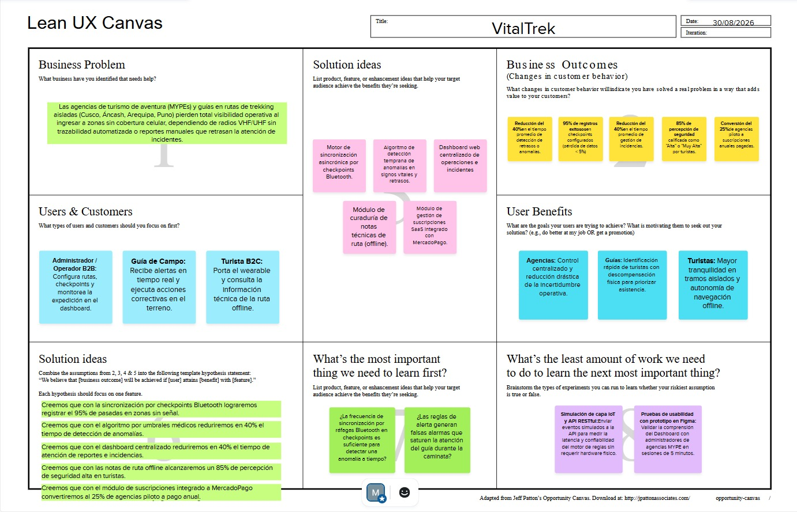

# Capítulo I: Introducción

## 1.1. Startup Profile

### 1.1.1. Descripción de la Startup

NexaTech es una startup tecnológica enfocada en el desarrollo de soluciones para el turismo de aventura en el Perú, orientada a mejorar la seguridad, trazabilidad y gestión operativa en entornos de baja conectividad. Surge para cubrir la falta de sistemas de alerta temprana que permitan detectar oportunamente anomalías en turistas que recorren zonas remotas sin cobertura celular.

Su producto principal, VitalTrek, es una plataforma web que centraliza la gestión de tours, permitiendo a las agencias supervisar la ubicación, estado y progreso de sus grupos mediante dashboards y alertas ante anomalías. A su vez, los turistas acceden a herramientas de navegación offline, registro de su experiencia y visualización de información contextual del recorrido. El enfoque del producto está en la operación y seguridad durante el tour, no en la reserva ni en la difusión abierta de reseñas de rutas: las notas de ruta (puntos críticos, condiciones del terreno) son cargadas por la propia agencia/guía que opera esa ruta, no por cualquier usuario.

A nivel técnico, VitalTrek integra un ecosistema IoT con dispositivos wearables y checkpoints Bluetooth que capturan datos de geolocalización y signos vitales. Estos se sincronizan de forma asincrónica cada vez que el turista pasa por un punto de control, asegurando operatividad incluso sin conexión continua, lo que permite un sistema de alertas tempranas escalable, resiliente y orientado a la prevención de riesgos.

### 1.1.2. Perfiles de integrantes del equipo

| Foto                                                        | Integrante                                                                                                                                                                                                                                                                                                                                                                                                                                                                                                                                                                                                                                                                                                                                                                       |
|-------------------------------------------------------------|----------------------------------------------------------------------------------------------------------------------------------------------------------------------------------------------------------------------------------------------------------------------------------------------------------------------------------------------------------------------------------------------------------------------------------------------------------------------------------------------------------------------------------------------------------------------------------------------------------------------------------------------------------------------------------------------------------------------------------------------------------------------------------|
|    | **Cayanchi Avila, Milenko Rubén**  Código de Estudiante: U202312566 Estudiante de Ingeniería de Software, enfocado en el desarrollo de soluciones tecnológicas innovadoras para la mejora de la calidad de vida. Poseo conocimientos básicos en Python y conocimientos básicos/intermedios en C++. Mi objetivo es adquirir conocimientos avanzados en inteligencia artificial y desarrollo de aplicaciones de salud, con el fin de mejorar mis habilidades y contribuir en el campo de la salud tecnológica.                                                                                                                                                                                                                                                            |
|      | **León Naupari, Jorge Mateo**  Código de Estudiante: U202422549 Soy Jorge Mateo León Naupari, tengo 19 años y soy estudiante de la carrera de Ingeniería de Software en la Universidad Peruana de Ciencias Aplicadas (UPC). Actualmente me encuentro cursando el cuarto ciclo de la carrera. Tengo conocimientos en el lenguaje de programación C++ y un gran interés por seguir desarrollando mis habilidades en el ámbito tecnológico. Mi objetivo es aplicar mis conocimientos en proyectos que me permitan crecer profesionalmente, aportar soluciones innovadoras y adquirir experiencia en el desarrollo de software.                                                                                                                                             |
|       | **Mendoza Blanco, Ariel Roberto**  Código de Estudiante: U202419667 Hola a todos, soy Ariel Mendoza, estudiante de Ingeniería de Software. En el ámbito técnico, me especializo en el desarrollo backend, diseño de bases de datos y arquitectura de sistemas. Dentro del proyecto VitalTrek, mi rol está enfocado en la integración de datos telemétricos y la lógica de negocio, asegurando que la sincronización de checkpoints y la detección de alertas de signos vitales funcionen de forma consistente. Mi objetivo es construir una solución técnica sólida que convierta datos de campo en respuestas operativas inmediatas para la seguridad del turista.                                                                                                     |
|      | **Rodriguez Rojas, Miler Alexander**  Código de Estudiante: U20241A827  Soy estudiante de Ingeniería de Software y actualmente curso el sexto ciclo. Cuento con conocimientos en C++, SQL Server Management, HTML, CSS, JavaScript, Python y TypeScript a nivel básico, principalmente orientados al desarrollo de software y aplicaciones web. Me encuentro en un proceso de desarrollo y aprendizaje continuo, buscando fortalecer mis conocimientos técnicos, adquirir experiencia y crecer profesionalmente. Mi objetivo es aplicar lo aprendido en proyectos que me permitan aportar soluciones innovadoras, trabajar en equipo y afrontar nuevos desafíos dentro del ámbito tecnológico.                                                                       |
|       | **Herrera Enriquez, Diego Fernando**  Código de Estudiante: U202319027  Soy Diego, con creatividad, responsabilidad y con gran disposición para aprender y crecer junto a mi equipo, pienso en entregar una aportación sobresaliente. Me adapto con facilidad a distintos retos, aportando ideas y soluciones prácticas que buscan mejorar cada proyecto. Valoro las buenas prácticas en esta profesión para servir a las personas con pasión por lo que hacemos.  Conocimientos competentes en procesos de ingeniería y experimentado en el diseño de proyectos a nivel integral. Mi  enfoque está orientado a desarrollar soluciones prácticas y efectivas, siempre priorizando la satisfacción del usuario y con visión  a seguir mejorando en futuros proyectos. |

---

## 1.2. Solution Profile

### 1.2.1. Antecedentes y problemática

En los últimos años, el turismo de aventura en el Perú ha presentado un crecimiento constante debido al interés de turistas nacionales e internacionales por actividades como trekking, montañismo y exploración en zonas naturales. El Ministerio de Comercio Exterior y Turismo ([MINCETUR](https://www.gob.pe/institucion/mincetur/noticias/563063-se-aprueban-veintidos-modalidades-de-turismo-de-aventura)) reconoce al turismo de aventura como un segmento importante dentro de la actividad turística nacional y ha aprobado diversas modalidades para fortalecer su desarrollo y regulación.

Muchas de estas actividades se desarrollan en áreas alejadas de centros urbanos, donde la cobertura de red móvil es limitada o inexistente debido a las condiciones geográficas del territorio peruano. Según reportes del Organismo Supervisor de Inversión Privada en Telecomunicaciones ([OSIPTEL](https://www.osiptel.gob.pe/portal-del-usuario/noticias/checa-tu-senal-asi-puedes-verificar-la-cobertura-movil-en-tu-distrito/)), todavía existen zonas del país con limitaciones de cobertura móvil y variaciones en la calidad del servicio, especialmente en áreas rurales y de difícil acceso.

Actualmente, las agencias de turismo y los guías dependen principalmente de teléfonos móviles y aplicaciones convencionales de comunicación y geolocalización para coordinar recorridos y mantener contacto con los grupos. Sin embargo, estas herramientas presentan limitaciones en zonas sin señal, generando dificultades para el monitoreo continuo de los turistas y la atención oportuna ante situaciones de emergencia. Esta problemática evidencia la necesidad de implementar soluciones tecnológicas adaptadas al contexto geográfico y operativo del turismo de aventura en el país.

### Objetivos del proyecto
 
| ID  | Objetivo                                                                                                                                              |
| --- | ------------------------------------------------------------------------------------------------------------------------------------------------------|
| O1  | Permitir que una agencia conserve trazabilidad verificable del avance de sus grupos durante tramos sin cobertura celular.                             |
| O2  | Reducir el tiempo que transcurre entre que ocurre un retraso o una anomalía y el momento en que la agencia se entera.                                 |
| O3  | Dar al guía de campo información suficiente para decidir si un retraso requiere intervención o es parte de la variabilidad normal del recorrido.      |
| O4  | Entregar al turista información de ruta consultable sin conexión durante el recorrido.                                                                |
| O5  | Validar la disposición de las agencias MYPE a pagar por el servicio mediante un piloto medible.                                                       |
 
### Restricciones y alcance
 
| ID  | Restricción                                                                                                                                                                         |
| --- | ------------------------------------------------------------------------------------------------------------------------------------------------------------------------------------|
| R1  | La capa IoT (wearables y unidades de checkpoint) se **simula** para el alcance académico del proyecto. No se fabrica ni se integra hardware físico.                                 |
| R2  | No existe conectividad continua en ruta. Toda sincronización es **asíncrona** y ocurre únicamente en los puntos de control definidos.                                               |
| R3  | El producto **no es un servicio de emergencia ni un dispositivo médico**. No reemplaza comunicadores satelitales, balizas, guías capacitados ni protocolos de rescate.              |
| R4  | El alcance cubre la **operación del tour**, no la reserva ni la comercialización de paquetes turísticos.                                                                            |
| R5  | Las notas de ruta son cargadas por la agencia o el guía responsable de esa ruta. No es contenido abierto aportado por cualquier usuario.                                            |
| R6  | El tratamiento de datos de ubicación y signos vitales está sujeto a la Ley N.° 29733 de Protección de Datos Personales, lo que exige consentimiento previo, expreso e informado.    |
| R7  | El idioma por defecto de todos los productos es inglés, con soporte para español latinoamericano (en_US / es_419).                                                                  |
 
### Trazabilidad entre 5W+2H y el Problem Statement
 
| Pregunta 5W+2H | Hallazgo                                                                  | Dónde aparece en el Problem Statement        |
| -------------- | ------------------------------------------------------------------------- |  ------------------------------------------- |
| Who            | Agencias MYPE, guías y turistas de aventura                               | *customer segments* e *initial segment*      |
| What           | Ausencia de alertas tempranas basadas en monitoreo periódico              | *gap*                                        |
| Where          | Rutas de trekking en Cusco, Áncash, Arequipa y Puno                       | *domain* e *initial segment*                 |
| When           | Durante la ejecución del recorrido, ante separación de grupos o urgencias | *pain points*                                |
| Why            | Las herramientas actuales requieren conexión continua para funcionar      | *gap*                                        |
| How            | Pérdida de comunicación, demora en ubicar turistas, respuesta tardía      | *pain points* y *workflows*                  |
| How Much       | Crecimiento sostenido de expediciones en zonas de difícil acceso          | sustento del *domain* y de la oportunidad    |
 
---

### 1.2.2. Lean UX Process

#### 1.2.2.1. Lean UX Problem Statements

**El estado actual** de la operación y la seguridad preventiva en el turismo de aventura en el Perú se ha centrado principalmente en dos segmentos: las agencias y operadores (MYPEs) que operan rutas de trekking y montañismo en Cusco, Áncash, Arequipa y Puno, y los turistas nacionales y extranjeros que las recorren. Sus principales dolores son la pérdida total de visibilidad sobre el grupo al ingresar en zonas sin cobertura celular, la imposibilidad de distinguir un retraso normal de un incidente real, y la incertidumbre del turista en los tramos donde queda incomunicado. Sus flujos de trabajo actuales se apoyan en radios VHF/UHF, coordinación por WhatsApp y llamadas cuando hay señal, conteos y reportes verbales del guía, y espera pasiva de la agencia hasta que el grupo vuelve a un punto con cobertura.
 
**Lo que los productos y servicios existentes no resuelven** es que ninguna alternativa disponible conserva trazabilidad del grupo durante los tramos sin conectividad: o cubren únicamente la comunicación puntual ante una emergencia ya declarada, o requieren cobertura continua para operar. El resultado es que la agencia solo se entera de un problema cuando alguien logra comunicarlo, es decir, después de que el problema ya escaló.
 
**Nuestro producto, VitalTrek, abordará este vacío** convirtiendo el recorrido en una secuencia de puntos de verificación a lo largo de la ruta, de modo que la agencia reciba evidencia periódica y comparable del avance y del estado del grupo sin depender de conectividad continua, y pueda distinguir de forma temprana un retraso esperado de una situación que exige intervención.
 
**Nuestro foco inicial** serán las agencias y operadores de turismo de aventura (MYPEs) que operan rutas de trekking de varios días en Cusco y Áncash.
 
**Sabremos que tenemos éxito cuando observemos** que las agencias del piloto consultan el estado de sus grupos al menos una vez por tramo en el 90% de los tours operados; que el tiempo que tarda una agencia en enterarse de un retraso relevante se reduce en 40% frente a su línea base actual; que al menos el 70% de las alertas recibidas por un guía deriva en una acción registrada; que al menos el 25% de las agencias del piloto renueva de forma pagada tras el periodo gratuito; y que al menos el 85% de los turistas encuestados califica como "Alta" o "Muy Alta" su percepción de seguridad durante el recorrido.

#### 1.2.2.2. Lean UX Assumptions

#### *Business Assumptions*
 
| ID  | Creencia                                                                                                                                                              |
| --- | --------------------------------------------------------------------------------------------------------------------------------------------------------------------- |
| BA1 | Creemos que las agencias de turismo de aventura reconocen la pérdida de visibilidad en ruta como un riesgo operativo real y no como una condición inevitable del negocio. |
| BA2 | Creemos que las MYPEs del sector tienen capacidad y disposición de pago para un servicio SaaS mensual o anual escalado por volumen de grupos gestionados.               |
| BA3 | Creemos que el canal de adquisición más eficiente es la venta directa B2B con demostración y piloto, antes que la captación digital masiva.                             |
| BA4 | Creemos que nuestra competencia real no son las soluciones satelitales, sino el proceso manual actual: radio, WhatsApp y la confianza en el criterio del guía.          |
| BA5 | Creemos que nuestro diferencial defendible es integrar en un mismo flujo la configuración de la ruta, la evidencia de avance y la alerta, y no resolver solo una parte. |
| BA6 | Creemos que el mayor riesgo del negocio es que la frecuencia de verificación sea demasiado baja para detectar una situación crítica a tiempo.                           |
| BA7 | Creemos que una tasa alta de falsas alarmas destruiría la confianza del guía en el sistema y lo llevaría a ignorarlo.                                                   |
 
#### *Business Outcome Assumptions*
 
| ID   | Creencia (cambio de comportamiento medible)                                                                                              |
| ---- | ------------------------------------------------------------------------------------------------------------------------------------------ |
| BOA1 | Creemos que las agencias del piloto consultarán el estado de sus grupos al menos una vez por tramo en el 90% de los tours operados.        |
| BOA2 | Creemos que el tiempo que tarda una agencia en enterarse de un retraso relevante se reducirá en 40% frente a su línea base.                |
| BOA3 | Creemos que al menos el 70% de las alertas recibidas por un guía derivará en una acción registrada en el sistema.                          |
| BOA4 | Creemos que al menos el 25% de las agencias del piloto gratuito renovará como suscripción pagada en los tres meses siguientes.             |
| BOA5 | Creemos que al menos el 85% de los turistas encuestados calificará su percepción de seguridad como "Alta" o "Muy Alta".                    |
| BOA6 | Creemos que al menos el 60% de los turistas abrirá la información de ruta al menos una vez durante el recorrido.                           |
 
#### *User Assumptions*
 
| ID  | Creencia                                                                                                                                             |
| --- | ------------------------------------------------------------------------------------------------------------------------------------------------------ |
| UA1 | Creemos que el comprador y el usuario principal es el administrador u operador de la agencia, que configura la ruta y supervisa desde la base.         |
| UA2 | Creemos que el guía de campo es un usuario distinto, con necesidades distintas: decide en el terreno, con poco tiempo y bajo condiciones adversas.     |
| UA3 | Creemos que el turista es un usuario pasivo respecto del monitoreo y activo respecto de la consulta de información de ruta.                            |
| UA4 | Creemos que el turista aceptará portar un dispositivo entregado por la agencia si se le explica con claridad qué se registra y quién puede verlo.      |
| UA5 | Creemos que el producto se usa en la fase de ejecución del tour, no en la de reserva ni en la de promoción.                                            |
| UA6 | Creemos que el administrador tiene un nivel de adopción digital bajo o medio, por lo que la interfaz debe ser legible sin entrenamiento previo.        |
 
#### *User Outcome and Benefit Assumptions*
 
| ID    | Creencia                                                                                                                                         |
| ----- | -------------------------------------------------------------------------------------------------------------------------------------------------- |
| UOBA1 | Creemos que el administrador quiere poder responder "¿dónde está mi grupo y está bien?" en cualquier momento, sin llamar a nadie.                  |
| UOBA2 | Creemos que el administrador quiere saber si un retraso es normal o si debe activar un protocolo, y hoy no tiene forma de distinguirlo.            |
| UOBA3 | Creemos que el guía quiere llegar al siguiente punto sabiendo a quién revisar primero, en lugar de evaluar a todo el grupo por igual.              |
| UOBA4 | Creemos que el guía quiere recibir pocas alertas y que todas sean accionables, porque una alerta irrelevante le cuesta atención en terreno.        |
| UOBA5 | Creemos que el turista quiere sentir que alguien sabe dónde está aunque él no tenga señal.                                                         |
| UOBA6 | Creemos que el turista quiere orientarse y entender el terreno sin depender de datos móviles.                                                      |
| UOBA7 | Creemos que el turista quiere conservar un registro de lo que recorrió una vez terminado el tour.                                                  |
 
#### *Feature Assumptions*
 
| ID  | Creencia                                                                                                                                                                        |
| --- | --------------------------------------------------------------------------------------------------------------------------------------------------------------------------------- |
| FA1 | Creemos que configurar la ruta con sus puntos de control y ventanas de tiempo esperadas le dará al administrador una referencia contra la cual comparar el avance real.           |
| FA2 | Creemos que sincronizar la telemetría acumulada en ráfaga al pasar por un punto de control permitirá conservar trazabilidad sin conectividad continua.                            |
| FA3 | Creemos que un motor de reglas que compare el paso real contra la ventana esperada detectará retrasos antes de que el guía los reporte.                                           |
| FA4 | Creemos que un dashboard centralizado con el estado de los grupos y alertas priorizadas permitirá al administrador decidir sin consultar varias fuentes.                          |
| FA5 | Creemos que notificar al guía solo las alertas accionables mantendrá su confianza en el sistema y evitará que lo ignore.                                                          |
| FA6 | Creemos que las notas de ruta consultables sin conexión, cargadas por la agencia responsable, darán al turista orientación confiable en los tramos aislados.                      |
| FA7 | Creemos que un resumen automático del recorrido al cierre del tour reforzará la percepción de valor del turista y servirá de insumo de mejora para la agencia.                    |
| FA8 | Creemos que un módulo de suscripción con pasarela de pagos permitirá a la agencia activar y renovar su plan sin gestión manual de cobros.                                         |
 
---

#### 1.2.2.3. Lean UX Hypothesis Statement

**H1 - Configuración de ruta, puntos de control y ventanas de tiempo** *(FA1 · BOA1)*
 
**Creemos que** lograremos que las agencias del piloto consulten el estado de sus grupos al menos una vez por tramo en el 90% de los tours operados
**Si** los administradores de agencias de turismo de aventura
**Obtienen** una referencia clara contra la cual comparar el avance real del grupo en cualquier momento del recorrido
**Con** la configuración de rutas con puntos de control y ventanas de tiempo esperadas.
 
**H2 - Sincronización en ráfaga al pasar por un punto de control** *(FA2 · BOA2)*
 
**Creemos que** lograremos reducir en 40% el tiempo que tarda una agencia en enterarse de un retraso relevante
**Si** los administradores de agencias que operan rutas sin cobertura celular
**Obtienen** evidencia periódica del avance del grupo sin depender de que alguien logre comunicarse
**Con** la sincronización en ráfaga de la telemetría acumulada al pasar por un punto de control.
 
**H3 - Motor de reglas de retrasos y anomalías** *(FA3 · BOA2)*
 
**Creemos que** lograremos reducir en 40% el tiempo que tarda una agencia en enterarse de un retraso relevante
**Si** los administradores y el personal de operaciones en base
**Obtienen** la identificación automática de desviaciones sin tener que revisar manualmente cada grupo
**Con** un motor de reglas que compara el paso real contra la ventana de tiempo esperada.
 
**H4 - Dashboard centralizado con alertas priorizadas** *(FA4 · BOA1)*
 
**Creemos que** lograremos que las agencias del piloto consulten el estado de sus grupos al menos una vez por tramo en el 90% de los tours operados
**Si** los administradores de agencias
**Obtienen** responder "¿dónde está mi grupo y está bien?" en una sola pantalla y sin consultar varias fuentes
**Con** un dashboard centralizado que muestra el estado de cada grupo y las alertas ordenadas por prioridad.
 
**H5 - Notificación accionable al guía de campo** *(FA5 · BOA3)*
 
**Creemos que** lograremos que al menos el 70% de las alertas recibidas por un guía derive en una acción registrada
**Si** los guías de campo responsables del grupo
**Obtienen** saber a quién revisar primero al llegar al siguiente punto, en lugar de evaluar a todo el grupo por igual
**Con** la notificación al guía únicamente de las alertas clasificadas como accionables.
 
**H6 - Notas de ruta consultables sin conexión** *(FA6 · BOA5)*
 
**Creemos que** lograremos que al menos el 85% de los turistas encuestados califique su percepción de seguridad como "Alta" o "Muy Alta"
**Si** los turistas de aventura que recorren tramos sin señal
**Obtienen** orientarse y entender el terreno sin depender de datos móviles
**Con** notas de ruta consultables sin conexión, cargadas por la agencia responsable de esa ruta.
 
**H7 - Resumen automático del recorrido** *(FA7 · BOA6)*
 
**Creemos que** lograremos que al menos el 60% de los turistas abra la información de su recorrido al menos una vez
**Si** los turistas de aventura que finalizaron un tour
**Obtienen** conservar un registro de lo que recorrieron y de cómo lo recorrieron
**Con** la generación automática de un resumen del recorrido al cierre del tour.
 
**H8 - Módulo de suscripción con pasarela de pagos** *(FA8 · BOA4)*
 
**Creemos que** lograremos que al menos el 25% de las agencias del piloto gratuito renueve como suscripción pagada
**Si** las MYPEs de turismo de aventura de Cusco, Áncash, Arequipa y Puno
**Obtienen** activar y renovar su plan sin depender de gestiones ni cobros manuales
**Con** un módulo de suscripción integrado a una pasarela de pagos.
 
---

#### 1.2.2.4. Lean UX Canvas

El **Lean UX Canvas** de VitalTrek sintetiza las decisiones estratégicas y de diseño del proyecto en un modelo visual iterativo. A continuación, se detallan los ocho recuadros estructurados para guiar el desarrollo del MVP:

| Recuadro                                                        | Contenido                                                                                                                                                                                                                                                                                                                                                                                                                                                                                                                                                                                                                                       |
| :-------------------------------------------------------------- | :------------------------------------------------------------------------------------------------------------------------------------------------------------------------------------------------------------------------------------------------------------------------------------------------------------------------------------------------------------------------------------------------------------------------------------------------------------------------------------------------------------------------------------------------------------------------------------------------------------------------------------------------------- |
| **1. Business Problem**                                         | Las agencias de turismo de aventura (MYPEs) y sus guías pierden toda visibilidad sobre el grupo al ingresar a zonas sin cobertura celular, y solo se enteran de un retraso o un incidente cuando alguien logra comunicarlo, es decir, cuando ya escaló. Las alternativas actuales cubren la emergencia ya declarada o exigen cobertura continua, pero ninguna conserva trazabilidad durante el tramo aislado.*                                                                                                                                                                                                 |
| **2. Business Outcomes**       | • 90% de los tours con al menos una consulta de estado por tramo. • −40% en el tiempo hasta que la agencia se entera de un retraso relevante. • 70% de las alertas al guía derivan en una acción registrada. • 25% de conversión de piloto gratuito a suscripción pagada. • 85% de turistas con percepción de seguridad "Alta" o "Muy Alta". • 60% de turistas que abren la información de ruta durante el recorrido.                                                                                                                                                                                                                       |
| **3. Users**                                                    | • **Administrador / Operador (B2B)**: configura la ruta y supervisa desde la base. Es el comprador. • **Guía de campo**: decide en terreno con poco tiempo y bajo condiciones adversas. • **Turista (B2C)**: porta el dispositivo y consulta información de ruta sin conexión.                                                                                                                                                                                                                                                                                                                                                                       |
| **4. User Outcomes & Benefits**                                 | • **Administrador**: responder "¿dónde está mi grupo y está bien?" sin llamar a nadie, y distinguir un retraso normal de uno que exige protocolo. • **Guía**: saber a quién revisar primero al llegar al punto, y recibir pocas alertas pero todas accionables. • **Turista**: sentir que alguien sabe dónde está, orientarse sin datos móviles y conservar un registro del recorrido.                                                                                                                                                                                                                                                              |
| **5. Solutions**                    | • Configuración de rutas, puntos de control y ventanas de tiempo esperadas. • Sincronización asíncrona en ráfaga vía checkpoints Bluetooth. • Motor de reglas de retrasos y anomalías. • Dashboard centralizado con alertas priorizadas. • Notificación filtrada al guía de campo. • Notas de ruta offline curadas por la agencia. • Resumen automático del recorrido. • Módulo de suscripción SaaS con pasarela de pagos.                                                                                                                                                                                                           |
| **6. Hypotheses**  | • **H1:** Creemos que lograremos 90% de tours con consulta de estado por tramo, si los administradores obtienen una referencia contra la cual comparar el avance, con la configuración de rutas y ventanas de tiempo. • **H2:** Creemos que lograremos −40% en el tiempo de enterarse de un retraso, si los administradores obtienen evidencia periódica del avance sin depender de comunicación, con la sincronización en ráfaga por punto de control. • **H3:** Creemos que lograremos −40% en el tiempo de enterarse de un retraso, si el personal de operaciones obtiene identificación automática de desviaciones, con el motor de reglas. • **H4:** Creemos que lograremos 90% de tours con consulta de estado, si los administradores obtienen responder en una sola pantalla, con el dashboard centralizado. • **H5:** Creemos que lograremos que 70% de las alertas deriven en acción, si los guías obtienen saber a quién revisar primero, con la notificación filtrada. • **H6:** Creemos que lograremos 85% de percepción de seguridad alta, si los turistas obtienen orientarse sin datos móviles, con las notas de ruta offline. • **H7:** Creemos que lograremos 60% de apertura del recorrido, si los turistas obtienen conservar un registro, con el resumen automático. • **H8:** Creemos que lograremos 25% de conversión a pago, si las MYPEs obtienen activar y renovar sin gestión manual, con el módulo de suscripción. |
| **7. What's the most important thing we need to learn first?**  | **Riesgo 1 (técnico, el más alto):** ¿la frecuencia de verificación por puntos de control es suficiente para detectar una situación crítica a tiempo, o la ventana entre dos puntos es demasiado larga? Aquí se evalúa la confiabilidad de sincronización (meta de referencia: 95% de pasadas registradas, pérdida de datos < 5%). **Riesgo 2 (de adopción):** ¿las reglas generan falsas alarmas en un volumen que haga que el guía deje de confiar en el sistema? **Riesgo 3 (de negocio):** ¿la agencia percibe valor suficiente como para pagar, o lo considera un "bueno tenerlo"? |
| **8. What's the least amount of work we can do to learn it?**   | **Para el riesgo 1:** simulación de la capa IoT enviando eventos a la API para medir latencia, pérdida de datos y tiempo de detección, sin hardware físico. **Para el riesgo 2:** prueba del motor de reglas con recorridos simulados que incluyan retrasos reales y falsos positivos, midiendo la proporción de alertas que un guía consideraría accionables. **Para el riesgo 3:** prueba de usabilidad del dashboard en sesiones de 5 minutos con administradores de agencias MYPE, cerrando con una pregunta de disposición a pagar. |

*Figura 1.2.2.4. Representación visual del Lean UX Canvas para el ecosistema VitalTrek.*

## 1.3 Segmentos Objetivo

A partir del análisis del dominio del problema, la falta de sistemas de alertas tempranas basados en monitoreo periódico para turismo de aventura en zonas remotas del Perú, se han identificado dos segmentos objetivo claramente diferenciados a los que VitalTrek dirige su propuesta de valor. El primero corresponde a las agencias y operadores turísticos de aventura que requieren herramientas de gestión, supervisión y trazabilidad operativa de sus tours; el segundo corresponde a los turistas de aventura nacionales y extranjeros que demandan experiencias seguras, guiadas y enriquecidas en entornos naturales del país. A continuación se describen ambos segmentos junto con sus características demográficas y la información estadística que sustenta su relevancia.

*Segmento 1: Agencias y Operadores de Turismo de Aventura*

**Descripción**

Empresas formalmente constituidas, registradas en el Directorio Nacional de Prestadores de Servicios Turísticos del MINCETUR, dedicadas a la organización y operación de tours de aventura: trekking, montañismo, canotaje, ciclismo de montaña, escalada y actividades de ecoturismo. Su operación se concentra principalmente en regiones con alto potencial de turismo de aventura como Cusco, Áncash, Arequipa, Puno, Madre de Dios y San Martín, donde la conectividad celular es intermitente o inexistente. Estas agencias enfrentan limitaciones operativas para supervisar el estado y la ubicación de sus grupos durante los recorridos, así como para responder de forma oportuna ante anomalías o emergencias.

**Características demográficas y de negocio**

- Tipo de empresa: Micro y pequeñas empresas (MYPEs) en su mayoría, con entre 5 y 50 colaboradores entre guías, choferes y personal administrativo.
- Ubicación geográfica: Cusco, Áncash (Huaraz), Arequipa, Puno, Madre de Dios, Lima y San Martín.
- Antigüedad operativa: Mayoritariamente con más de 3 años en el mercado y registradas en DIRCETUR/GERCETUR.
- Capacidad operativa: Atienden grupos de entre 4 y 20 turistas por tour, con frecuencia diaria o semanal según temporada.
- Perfil tecnológico: Adopción digital baja a media, con uso predominante de WhatsApp y radios para comunicación, y escaso uso de plataformas integradas de gestión.

**Información estadística de sustento**

- Solo en Cusco, la Asociación de Agencias de Turismo del Cusco (AATC) representa a más de 190 agencias activas dedicadas a turismo de aventura, místico, ecológico y tradicional, lo que evidencia la concentración del mercado objetivo en regiones específicas.
- Según MINCETUR, en el 2025 se registraron 14.1 millones de visitas a sitios turísticos del país, un crecimiento del 33.2% frente al 2024, con una recuperación del 95.4% respecto al nivel prepandemia, lo que se traduce en una mayor demanda de servicios para los operadores.
- El 83% de los operadores turísticos del segmento aventura reportó incremento de ingresos en 2025, y un 46% indicó que estos crecieron por encima del 26% según el estudio anual de la Adventure Travel Trade Association (ATTA), lo que demuestra capacidad de inversión en herramientas tecnológicas.
- El sector turismo aportó aproximadamente el 2.9% del PBI nacional en 2025, según estimaciones del MINCETUR a partir de las Cuentas Satélite del Turismo, consolidando a las agencias como un mercado de alto valor económico.

*Segmento 2: Turistas de Aventura*

**Descripción**

Personas que viajan al Perú, ya sea desde el extranjero o desde otras regiones del país, motivadas por experiencias de naturaleza, deporte y exploración en entornos remotos. Buscan vivir recorridos como el Camino Inca, Salkantay, Choquequirao, Huayhuash, Colca o la Amazonía, contratando agencias formales que les brinden seguridad, organización y guías especializados. Demandan herramientas digitales que les permitan navegar offline, registrar su experiencia y acceder a información contextual del recorrido sin depender de conectividad continua.

**Características demográficas**

- Edad: El 49% de los viajeros de aventura a nivel mundial se ubica entre los 41 y 60 años; en Sudamérica esta franja sube al 54%, mientras que un 26% tiene menos de 40 años.
- Género: Predominio femenino, con 53% de mujeres frente a 46% de hombres realizando viajes de aventura, según ATTA 2024.
- Composición del grupo de viaje: El 36% viaja en pareja, 24% en grupo y 21% en familia. En Sudamérica, la familia (26%) supera a los grupos como segunda modalidad más popular.
- Procedencia: Mayoritariamente turistas extranjeros provenientes de Sudamérica (51.7%), Norteamérica (23.8%) y Europa (16.8%), complementados por turistas nacionales que viajan dentro del territorio peruano.
- Nivel socioeconómico: Medio-alto y alto, con capacidad de pagar paquetes turísticos completos y seguros de viaje con cobertura para deportes de riesgo.

**Información estadística de sustento**

- En el 2025, el Perú recibió 3.2 millones de turistas internacionales, un crecimiento del 29% frente al 2024, con proyecciones de alcanzar las cifras prepandemia de 4.4 millones en los próximos años.
- Se estima que el país alcanzará 43.5 millones de viajes por turismo interno al cierre de 2025, un 16.9% más que en 2024, ampliando significativamente la base potencial de turistas nacionales que demandan experiencias de aventura.
- El segmento global de turismo de aventura registró un crecimiento del 65% en número de viajeros atendidos respecto al 2019, y un 54% adicional respecto al 2022, consolidándose como uno de los nichos de mayor expansión a nivel mundial.
- El 51.5% de las visitas registradas en sitios turísticos peruanos en 2025 corresponde a turistas internacionales y el 48.5% a nacionales, lo que confirma que la propuesta de VitalTrek debe atender a ambos perfiles bajo experiencias multilingües y adaptadas culturalmente.
- Regiones clave para el turismo de aventura como Cusco e Ica ya están a solo 2.6% y 3.6% de alcanzar sus cifras prepandemia, evidenciando la consolidación de los destinos donde opera el segmento.
