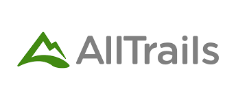
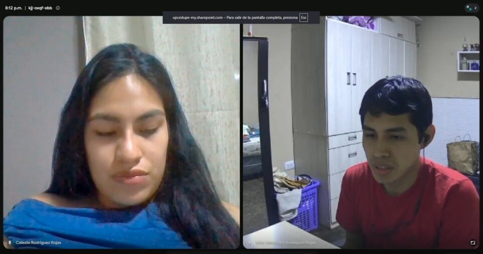
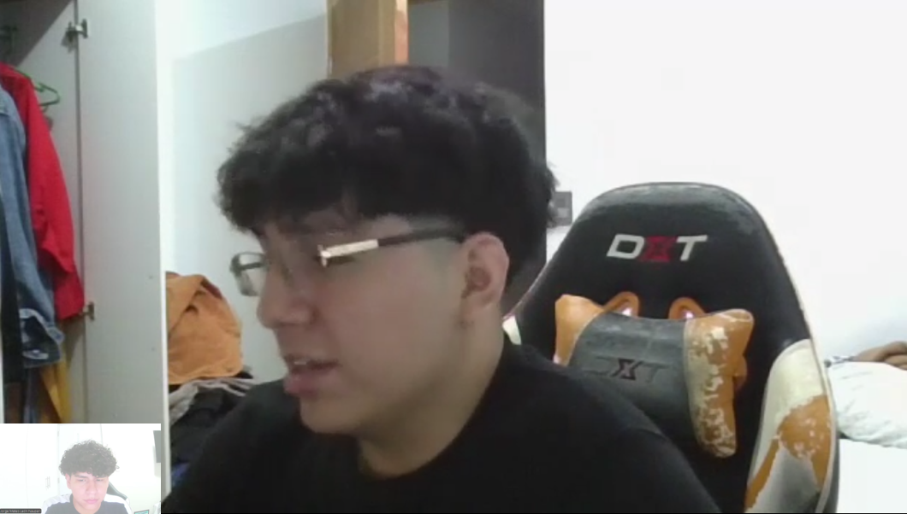
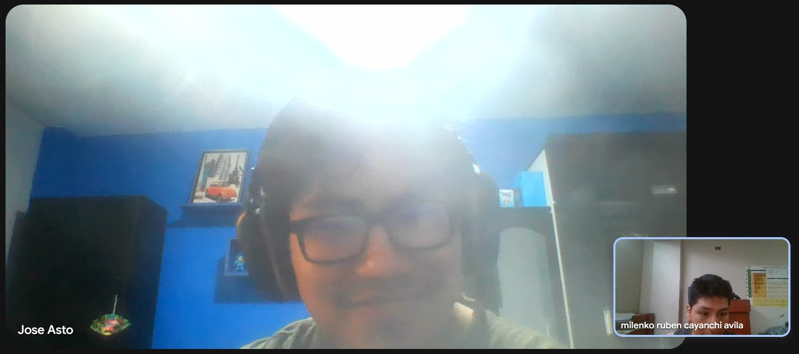
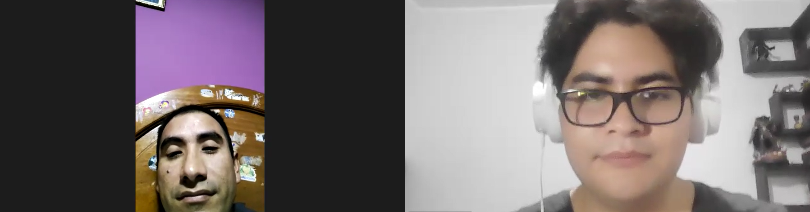
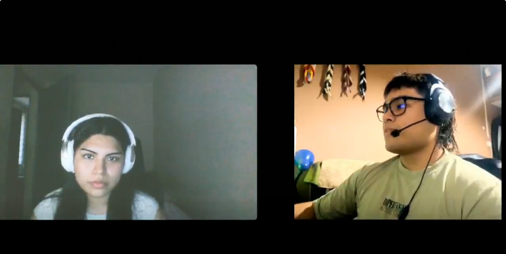

# Capítulo II: Requirements Elicitation & Analysis
 
## 2.1. Competidores
 
En esta sección se identifican y describen los principales competidores directos que operan en el dominio del problema que VitalTrek aborda: la gestión, monitoreo y trazabilidad de tours de aventura mediante productos digitales similares. Los tres competidores seleccionados comparten con VitalTrek el modelo de negocio basado en plataformas digitales orientadas al turismo de aventura, con funcionalidades superpuestas en gestión de tours, navegación, seguimiento periódico por checkpoints y experiencia del turista.
 
**TrekkSoft:** Empresa suiza fundada en 2010 en Interlaken, conocida como la capital europea de la aventura. Ofrece una plataforma de reservas y gestión operativa orientada a operadores turísticos de aventura, con módulos de pago, sincronización con OTAs, gestión de inventario y panel administrativo. Su enfoque comercial está dirigido a agencias pequeñas y medianas en mercados europeos y latinoamericanos.
 
**Wayward:** Plataforma estadounidense especializada en software para operadores de turismo de aventura, rallies y experiencias outdoor. Combina en una sola solución gestión de reservas, seguimiento de viaje en vivo (Live Trip Tracking), chat en tiempo real entre guías y turistas, waivers digitales, itinerarios personalizados y comunicación con contactos de emergencia. Es uno de los competidores directos más cercanos a VitalTrek por su enfoque integral en seguridad y trazabilidad durante el recorrido.
 
**AllTrails:** Aplicación móvil desarrollada en Estados Unidos, líder mundial en navegación para senderismo y trekking. Posee un catálogo superior a 500,000 rutas en todo el mundo, navegación GPS giro a giro, mapas offline para suscriptores premium y una comunidad activa de senderistas. Se posiciona como la herramienta de referencia para turistas que realizan rutas de aventura por su cuenta o con agencias.

### 2.1.1. Análisis Competitivo
 
**Competitive Analysis Landscape**
 
A continuación se presenta el cuadro Competitive Analysis Landscape, en el cual se contrasta el perfil de Nexum Devs y su producto VitalTrek frente a los tres competidores directos identificados, considerando dimensiones de perfil, marketing, producto y análisis SWOT.
 
| ¿Por qué llevar a cabo este análisis? | El objetivo es comprender el posicionamiento real de los competidores en el mercado de gestión y monitoreo de turismo de aventura, identificar brechas en sus propuestas de valor y validar los espacios de oportunidad que VitalTrek puede ocupar en el mercado peruano. |
| ------------------------------------- | ------------------------------------------------------------------------------------------------------------------------------------------------------------------------------------------------------------------------------------------------------------------------- |
 
| Dimensión           | Categoría                                              |  **VitalTrek (Nexum Devs)**                                                                                                                                                                                                                               |  **TrekkSoft**                                                                                                       |  **Wayward**                                                                                                                                              |  **AllTrails**                                                                                                       |
| ------------------- | ------------------------------------------------------ | ----------------------------------------------------------------------------------------------------------------------------------------------------------------------------------------------------------------------------------------------------------------------------------------------------------------------- | ---------------------------------------------------------------------------------------------------------------------------------------------------------------------------------------------------------- | --------------------------------------------------------------------------------------------------------------------------------------------------------------------------------------------------------------------------------------------- | ---------------------------------------------------------------------------------------------------------------------------------------------------------------------------------------------------------- |
| Perfil              | Overview                                               | Plataforma web peruana que centraliza la gestión de tours de aventura para agencias y ofrece a turistas navegación offline, registro de experiencia e información contextual del recorrido, integrando un ecosistema IoT con wearables y checkpoints Bluetooth.                                                         | Plataforma suiza de software como servicio para reservas y gestión operativa de operadores turísticos, con foco en pagos online y conexión con OTAs.                                                       | Plataforma estadounidense todo en uno para operadores de aventura, con énfasis en seguimiento de viaje en vivo, chat en tiempo real entre guías y viajeros, waivers digitales e itinerarios personalizados.                                   | Aplicación móvil estadounidense con el mayor catálogo mundial de rutas de senderismo, navegación GPS y comunidad de usuarios.                                                                              |
| Perfil              | Ventaja competitiva. ¿Qué valor ofrece a los clientes? | Solución integral con sincronización asincrónica que opera sin conexión continua, dashboards con alertas tempranas por checkpoint para agencias, alertas ante anomalías y captura de signos vitales mediante wearables. Diseñada específicamente para el contexto peruano.                                              | Reduce la fricción del proceso de reserva y centraliza pagos. Permite a agencias vender sus tours en múltiples canales desde una sola plataforma.                                                          | Unifica reservas, comunicación, seguridad y experiencia del viajero en una sola interfaz. Permite a las agencias mostrar la marca propia sin que aparezca el branding de Wayward, y comparte la ubicación con contactos de emergencia.        | Acceso instantáneo a más de 500,000 rutas verificadas con reseñas, fotografías y mapas offline en versión premium.                                                                                         |
| Perfil de Marketing | Mercado objetivo                                       | Agencias formales de turismo de aventura y turistas nacionales y extranjeros que realizan rutas en regiones del Perú con baja conectividad como Cusco, Áncash, Arequipa, Puno y Madre de Dios.                                                                                                                          | Operadores turísticos de actividades y tours en Europa y Latinoamérica, principalmente pequeñas y medianas empresas con foco en ventas online.                                                             | Operadores de turismo de aventura, organizadores de rallies, retiros outdoor y organizaciones turísticas regionales (DMOs) en Norteamérica y Europa.                                                                                          | Senderistas, ciclistas, corredores y turistas de aventura individuales a nivel global, mayoritariamente en Norteamérica y Europa.                                                                          |
| Perfil de Marketing | Estrategias de marketing                               | Marketing digital orientado a segmentos B2B mediante alianzas con DIRCETUR, asociaciones de agencias como AATC y participación en ferias de turismo. Estrategia B2C centrada en redes sociales, contenido de valor sobre rutas peruanas y posicionamiento SEO local.                                                    | Marketing de contenidos en blog corporativo, webinars para operadores, presencia en plataformas de reseñas como Capterra y participación en eventos de la industria turística europea.                     | Marketing basado en casos de éxito de operadores reales, alianzas con DMOs regionales, contenido educativo para gestores de turismo y enfoque en testimonios sobre seguridad y conexión con viajeros.                                         | Modelo freemium con conversión a suscripción AllTrails Plus. Crecimiento basado en comunidad de usuarios, contenido generado por usuarios y posicionamiento orgánico en buscadores.                        |
| Perfil de Producto  | Productos y Servicios                                  | Plataforma web para agencias con dashboard de monitoreo, gestión de tours y alertas. Módulo web para turistas con mapas offline y registro de experiencia. Wearables IoT y checkpoints Bluetooth para captura de geolocalización y signos vitales.                                                                      | Software de reservas, gestión de pagos, sincronización con OTAs como Viator y GetYourGuide, panel de control y aplicación para guías.                                                                      | Plataforma con seguimiento de ubicación en vivo, chat instantáneo entre guías y viajeros, waivers digitales, encuestas posteriores al viaje, mapas con itinerarios destacados y módulo de reservas con marca personalizada.                   | Aplicación móvil con búsqueda de rutas, navegación GPS giro a giro, mapas offline en plan Plus, registro de actividad y comunidad social.                                                                  |
| Perfil de Producto  | Precios y Costos                                       | Modelo de suscripción mensual diferenciado para agencias según tamaño y volumen de tours. Acceso web gratuito para turistas con funciones premium opcionales.                                                                                                                                                           | Planes mensuales para operadores turísticos con comisión sobre reservas. Tarifas variables según volumen y módulos contratados.                                                                            | Precios bajo cotización personalizada según tamaño del operador y módulos contratados. Modelo SaaS sin comisión por reserva.                                                                                                                  | Versión gratuita con funciones básicas. Suscripción AllTrails Plus alrededor de 35.99 dólares anuales para mapas offline y funcionalidades avanzadas.                                                      |
| Perfil de Producto  | Canales de distribución (Web y/o Móvil)                | Plataforma web responsive para agencias y turistas. Distribución directa a través del sitio web corporativo y alianzas con asociaciones de agencias.                                                                                                                                                                    | Aplicación web SaaS y aplicación móvil para guías. Distribución mediante sitio corporativo, comparadores de software y partnerships.                                                                       | Plataforma web SaaS y experiencia móvil para viajeros sin necesidad de descargar aplicación adicional, accesible vía enlace directo. Distribución a través del sitio web corporativo.                                                         | Aplicación móvil Android e iOS, sitio web complementario. Distribución a través de App Store, Google Play y posicionamiento orgánico.                                                                      |
| Análisis SWOT       | Fortalezas                                             | Solución integral única en el mercado peruano que combina gestión para agencias, experiencia para turistas e integración IoT. Funcionamiento offline mediante sincronización asincrónica. Conocimiento profundo del contexto local y rutas peruanas. Captura de signos vitales para prevención de riesgos.              | Plataforma robusta y madura con más de quince años en el mercado. Integración consolidada con OTAs líderes. Reconocimiento en el sector europeo de actividades de aventura.                                | Propuesta integral que une seguridad, comunicación y reservas. Live Tracking validado por operadores de rallies y aventuras de varios días. Experiencia móvil sin fricción, sin login para el viajero.                                        | Comunidad masiva de usuarios y volumen de rutas inigualable. Marca reconocida globalmente. Interfaz intuitiva y experiencia de usuario altamente pulida.                                                   |
| Análisis SWOT       | Debilidades                                            | Marca nueva sin reconocimiento en el mercado. Curva de adopción tecnológica en agencias con baja madurez digital.                                                                                                                                                                                                       | Plataforma orientada principalmente a reservas, sin capacidades de monitoreo en tiempo real ni integración con dispositivos de tracking en campo. Interfaz no diseñada para uso en zonas sin conectividad. | Su tracking depende de la conectividad celular del dispositivo del viajero, lo que limita su utilidad en zonas remotas sin señal. No incorpora hardware IoT propio ni captura de signos vitales. Presencia inexistente en el mercado peruano. | No ofrece herramientas de gestión para agencias ni dashboards de supervisión. Cobertura limitada de rutas peruanas. Mapas offline restringidos a la versión de pago. Sin integración con dispositivos IoT. |
| Análisis SWOT       | Oportunidades                                          | Crecimiento sostenido del turismo de aventura en el Perú con 14.1 millones de visitas a sitios turísticos en 2025 y aumento del 33.2 por ciento respecto a 2024. Alta demanda de soluciones de seguridad por parte de turistas y agencias. Bajo nivel de digitalización del sector permite posicionarse como referente. | Expansión hacia mercados latinoamericanos donde su presencia es limitada. Demanda creciente de digitalización en operadores turísticos.                                                                    | Expansión hacia mercados emergentes de turismo de aventura como Sudamérica y Asia. Integración futura con dispositivos satelitales o IoT podría ampliar su propuesta de valor.                                                                | Incorporación de funcionalidades para agencias podría ampliar su mercado. Crecimiento del turismo experiencial a nivel global.                                                                             |
| Análisis SWOT       | Amenazas                                               | Llegada de competidores internacionales con mayor capital al mercado peruano. Adopción masiva de tecnologías satelitales como Starlink Direct to Cell que reduzcan la barrera de la conectividad. Competencia con plataformas globales con mayor presupuesto de marketing.                                              | Aparición de competidores locales con propuestas adaptadas culturalmente. Posible canibalización por parte de plataformas como Bokun o FareHarbor en mercados emergentes.                                  | Competidores con soluciones más completas que integren hardware propio. Saturación del mercado norteamericano de software para turismo.                                                                                                       | Competidores especializados en navegación offline regional con mejor cobertura local. Apps de mapas gratuitos como Google Maps incorporando funciones similares.                                           |

## 2.2. Entrevistas
 
### 2.2.1. Diseño de Entrevistas
 
Las entrevistas constituyen la principal técnica de investigación cualitativa para la validación del problema y la propuesta de valor de VitalTrek. El objetivo es comprender en profundidad las necesidades, frustraciones, comportamientos actuales y expectativas de los dos segmentos de usuario identificados: los **dueños o responsables de agencias de turismo de aventura** y los **turistas de aventura**.
 
---
#### Objetivos Generales del Proceso de Entrevistas
 
1. Validar la existencia y criticidad del problema de monitoreo y seguridad en tours de aventura en zonas remotas del Perú.
2. Comprender cómo gestionan actualmente sus operaciones las agencias de turismo de aventura, identificando herramientas utilizadas, brechas y puntos de dolor.
3. Explorar la disposición de las agencias a adoptar una solución tecnológica integrada y su sensibilidad al precio.
4. Entender la experiencia del turista durante el tour: qué información desearía tener, qué situaciones de riesgo ha vivido y qué herramientas digitales ya usa.
5. Identificar funcionalidades prioritarias y posibles fricciones en la adopción del producto desde la perspectiva de ambos segmentos.
---
 
#### Segmento 1: Dueños o Responsables de Agencias de Turismo de Aventura
 
**Perfil del entrevistado:** propietarios, directores de operaciones o guías principales de agencias que operen rutas de trekking, montañismo, expediciones o turismo de naturaleza en zonas remotas del Perú. Preferiblemente agencias medianas o pequeñas con operaciones activas en sierra, selva alta o circuitos andinos.
 
---
 
**Preguntas de apertura y contexto**
 
1. ¿Podría contarme brevemente cómo funciona su agencia? ¿Qué tipo de tours opera y en qué zonas del país?
2. ¿Cuántos guías y turistas maneja típicamente en una temporada alta? ¿Cuántos grupos simultáneos puede llegar a tener activos?
**Preguntas sobre gestión operativa actual**
 
3. ¿Cómo realiza actualmente el seguimiento de sus grupos de turistas cuando están en campo? ¿Qué herramientas o medios utiliza (radio, celular, reportes manuales, apps)?
4. ¿Con qué frecuencia sus guías o grupos se quedan sin señal durante el recorrido? ¿Cómo manejan esa situación actualmente?
5. ¿Cómo coordina internamente a su equipo (guías, base de operaciones, contactos de emergencia) durante el desarrollo de un tour?
6. ¿Lleva algún registro de los recorridos realizados, incidentes ocurridos o datos de los turistas durante el tour? ¿De qué forma?
**Preguntas sobre seguridad y gestión de emergencias**
 
7. ¿Ha vivido alguna situación de emergencia o incidente grave durante algún tour? ¿Cómo fue la respuesta? ¿Qué falló o qué hubiera necesitado tener disponible en ese momento?
8. ¿Cómo determina si un turista está en una condición de riesgo (fatiga extrema, mal de altura, extravío) cuando no está físicamente con el guía?
9. ¿Qué protocolos de seguridad tiene establecidos actualmente? ¿Los considera suficientes?
10. ¿Ha recibido alguna vez una queja, reclamo o acción legal relacionada con un incidente de seguridad? ¿Cómo afectó eso a su operación?
**Preguntas sobre tecnología y adopción**
 
11. ¿Utiliza actualmente alguna herramienta digital o software para gestionar sus operaciones (reservas, logística, comunicación con guías)? ¿Cuál es su experiencia con ella?
12. ¿Ha intentado implementar alguna solución tecnológica para el monitoreo en campo? ¿Qué resultó y qué no?
13. ¿Qué barreras considera que existen para que agencias como la suya adopten soluciones tecnológicas de monitoreo?
**Preguntas sobre disposición y expectativas**
 
14. Si existiera una plataforma que le permitiera ver periódicamente, a través de puntos de control, la ubicación y estado de todos sus grupos activos desde un panel centralizado, ¿qué tan valiosa sería para usted? ¿Qué condiciones necesitaría para adoptarla?
15. ¿Estaría dispuesto a pagar una suscripción mensual por una solución así? ¿Qué rango de precio consideraría razonable?
16. ¿Qué funcionalidades consideraría indispensables y cuáles serían un plus? ¿Qué debería tener sí o sí desde el primer día?
**Preguntas demográficas y de perfil**
 
17. ¿Cuál es su edad y en qué distrito o ciudad opera su agencia?
18. ¿Cuántos años de experiencia tiene en el sector turístico?
19. ¿Qué dispositivo usa principalmente para gestionar su negocio (celular, laptop, tablet)?
20. ¿Qué canales digitales usa más para comunicarse con su equipo o clientes (WhatsApp, Instagram, Facebook, correo)?
21. ¿Sigue a alguna marca, asociación gremial (AATC, DIRCETUR) o referente del sector turístico que influya en sus decisiones?
---
 
#### Segmento 2: Turistas de Aventura
 
**Perfil del entrevistado:** personas que hayan realizado al menos una actividad de turismo de aventura en el Perú en los últimos dos años (trekking, montañismo, expedición en selva o ruta de naturaleza en zonas remotas), ya sean nacionales o extranjeros residentes en el país.
 
---
 
**Preguntas de apertura y contexto**
 
1. ¿Podría contarme sobre la última actividad de aventura que realizó en el Perú? ¿A dónde fue, qué ruta hizo y con quién?
2. ¿Con qué frecuencia realiza este tipo de actividades? ¿Suele contratar agencias o prefiere organizar sus propias expediciones?
**Preguntas sobre seguridad y experiencias previas**
 
3. Durante ese recorrido, ¿hubo momentos en los que se sintió inseguro o sin saber bien dónde estaba o cómo pedir ayuda? ¿Puede contarme ese momento?
4. ¿Alguna vez ha vivido o presenciado una emergencia o incidente durante un tour de aventura? ¿Cómo respondió la agencia o el guía?
5. ¿Siente que las agencias con las que ha viajado tienen mecanismos adecuados para garantizar su seguridad en caso de emergencia? ¿Por qué?
6. ¿Le preocupa la falta de conectividad o la dificultad para pedir ayuda cuando está en zonas remotas? ¿Cómo lo maneja actualmente?
**Preguntas sobre herramientas y tecnología usada**
 
7. ¿Qué aplicaciones o dispositivos utiliza durante sus actividades de aventura? (GPS, mapas offline, reloj deportivo, etc.) ¿Cuál es su experiencia con ellas?
8. ¿Comparte su ubicación con alguien (familiar, contacto de emergencia) durante el recorrido? ¿Cómo lo hace?
9. ¿Ha usado alguna aplicación que le permita ver su recorrido, registrar datos de salud (ritmo cardíaco, altitud) o documentar su experiencia durante el tour?
**Preguntas sobre expectativas e información durante el tour**
 
10. Durante un tour, ¿qué información le gustaría tener disponible en todo momento? (su posición en el mapa, distancia recorrida, signos vitales, clima, información sobre el lugar, etc.)
11. ¿Le resultaría útil poder ver en su teléfono información contextual del recorrido, como datos históricos del lugar, puntos de interés o alertas de riesgo específicas de la ruta?
12. ¿Cómo le gustaría registrar su experiencia durante el tour? ¿Fotos georreferenciadas, registros automáticos, notas de voz?
**Preguntas sobre confianza y adopción**
 
13. Si la agencia que contrató le ofreciera un dispositivo wearable que monitoree su ubicación y signos vitales durante el tour, ¿lo usaría? ¿Qué preguntas o dudas tendría al respecto?
14. ¿Tiene alguna preocupación sobre la privacidad de sus datos si una agencia monitorea su ubicación y salud periódicamente durante el recorrido?
15. ¿Cuánto influiría en su decisión de contratar una agencia el hecho de que esta cuente con tecnología de monitoreo por checkpoints y protocolos de emergencia avanzados?
**Preguntas demográficas y de perfil**
 
16. ¿Cuál es su edad y en qué distrito o ciudad reside?
17. ¿Cuál es su estado civil y con quién suele viajar (pareja, familia, grupo, solo)?
18. ¿A qué se dedica actualmente (ocupación)?
19. ¿Qué dispositivo usa principalmente durante sus viajes (smartphone, reloj deportivo, GPS dedicado)?
20. ¿Qué canales digitales usa más para planear o compartir sus viajes (Instagram, blogs, foros, YouTube)?
21. ¿Sigue a alguna marca, influencer de viajes o comunidad de senderismo que influya en sus decisiones?
---
 
#### Consideraciones Metodológicas
 
**Cantidad de entrevistas:** mínimo 3 y máximo 5 entrevistas por segmento (total: entre 6 y 10 entrevistas) para alcanzar saturación temática en una etapa de descubrimiento.
 
**Registro:** Las entrevistas deben ser grabadas con consentimiento del entrevistado para su posterior análisis. Se recomienda el uso de una guía de toma de notas que permita capturar citas textuales relevantes.
 
**Análisis:** Los resultados serán procesados mediante agrupamiento de respuestas por temática, identificando patrones comunes, necesidades no cubiertas y citas representativas para validar o refutar las hipótesis de problema y solución.
 
**Ética:** Antes de cada entrevista se informará al participante sobre el propósito de la investigación, la confidencialidad de sus respuestas y su derecho a retirarse en cualquier momento. No se recopilará información personal identificable más allá de la necesaria para el reclutamiento.
 
---

### 2.2.2. Registro de Entrevistas
En esta sección presentamos los registros de las entrevistas que hicimos para cada segmento objetivo de nuestra aplicación.

#### Segmento 1: Dueños o Responsables de Agencias de Turismo de Aventura

| **Entrevista #1**                     |                                                                                                                                                                                                                                                                                                                                                                                                                                                                                                                                                                                                                                                                                                                                                                                                                                                                                                                                                                                                                                                          |
| ------------------------------------- | -------------------------------------------------------------------------------------------------------------------------------------------------------------------------------------------------------------------------------------------------------------------------------------------------------------------------------------------------------------------------------------------------------------------------------------------------------------------------------------------------------------------------------------------------------------------------------------------------------------------------------------------------------------------------------------------------------------------------------------------------------------------------------------------------------------------------------------------------------------------------------------------------------------------------------------------------------------------------------------------------------------------------------------------------------- |
| **Nombre**                            | Vannya                                                                                                                                                                                                                                                                                                                                                                                                                                                                                                                                                                                                                                                                                                                                                                                                                                                                                                                                                                                                                                                   |
| **Apellidos**                         | Herrera                                                                                                                                                                                                                                                                                                                                                                                                                                                                                                                                                                                                                                                                                                                                                                                                                                                                                                                                                                                                                                                  |
| **Edad**                              | 35                                                                                                                                                                                                                                                                                                                                                                                                                                                                                                                                                                                                                                                                                                                                                                                                                                                                                                                                                                                                                                                       |
| **Rol**                               | Dueña de agencia de turismo                                                                                                                                                                                                                                                                                                                                                                                                                                                                                                                                                                                                                                                                                                                                                                                                                                                                                                                                                                                                                              |
| **Evidencias**                        |                                                                                                                                                                                                                                                                                                                                                                                                                                                                                                                                                                                                                                                                                                                                                                                                                                                                                                                                                               |
| **Link**                              | [Ver Video](https://upcedupe-my.sharepoint.com/:v:/g/personal/u202319027_upc_edu_pe/IQCe9EYoM457Ta0dTCgDnOPCAYtgsTllA6rmQAOqbIl8mHM?nav=eyJyZWZlcnJhbEluZm8iOnsicmVmZXJyYWxBcHAiOiJPbmVEcml2ZUZvckJ1c2luZXNzIiwicmVmZXJyYWxBcHBQbGF0Zm9ybSI6IldlYiIsInJlZmVycmFsTW9kZSI6InZpZXciLCJyZWZlcnJhbFZpZXciOiJNeUZpbGVzTGlua0NvcHkifX0&e=ZX3gnD)                                                                                                                                                                                                                                                                                                                                                                                                                                                                                                                                                                                                                                                                                                                |
| **Timing donde inicia la entrevista** | 0:34 min                                                                                                                                                                                                                                                                                                                                                                                                                                                                                                                                                                                                                                                                                                                                                                                                                                                                                                                                                                                                                                                 |
| **Duracion de la entrevista**         | 7:54 min                                                                                                                                                                                                                                                                                                                                                                                                                                                                                                                                                                                                                                                                                                                                                                                                                                                                                                                                                                                                                                                 |
| **Resumen**                           | Vannya, de 35 años, es propietaria de una pequeña agencia de turismo de aventura en Cusco y cuenta con aproximadamente 10 años de experiencia en el sector. Su agencia se especializa en trekking y turismo de naturaleza, trabajando con entre 8 y 10 guías y alrededor de 40 a 60 turistas diarios durante temporada alta.     Actualmente, el seguimiento de los grupos se realiza mediante WhatsApp y llamadas telefónicas, pero la falta de señal en zonas remotas dificulta la comunicación y la respuesta ante emergencias. Además, los recorridos e incidentes se registran manualmente y la agencia depende de los reportes de los guías para conocer la ubicación y estado de los turistas.     Considera muy valiosa una plataforma como VitalTrek que permita monitorear grupos mediante checkpoints, recibir alertas de emergencia y detectar desviaciones de ruta. Estaría dispuesta a pagar entre 100 y 300 soles mensuales, siempre que la solución sea sencilla, confiable y funcione adecuadamente en zonas sin cobertura. |

| **Entrevista #2**                     |                                                                                                                                                                                                                                                                                                                                                                                                                                                                                                                                                                                                                                                                                                                                                                                                                                                                                                                                                                                                                                                                     |
| ------------------------------------- | ------------------------------------------------------------------------------------------------------------------------------------------------------------------------------------------------------------------------------------------------------------------------------------------------------------------------------------------------------------------------------------------------------------------------------------------------------------------------------------------------------------------------------------------------------------------------------------------------------------------------------------------------------------------------------------------------------------------------------------------------------------------------------------------------------------------------------------------------------------------------------------------------------------------------------------------------------------------------------------------------------------------------------------------------------------------- |
| **Nombre**                            | Celeste                                                                                                                                                                                                                                                                                                                                                                                                                                                                                                                                                                                                                                                                                                                                                                                                                                                                                                                                                                                                                                                             |
| **Apellidos**                         | Rodriguez Rojas                                                                                                                                                                                                                                                                                                                                                                                                                                                                                                                                                                                                                                                                                                                                                                                                                                                                                                                                                                                                                                                     |
| **Edad**                              | 27 años                                                                                                                                                                                                                                                                                                                                                                                                                                                                                                                                                                                                                                                                                                                                                                                                                                                                                                                                                                                                                                                             |
| **Rol**                               | Dueña de agencia de turismo                                                                                                                                                                                                                                                                                                                                                                                                                                                                                                                                                                                                                                                                                                                                                                                                                                                                                                                                                                                                                                         |
| **Evidencias**                        |                                                                                                                                                                                                                                                                                                                                                                                                                                                                                                                                                                                                                                                                                                                                                                                                                                                                                                                                                                          |
| **Link**                              | [Ver Video](https://upcedupe-my.sharepoint.com/:v:/g/personal/u20241a827_upc_edu_pe/IQDq2rFvPqy_RbUV3bVfSnK4Af2K5xlnXyJMumYV4kDWxdQ?e=bTFQ2s&nav=eyJyZWZlcnJhbEluZm8iOnsicmVmZXJyYWxBcHAiOiJTdHJlYW1XZWJBcHAiLCJyZWZlcnJhbFZpZXciOiJTaGFyZURpYWxvZy1MaW5rIiwicmVmZXJyYWxBcHBQbGF0Zm9ybSI6IldlYiIsInJlZmVycmFsTW9kZSI6InZpZXcifX0%3D)                                                                                                                                                                                                                                                                                                                                                                                                                                                                                                                                                                                                                                                                                                                                |
| **Timing donde inicia la entrevista** | 0:00 min                                                                                                                                                                                                                                                                                                                                                                                                                                                                                                                                                                                                                                                                                                                                                                                                                                                                                                                                                                                                                                                            |
| **Duracion de la entrevista**         | 8:12 min                                                                                                                                                                                                                                                                                                                                                                                                                                                                                                                                                                                                                                                                                                                                                                                                                                                                                                                                                                                                                                                            |
| **Resumen**                           | La entrevistada, Celeste, pertenece a una agencia tour operadora ubicada en Ayacucho, que opera principalmente en la región y cuenta con aproximadamente cinco años de experiencia. Durante temporadas altas puede gestionar grupos de 10 a 12 turistas o más. Actualmente, realiza el seguimiento y la comunicación con los grupos mediante llamadas telefónicas y WhatsApp; sin embargo, señaló que la pérdida de señal durante los recorridos representa una dificultad para mantener el contacto y conocer el estado de los grupos. La agencia registra las incidencias mediante formatos y utiliza Google Drive para gestionar su información, pero no cuenta con un sistema especializado debido principalmente a los costos. La entrevistada manifestó que una plataforma de monitoreo sería muy útil para supervisar en tiempo real la ubicación y estado de los grupos y vehículos. Considera indispensables funciones como GPS y un chat interno, y estaría dispuesta a pagar entre S/50 y S/100 mensuales, dependiendo de las funcionalidades ofrecidas. |

| **Entrevista #3**                     |                                                                                                                                                                                                                                                                                                                                                                                                                                                                                                                                                                                                                                                                                                                                                                                                                                                                                                                                                                                                                                                                                                                                                                                                                                                                                                                                                |
| ------------------------------------- | ---------------------------------------------------------------------------------------------------------------------------------------------------------------------------------------------------------------------------------------------------------------------------------------------------------------------------------------------------------------------------------------------------------------------------------------------------------------------------------------------------------------------------------------------------------------------------------------------------------------------------------------------------------------------------------------------------------------------------------------------------------------------------------------------------------------------------------------------------------------------------------------------------------------------------------------------------------------------------------------------------------------------------------------------------------------------------------------------------------------------------------------------------------------------------------------------------------------------------------------------------------------------------------------------------------------------------------------------- |
| **Nombre**                            | Édgar                                                                                                                                                                                                                                                                                                                                                                                                                                                                                                                                                                                                                                                                                                                                                                                                                                                                                                                                                                                                                                                                                                                                                                                                                                                                                                                                          |
| **Apellidos**                         | Ramos Cadillo                                                                                                                                                                                                                                                                                                                                                                                                                                                                                                                                                                                                                                                                                                                                                                                                                                                                                                                                                                                                                                                                                                                                                                                                                                                                                                                                  |
| **Edad**                              | 44                                                                                                                                                                                                                                                                                                                                                                                                                                                                                                                                                                                                                                                                                                                                                                                                                                                                                                                                                                                                                                                                                                                                                                                                                                                                                                                                             |
| **Rol**                               | Dueño y jefe de operaciones de agencia de turismo de aventura                                                                                                                                                                                                                                                                                                                                                                                                                                                                                                                                                                                                                                                                                                                                                                                                                                                                                                                                                                                                                                                                                                                                                                                                                                                                                  |
| **Evidencias**                        |                                                                                                                                                                                                                                                                                                                                                                                                                                                                                                                                                                                                                                                                                                                                                                                                                                                                                                                                                                                                                                                                                                                                                                                                                                                     |
| **Link**                              | [Ver Video](https://upcedupe-my.sharepoint.com/:v:/g/personal/u202422549_upc_edu_pe/IQBx0sSdM41FTYCVqc-LO5r2ATLE_7_Qr8LPYhwMzVd0jJw?nav=eyJyZWZlcnJhbEluZm8iOnsicmVmZXJyYWxBcHAiOiJPbmVEcml2ZUZvckJ1c2luZXNzIiwicmVmZXJyYWxBcHBQbGF0Zm9ybSI6IldlYiIsInJlZmVycmFsTW9kZSI6InZpZXciLCJyZWZlcnJhbFZpZXciOiJNeUZpbGVzTGlua0NvcHkifX0&e=91c4cr)                                                                                                                                                                                                                                                                                                                                                                                                                                                                                                                                                                                                                                                                                                                                                                                                                                                                                                                                                                                                      |
| **Timing donde inicia la entrevista** | 0:24 min                                                                                                                                                                                                                                                                                                                                                                                                                                                                                                                                                                                                                                                                                                                                                                                                                                                                                                                                                                                                                                                                                                                                                                                                                                                                                                                                       |
| **Duracion de la entrevista**         | 7:33 min                                                                                                                                                                                                                                                                                                                                                                                                                                                                                                                                                                                                                                                                                                                                                                                                                                                                                                                                                                                                                                                                                                                                                                                                                                                                                                                                       |
| **Resumen**                           | Édgar, de 44 años, es dueño y jefe de operaciones de una agencia de turismo de aventura en Huaraz que opera desde 2013 las rutas de Laguna 69, el trekking Santa Cruz y el circuito Huayhuash. Cuenta con seis guías fijos, contrata hasta cuatro adicionales en temporada alta y maneja grupos de seis a doce turistas, llegando a tener hasta cuatro grupos en ruta simultáneamente.     El seguimiento de los grupos se realiza únicamente por celular y WhatsApp, dependiendo de que el guía encuentre señal al llegar al campamento. Señala que alrededor del 80% del recorrido carece de cobertura y que en el circuito Huayhuash ha permanecido hasta dos días sin recibir noticias de un grupo. Relató un incidente de mal de altura ocurrido en 2022 durante el ascenso a Punta Unión, del cual se enteró recién siete horas después, cuando el guía alcanzó un punto con señal.     Considera que una plataforma que le permita confirmar el paso de sus grupos por puntos de control mejoraría de forma importante su capacidad de respuesta, siempre que sea sencilla, esté en español y funcione en zonas sin cobertura. Estaría dispuesto a pagar entre 150 y 300 soles mensuales por agencia, y prioriza como funcionalidad indispensable la alerta automática cuando un grupo no llega dentro del tiempo esperado. |

#### Segmento 2: Turistas de Aventura

| **Entrevista #1**                     |                                                                                                                                                                                                                                                                                                                                                                                                                                                                                                                                                                                                                                                                                                                                                                                                                                                                                                                                                                                                                                                                                                                                                                                                                                                                                                                                                                                                                                                                                                                                                                                                                                                                                                                                                                                  |
| ------------------------------------- | -------------------------------------------------------------------------------------------------------------------------------------------------------------------------------------------------------------------------------------------------------------------------------------------------------------------------------------------------------------------------------------------------------------------------------------------------------------------------------------------------------------------------------------------------------------------------------------------------------------------------------------------------------------------------------------------------------------------------------------------------------------------------------------------------------------------------------------------------------------------------------------------------------------------------------------------------------------------------------------------------------------------------------------------------------------------------------------------------------------------------------------------------------------------------------------------------------------------------------------------------------------------------------------------------------------------------------------------------------------------------------------------------------------------------------------------------------------------------------------------------------------------------------------------------------------------------------------------------------------------------------------------------------------------------------------------------------------------------------------------------------------------------------- |
| **Nombre**                            | Jose                                                                                                                                                                                                                                                                                                                                                                                                                                                                                                                                                                                                                                                                                                                                                                                                                                                                                                                                                                                                                                                                                                                                                                                                                                                                                                                                                                                                                                                                                                                                                                                                                                                                                                                                                                             |
| **Apellidos**                         | Asto Jacome                                                                                                                                                                                                                                                                                                                                                                                                                                                                                                                                                                                                                                                                                                                                                                                                                                                                                                                                                                                                                                                                                                                                                                                                                                                                                                                                                                                                                                                                                                                                                                                                                                                                                                                                                                      |
| **Edad**                              | 21 años                                                                                                                                                                                                                                                                                                                                                                                                                                                                                                                                                                                                                                                                                                                                                                                                                                                                                                                                                                                                                                                                                                                                                                                                                                                                                                                                                                                                                                                                                                                                                                                                                                                                                                                                                                          |
| **Rol**                               | Turista de Aventura                                                                                                                                                                                                                                                                                                                                                                                                                                                                                                                                                                                                                                                                                                                                                                                                                                                                                                                                                                                                                                                                                                                                                                                                                                                                                                                                                                                                                                                                                                                                                                                                                                                                                                                                                              |
| **Evidencias**                        |                                                                                                                                                                                                                                                                                                                                                                                                                                                                                                                                                                                                                                                                                                                                                                                                                                                                                                                                                                                                                                                                                                                                                                                                                                                                                                                                                                                                                                                                                                                                                                                                                                                                                     |
| **Link**                              | [Ver Video](https://upcedupe-my.sharepoint.com/:v:/g/personal/u202312566_upc_edu_pe/IQBmQZSUuC4rQL-ykZyS0tXxAQZmBNgqqT1MYFnG7LJnUVU?nav=eyJyZWZlcnJhbEluZm8iOnsicmVmZXJyYWxBcHAiOiJPbmVEcml2ZUZvckJ1c2luZXNzIiwicmVmZXJyYWxBcHBQbGF0Zm9ybSI6IldlYiIsInJlZmVycmFsTW9kZSI6InZpZXciLCJyZWZlcnJhbFZpZXciOiJNeUZpbGVzTGlua0NvcHkifX0&e=q4dbKK)                                                                                                                                                                                                                                                                                                                                                                                                                                                                                                                                                                                                                                                                                                                                                                                                                                                                                                                                                                                                                                                                                                                                                                                                                                                                                                                                                                                                                                        |
| **Timing donde inicia la entrevista** | 0:30 min                                                                                                                                                                                                                                                                                                                                                                                                                                                                                                                                                                                                                                                                                                                                                                                                                                                                                                                                                                                                                                                                                                                                                                                                                                                                                                                                                                                                                                                                                                                                                                                                                                                                                                                                                                         |
| **Duracion de la entrevista**         | 9:09 min                                                                                                                                                                                                                                                                                                                                                                                                                                                                                                                                                                                                                                                                                                                                                                                                                                                                                                                                                                                                                                                                                                                                                                                                                                                                                                                                                                                                                                                                                                                                                                                                                                                                                                                                                                         |
| **Resumen**                           | El entrevistado realiza actividades de aventura dos o tres veces al año y suele contratar agencias para rutas largas, de alta montaña o selva, principalmente por seguridad y logística. Identificó la falta de conectividad como uno de los principales riesgos, ya que ha vivido situaciones de desorientación durante el Camino Inca y presenciado una emergencia por mal de altura en Huaraz donde la falta de comunicación satelital dificultó la evacuación.     Actualmente utiliza Maps.me, Garmin y Strava para orientarse y registrar distancia, altitud, desnivel y ritmo cardíaco. Sin embargo, señaló que compartir su ubicación por WhatsApp deja de funcionar al perder cobertura y que el celular consume rápidamente su batería intentando encontrar señal. Por ello, considera especialmente importante contar con mapas offline, ubicación exacta, distancia restante, alertas climáticas y avisos sobre riesgos de la ruta.     También mostró interés en recibir información histórica y de puntos de interés durante el recorrido, así como en generar automáticamente una bitácora digital mediante fotos georreferenciadas. Estaría dispuesto a utilizar un wearable que monitoree su ubicación y signos vitales, siempre que sea cómodo, tenga buena batería y la agencia pueda recibir la señal en zonas remotas. Su principal preocupación sería la privacidad de sus datos, por lo que espera que sean utilizados únicamente durante el tour y posteriormente eliminados.     Finalmente, considera que el monitoreo en tiempo real y los protocolos avanzados de emergencia serían un factor decisivo para elegir una agencia, e incluso estaría dispuesto a pagar un costo adicional por contar con mayor seguridad tecnológica. |

| **Entrevista #2**                     |                                                                                                                                                                                                                                                                                                                                                                                                                                                                                                                                                                                                                                                                                                                                                                                                                                                                                                                                                                                                                                                                                                                                          |
| ------------------------------------- | ---------------------------------------------------------------------------------------------------------------------------------------------------------------------------------------------------------------------------------------------------------------------------------------------------------------------------------------------------------------------------------------------------------------------------------------------------------------------------------------------------------------------------------------------------------------------------------------------------------------------------------------------------------------------------------------------------------------------------------------------------------------------------------------------------------------------------------------------------------------------------------------------------------------------------------------------------------------------------------------------------------------------------------------------------------------------------------------------------------------------------------------- |
| **Nombre**                            | Paul                                                                                                                                                                                                                                                                                                                                                                                                                                                                                                                                                                                                                                                                                                                                                                                                                                                                                                                                                                                                                                                                                                                                     |
| **Apellidos**                         | Requejo Sanchez                                                                                                                                                                                                                                                                                                                                                                                                                                                                                                                                                                                                                                                                                                                                                                                                                                                                                                                                                                                                                                                                                                                          |
| **Edad**                              | 29                                                                                                                                                                                                                                                                                                                                                                                                                                                                                                                                                                                                                                                                                                                                                                                                                                                                                                                                                                                                                                                                                                                                       |
| **Rol**                               | Turista de aventura                                                                                                                                                                                                                                                                                                                                                                                                                                                                                                                                                                                                                                                                                                                                                                                                                                                                                                                                                                                                                                                                                                                      |
| **Evidencias**                        |                                                                                                                                                                                                                                                                                                                                                                                                                                                                                                                                                                                                                                                                                                                                                                                                                                                                                                                                                                                                                                               |
| **Link**                              | [Ver Video](https://upcedupe-my.sharepoint.com/:v:/g/personal/u202319027_upc_edu_pe/IQCoAOdubRe-Ras-U8hbYNW1Afk5zz-RHKXAqTS4koUe8bE?nav=eyJyZWZlcnJhbEluZm8iOnsicmVmZXJyYWxBcHAiOiJPbmVEcml2ZUZvckJ1c2luZXNzIiwicmVmZXJyYWxBcHBQbGF0Zm9ybSI6IldlYiIsInJlZmVycmFsTW9kZSI6InZpZXciLCJyZWZlcnJhbFZpZXciOiJNeUZpbGVzTGlua0NvcHkifX0&e=DN5M4x)                                                                                                                                                                                                                                                                                                                                                                                                                                                                                                                                                                                                                                                                                                                                                                                                |
| **Timing donde inicia la entrevista** | 0:45                                                                                                                                                                                                                                                                                                                                                                                                                                                                                                                                                                                                                                                                                                                                                                                                                                                                                                                                                                                                                                                                                                                                     |
| **Duracion de la entrevista**         | 9:39                                                                                                                                                                                                                                                                                                                                                                                                                                                                                                                                                                                                                                                                                                                                                                                                                                                                                                                                                                                                                                                                                                                                     |
| **Resumen**                           | Paul tiene 29 años, vive en Lima y realiza actividades de aventura cada dos o tres meses, principalmente trekking y rutas de montaña. En una de sus experiencias recientes realizó un trekking de varios días en Cusco junto a amigos y contrató una agencia debido a la dificultad de la ruta.     Durante sus recorridos ha experimentado pérdida total de señal, lo que genera preocupación especialmente cuando alguien se separa del grupo o necesita ayuda. Actualmente utiliza mapas offline, Google Maps cuando existe cobertura y un reloj deportivo para registrar distancia, altitud y frecuencia cardíaca, además de compartir su ubicación mediante WhatsApp cuando es posible.     Consideraría útil utilizar un dispositivo que monitoree su ubicación y signos vitales durante rutas largas o peligrosas. También valora recibir alertas de riesgo, clima y desviaciones de ruta, así como registrar automáticamente sus recorridos y fotos georreferenciadas. Sin embargo, considera fundamental que exista transparencia sobre la recopilación, almacenamiento y acceso a sus datos personales y de salud. |

| **Entrevista #3**                     |                                                                                                                                                                                                                                                                                                                                                                                                                                                                                                                                                                                                                                                                                                                                                                                                                                                                                                                                                                                                                                                                                                                                                                                                                                                                                                                                                                                                                                                                                                                                                                                                                                                                                                                                                                                                                                                                                                                                                                                                     |
| ------------------------------------- | --------------------------------------------------------------------------------------------------------------------------------------------------------------------------------------------------------------------------------------------------------------------------------------------------------------------------------------------------------------------------------------------------------------------------------------------------------------------------------------------------------------------------------------------------------------------------------------------------------------------------------------------------------------------------------------------------------------------------------------------------------------------------------------------------------------------------------------------------------------------------------------------------------------------------------------------------------------------------------------------------------------------------------------------------------------------------------------------------------------------------------------------------------------------------------------------------------------------------------------------------------------------------------------------------------------------------------------------------------------------------------------------------------------------------------------------------------------------------------------------------------------------------------------------------------------------------------------------------------------------------------------------------------------------------------------------------------------------------------------------------------------------------------------------------------------------------------------------------------------------------------------------------------------------------------------------------------------------------------------------------- |
| **Nombre**                            | Elynor                                                                                                                                                                                                                                                                                                                                                                                                                                                                                                                                                                                                                                                                                                                                                                                                                                                                                                                                                                                                                                                                                                                                                                                                                                                                                                                                                                                                                                                                                                                                                                                                                                                                                                                                                                                                                                                                                                                                                                                              |
| **Apellidos**                         | Palma                                                                                                                                                                                                                                                                                                                                                                                                                                                                                                                                                                                                                                                                                                                                                                                                                                                                                                                                                                                                                                                                                                                                                                                                                                                                                                                                                                                                                                                                                                                                                                                                                                                                                                                                                                                                                                                                                                                                                                                               |
| **Edad**                              | 21                                                                                                                                                                                                                                                                                                                                                                                                                                                                                                                                                                                                                                                                                                                                                                                                                                                                                                                                                                                                                                                                                                                                                                                                                                                                                                                                                                                                                                                                                                                                                                                                                                                                                                                                                                                                                                                                                                                                                                                                  |
| **Rol**                               | Turista de aventura                                                                                                                                                                                                                                                                                                                                                                                                                                                                                                                                                                                                                                                                                                                                                                                                                                                                                                                                                                                                                                                                                                                                                                                                                                                                                                                                                                                                                                                                                                                                                                                                                                                                                                                                                                                                                                                                                                                                                                                 |
| **Evidencias**                        |                                                                                                                                                                                                                                                                                                                                                                                                                                                                                                                                                                                                                                                                                                                                                                                                                                                                                                                                                                                                                                                                                                                                                                                                                                                                                                                                                                                                                                                                                                                                                                                                                                                                                                                                                                                                                                                                                                          |
| **Link**                              | [Ver Video](https://upcedupe-my.sharepoint.com/personal/u202419667_upc_edu_pe/_layouts/15/stream.aspx?id=%2Fpersonal%2Fu202419667_upc_edu_pe%2FDocuments%2FENTREVISTA%20DADA%2Emp4&nav=eyJyZWZlcnJhbEluZm8iOnsicmVmZXJyYWxBcHAiOiJPbmVEcml2ZUZvckJ1c2luZXNzIiwicmVmZXJyYWxBcHBQbGF0Zm9ybSI6IldlYiIsInJlZmVycmFsTW9kZSI6InZpZXciLCJyZWZlcnJhbFZpZXciOiJNeUZpbGVzTGlua0NvcHkifX0&ga=1&referrer=StreamWebApp%2EWeb&referrerScenario=AddressBarCopied%2Eview%2Eb2af107f-a20d-41b8-90c6-a517cb6aa5e0&isDarkMode=false)                                                                                                                                                                                                                                                                                                                                                                                                                                                                                                                                                                                                                                                                                                                                                                                                                                                                                                                                                                                                                                                                                                                                                                                                                                                                                                                                                                                                                                                                                   |
| **Timing donde inicia la entrevista** | 0:05                                                                                                                                                                                                                                                                                                                                                                                                                                                                                                                                                                                                                                                                                                                                                                                                                                                                                                                                                                                                                                                                                                                                                                                                                                                                                                                                                                                                                                                                                                                                                                                                                                                                                                                                                                                                                                                                                                                                                                                                |
| **Duracion de la entrevista**         | 8:39                                                                                                                                                                                                                                                                                                                                                                                                                                                                                                                                                                                                                                                                                                                                                                                                                                                                                                                                                                                                                                                                                                                                                                                                                                                                                                                                                                                                                                                                                                                                                                                                                                                                                                                                                                                                                                                                                                                                                                                                |
| **Resumen**                           | Elynor de 24 años que vive en Lima y practica deportes de aventura y caminatas cada dos o tres meses, eligiendo siempre ir con amigos por razones de seguridad. En una de sus vivencias más recientes, caminó durante varias horas por Marcahuasi con su grupo, ya que no conocían la ruta y contrataron los servicios de una agencia. En sus travesías, ha sufrido la pérdida completa de señal en áreas apartadas, lo que causa preocupación al desorientarse o cuando miembros del grupo se separan porque caminan a un ritmo distinto; también fue testigo de un suceso con una compañera que se lastimó el tobillo y en el que la ayuda del guía fue improvisada y no tuvo soporte tecnológico para informar sobre el incidente. En la actualidad, se apoya en su teléfono móvil con mapas que descargó para emplear sin conexión, Google Maps y WhatsApp cuando tiene cobertura, un reloj inteligente para contar los pasos, la distancia y el ritmo cardíaco; también lleva una batería portátil y notifica a sus familiares de antemano sobre su destino. Estaría dispuesta a emplear un dispositivo portátil que la agencia le proporcionara para hacer seguimiento de su ubicación y signos vitales, enfatizando que esto le aportaría tranquilidad y facilitaría la identificación precoz de emergencias en áreas remotas. También se tiene en cuenta que es muy útil tener acceso a datos en tiempo real sobre el tiempo que queda, la dificultad del recorrido, los lugares peligrosos cercanos, las alteraciones climáticas y el registro automático de fotos georreferenciadas. Esto señala que disponer de estas tecnologías y protocolos avanzados tendría un impacto positivo al seleccionar una agencia de turismo. No obstante, subraya que es necesario que exista transparencia en la gestión de su información, posibilitando solo la recolección durante el trayecto y previniendo el almacenamiento indefinido de sus datos o su uso para otros propósitos sin su permiso. |

### 2.2.3. Análisis de Entrevistas

#### Análisis del segmento de Dueños o Responsables de Agencias de Turismo de Aventura

Para el segmento de dueños o responsables de agencias de turismo de aventura se analizaron 3 entrevistas: **Celeste, Vannya y Édgar**. Los entrevistados cuentan con experiencia en la gestión de actividades turísticas en **Ayacucho, Cusco y Huaraz**, respectivamente. La muestra evidencia una problemática común relacionada con la dificultad para realizar el seguimiento de los grupos en zonas remotas, debido principalmente a la pérdida de cobertura móvil y a la dependencia de herramientas tradicionales como WhatsApp, llamadas telefónicas y registros manuales.

| Característica identificada                                     | Resultado estadístico                                                                                                | Sustento en entrevistas                                                                                                                                                                                          | Relación con el arquetipo                                                                                    |
| --------------------------------------------------------------- | -------------------------------------------------------------------------------------------------------------------- | ---------------------------------------------------------------------------------------------------------------------------------------------------------------------------------------------------------------- | ------------------------------------------------------------------------------------------------------------ |
| **Dependencia de WhatsApp y llamadas para el seguimiento**      | 3 de 3 entrevistados (100%) utilizan principalmente WhatsApp y llamadas telefónicas para comunicarse con sus grupos. | Celeste, Vannya y Édgar señalaron que utilizan WhatsApp y llamadas como principales medios de comunicación durante los tours.                                                                                    | El arquetipo necesita una solución que centralice la comunicación y el seguimiento de los grupos.            |
| **Pérdida de señal durante los recorridos**                     | 3 de 3 entrevistados (100%) reportan problemas de conectividad en zonas remotas.                                     | Celeste señala que deben esperar hasta recuperar la señal; Vannya identifica dificultades de comunicación en zonas alejadas; Édgar indica que aproximadamente el 80% de algunos recorridos carece de cobertura.  | El funcionamiento sin conexión es una característica fundamental para VitalTrek.                             |
| **Dificultad para conocer la ubicación y estado de los grupos** | 3 de 3 entrevistados (100%) dependen de los reportes de los guías o de recuperar la comunicación.                    | Los entrevistados indicaron que no pueden conocer continuamente la situación de los grupos cuando estos se encuentran sin cobertura.                                                                             | VitalTrek debe permitir registrar y sincronizar información mediante checkpoints incluso en zonas sin señal. |
| **Experiencias relacionadas con situaciones de riesgo**         | 3 de 3 entrevistados (100%) han identificado o experimentado situaciones de riesgo durante los tours.                | Celeste relató un incidente relacionado con las condiciones de ruta; Vannya señaló las emergencias como una preocupación; Édgar relató un caso de mal de altura cuya información llegó varias horas después.     | La solución debe facilitar la detección temprana de riesgos y mejorar la capacidad de respuesta.             |
| **Interés en una plataforma de monitoreo**                      | 3 de 3 entrevistados (100%) consideran útil implementar una solución especializada.                                  | Celeste considera factible utilizar una plataforma de monitoreo; Vannya valora los checkpoints, alertas y detección de desviaciones; Édgar considera útil confirmar el paso de los grupos por puntos de control. | Se valida la necesidad de una plataforma como VitalTrek para mejorar la supervisión de las operaciones.      |
| **Necesidad de ubicación y GPS**                                | 3 de 3 entrevistados (100%) consideran importante conocer la ubicación de sus grupos o unidades.                     | Celeste considera indispensable el GPS; Vannya valora el monitoreo mediante checkpoints; Édgar prioriza la confirmación de paso por puntos de control.                                                           | El seguimiento de ubicación debe formar parte del núcleo funcional de VitalTrek.                             |
| **Necesidad de alertas ante situaciones anormales**             | 2 de 3 entrevistados (66.7%) mencionan explícitamente las alertas como una funcionalidad prioritaria.                | Vannya considera importantes las alertas de emergencia y desviaciones de ruta; Édgar prioriza una alerta cuando un grupo no llega a tiempo a un punto de control.                                                | VitalTrek debe incorporar alertas automáticas para facilitar la detección temprana de riesgos.               |
| **Disposición a pagar por la solución**                         | 3 de 3 entrevistados (100%) muestran disposición a pagar por una plataforma de este tipo.                            | Celeste considera razonable entre S/50 y S/100 mensuales; Vannya entre S/100 y S/300; Édgar entre S/150 y S/300 por agencia.                                                                                     | Existe una oportunidad para establecer planes diferenciados según las necesidades y tamaño de cada agencia.  |
| **Necesidad de simplicidad y facilidad de uso**                 | 2 de 3 entrevistados (66.7%) destacan la importancia de una solución sencilla y confiable.                           | Vannya señala que el sistema debe ser sencillo y confiable; Édgar indica que debe ser sencillo y estar disponible en español.                                                                                    | La interfaz de VitalTrek debe ser intuitiva y requerir poca capacitación para agencias y guías.              |

En conjunto, el análisis muestra que el responsable de una agencia de turismo de aventura enfrenta una **limitación constante para supervisar sus grupos en zonas con poca o nula cobertura móvil**. Los 3 entrevistados dependen actualmente de WhatsApp, llamadas telefónicas y reportes de los guías, lo que genera periodos de incertidumbre durante los recorridos.

La pérdida de conectividad representa uno de los principales problemas identificados, llegando en algunos casos a periodos prolongados sin recibir información sobre un grupo. Esta situación adquiere mayor importancia cuando ocurre un incidente, debido a que la agencia puede enterarse de lo sucedido varias horas después.

Desde el punto de vista subjetivo, los entrevistados valoran principalmente la **seguridad, el control operativo y la capacidad de responder rápidamente ante una emergencia**. También existe una disposición positiva hacia una solución tecnológica, siempre que sea sencilla, confiable, funcione en zonas sin cobertura y tenga un costo acorde con las posibilidades de la agencia.

Por ello, el arquetipo del responsable de agencia para VitalTrek debe representar a una persona **orientada al control, la prevención de riesgos y la seguridad de sus turistas**, que necesita contar con información sobre sus grupos sin depender exclusivamente de la cobertura móvil. El principal valor esperado de VitalTrek es proporcionar **visibilidad sobre los grupos, detección temprana de situaciones de riesgo y una mejor capacidad de respuesta durante los recorridos**.

---

#### Análisis del segmento de Turistas de Aventura

Para el segmento de turistas de aventura se analizaron 3 entrevistas realizadas a personas que practican actividades como **trekking, caminatas y rutas de montaña** y que recurren a agencias de turismo principalmente cuando las rutas presentan mayor dificultad, duración o riesgo. La muestra evidencia una preocupación común por la pérdida de conectividad, la desorientación, la separación del grupo y la dificultad para solicitar ayuda durante situaciones de emergencia.

| Característica identificada                               | Resultado estadístico                                                                                                      | Sustento en entrevistas                                                                                                                        | Relación con el arquetipo                                                                                                    |
| --------------------------------------------------------- | -------------------------------------------------------------------------------------------------------------------------- | ---------------------------------------------------------------------------------------------------------------------------------------------- | ---------------------------------------------------------------------------------------------------------------------------- |
| **Experiencia de pérdida de señal**                       | 3 de 3 entrevistados (100%) han experimentado pérdida de cobertura durante actividades de aventura.                        | Los tres entrevistados mencionaron situaciones en las que WhatsApp, Google Maps u otros servicios dejaron de funcionar por falta de señal.     | VitalTrek debe ofrecer funcionalidades que no dependan exclusivamente de la cobertura móvil.                                 |
| **Uso de herramientas digitales durante los recorridos**  | 3 de 3 entrevistados (100%) utilizan herramientas tecnológicas para orientarse o registrar sus actividades.                | Utilizan mapas offline, Google Maps, Garmin, Maps.me, Strava y relojes inteligentes para registrar diferentes datos.                           | VitalTrek debe integrar o complementar las funciones que actualmente los turistas realizan mediante diferentes herramientas. |
| **Preocupación por emergencias y desorientación**         | 3 de 3 entrevistados (100%) identifican situaciones de emergencia, separación o desorientación como riesgos relevantes.    | Los entrevistados relataron experiencias de desorientación, separación de integrantes y emergencias relacionadas con lesiones o mal de altura. | VitalTrek debe facilitar la detección de riesgos y mejorar la capacidad de respuesta ante emergencias.                       |
| **Interés en monitoreo de ubicación y signos vitales**    | 3 de 3 entrevistados (100%) muestran disposición a utilizar un dispositivo portátil para monitorear su ubicación y estado. | Los tres consideran útil utilizar un wearable proporcionado por la agencia durante rutas largas o de mayor dificultad.                         | Se valida el uso de dispositivos IoT como parte del ecosistema de VitalTrek.                                                 |
| **Interés en alertas de riesgo y condiciones de la ruta** | 3 de 3 entrevistados (100%) consideran útiles las alertas relacionadas con riesgos, clima o recorrido.                     | Se mencionan alertas climáticas, desviaciones de ruta, lugares peligrosos y situaciones de emergencia.                                         | VitalTrek puede proporcionar información preventiva y mejorar la percepción de seguridad del turista.                        |
| **Interés en registrar automáticamente el recorrido**     | 3 de 3 entrevistados (100%) valoran contar con un registro de sus actividades.                                             | Los entrevistados mostraron interés en registrar rutas, distancias y generar bitácoras mediante fotografías georreferenciadas.                 | VitalTrek puede ofrecer una bitácora digital como funcionalidad adicional después del recorrido.                             |
| **Preocupación por la privacidad de los datos**           | 3 de 3 entrevistados (100%) expresan preocupación por el uso de sus datos personales y de salud.                           | Los entrevistados consideran importante conocer qué información se recopila, quién puede acceder a ella y cuánto tiempo se conserva.           | VitalTrek debe aplicar políticas claras de privacidad, consentimiento y uso limitado de la información.                      |
| **Tecnología como factor de elección de una agencia**     | 2 de 3 entrevistados (66.7%) consideran que las tecnologías de seguridad pueden influir en su elección de agencia.         | Los entrevistados consideran el monitoreo y los protocolos avanzados de emergencia como elementos diferenciadores.                             | VitalTrek puede convertirse en un elemento de diferenciación para las agencias que implementen la solución.                  |

En conjunto, las entrevistas muestran que los turistas de aventura ya tienen una **alta familiaridad con herramientas tecnológicas** para orientarse, registrar sus recorridos y monitorear diferentes indicadores. Sin embargo, estas herramientas presentan limitaciones cuando se pierde la cobertura móvil, especialmente en situaciones de emergencia, desorientación o separación de integrantes del grupo.

Los 3 entrevistados mostraron interés en utilizar un **dispositivo portátil capaz de registrar su ubicación y signos vitales**, especialmente durante rutas largas o de mayor dificultad. Asimismo, valoran funcionalidades como mapas offline, alertas climáticas, detección de desviaciones de ruta, información sobre riesgos y registro automático de fotografías georreferenciadas.

Un aspecto importante identificado es la **privacidad de la información**. Los entrevistados consideran necesario conocer qué datos serán recopilados, quién tendrá acceso a ellos y durante cuánto tiempo serán almacenados. Por ello, la implementación de VitalTrek debe considerar mecanismos de consentimiento y transparencia en el tratamiento de los datos.

En consecuencia, el arquetipo del turista objetivo de VitalTrek debe representar a una persona **interesada en realizar actividades de aventura de manera segura, familiarizada con el uso de tecnología y preocupada por contar con apoyo durante situaciones de riesgo**. Para este segmento, el valor de VitalTrek se encuentra en proporcionar **mayor seguridad, orientación y tranquilidad durante el recorrido**, sin depender completamente de la conectividad móvil.

---

### Conclusión del análisis de entrevistas

El análisis conjunto de ambos segmentos permite identificar una **necesidad compartida de mejorar la seguridad, comunicación y supervisión durante actividades turísticas en zonas con conectividad limitada**.

Mientras los **responsables de las agencias** necesitan mayor control y visibilidad sobre sus grupos para poder detectar situaciones de riesgo y responder oportunamente, los **turistas** buscan seguridad, orientación y tranquilidad durante sus recorridos.

Esta coincidencia respalda la propuesta de valor de **VitalTrek** como un ecosistema tecnológico que conecta a agencias, guías y turistas mediante herramientas de **monitoreo, GPS, checkpoints, alertas y dispositivos IoT**, priorizando el funcionamiento en entornos donde la conectividad móvil es limitada.

Los resultados también permiten identificar como funcionalidades prioritarias de VitalTrek el **seguimiento mediante checkpoints, monitoreo de ubicación, alertas ante retrasos o desviaciones, registro de signos vitales, funcionamiento offline y comunicación entre los participantes**. Asimismo, aspectos como la facilidad de uso, el costo y la privacidad de los datos deberán ser considerados como factores importantes para la adopción de la solución.

### 2.3. Needfinding

En esta sección se presentan los artefactos resultantes del proceso de análisis de la información recolectada durante la fase de Needfinding. A partir de las entrevistas realizadas a los segmentos objetivo y del análisis competitivo desarrollado en el capítulo anterior, el equipo ha sintetizado los hallazgos en artefactos que permiten visualizar de forma estructurada las características, comportamientos, motivaciones y necesidades de los usuarios potenciales de VitalTrek. Estos artefactos servirán como base para la definición de requerimientos funcionales y de diseño de la solución, asegurando que cada decisión esté centrada en el usuario y respaldada por evidencia recolectada en campo.

#### 2.3.1. User Personas

A continuación se presentan las fichas de User Persona elaboradas para cada uno de los dos segmentos objetivo de VitalTrek, identificados previamente en la sección de Segmentos Objetivo del capítulo anterior. La elaboración de estos arquetipos se sustenta en el análisis cualitativo de las entrevistas realizadas a representantes de cada segmento, así como en los hallazgos obtenidos del análisis competitivo, donde se evidenciaron brechas en la oferta actual de productos digitales para turismo de aventura en zonas de baja conectividad.

Las principales características consideradas para la construcción de los User Personas incluyen los datos demográficos, ocupación, comportamiento digital, motivaciones, frustraciones, objetivos personales y profesionales, así como el nivel de adopción tecnológica de cada segmento. Esta información fue contrastada con las debilidades detectadas en competidores como TrekkSoft, Wayward y AllTrails, especialmente en lo referente a la operatividad sin conectividad, la captura de signos vitales y la falta de personalización para el contexto peruano. De esta manera, los arquetipos no solo representan a los usuarios, sino que también encapsulan las oportunidades de diferenciación que VitalTrek puede capitalizar.

Se ha elaborado una ficha de User Persona por cada segmento objetivo, utilizando la herramienta UXPressia siguiendo las mejores prácticas de la industria. El primer User Persona, Vanessa Quispe, representa al segmento de agencias y operadores de turismo de aventura, mientras que el segundo, Sebastian Rojas, representa al segmento de turistas de aventura nacionales y extranjeros que contratan los servicios de estas agencias.

1. Segemento 1: Agencias y operadores de Turismo de Aventura

**Vanessa Quispe** representa al segmento de agencias y operadores de turismo de aventura. Este arquetipo encarna a la gerente de operaciones de una agencia pequeña en Cusco, responsable de coordinar guías, supervisar tours simultáneos y garantizar la seguridad de los grupos en zonas remotas. Sus motivaciones giran en torno a la profesionalización operativa, la reducción del tiempo de respuesta ante emergencias y la diferenciación competitiva mediante el uso de tecnología. Sus principales frustraciones se relacionan con la pérdida de comunicación con los guías por horas, la dependencia de WhatsApp y radios analógicas, y la ausencia de herramientas digitales adaptadas al contexto y al presupuesto de una micro o pequeña empresa peruana.

1. Segmento 2: Turistas de Aventura

**Sebastian Rojas** representa al segmento de turistas de aventura nacionales y extranjeros. Este arquetipo encarna al viajero europeo experimentado, con alto poder adquisitivo, manejo básico a medio de herramientas tecnológicas y pasión por las experiencias outdoor auténticas. Sus motivaciones se centran en vivir aventuras seguras y memorables, mantener informados a sus familiares durante el recorrido y enriquecer su experiencia con información cultural e histórica del entorno. Sus frustraciones más relevantes son la incertidumbre sobre su ubicación al perder señal GPS, la imposibilidad de avisar a su familia durante varios días, y la carencia de aplicaciones móviles que funcionen sin conectividad continua en zonas remotas del Perú.

#### 2.3.2. User Task Matrix

En esta sección se presenta el User Task Matrix de VitalTrek, elaborado a partir del análisis de entrevistas de la sección 2.2.3 y de los dos User Personas presentados en la sección anterior. **Vanessa Quispe** representa al segmento de agencias y operadores de turismo de aventura, y su arquetipo se sustenta en las entrevistas a Vannya (Cusco), Celeste (Ayacucho) y Édgar (Huaraz). **Sebastian Rojas** representa al segmento de turistas de aventura nacionales y extranjeros, y su arquetipo se sustenta en las entrevistas a Jose, Paul y Elynor.

Las tareas listadas corresponden a actividades que ambos User Personas realizan actualmente para cumplir sus objetivos, con independencia de la existencia de VitalTrek. No se trata de funcionalidades del software, sino del comportamiento real identificado en las entrevistas: coordinar por WhatsApp, esperar el reporte del guía, descargar mapas para usarlos sin conexión o avisar a un familiar antes de salir. Para cada tarea se evalúa la **Frecuencia** (Siempre, A menudo, A veces, Rara vez, Nunca) y la **Importancia** (Alta, Media, Baja) que tiene para cada User Persona.

| Task (Tarea) | Vanessa Quispe Frecuencia | Vanessa Quispe Importancia | Sebastian Rojas Frecuencia | Sebastian Rojas Importancia |
| --- | :---: | :---: | :---: | :---: |
| Planificar la ruta, el itinerario y los tiempos esperados del recorrido | Siempre | Alta | A veces | Media |
| Verificar las condiciones del terreno y del clima antes de la salida | Siempre | Alta | A menudo | Alta |
| Asignar guías, movilidad y equipos a cada grupo | Siempre | Alta | Nunca | Baja |
| Registrar los datos del turista y su contacto de emergencia | Siempre | Alta | A menudo | Media |
| Comunicarse con el grupo o con la base durante el recorrido | Siempre | Alta | A menudo | Alta |
| Esperar y recibir el reporte del guía al llegar a un punto con señal | Siempre | Alta | Rara vez | Baja |
| Confirmar el avance del grupo en puntos de referencia de la ruta | A menudo | Alta | A veces | Media |
| Verificar el estado físico de los integrantes durante el recorrido | A menudo | Alta | A menudo | Alta |
| Orientarse y ubicarse dentro de la ruta | A veces | Media | Siempre | Alta |
| Consultar mapas e información de la ruta sin conexión | A veces | Media | Siempre | Alta |
| Avisar a un familiar o contacto de emergencia sobre su ubicación y estado | A veces | Media | Siempre | Alta |
| Gestionar la batería y los dispositivos durante el recorrido | Rara vez | Baja | A menudo | Alta |
| Detectar y atender una situación de riesgo o incidencia durante el tour | A menudo | Alta | Rara vez | Alta |
| Coordinar la evacuación y el escalamiento a entidades de rescate | Rara vez | Alta | Rara vez | Alta |
| Registrar por escrito las incidencias y los recorridos realizados | A menudo | Media | Rara vez | Baja |
| Documentar la experiencia del recorrido con fotografías y registros | Rara vez | Baja | A menudo | Media |
| Informarse sobre el contexto cultural e histórico de la ruta | Rara vez | Baja | A menudo | Media |
| Revisar referencias y protocolos de seguridad antes de contratar u operar | A veces | Media | A menudo | Alta |
| Gestionar el cobro o el pago del servicio del tour | Siempre | Alta | A veces | Media |

**Análisis del User Task Matrix**

Para Vanessa Quispe las tareas de mayor frecuencia e importancia se concentran en la preparación y la supervisión del tour: planificar la ruta y los tiempos esperados, verificar las condiciones del terreno, asignar guías y movilidad, registrar los datos de los turistas y mantener comunicación con el grupo. A ellas se suma una tarea que aparece en las tres entrevistas del segmento y que resulta particularmente reveladora: esperar el reporte del guía. El 100% de los entrevistados depende de WhatsApp, llamadas telefónicas y del aviso del guía para conocer la situación de sus grupos, de modo que la supervisión no es una acción que la agencia ejecuta, sino una espera a la que está sometida.

Para Sebastian Rojas las tareas de frecuencia Siempre e importancia Alta son orientarse dentro de la ruta, consultar mapas sin conexión y avisar a un familiar sobre su ubicación y estado, lo que coincide con su frustración principal de no poder comunicarse con su familia durante varios días. La gestión de la batería y los dispositivos también resulta relevante, ya que en las entrevistas se menciona que el celular se descarga rápidamente al buscar señal y que se recurre a baterías portátiles. Informarse sobre el contexto cultural e histórico de la ruta aparece con importancia media, alineada con su motivación de enriquecer la experiencia del viaje.

Entre las coincidencias, tres tareas resultan de importancia Alta para ambos User Personas: verificar las condiciones del terreno y el clima, verificar el estado físico durante el recorrido y comunicarse durante la ruta. Estas constituyen el núcleo compartido del problema, dado que ambos dependen del mismo canal de comunicación y este deja de operar al ingresar en zonas sin cobertura, situación reportada por el 100% de los entrevistados de ambos segmentos. Del mismo modo, coordinar una evacuación es una tarea de baja frecuencia pero de importancia Alta para ambos, pues ocurre pocas veces y cuando ocurre determina el desenlace del incidente.

Entre las diferencias, las tareas de planificación, asignación de recursos, registro de incidencias y gestión del cobro son propias de Vanessa y prácticamente inexistentes para Sebastian, ya que corresponden al rol operativo y administrativo de la agencia. A la inversa, orientarse en la ruta, consultar información sin conexión, avisar a un familiar, gestionar la batería y documentar la experiencia son tareas frecuentes y valoradas por Sebastian, mientras que para Vanessa tienen menor frecuencia o se ejecutan de forma indirecta a través del guía. Otra diferencia relevante se observa en la detección de incidencias: para Vanessa es una tarea recurrente porque supervisa varios grupos de forma simultánea en temporada alta, mientras que para Sebastian es un evento excepcional, aunque de máxima importancia cuando ocurre.

En conjunto, la matriz evidencia que ambos segmentos convergen en las tareas de verificación del estado del grupo y comunicación durante el recorrido, y que ambas se interrumpen por la falta de conectividad. Esto sustenta priorizar en el MVP las capacidades asociadas a la confirmación de avance mediante puntos de control, la detección de retrasos y anomalías, y la consulta offline de la información de la ruta, que coinciden con las funcionalidades señaladas como prioritarias por los propios entrevistados en la sección 2.2.3.

#### 2.3.3. User Journey Mapping

#### 2.3.4. Empathy Mapping

### 2.4. Big Picture EventStorming

### 2.5. Ubiquitous Language

En esta sección se presenta el glosario de términos del dominio de negocio de **VitalTrek**, orientado a la operación y seguridad del turismo de aventura en zonas con conectividad limitada del Perú. El objetivo de este lenguaje ubicuo es que todos los miembros del equipo y los stakeholders (agencias, guías de campo y turistas) utilicen los mismos términos, con el mismo significado y sin ambigüedad, tanto en las entrevistas y el análisis de requerimientos como en la especificación de User Stories, el EventStorming y la comunicación diaria del proyecto.

Los términos se presentan en **inglés** (idioma establecido para todos los productos de la solución), acompañados de su equivalente en español entre paréntesis cuando existe, y su definición en español. Se incluyen únicamente conceptos propios del dominio del turismo de aventura, la operación de tours y la seguridad preventiva en campo; no se incluyen términos técnicos de ingeniería de software.

### Actores del dominio

| Término (inglés)             | Equivalente (español)        | Definición                                                                                                                                                                                                                                                                |
| ---------------------------- | ---------------------------- | ------------------------------------------------------------------------------------------------------------------------------------------------------------------------------------------------------------------------------------------------------------------------- |
| **Tour Operator**            | Operador turístico / Agencia | Empresa formalmente constituida y registrada ante DIRCETUR/GERCETUR que organiza y opera tours de aventura. Es la responsable de la ruta, del personal de campo y de la seguridad de los turistas durante el recorrido. Constituye el cliente principal del segmento B2B. |
| **Operations Administrator** | Administrador de operaciones | Persona dentro de la agencia encargada de planificar rutas, definir los puntos de control esperados, asignar guías y supervisar el estado de los grupos activos desde la base de operaciones.                                                                             |
| **Field Guide**              | Guía de campo                | Profesional acreditado que acompaña físicamente al grupo durante el recorrido, lidera la ruta, verifica el estado de los turistas y ejecuta las acciones de respuesta ante un incidente.                                                                                  |
| **Adventure Tourist**        | Turista de aventura          | Persona nacional o extranjera que participa en una actividad de aventura (trekking, montañismo, expedición) contratada a una agencia. Porta el dispositivo de monitoreo y consulta la información de la ruta durante el recorrido.                                        |
| **Emergency Contact**        | Contacto de emergencia       | Persona designada por el turista al momento de la inscripción, a quien la agencia debe notificar ante un incidente que comprometa su integridad.                                                                                                                          |
| **Rescue Entity**            | Entidad de rescate           | Organización externa responsable de la asistencia y evacuación en campo (Policía de Alta Montaña, SERNANP, Defensa Civil, servicios de salud locales) a la que la agencia escala un incidente crítico.                                                                    |

### Operación del tour

| Término (inglés)         | Equivalente (español)      | Definición                                                                                                                                                                                                                                                    |
| ------------------------ | -------------------------- | ------------------------------------------------------------------------------------------------------------------------------------------------------------------------------------------------------------------------------------------------------------- |
| **Adventure Tour**       | Tour de aventura           | Servicio turístico organizado por una agencia que implica el desplazamiento de un grupo por un entorno natural bajo condiciones de esfuerzo físico y exposición a riesgos del terreno. Tiene fecha de inicio, fecha de fin, ruta definida y guía responsable. |
| **Route**                | Ruta                       | Trazado geográfico oficial que sigue un tour, compuesto por una secuencia ordenada de puntos de control, con distancia, altitud y duración estimada conocidas por la agencia.                                                                                 |
| **Expedition Group**     | Grupo de expedición        | Conjunto de turistas que recorren una misma ruta en una misma fecha bajo la responsabilidad de uno o más guías. Es la unidad mínima de supervisión operativa para la agencia.                                                                                 |
| **Itinerary**            | Itinerario                 | Programación por etapas del recorrido, que establece los tramos a cubrir por jornada, los tiempos esperados de llegada a cada punto de control y los lugares de descanso o pernocte.                                                                          |
| **Leg (Route Segment)**  | Tramo                      | Porción de la ruta comprendida entre dos puntos de control consecutivos, a la que se asocia una ventana de tiempo esperada.                                                                                                                                   |
| **Checkpoint**           | Punto de control           | Ubicación física predefinida en la ruta por la que se espera que pase el grupo. Sirve como referencia para confirmar el avance del recorrido y como punto donde el dispositivo del turista transmite la información acumulada.                                |
| **Expected Time Window** | Ventana de tiempo esperada | Rango de tiempo dentro del cual la agencia estima que un turista o grupo debe registrar su paso por un punto de control determinado, según la dificultad del tramo y el perfil del grupo.                                                                     |
| **Check-in Record**      | Registro de paso           | Evidencia de que un turista pasó por un punto de control en un momento determinado. Es la unidad básica de trazabilidad del recorrido.                                                                                                                        |
| **Coverage Gap**         | Zona sin cobertura         | Tramo de la ruta donde no existe señal de red móvil, por lo que la agencia pierde contacto directo con el grupo hasta el siguiente punto de control.                                                                                                          |
| **High Season**          | Temporada alta             | Periodo del año con mayor volumen de tours operados simultáneamente, típicamente de mayo a setiembre en los circuitos andinos, en el que se incrementa la carga de supervisión de la agencia.                                                                 |
| **Tour Summary**         | Resumen del recorrido      | Consolidado generado al finalizar el tour con el recorrido efectivamente realizado, los puntos de control registrados y los eventos relevantes ocurridos.                                                                                                     |

### Seguridad y monitoreo

| Término (inglés)         | Equivalente (español)   | Definición                                                                                                                                                                                                                  |
| ------------------------ | ----------------------- | --------------------------------------------------------------------------------------------------------------------------------------------------------------------------------------------------------------------------- |
| **Wearable Device**      | Dispositivo wearable    | Equipo portátil entregado por la agencia al turista al inicio del tour, que registra su posición y sus signos vitales durante el recorrido.                                                                                 |
| **Telemetry**            | Telemetría              | Conjunto de mediciones de posición y signos vitales capturadas por el dispositivo del turista a lo largo del recorrido.                                                                                                     |
| **Vital Signs**          | Signos vitales          | Indicadores fisiológicos del turista considerados por la operación para valorar su condición durante la ruta, principalmente frecuencia cardíaca y saturación de oxígeno.                                                   |
| **Baseline Range**       | Rango basal             | Intervalo de valores considerado normal para un turista en una ruta y altitud determinadas, tomado como referencia para identificar una posible descompensación.                                                            |
| **Anomaly**              | Anomalía                | Desviación de los signos vitales de un turista respecto de su rango basal que sugiere una posible descompensación física y requiere la atención del guía.                                                                   |
| **Delay**                | Retraso                 | Situación en la que un turista o grupo no registra su paso por un punto de control dentro de la ventana de tiempo esperada.                                                                                                 |
| **Route Deviation**      | Desviación de ruta      | Situación en la que la posición registrada de un turista se aleja del trazado oficial de la ruta más allá del margen tolerado.                                                                                              |
| **Early Warning Alert**  | Alerta temprana         | Aviso generado a partir de un retraso, una anomalía o una desviación de ruta, dirigido al administrador de operaciones y al guía de campo para permitir una respuesta antes de que la situación se convierta en emergencia. |
| **False Alarm**          | Falsa alarma            | Alerta temprana que, al ser verificada en campo, no corresponde a una situación real de riesgo. Su exceso reduce la confianza del guía en el sistema de alertas.                                                            |
| **Incident**             | Incidencia              | Suceso ocurrido durante el tour que afecta la seguridad, la salud o la continuidad del recorrido de un turista o del grupo, y que la agencia debe atender y registrar.                                                      |
| **Emergency**            | Emergencia              | Incidencia de gravedad que compromete la integridad física de una persona y exige asistencia inmediata, escalamiento a entidades de rescate y, eventualmente, evacuación.                                                   |
| **Safety Protocol**      | Protocolo de seguridad  | Conjunto de procedimientos establecidos por la agencia para prevenir, atender y escalar incidencias durante el recorrido.                                                                                                   |
| **Evacuation**           | Evacuación              | Traslado de un turista fuera de la ruta hacia un punto de atención médica o de acceso vehicular, como respuesta a una emergencia.                                                                                           |
| **Altitude Sickness**    | Mal de altura o soroche | Cuadro clínico provocado por la exposición a gran altitud, frecuente en rutas andinas, que se manifiesta con cefalea, náuseas, fatiga extrema y dificultad respiratoria.                                                    |
| **Acclimatization**      | Aclimatación            | Periodo de adaptación progresiva del turista a la altitud antes de iniciar los tramos más exigentes de la ruta.                                                                                                             |
| **Critical Point**       | Punto crítico           | Ubicación de la ruta identificada por la agencia como de mayor riesgo por sus condiciones, tales como derrumbes, crecidas, pasos expuestos o cruces de río.                                                                 |
| **Route Note**           | Nota de ruta            | Información técnica sobre el estado del terreno o los puntos críticos de una ruta, cargada y validada por la agencia o el guía responsable de esa ruta, y consultable por el turista sin conexión.                          |
| **Offline Consultation** | Consulta offline        | Acceso del turista a la información de su ruta, como mapa, puntos de control y notas de ruta, sin requerir conexión a red móvil o internet.                                                                                 |

### Modelo de negocio

| Término (inglés)      | Equivalente (español)  | Definición                                                                                                                                                                                 |
| --------------------- | ---------------------- | ------------------------------------------------------------------------------------------------------------------------------------------------------------------------------------------ |
| **Subscription Plan** | Plan de suscripción    | Modalidad de contratación mensual o anual mediante la cual una agencia accede al servicio, diferenciada según el volumen de grupos o turistas gestionados.                                 |
| **Pilot**             | Piloto                 | Periodo de uso gratuito y acotado del servicio otorgado a una agencia con el fin de validar su utilidad operativa antes de una contratación pagada.                                        |
| **Booking**           | Reserva                | Compromiso de un turista de participar en un tour en una fecha determinada. Se considera parte del contexto del negocio de la agencia, pero está fuera del alcance funcional de VitalTrek. |
| **Tourist Manifest**  | Manifiesto de turistas | Relación oficial de los turistas que integran un grupo de expedición, con sus datos de contacto de emergencia y observaciones de salud relevantes.                                         |

### Criterios de uso del lenguaje

Para mantener la consistencia del lenguaje ubicuo a lo largo del proyecto, el equipo adopta los siguientes acuerdos:

- Se usa **Checkpoint** y no estación, parada o hito; el término designa siempre una ubicación esperada de la ruta.
- - Se distingue **Alert** (aviso generado por el sistema de reglas) de **Incident** (suceso real verificado por el guía) y de **Emergency** (incidencia grave con escalamiento externo).
  - - Se distingue **Delay** (desviación respecto del tiempo esperado) de **Route Deviation** (desviación respecto del trazado de la ruta); ambas pueden originar una alerta temprana, pero responden a causas distintas.
    - - Se usa **Expedition Group** para la unidad de supervisión y **Adventure Tour** para el servicio comercial; un tour puede operar más de un grupo en la misma fecha.
      - - Se usa **Route Note** exclusivamente para la información técnica cargada por la agencia o el guía responsable de la ruta. VitalTrek no contempla reseñas abiertas de rutas publicadas por cualquier usuario.
        - 
