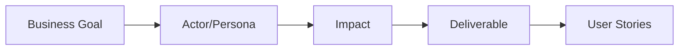
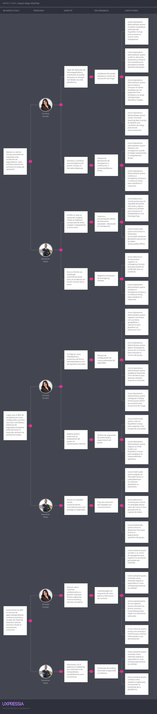
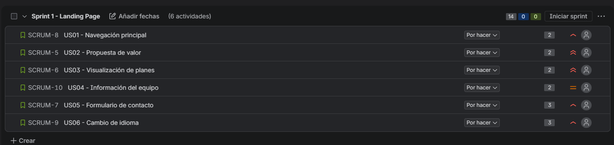

# Capítulo III: Requirements Specification
## 3.1. User Stories
Las siguientes historias de usuario describen las funcionalidades que VitalTrek debe proporcionar a sus actores principales: **Tour Operator**, **Operations Administrator**, **Field Guide**, **Adventure Tourist**, **Emergency Contact** y **Rescue Entity**. Se incluyen únicamente historias funcionales del producto; las Technical Stories se definirán en una etapa posterior.

### EP01. Landing Page y comunicación del producto

| Story ID | Título                  | Descripción                                                                                                                    | Criterios de aceptación (Gherkin)                                                                                                                                               |
| -------- | ----------------------- | ------------------------------------------------------------------------------------------------------------------------------ | ------------------------------------------------------------------------------------------------------------------------------------------------------------------------------- |
| US01     | Navegación principal    | Como visitante quiero acceder a un menú de navegación para explorar las secciones principales de VitalTrek.                    | **Dado que** estoy en la landing page **Cuando** el menú está disponible **Entonces** puedo acceder a Inicio, Solución, Cómo funciona, Precios, Equipo y Contacto.        |
| US02     | Propuesta de valor      | Como visitante quiero entender cómo VitalTrek mejora la seguridad en rutas remotas para evaluar su utilidad.                   | **Dado que** visito la página principal **Cuando** consulto la sección inicial **Entonces** visualizo el problema, la solución y sus beneficios principales.              |
| US03     | Visualización de planes | Como representante de una agencia quiero consultar los planes, precios y características para elegir una alternativa adecuada. | **Dado que** ingreso a la sección de precios **Cuando** los planes están disponibles **Entonces** puedo comparar precio, alcance y características de cada plan.          |
| US04     | Información del equipo  | Como visitante quiero conocer a los integrantes de Nexum Devs para identificar al equipo responsable de VitalTrek.             | **Dado que** ingreso a la sección Equipo **Cuando** la información está disponible **Entonces** visualizo nombre, rol y descripción de cada integrante.                   |
| US05     | Formulario de contacto  | Como visitante quiero enviar una consulta a VitalTrek para solicitar información o una demostración.                           | **Dado que** estoy en Contacto **Cuando** completo los campos obligatorios y envío el formulario **Entonces** el sistema confirma el envío y valida los datos ingresados. |
| US06     | Cambio de idioma        | Como visitante quiero cambiar entre español e inglés para comprender el contenido de la plataforma.                            | **Dado que** estoy en la landing page **Cuando** selecciono un idioma disponible **Entonces** el contenido se actualiza al idioma elegido y conserva la preferencia.      |

### EP02. Configuración del tour

| Story ID | Título                             | Descripción                                                                                                                        | Criterios de aceptación (Gherkin)                                                                                                                                                                |
| -------- | ---------------------------------- | ---------------------------------------------------------------------------------------------------------------------------------- | ------------------------------------------------------------------------------------------------------------------------------------------------------------------------------------------------ |
| US07     | Configuración de rutas             | Como Operations Administrator quiero registrar una Route con sus datos geográficos y operativos para planificar un Adventure Tour. | **Dado que** tengo permisos de administración **Cuando** ingreso los datos obligatorios de la ruta **Entonces** el sistema crea y muestra la Route configurada.                            |
| US08     | Definición de checkpoints          | Como Operations Administrator quiero definir Checkpoints dentro de una Route para controlar el avance del grupo.                   | **Dado que** existe una Route **Cuando** registro ubicación, orden y características de cada checkpoint **Entonces** los Checkpoints quedan asociados a la ruta.                           |
| US09     | Ventanas de tiempo esperadas       | Como Operations Administrator quiero establecer Expected Time Windows para detectar retrasos durante el recorrido.                 | **Dado que** existen Checkpoints configurados **Cuando** asigno una ventana de tiempo a cada tramo **Entonces** el sistema guarda los límites esperados y los utiliza en la supervisión.   |
| US10     | Protocolo de seguridad             | Como Operations Administrator quiero configurar el Safety Protocol para definir las acciones ante situaciones de riesgo.           | **Dado que** estoy configurando un tour **Cuando** registro niveles de riesgo, responsables y acciones **Entonces** el protocolo queda asociado al tour.                                   |
| US11     | Creación del grupo de expedición   | Como Field Guide quiero crear un Expedition Group para organizar a los turistas de una salida.                                     | **Dado que** existe una Route activa **Cuando** registro fecha, guía y datos del grupo **Entonces** el sistema crea el Expedition Group.                                                   |
| US12     | Registro del manifiesto            | Como Field Guide quiero registrar el Tourist Manifest para conocer quiénes participan en el tour.                                  | **Dado que** existe un Expedition Group **Cuando** ingreso los datos requeridos de cada Adventure Tourist **Entonces** el sistema guarda el manifiesto y valida que no existan duplicados. |
| US13     | Asignación del guía                | Como Operations Administrator quiero asignar un Field Guide a un Expedition Group para establecer la responsabilidad operativa.    | **Dado que** existe un grupo sin guía asignado **Cuando** selecciono un Field Guide disponible **Entonces** el sistema registra la asignación y la muestra en el tour.                     |
| US14     | Registro de contacto de emergencia | Como Adventure Tourist quiero registrar un Emergency Contact para que pueda ser notificado ante un incidente.                      | **Dado que** estoy registrado en un tour **Cuando** ingreso nombre y medio de contacto válidos **Entonces** el contacto queda asociado a mi registro.                                      |

### EP03. Preparación y operación offline

| Story ID | Título                          | Descripción                                                                                                                                       | Criterios de aceptación (Gherkin)                                                                                                                                                |
| -------- | ------------------------------- | ------------------------------------------------------------------------------------------------------------------------------------------------- | -------------------------------------------------------------------------------------------------------------------------------------------------------------------------------- |
| US15     | Asignación del wearable         | Como Field Guide quiero asignar un Wearable Device a cada Adventure Tourist para identificar su telemetría.                                       | **Dado que** existe un Tourist Manifest **Cuando** asigno un dispositivo disponible a un turista **Entonces** el sistema registra la relación y el estado del dispositivo. |
| US16     | Activación del wearable         | Como Adventure Tourist quiero activar mi Wearable Device antes de iniciar el tour para permitir la captura de datos.                              | **Dado que** tengo un dispositivo asignado **Cuando** inicio la activación y otorgo mi consentimiento **Entonces** el dispositivo queda activo para el recorrido.          |
| US17     | Inicio del Adventure Tour       | Como Field Guide quiero iniciar el Adventure Tour para activar el seguimiento operativo del grupo.                                                | **Dado que** el grupo, la ruta y los dispositivos están listos **Cuando** confirmo el inicio **Entonces** el tour cambia a estado activo y se registra la hora de inicio.  |
| US18     | Captura offline de telemetría   | Como Adventure Tourist quiero que mi wearable almacene ubicación y signos vitales sin conexión para mantener la trazabilidad en una Coverage Gap. | **Dado que** el grupo está sin cobertura móvil **Cuando** el wearable recibe datos **Entonces** los almacena localmente para sincronizarlos posteriormente.                |
| US19     | Consulta offline de Route Notes | Como Field Guide quiero consultar Route Notes sin conexión para orientarme y revisar indicaciones durante el recorrido.                           | **Dado que** estoy dentro de una Coverage Gap **Cuando** consulto una nota previamente descargada **Entonces** puedo visualizarla sin conexión a Internet.                 |
| US20     | Seguimiento del progreso        | Como Operations Administrator quiero visualizar el progreso estimado del Expedition Group para conocer su avance entre checkpoints.               | **Dado que** existen datos del recorrido **Cuando** consulto el estado del grupo **Entonces** visualizo tramo actual, último checkpoint y progreso estimado.               |

### EP04. Checkpoint y supervisión

| Story ID | Título                             | Descripción                                                                                                                                                   | Criterios de aceptación (Gherkin)                                                                                                                                                                 |
| -------- | ---------------------------------- | ------------------------------------------------------------------------------------------------------------------------------------------------------------- | ------------------------------------------------------------------------------------------------------------------------------------------------------------------------------------------------- |
| US21     | Registro de llegada al checkpoint  | Como Field Guide quiero registrar la llegada del grupo a un Checkpoint para generar evidencia del avance.                                                     | **Dado que** el grupo llegó a un checkpoint **Cuando** confirmo el check-in **Entonces** el sistema registra fecha, hora, grupo y checkpoint.                                               |
| US22     | Sincronización por Bluetooth       | Como Field Guide quiero sincronizar la telemetría acumulada mediante Bluetooth para enviar los datos almacenados offline.                                     | **Dado que** el dispositivo está cerca del checkpoint **Cuando** se establece el handshake Bluetooth **Entonces** el sistema transfiere y confirma los datos pendientes.                    |
| US23     | Actualización del estado del grupo | Como Operations Administrator quiero recibir la ubicación, telemetría y check-in sincronizados para actualizar el estado operativo del grupo.                 | **Dado que** la sincronización finalizó correctamente **Cuando** el sistema procesa el lote recibido **Entonces** actualiza ubicación, signos vitales, tramo y estado del Expedition Group. |
| US24     | Evaluación de riesgo               | Como Operations Administrator quiero que el sistema compare los datos recibidos con las Expected Time Windows y el rango vital base para identificar riesgos. | **Dado que** existe información sincronizada **Cuando** se ejecutan las reglas de evaluación **Entonces** el sistema identifica retrasos, anomalías o Route Deviations.                     |
| US25     | Generación de alerta temprana      | Como Operations Administrator quiero recibir una Early Warning Alert cuando se detecte una condición de riesgo para actuar oportunamente.                     | **Dado que** una regla identifica una condición de riesgo **Cuando** finaliza la evaluación **Entonces** se genera una alerta con tipo, prioridad, grupo y evidencia asociada.              |
| US26     | Visualización de alertas           | Como Field Guide quiero recibir las alertas priorizadas para conocer las acciones que debo ejecutar en campo.                                                 | **Dado que** existe una alerta activa **Cuando** el sistema la distribuye al guía **Entonces** puedo visualizar su prioridad, causa y protocolo recomendado.                                |

### EP05. Incidentes y cierre

| Story ID | Título                      | Descripción                                                                                                                            | Criterios de aceptación (Gherkin)                                                                                                                                                     |
| -------- | --------------------------- | -------------------------------------------------------------------------------------------------------------------------------------- | ------------------------------------------------------------------------------------------------------------------------------------------------------------------------------------- |
| US27     | Confirmación de incidente   | Como Field Guide quiero confirmar un incidente para informar a operaciones que la situación requiere atención.                         | **Dado que** recibo una alerta **Cuando** verifico la situación y la confirmo **Entonces** el incidente cambia a estado confirmado y se registra la evidencia.                  |
| US28     | Declaración de emergencia   | Como Operations Administrator quiero declarar una emergencia cuando el riesgo compromete la integridad del grupo.                      | **Dado que** existe un incidente confirmado **Cuando** declaro la emergencia **Entonces** el sistema activa el protocolo de respuesta y registra la hora y responsable.         |
| US29     | Notificación de contactos   | Como Operations Administrator quiero notificar al Emergency Contact y a la Rescue Entity para coordinar la respuesta.                  | **Dado que** se declaró una emergencia **Cuando** confirmo los destinatarios y el mensaje **Entonces** el sistema registra las notificaciones y su estado de envío.             |
| US30     | Coordinación de evacuación  | Como Field Guide quiero registrar las acciones de evacuación para mantener trazabilidad durante la atención del incidente.             | **Dado que** una emergencia está activa **Cuando** registro instrucciones, ubicación y acciones ejecutadas **Entonces** la información queda asociada al incidente.             |
| US31     | Finalización del tour       | Como Field Guide quiero finalizar el Adventure Tour para cerrar formalmente el recorrido.                                              | **Dado que** el grupo completó la ruta o terminó la operación **Cuando** confirmo el cierre **Entonces** se registra el último checkpoint y el tour cambia a estado finalizado. |
| US32     | Generación del Tour Summary | Como Operations Administrator quiero consultar un Tour Summary para revisar el recorrido, checkpoints, alertas e incidentes ocurridos. | **Dado que** el tour fue finalizado **Cuando** solicito el resumen **Entonces** el sistema genera un consolidado del recorrido y sus eventos relevantes.                        |

## 3.2. Impact Mapping

En esta sección se explica y se presentan las capturas del Impact Mapping elaborado para el modelo de negocio digital de **VitalTrek**, construido en la herramienta **UXPressia**. Previamente a la elaboración del mapa, se crearon en la herramienta las fichas de **User Persona** correspondientes a los dos segmentos objetivo del producto, las cuales se muestran a continuación.

### 3.2.1. User Personas elaboradas previamente

| Segmento objetivo                                            | Persona         | Descripción                                                                                                                                                                                               |
| ------------------------------------------------------------ | --------------- | --------------------------------------------------------------------------------------------------------------------------------------------------------------------------------------------------------- |
| **Segmento 1: Agencias y Operadores de Turismo de Aventura** | Vanessa Quispe  | Gerente de operaciones (Operations Administrator) de una agencia de turismo de aventura en Cusco; responsable de la seguridad y supervisión de los grupos en ruta. Es la decisora de compra del producto. |
| **Segmento 2: Turistas de Aventura**                         | Sebastian Rojas | Turista de aventura (Adventure Tourist) que contrata tours en rutas remotas; necesita seguridad, trazabilidad y comunicación con su familia durante el recorrido.                                         |

*(Insertar aquí las capturas de las fichas de Persona exportadas desde UXPressia)*

### 3.2.2. Business Goals (criterios SMART)

Se identificaron 3 Business Goals para el Impact Map, cada uno cumpliendo los criterios SMART (específico, medible, alcanzable, relevante y con plazo definido):

**Business Goal 1**
> Reducir en 40% el tiempo promedio de respuesta ante incidentes de seguridad en rutas remotas durante los primeros 12 meses de operación.

**Business Goal 2**
> Lograr que el 80% de los Adventure Tours configurados en la plataforma cuenten con ruta, manifiesto y protocolo de seguridad completos antes de iniciar el recorrido, durante los primeros 6 meses de lanzamiento.

**Business Goal 3**
> Incrementar en 30% el número de agencias/operadores turísticos suscritos a un plan de VitalTrek durante el primer semestre desde el lanzamiento comercial.

| Criterio SMART | Goal 1                                                  | Goal 2                                                              | Goal 3                                                       |
| -------------- | ------------------------------------------------------- | ------------------------------------------------------------------- | ------------------------------------------------------------ |
| Específico     | Tiempo de respuesta ante incidentes de seguridad        | Completitud de configuración del tour antes de iniciar              | Crecimiento de agencias suscritas a un plan pago             |
| Medible        | Reducción del 40%                                       | 80% de los tours cumpliendo el criterio                             | Incremento del 30%                                           |
| Alcanzable     | Mediante alertas automatizadas y sincronización offline | A través de los módulos de configuración ya definidos en el backlog | Vía landing page con propuesta de valor y captación de leads |
| Relevante      | Núcleo del valor diferencial de VitalTrek               | Prerrequisito operativo para la seguridad del tour                  | Condiciona la sostenibilidad comercial del producto          |
| Con plazo      | 12 meses desde el inicio de operación                   | 6 meses desde el lanzamiento                                        | Primer semestre desde el lanzamiento comercial               |

### 3.2.3. Impact Map

La siguiente tabla presenta el Impact Map completo, respondiendo para cada rama las preguntas guía de la metodología:

- **Business Goals** - ¿Por qué lo hacemos?
- **Actors/Personas** - ¿Quiénes me ayudarán a lograr la meta?
- **Impact** - ¿Qué tendría que hacer o cómo tendría que comportarse el Persona para ayudar a lograr la meta?
- **Deliverables** - ¿Qué puedo hacer como negocio digital para provocar esos Impacts?
- **User Stories** - Historias en formato "Como... deseo... para..." que permiten obtener los features que producen cada Deliverable.

El patrón se repite de la siguiente forma en cada rama del mapa:

#### Business Goal 1 — Reducir el tiempo de respuesta ante incidentes

| Actor/Persona                | Impact                                                                                                                             | Deliverables                                                                                          | User Stories                                                                                                                                                                                                                                                         |
| ---------------------------- | ---------------------------------------------------------------------------------------------------------------------------------- | ----------------------------------------------------------------------------------------------------- | -------------------------------------------------------------------------------------------------------------------------------------------------------------------------------------------------------------------------------------------------------------------- |
| Vanessa Quispe (Segmento 1)  | Dejar de depender de WhatsApp/radios y monitorear el estado del grupo en tiempo real; declarar y coordinar emergencias sin demoras | Dashboard de estado operativo, motor de evaluación de riesgo y módulo de declaración de emergencia    | Como Operations Administrator quiero recibir la ubicación, telemetría y check-in sincronizados para actualizar el estado operativo del grupo.   Como Operations Administrator quiero declarar una emergencia cuando el riesgo compromete la integridad del grupo. |
| Sebastian Rojas (Segmento 2) | Confiar en que su ubicación y signos vitales se registran aunque pierda señal; que su familia sea notificada automáticamente       | Captura y sincronización offline de telemetría (wearable + Bluetooth) y registro de Emergency Contact | Como Adventure Tourist quiero que mi wearable almacene ubicación y signos vitales sin conexión para mantener la trazabilidad en una Coverage Gap.   Como Adventure Tourist quiero registrar un Emergency Contact para que pueda ser notificado ante un incidente. |

#### Business Goal 2 — Preparación completa de los tours

| Actor/Persona                | Impact                                                                                                     | Deliverables                                                             | User Stories                                                                                                                                                                                                                                                            |
| ---------------------------- | ---------------------------------------------------------------------------------------------------------- | ------------------------------------------------------------------------ | ----------------------------------------------------------------------------------------------------------------------------------------------------------------------------------------------------------------------------------------------------------------------- |
| Vanessa Quispe (Segmento 1)  | Configurar rutas, checkpoints y protocolos de forma estandarizada; asignar guías sin coordinación informal | Módulo de configuración de rutas, protocolos y asignación de Field Guide | Como Operations Administrator quiero registrar una Route con sus datos geográficos y operativos para planificar un Adventure Tour.   Como Operations Administrator quiero asignar un Field Guide a un Expedition Group para establecer la responsabilidad operativa. |
| Sebastian Rojas (Segmento 2) | Activar su wearable dando consentimiento antes de iniciar el tour                                          | Flujo de asignación y activación del wearable                            | Como Adventure Tourist quiero activar mi Wearable Device antes de iniciar el tour para permitir la captura de datos.                                                                                                                                                    |

#### Business Goal 3 — Crecimiento de agencias suscritas

| Actor/Persona                | Impact                                                                                                            | Deliverables                                                         | User Stories                                                                                                                                                                                                                             |
| ---------------------------- | ----------------------------------------------------------------------------------------------------------------- | -------------------------------------------------------------------- | ---------------------------------------------------------------------------------------------------------------------------------------------------------------------------------------------------------------------------------------- |
| Vanessa Quispe (Segmento 1)  | Evaluar cómo VitalTrek profesionaliza su gestión operativa frente a agencias internacionales y solicitar una demo | Landing page con propuesta de valor, planes y formulario de contacto | Como representante de una agencia quiero consultar los planes, precios y características para elegir una alternativa adecuada.   Como visitante quiero enviar una consulta a VitalTrek para solicitar información o una demostración. |
| Sebastian Rojas (Segmento 2) | Reconocer, vía la agencia o marketing, que VitalTrek le da tranquilidad y trazabilidad durante su aventura        | Contenido de landing orientado a seguridad y confianza               | Como visitante quiero entender cómo VitalTrek mejora la seguridad en rutas remotas para evaluar su utilidad.                                                                                                                             |

### 3.2.4. Capturas del Impact Map en UXPressia

## 3.3. Product Backlog

El Product Backlog contiene las User Stories funcionales de VitalTrek, priorizadas según el valor que aportan al negocio, la seguridad de los tours y la validación inicial del modelo comercial. La estimación utiliza Story Points con la escala `1, 2, 3, 5, 8`.

Las historias de la Landing Page se incluyen desde el inicio porque permiten comunicar la propuesta de valor y captar agencias interesadas. Luego se priorizan las funcionalidades necesarias para configurar, ejecutar, supervisar y cerrar un Adventure Tour.

| Orden | User Story ID | Título                             | Descripción                                                                                                                         | Story Points |
| ----: | ------------- | ---------------------------------- | ----------------------------------------------------------------------------------------------------------------------------------- | -----------: |
|     1 | US02          | Propuesta de valor                 | Como visitante quiero entender cómo VitalTrek mejora la seguridad en rutas remotas para evaluar su utilidad.                        |            2 |
|     2 | US03          | Visualización de planes            | Como representante de una agencia quiero consultar los planes, precios y características para elegir una alternativa adecuada.      |            2 |
|     3 | US05          | Formulario de contacto             | Como visitante quiero enviar una consulta a VitalTrek para solicitar información o una demostración.                                |            3 |
|     4 | US01          | Navegación principal               | Como visitante quiero acceder a un menú de navegación para explorar las secciones principales de VitalTrek.                         |            2 |
|     5 | US06          | Cambio de idioma                   | Como visitante quiero cambiar entre español e inglés para comprender el contenido de la plataforma.                                 |            3 |
|     6 | US04          | Información del equipo             | Como visitante quiero conocer a los integrantes de Nexum Devs para identificar al equipo responsable de VitalTrek.                  |            2 |
|     7 | US07          | Configuración de rutas             | Como Operations Administrator quiero registrar una Route con sus datos geográficos y operativos para planificar un Adventure Tour.  |            5 |
|     8 | US08          | Definición de checkpoints          | Como Operations Administrator quiero definir Checkpoints dentro de una Route para controlar el avance del grupo.                    |            5 |
|     9 | US09          | Ventanas de tiempo esperadas       | Como Operations Administrator quiero establecer Expected Time Windows para detectar retrasos durante el recorrido.                  |            3 |
|    10 | US10          | Protocolo de seguridad             | Como Operations Administrator quiero configurar el Safety Protocol para definir acciones ante situaciones de riesgo.                |            5 |
|    11 | US11          | Creación del grupo de expedición   | Como Field Guide quiero crear un Expedition Group para organizar a los turistas de una salida.                                      |            3 |
|    12 | US12          | Registro del manifiesto            | Como Field Guide quiero registrar el Tourist Manifest para conocer quiénes participan en el tour.                                   |            5 |
|    13 | US13          | Asignación del guía                | Como Operations Administrator quiero asignar un Field Guide a un Expedition Group para establecer la responsabilidad operativa.     |            2 |
|    14 | US15          | Asignación del wearable            | Como Field Guide quiero asignar un Wearable Device a cada Adventure Tourist para identificar su telemetría.                         |            5 |
|    15 | US16          | Activación del wearable            | Como Adventure Tourist quiero activar mi Wearable Device antes de iniciar el tour para permitir la captura de datos.                |            3 |
|    16 | US17          | Inicio del Adventure Tour          | Como Field Guide quiero iniciar el Adventure Tour para activar el seguimiento operativo del grupo.                                  |            2 |
|    17 | US18          | Captura offline de telemetría      | Como Adventure Tourist quiero que mi wearable almacene ubicación y signos vitales sin conexión para mantener la trazabilidad.       |            8 |
|    18 | US22          | Sincronización por Bluetooth       | Como Field Guide quiero sincronizar la telemetría acumulada mediante Bluetooth para enviar los datos almacenados offline.           |            8 |
|    19 | US21          | Registro de llegada al checkpoint  | Como Field Guide quiero registrar la llegada del grupo a un Checkpoint para generar evidencia del avance.                           |            3 |
|    20 | US23          | Actualización del estado del grupo | Como Operations Administrator quiero recibir la ubicación, telemetría y check-in sincronizados para actualizar el estado operativo. |            5 |
|    21 | US24          | Evaluación de riesgo               | Como Operations Administrator quiero comparar los datos recibidos con las reglas operativas para identificar riesgos.               |            8 |
|    22 | US25          | Generación de alerta temprana      | Como Operations Administrator quiero recibir una Early Warning Alert cuando se detecte una condición de riesgo.                     |            5 |
|    23 | US26          | Visualización de alertas           | Como Field Guide quiero recibir las alertas priorizadas para conocer las acciones que debo ejecutar en campo.                       |            3 |
|    24 | US14          | Registro de contacto de emergencia | Como Adventure Tourist quiero registrar un Emergency Contact para que pueda ser notificado ante un incidente.                       |            3 |
|    25 | US27          | Confirmación de incidente          | Como Field Guide quiero confirmar un incidente para informar a operaciones que requiere atención.                                   |            3 |
|    26 | US28          | Declaración de emergencia          | Como Operations Administrator quiero declarar una emergencia cuando el riesgo compromete la integridad del grupo.                   |            3 |
|    27 | US29          | Notificación de contactos          | Como Operations Administrator quiero notificar al Emergency Contact y a la Rescue Entity para coordinar la respuesta.               |            5 |
|    28 | US30          | Coordinación de evacuación         | Como Field Guide quiero registrar las acciones de evacuación para mantener trazabilidad durante el incidente.                       |            5 |
|    29 | US20          | Seguimiento del progreso           | Como Operations Administrator quiero visualizar el progreso estimado del grupo para conocer su avance entre checkpoints.            |            5 |
|    30 | US19          | Consulta offline de Route Notes    | Como Field Guide quiero consultar Route Notes sin conexión para revisar indicaciones durante el recorrido.                          |            3 |
|    31 | US31          | Finalización del tour              | Como Field Guide quiero finalizar el Adventure Tour para cerrar formalmente el recorrido.                                           |            2 |
|    32 | US32          | Generación del Tour Summary        | Como Operations Administrator quiero consultar un Tour Summary para revisar el recorrido, checkpoints, alertas e incidentes.        |            5 |

### Criterio de priorización

La prioridad considera cuatro factores: valor para el negocio, aporte a la seguridad, dependencia entre funcionalidades y posibilidad de validar la propuesta comercial. Por ello, la Landing Page aparece al inicio; posteriormente se incluyen las capacidades mínimas para preparar un tour, capturar y sincronizar telemetría, evaluar riesgos, responder a incidentes y generar el cierre operativo.

### Evidencia del Product Backlog en Jira

El Product Backlog de VitalTrek fue gestionado en Jira Software. Las User Stories fueron importadas, priorizadas y estimadas mediante Story Points. Para el primer Sprint se seleccionaron las seis historias relacionadas con la Landing Page, debido a que la guía del curso exige que este producto se considere desde el inicio del desarrollo.

**Figura 3.6.** Product Backlog de VitalTrek en Jira.

**Enlace al Product Backlog en Jira:**  
[Ver Product Backlog](https://milenkorvu.atlassian.net/jira/software/projects/SCRUM/boards/1/backlog)

El Sprint 1 contiene las User Stories US01–US06, con una estimación total de 14 Story Points. Las 26 historias restantes permanecen en el backlog para siguientes iteraciones.