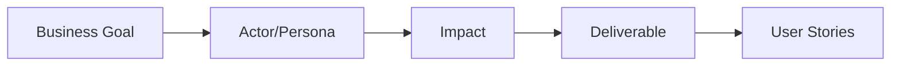
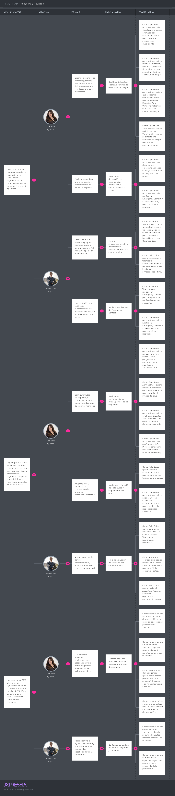

# Capítulo III: Requirements Specification
## 3.1. User Stories

Los requisitos de VitalTrek se especifican a partir de los **dos segmentos objetivo** definidos en la sección 1.3 y de los User Personas elaborados para cada uno de ellos. Los roles utilizados en la redacción de las historias se derivan directamente de esos segmentos:
 
| Segmento objetivo | User Persona | Rol en las historias de la Landing Page | Rol en las aplicaciones web |
| --- | --- | --- | --- |
| **Segmento 1: Agencias y Operadores de Turismo de Aventura** | Vanessa Quispe | `visitante del segmento Agencias y Operadores de Turismo de Aventura` | `Operations Administrator` (supervisión y configuración desde la central) y `Field Guide` (operación en campo) |
| **Segmento 2: Turistas de Aventura** | Sebastian Rojas | `visitante del segmento Turistas de Aventura` | `Adventure Tourist` |
 
Cuando una sección de la Landing Page presenta contenido dirigido a ambos segmentos, la historia se redacta con el **rol base `visitante`**. Las Technical Stories se redactan con el rol **`Developer`**, correspondiente al equipo NexaTech.
 
El dominio contempla además dos actores externos que **reciben información del sistema pero no lo operan**, por lo que no figuran como rol en ninguna historia: el **Emergency Contact**, persona designada por el Adventure Tourist que es notificada ante un incidente (US14, US29), y la **Rescue Entity**, organización de rescate o autoridad competente a la que se escala una emergencia declarada (US29).
 
Los criterios de aceptación se redactan en tiempo presente, tercera persona y sin referencias a detalles de interfaz. Siguen la estructura Gherkin (Given-When-Then); en las Technical Stories cuyo contenido son restricciones que no dependen de una condición se emplea una lista de reglas, que es la excepción prevista en el enunciado. Las TS01–TS04 corresponden al alcance de AV1; las TS05–TS10 quedan planificadas para Sprints posteriores.

**Resumen de épicas**
 
| Epic ID | Épica                                    | ¿En qué consiste?                                                                                                              |
| ------- | ---------------------------------------- | ------------------------------------------------------------------------------------------------------------------------------ |
| EP01    | Landing Page y comunicación del producto | Comunicar la propuesta de valor de VitalTrek y presentar información sobre la solución, beneficios, planes, equipo y contacto. |
| EP02    | Configuración del tour                   | Permitir registrar rutas, checkpoints, ventanas de tiempo, protocolos de seguridad y grupos de expedición.                     |
| EP03    | Preparación y operación offline          | Preparar dispositivos, activar wearables y mantener la operación cuando no existe conexión móvil.                              |
| EP04    | Checkpoint y supervisión                 | Registrar llegadas, sincronizar telemetría, actualizar el estado del grupo, evaluar riesgos y generar alertas.                 |
| EP05    | Incidentes y cierre                      | Gestionar incidentes, declarar emergencias, notificar contactos, coordinar evacuaciones y cerrar el tour con un resumen.       |
 
| Epic / Story ID | Título | Descripción | Criterios de aceptación | Relacionado con (Epic ID) |
| --- | --- | --- | --- | --- |
| EP01 | Landing Page y comunicación del producto | Comunicar la propuesta de valor de VitalTrek y facilitar el acceso a la información principal del producto. | — | — |
| US01 | Navegación principal | Como **visitante** quiero acceder a las secciones principales del sitio para explorar la información de VitalTrek según mi interés. | **Escenario 1: Acceso a una sección principal** **Dado que** el visitante se encuentra en la Landing Page **Cuando** solicita acceder a una de las secciones principales del sitio **Entonces** el sistema presenta el contenido de la sección solicitada.  **Escenario 2: Acceso a la solicitud de demostración** **Dado que** el visitante se encuentra en cualquier sección del sitio **Cuando** solicita contactar a VitalTrek **Entonces** el sistema presenta el formulario de solicitud de información.  **Escenario 3: Equivalencia entre dispositivos** **Dado que** el visitante accede desde un dispositivo de pantalla reducida **Cuando** solicita la navegación del sitio **Entonces** el sistema ofrece las mismas secciones disponibles en pantallas de mayor tamaño. | EP01 |
| US02 | Propuesta de valor | Como **visitante** quiero entender cómo VitalTrek mejora la seguridad en rutas sin cobertura móvil para evaluar su utilidad. | **Escenario 1: Consulta de la propuesta de valor** **Dado que** el visitante accede a la Landing Page **Cuando** consulta la sección inicial **Entonces** el sistema presenta el problema que atiende el producto, la solución propuesta y sus beneficios principales.  **Escenario 2: Vínculo con el detalle de la solución** **Dado que** el visitante consultó la propuesta de valor **Cuando** solicita ampliar la información sobre el funcionamiento de la solución **Entonces** el sistema presenta la descripción de las capacidades del producto. | EP01 |
| US03 | Consulta de planes y precios | Como **visitante del segmento Agencias y Operadores de Turismo de Aventura** quiero consultar los planes, precios y características incluidas para elegir la alternativa adecuada para mi agencia. | **Escenario 1: Comparación de los planes disponibles** **Dado que** el visitante del segmento Agencias y Operadores de Turismo de Aventura consulta la sección de planes **Cuando** los planes se encuentran publicados **Entonces** el sistema presenta el precio, el alcance y las características de cada plan de forma comparable.  **Escenario 2: Continuidad hacia el contacto comercial** **Dado que** el visitante del segmento Agencias y Operadores de Turismo de Aventura revisó los planes **Cuando** solicita información sobre un plan determinado **Entonces** el sistema presenta el formulario de contacto con el plan de interés identificado. | EP01 |
| US04 | Información del equipo | Como **visitante** quiero conocer a los integrantes de NexaTech para identificar al equipo responsable del producto. | **Escenario 1: Consulta de la sección Equipo** **Dado que** el visitante consulta la sección Equipo **Cuando** la información se encuentra publicada **Entonces** el sistema presenta el nombre, el rol y la descripción de cada integrante. | EP01 |
| US05 | Solicitud de información o demostración | Como **visitante del segmento Agencias y Operadores de Turismo de Aventura** quiero enviar una solicitud de información o demostración para evaluar la adopción de VitalTrek en mi agencia. | **Escenario 1: Registro de una solicitud válida** **Dado que** el visitante del segmento Agencias y Operadores de Turismo de Aventura completa los datos obligatorios con valores válidos **Cuando** envía la solicitud **Entonces** el sistema registra la solicitud y confirma su recepción.  **Escenario 2: Solicitud con datos obligatorios incompletos** **Dado que** el visitante del segmento Agencias y Operadores de Turismo de Aventura omite uno o más datos obligatorios **Cuando** intenta enviar la solicitud **Entonces** el sistema no la registra e informa cuáles datos deben completarse.  **Escenario 3: Solicitud con correo de formato inválido** **Dado que** el visitante del segmento Agencias y Operadores de Turismo de Aventura ingresa un correo con formato inválido **Cuando** intenta enviar la solicitud **Entonces** el sistema no la registra e informa el formato esperado. | EP01 |
| US06 | Consulta del contenido en el idioma del visitante | Como **visitante** quiero consultar el contenido del sitio en español o en inglés para comprender la propuesta en mi idioma. | **Escenario 1: Selección de idioma** **Dado que** el visitante se encuentra en la Landing Page **Cuando** selecciona uno de los idiomas disponibles **Entonces** el sistema presenta todo el contenido del sitio en el idioma seleccionado.  **Escenario 2: Persistencia de la preferencia** **Dado que** el visitante seleccionó previamente un idioma **Cuando** vuelve a acceder al sitio **Entonces** el sistema conserva el idioma seleccionado. | EP01 |
| US33 | Consulta del tratamiento de datos personales | Como **visitante del segmento Turistas de Aventura** quiero conocer qué datos registra el producto y cómo se tratan para decidir con información si acepto ser monitoreado durante una expedición. | **Escenario 1: Consulta de la política de privacidad** **Dado que** el visitante del segmento Turistas de Aventura consulta la información legal del sitio **Cuando** accede a la política de privacidad **Entonces** el sistema presenta las categorías de datos que se registran, su finalidad y el plazo de conservación.  **Escenario 2: Consulta de los derechos del titular** **Dado que** el visitante del segmento Turistas de Aventura consulta la política de privacidad **Cuando** revisa la sección de derechos del titular **Entonces** el sistema presenta los derechos de acceso, rectificación, cancelación y oposición, y el canal para ejercerlos.  **Escenario 3: Alcance y limitaciones del producto** **Dado que** el visitante del segmento Turistas de Aventura consulta la información legal del sitio **Cuando** revisa los términos de servicio **Entonces** el sistema indica expresamente que el producto no sustituye a un servicio de emergencia ni a un dispositivo médico. | EP01 |
| EP02 | Configuración del tour | Configurar rutas, checkpoints, ventanas de tiempo, protocolos y grupos antes de iniciar un Adventure Tour. | — | — |
| US07 | Configuración de rutas | Como **Operations Administrator** quiero registrar una Route con sus datos geográficos y operativos para planificar un Adventure Tour. | **Escenario 1: Registro de una ruta válida** **Dado que** el Operations Administrator cuenta con permisos de administración **Cuando** registra una Route con todos sus datos obligatorios **Entonces** el sistema crea la Route y la habilita para la planificación de tours.  **Escenario 2: Registro con datos obligatorios incompletos** **Dado que** el Operations Administrator registra una Route sin uno de sus datos obligatorios **Cuando** confirma el registro **Entonces** el sistema no crea la Route e informa el dato faltante.  **Escenario 3: Nombre de ruta duplicado** **Dado que** ya existe una Route registrada con el mismo nombre en la agencia **Cuando** el Operations Administrator confirma el registro **Entonces** el sistema rechaza el registro e informa la duplicidad. | EP02 |
| US08 | Definición de checkpoints | Como **Operations Administrator** quiero definir los Checkpoints de una Route para controlar el avance del grupo durante el recorrido. | **Escenario 1: Registro de un checkpoint** **Dado que** existe una Route registrada **Cuando** el Operations Administrator registra un Checkpoint con su ubicación y su orden en la secuencia **Entonces** el sistema asocia el Checkpoint a la Route en la posición indicada.  **Escenario 2: Orden duplicado en la secuencia** **Dado que** la Route ya tiene un Checkpoint registrado en una posición determinada **Cuando** el Operations Administrator registra otro Checkpoint con la misma posición **Entonces** el sistema rechaza el registro e informa el conflicto de secuencia.  **Escenario 3: Ruta sin checkpoints** **Dado que** una Route no tiene Checkpoints registrados **Cuando** el Operations Administrator intenta habilitarla para la planificación de tours **Entonces** el sistema impide la habilitación e informa que la Route requiere al menos un Checkpoint. | EP02 |
| US09 | Ventanas de tiempo esperadas | Como **Operations Administrator** quiero establecer las Expected Time Windows de cada tramo para que el sistema pueda detectar retrasos durante el recorrido. | **Escenario 1: Asignación de la ventana de tiempo** **Dado que** la Route cuenta con Checkpoints registrados **Cuando** el Operations Administrator asigna una Expected Time Window a un tramo **Entonces** el sistema guarda los límites esperados y los habilita para la evaluación de riesgo.  **Escenario 2: Límites inconsistentes** **Dado que** el Operations Administrator asigna una Expected Time Window **Cuando** el límite máximo es menor o igual al límite mínimo **Entonces** el sistema rechaza la asignación e informa la inconsistencia.  **Escenario 3: Tramos sin ventana asignada** **Dado que** existen tramos de la Route sin Expected Time Window **Cuando** el Operations Administrator consulta la configuración de la Route **Entonces** el sistema identifica los tramos pendientes de configuración. | EP02 |
| US10 | Protocolo de seguridad | Como **Operations Administrator** quiero configurar el Safety Protocol del tour para definir las acciones que corresponden ante cada nivel de riesgo. | **Escenario 1: Configuración del protocolo** **Dado que** el Operations Administrator configura un Adventure Tour **Cuando** registra los niveles de riesgo con sus responsables y acciones asociadas **Entonces** el sistema asocia el Safety Protocol al tour.  **Escenario 2: Nivel de riesgo sin acción definida** **Dado que** el Operations Administrator registró un nivel de riesgo sin acción asociada **Cuando** confirma la configuración del protocolo **Entonces** el sistema no guarda el protocolo e informa el nivel incompleto. | EP02 |
| US11 | Creación del grupo de expedición | Como **Field Guide** quiero crear un Expedition Group para organizar a los turistas que participan en una salida. | **Escenario 1: Creación del grupo** **Dado que** existe una Route habilitada **Cuando** el Field Guide registra la fecha de salida y los datos del grupo **Entonces** el sistema crea el Expedition Group asociado a esa Route.  **Escenario 2: Fecha de salida en el pasado** **Dado que** el Field Guide registra un Expedition Group **Cuando** la fecha de salida indicada es anterior a la fecha actual **Entonces** el sistema rechaza el registro e informa la inconsistencia de la fecha. | EP02 |
| US12 | Registro del manifiesto | Como **Field Guide** quiero registrar el Tourist Manifest del grupo para conocer quiénes participan en el tour y responder por ellos. | **Escenario 1: Registro de participantes** **Dado que** existe un Expedition Group **Cuando** el Field Guide registra los datos requeridos de cada Adventure Tourist **Entonces** el sistema guarda el Tourist Manifest asociado al grupo.  **Escenario 2: Participante duplicado** **Dado que** un Adventure Tourist ya figura en el Tourist Manifest **Cuando** el Field Guide lo registra nuevamente con el mismo documento de identidad **Entonces** el sistema rechaza el registro e informa que el participante ya está incluido.  **Escenario 3: Capacidad máxima del grupo** **Dado que** el Expedition Group alcanzó la cantidad máxima de participantes configurada **Cuando** el Field Guide registra un participante adicional **Entonces** el sistema rechaza el registro e informa que se alcanzó la capacidad del grupo. | EP02 |
| US13 | Asignación del guía | Como **Operations Administrator** quiero asignar un Field Guide a cada Expedition Group para establecer la responsabilidad operativa del recorrido. | **Escenario 1: Asignación de un guía disponible** **Dado que** existe un Expedition Group sin Field Guide asignado **Cuando** el Operations Administrator asigna un Field Guide disponible **Entonces** el sistema registra la asignación y la asocia al tour.  **Escenario 2: Guía con asignación simultánea** **Dado que** el Field Guide seleccionado ya está asignado a otro tour en la misma fecha **Cuando** el Operations Administrator confirma la asignación **Entonces** el sistema informa el cruce de fechas y requiere una confirmación explícita.  **Escenario 3: Tour sin guía asignado** **Dado que** un Expedition Group no tiene Field Guide asignado **Cuando** se intenta iniciar el Adventure Tour **Entonces** el sistema impide el inicio e informa que el tour requiere un Field Guide responsable. | EP02 |
| US14 | Registro de contacto de emergencia | Como **Adventure Tourist** quiero registrar un Emergency Contact para que una persona de mi confianza sea notificada si ocurre un incidente. | **Escenario 1: Registro del contacto** **Dado que** el Adventure Tourist figura en el Tourist Manifest de un tour **Cuando** registra el nombre y un medio de contacto válido **Entonces** el sistema asocia el Emergency Contact a su registro.  **Escenario 2: Medio de contacto inválido** **Dado que** el Adventure Tourist registra su Emergency Contact **Cuando** el medio de contacto ingresado tiene un formato inválido **Entonces** el sistema no guarda el contacto e informa el formato esperado.  **Escenario 3: Participante sin contacto registrado** **Dado que** un Adventure Tourist del manifiesto no tiene Emergency Contact registrado **Cuando** el Field Guide revisa la preparación del tour **Entonces** el sistema identifica al participante con el registro pendiente. | EP02 |
| EP03 | Preparación y operación offline | Preparar dispositivos y permitir la operación del tour cuando existe una Coverage Gap o no hay conexión. | — | — |
| US15 | Asignación del wearable | Como **Field Guide** quiero asignar un Wearable Device a cada Adventure Tourist para poder identificar a quién corresponde cada lectura de telemetría. | **Escenario 1: Asignación de un dispositivo disponible** **Dado que** existe un Tourist Manifest registrado **Cuando** el Field Guide asigna un Wearable Device disponible a un Adventure Tourist **Entonces** el sistema registra la relación entre dispositivo y participante, y actualiza el estado del dispositivo.  **Escenario 2: Dispositivo ya asignado** **Dado que** un Wearable Device está asignado a otro Adventure Tourist **Cuando** el Field Guide lo asigna nuevamente **Entonces** el sistema rechaza la asignación e informa a qué participante está vinculado.  **Escenario 3: Participantes sin dispositivo** **Dado que** existen participantes del manifiesto sin Wearable Device asignado **Cuando** el Field Guide consulta la preparación del tour **Entonces** el sistema identifica a los participantes pendientes de asignación. | EP03 |
| US16 | Activación del wearable | Como **Adventure Tourist** quiero activar mi Wearable Device antes de iniciar el recorrido para autorizar el registro de mi ubicación y mis signos vitales. | **Escenario 1: Activación con consentimiento otorgado** **Dado que** el Adventure Tourist tiene un Wearable Device asignado **Cuando** otorga su consentimiento para el tratamiento de sus datos y confirma la activación **Entonces** el sistema activa el dispositivo y registra la fecha y hora del consentimiento.  **Escenario 2: Consentimiento no otorgado** **Dado que** el Adventure Tourist tiene un Wearable Device asignado **Cuando** no otorga su consentimiento **Entonces** el sistema mantiene el dispositivo inactivo y no registra lecturas asociadas al participante.  **Escenario 3: Revocación del consentimiento** **Dado que** el Adventure Tourist otorgó previamente su consentimiento **Cuando** solicita revocarlo **Entonces** el sistema desactiva el dispositivo y registra la revocación con su fecha y hora. | EP03 |
| US17 | Inicio del Adventure Tour | Como **Field Guide** quiero iniciar el Adventure Tour para activar el seguimiento operativo del grupo durante el recorrido. | **Escenario 1: Inicio del tour** **Dado que** el Expedition Group, la Route y los dispositivos se encuentran preparados **Cuando** el Field Guide confirma el inicio **Entonces** el sistema cambia el tour al estado activo y registra la hora de inicio.  **Escenario 2: Preparación incompleta** **Dado que** existen participantes del manifiesto sin Wearable Device activado **Cuando** el Field Guide confirma el inicio **Entonces** el sistema informa los participantes pendientes y requiere una confirmación explícita antes de activar el tour.  **Escenario 3: Tour ya iniciado** **Dado que** el Adventure Tour se encuentra en estado activo **Cuando** el Field Guide confirma el inicio nuevamente **Entonces** el sistema mantiene la hora de inicio original y no genera un nuevo registro. | EP03 |
| US18 | Captura offline de telemetría | Como **Adventure Tourist** quiero que mi wearable registre mi ubicación y mis signos vitales aunque no haya cobertura para que la trazabilidad no se interrumpa durante una Coverage Gap. | **Escenario 1: Captura dentro de una Coverage Gap** **Dado que** el Expedition Group se encuentra dentro de una Coverage Gap **Cuando** el Wearable Device registra ubicación y signos vitales **Entonces** el dispositivo almacena cada lectura localmente con su marca de tiempo de origen.  **Escenario 2: Almacenamiento próximo a su capacidad** **Dado que** el almacenamiento local del dispositivo se aproxima a su capacidad máxima **Cuando** se registran nuevas lecturas **Entonces** el dispositivo reduce la frecuencia de muestreo y conserva las lecturas clasificadas como críticas.  **Escenario 3: Conservación hasta la confirmación** **Dado que** existen lecturas almacenadas localmente **Cuando** el sistema central no ha confirmado su recepción **Entonces** el dispositivo conserva esas lecturas y no las elimina. | EP03 |
| US19 | Consulta offline de Route Notes | Como **Field Guide** quiero consultar las Route Notes sin conexión para orientarme y revisar las indicaciones del tramo durante el recorrido. | **Escenario 1: Consulta sin conexión** **Dado que** el Field Guide se encuentra dentro de una Coverage Gap **Cuando** consulta una Route Note descargada antes del inicio del tour **Entonces** el sistema presenta su contenido sin requerir conexión a Internet.  **Escenario 2: Nota no descargada** **Dado que** el Field Guide se encuentra sin conexión **Cuando** consulta una Route Note que no fue descargada antes del inicio del tour **Entonces** el sistema informa que la nota no se encuentra disponible sin conexión.  **Escenario 3: Preparación de las notas** **Dado que** el Adventure Tour aún no ha iniciado y existe conexión disponible **Cuando** el Field Guide prepara el recorrido **Entonces** el sistema descarga las Route Notes de la Route asignada y confirma su disponibilidad offline. | EP03 |
| US20 | Seguimiento del progreso | Como **Operations Administrator** quiero visualizar el progreso estimado del Expedition Group para conocer su avance entre checkpoints. | **Escenario 1: Consulta del progreso** **Dado que** existen datos registrados del recorrido **Cuando** el Operations Administrator consulta el estado del Expedition Group **Entonces** el sistema presenta el tramo en curso, el último Checkpoint confirmado y el progreso estimado.  **Escenario 2: Sin sincronizaciones recientes** **Dado que** el grupo no registra sincronizaciones desde el último Checkpoint **Cuando** el Operations Administrator consulta el estado **Entonces** el sistema indica la antigüedad del último dato recibido y señala que el progreso corresponde a una estimación.  **Escenario 3: Tour no iniciado** **Dado que** el Adventure Tour no se encuentra en estado activo **Cuando** el Operations Administrator consulta el progreso **Entonces** el sistema informa que el seguimiento se habilita al iniciar el recorrido. | EP03 |
| EP04 | Checkpoint y supervisión | Registrar llegadas, sincronizar telemetría y supervisar el estado operativo y los riesgos del grupo. | — | — |
| US21 | Registro de llegada al checkpoint | Como **Field Guide** quiero registrar la llegada del grupo a cada Checkpoint para dejar evidencia verificable del avance del recorrido. | **Escenario 1: Registro de la llegada** **Dado que** el Expedition Group llegó a un Checkpoint de la Route **Cuando** el Field Guide confirma la llegada **Entonces** el sistema registra la fecha, la hora, el grupo y el Checkpoint correspondiente.  **Escenario 2: Checkpoint fuera de secuencia** **Dado que** el grupo no registró la llegada al Checkpoint anterior **Cuando** el Field Guide confirma la llegada a un Checkpoint posterior **Entonces** el sistema registra la llegada y marca el Checkpoint omitido como no confirmado.  **Escenario 3: Registro duplicado** **Dado que** la llegada a un Checkpoint ya fue registrada **Cuando** el Field Guide la confirma nuevamente **Entonces** el sistema conserva el primer registro y no genera un duplicado. | EP04 |
| US22 | Sincronización de la telemetría acumulada | Como **Field Guide** quiero sincronizar en el Checkpoint la telemetría acumulada por los wearables para enviar al sistema los datos capturados sin cobertura. | **Escenario 1: Sincronización completa** **Dado que** el Wearable Device se encuentra dentro del alcance del Checkpoint **Cuando** se establece el enlace de corto alcance **Entonces** el sistema transfiere las lecturas pendientes e informa al Field Guide la cantidad de registros transferidos.  **Escenario 2: Sincronización interrumpida** **Dado que** la transferencia se interrumpe antes de finalizar **Cuando** el dispositivo vuelve a estar dentro del alcance **Entonces** el sistema reanuda la transferencia desde la última lectura confirmada y no duplica las ya recibidas.  **Escenario 3: Reenvío de un lote ya recibido** **Dado que** un lote de lecturas fue recibido y confirmado previamente **Cuando** el dispositivo lo transfiere nuevamente **Entonces** el sistema reconoce las lecturas existentes y no genera registros duplicados.  **Escenario 4: Dispositivos pendientes de sincronizar** **Dado que** uno o más Wearable Devices del grupo no completaron la sincronización en el Checkpoint **Cuando** el Field Guide consulta el resultado del proceso **Entonces** el sistema identifica los dispositivos con lecturas pendientes. | EP04 |
| US23 | Actualización del estado del grupo | Como **Operations Administrator** quiero que el sistema actualice el estado operativo del grupo con los datos sincronizados para supervisar la expedición con la información más reciente. | **Escenario 1: Procesamiento del lote sincronizado** **Dado que** la sincronización de un Checkpoint finalizó **Cuando** el sistema procesa el lote recibido **Entonces** el sistema actualiza la ubicación, los signos vitales, el tramo y el estado del Expedition Group.  **Escenario 2: Lote con registros inconsistentes** **Dado que** el lote recibido contiene lecturas con marca de tiempo inválida **Cuando** el sistema lo procesa **Entonces** el sistema incorpora las lecturas válidas y reporta las descartadas con su motivo.  **Escenario 3: Orden cronológico de las lecturas** **Dado que** el lote recibido contiene lecturas capturadas en distintos momentos **Cuando** el sistema lo procesa **Entonces** el sistema conserva el orden cronológico de captura, independientemente del orden de recepción. | EP04 |
| US24 | Evaluación de riesgo | Como **Operations Administrator** quiero que el sistema compare los datos recibidos con las Expected Time Windows y el rango vital base para identificar oportunamente las condiciones de riesgo del grupo. | **Escenario 1: Detección de retraso** **Dado que** existe información sincronizada de un tramo **Cuando** el tiempo transcurrido excede la Expected Time Window configurada **Entonces** el sistema clasifica la situación como retraso y conserva la evidencia que la sustenta.  **Escenario 2: Detección de anomalía vital** **Dado que** existen signos vitales sincronizados de un Adventure Tourist **Cuando** un valor se encuentra fuera del rango vital base registrado para ese participante **Entonces** el sistema clasifica la situación como anomalía vital e identifica al participante afectado.  **Escenario 3: Detección de desvío de ruta** **Dado que** existe una ubicación sincronizada del grupo **Cuando** la posición se encuentra fuera del corredor definido por la Route **Entonces** el sistema clasifica la situación como Route Deviation.  **Escenario 4: Condiciones dentro de lo esperado** **Dado que** existe información sincronizada del grupo **Cuando** los tiempos, los signos vitales y la ubicación se encuentran dentro de los rangos configurados **Entonces** el sistema mantiene el estado del grupo como normal y no clasifica ninguna condición de riesgo. | EP04 |
| US25 | Generación de alerta temprana | Como **Operations Administrator** quiero recibir una Early Warning Alert cuando se identifique una condición de riesgo para actuar antes de que la situación se agrave. | **Escenario 1: Generación de la alerta** **Dado que** la evaluación de riesgo identificó una condición de riesgo **Cuando** finaliza el procesamiento del lote **Entonces** el sistema genera una Early Warning Alert con su tipo, prioridad, grupo afectado y evidencia asociada.  **Escenario 2: Condición de riesgo persistente** **Dado que** existe una Early Warning Alert activa por una condición determinada **Cuando** la siguiente evaluación identifica la misma condición en el mismo grupo **Entonces** el sistema actualiza la alerta existente y no genera un duplicado.  **Escenario 3: Condición de riesgo superada** **Dado que** existe una Early Warning Alert activa **Cuando** una evaluación posterior determina que la condición dejó de cumplirse **Entonces** el sistema cierra la alerta y conserva su registro histórico. | EP04 |
| US26 | Recepción de alertas en campo | Como **Field Guide** quiero recibir las alertas de mi grupo ordenadas por prioridad para saber qué acción del protocolo debo ejecutar primero. | **Escenario 1: Recepción de la alerta** **Dado que** existe una Early Warning Alert activa para el grupo a cargo del Field Guide **Cuando** el sistema la distribuye **Entonces** el sistema presenta la prioridad, la causa y la acción del Safety Protocol que corresponde.  **Escenario 2: Varias alertas simultáneas** **Dado que** existen varias Early Warning Alerts activas para el mismo grupo **Cuando** el Field Guide consulta las alertas **Entonces** el sistema las presenta ordenadas de mayor a menor prioridad.  **Escenario 3: Alerta generada sin conexión** **Dado que** el Field Guide se encuentra dentro de una Coverage Gap **Cuando** el sistema genera una alerta para su grupo **Entonces** el sistema la entrega en la siguiente sincronización y conserva la hora en que fue generada. | EP04 |
| EP05 | Incidentes y cierre | Gestionar incidentes, coordinar la respuesta y cerrar formalmente el Adventure Tour con su resumen operativo. | — | — |
| US27 | Confirmación de incidente | Como **Field Guide** quiero confirmar o descartar un incidente para que operaciones sepa si la situación requiere atención real. | **Escenario 1: Confirmación del incidente** **Dado que** el Field Guide recibió una Early Warning Alert **Cuando** verifica la situación en campo y la confirma **Entonces** el sistema cambia el incidente al estado confirmado y conserva la evidencia aportada.  **Escenario 2: Descarte de la alerta** **Dado que** el Field Guide recibió una Early Warning Alert **Cuando** determina que la situación no representa un riesgo real y la descarta **Entonces** el sistema cierra la alerta como falso positivo y conserva el motivo indicado.  **Escenario 3: Alerta sin respuesta** **Dado que** una Early Warning Alert de prioridad alta no fue confirmada ni descartada dentro del plazo configurado **Cuando** vence ese plazo **Entonces** el sistema escala la alerta al Operations Administrator y registra la falta de respuesta. | EP05 |
| US28 | Declaración de emergencia | Como **Operations Administrator** quiero declarar una emergencia cuando el riesgo compromete la integridad del grupo **para activar el protocolo de respuesta y coordinar la asistencia sin demoras**. | **Escenario 1: Declaración sobre un incidente confirmado** **Dado que** existe un incidente confirmado **Cuando** el Operations Administrator declara la emergencia **Entonces** el sistema activa el Safety Protocol correspondiente y registra la hora y el responsable de la declaración.  **Escenario 2: Declaración sin incidente confirmado** **Dado que** no existe un incidente confirmado para el grupo **Cuando** el Operations Administrator declara la emergencia **Entonces** el sistema requiere el registro del motivo antes de activar el protocolo.  **Escenario 3: Emergencia ya declarada** **Dado que** el grupo tiene una emergencia activa **Cuando** el Operations Administrator declara una nueva emergencia sobre el mismo incidente **Entonces** el sistema mantiene la emergencia vigente y no duplica la declaración. | EP05 |
| US29 | Notificación de contactos y entidades | Como **Operations Administrator** quiero notificar al Emergency Contact y a la Rescue Entity para coordinar la respuesta ante una emergencia declarada. | **Escenario 1: Envío de las notificaciones** **Dado que** existe una emergencia declarada **Cuando** el Operations Administrator confirma los destinatarios y el contenido del mensaje **Entonces** el sistema envía las notificaciones y registra el estado de entrega de cada una.  **Escenario 2: Notificación no entregada** **Dado que** una notificación no pudo ser entregada **Cuando** el sistema registra el resultado del envío **Entonces** el sistema la marca como fallida y la informa al Operations Administrator para su reintento.  **Escenario 3: Participante sin contacto registrado** **Dado que** un Adventure Tourist afectado no tiene Emergency Contact registrado **Cuando** el sistema prepara las notificaciones **Entonces** el sistema informa la ausencia del contacto y notifica únicamente a la Rescue Entity. | EP05 |
| US30 | Registro de la evacuación | Como **Field Guide** quiero registrar las acciones de evacuación ejecutadas para mantener la trazabilidad de la atención del incidente. | **Escenario 1: Registro de acciones** **Dado que** existe una emergencia activa **Cuando** el Field Guide registra las instrucciones recibidas, la ubicación y las acciones ejecutadas **Entonces** el sistema asocia la información al incidente con su marca de tiempo.  **Escenario 2: Registro sin conexión** **Dado que** el Field Guide se encuentra dentro de una Coverage Gap **Cuando** registra una acción de evacuación **Entonces** el sistema la almacena localmente y la sincroniza al recuperar la conexión, conservando la hora del registro original. | EP05 |
| US31 | Finalización del tour | Como **Field Guide** quiero finalizar el Adventure Tour para cerrar formalmente el recorrido y liberar los recursos asignados. | **Escenario 1: Cierre del recorrido** **Dado que** el Expedition Group completó la Route o concluyó la operación **Cuando** el Field Guide confirma el cierre **Entonces** el sistema registra el último Checkpoint confirmado y cambia el tour al estado finalizado.  **Escenario 2: Cierre con incidentes abiertos** **Dado que** existen incidentes sin resolver asociados al tour **Cuando** el Field Guide confirma el cierre **Entonces** el sistema informa los incidentes pendientes y requiere una confirmación explícita.  **Escenario 3: Liberación de dispositivos** **Dado que** el Adventure Tour quedó finalizado **Cuando** el sistema procesa el cierre **Entonces** el sistema libera los Wearable Devices asignados y los deja disponibles para una nueva expedición. | EP05 |
| US32 | Generación del Tour Summary | Como **Operations Administrator** quiero consultar el Tour Summary de cada expedición para revisar el recorrido, los checkpoints, las alertas y los incidentes ocurridos. | **Escenario 1: Generación del resumen** **Dado que** el Adventure Tour se encuentra finalizado **Cuando** el Operations Administrator solicita el Tour Summary **Entonces** el sistema genera un consolidado con el recorrido, los Checkpoints confirmados, las alertas emitidas y los incidentes registrados.  **Escenario 2: Solicitud sobre un tour en curso** **Dado que** el Adventure Tour se encuentra activo **Cuando** el Operations Administrator solicita el Tour Summary **Entonces** el sistema informa que el consolidado se encuentra disponible al finalizar el recorrido.  **Escenario 3: Tour con datos pendientes de sincronizar** **Dado que** existen lecturas no sincronizadas al momento del cierre **Cuando** el sistema genera el Tour Summary **Entonces** el sistema señala los tramos con información incompleta. | EP05 |
| TS01 | Estructura técnica del Landing Page (AV1) | Como **Developer** quiero organizar el Landing Page con una estructura de archivos y convenciones definidas para que el equipo pueda trabajar en paralelo y mantener el sitio sin romperlo. | **Reglas y restricciones** 1. El repositorio mantiene el marcado, los estilos y los scripts en archivos y directorios independientes. 2. Los valores de color, tipografía y espaciado se declaran una única vez como variables en el archivo de tokens; ningún otro archivo de estilos repite esos valores literales. 3. Los recursos estáticos residen en un único directorio de assets y ninguna página referencia orígenes externos para contenido propio. 4. El archivo README documenta la estructura de directorios, la convención de nombres y el procedimiento de ejecución local. 5. Los mensajes de commit siguen Conventional Commits y las ramas respetan la convención GitFlow definida en la sección 5.1.2. 6. Ninguna página incorpora estilos ni lógica en línea, salvo lo estrictamente necesario para la carga inicial, documentado mediante comentarios. | EP01 |
| TS02 | Adaptación del Landing Page a distintos dispositivos (AV1) | Como **Developer** quiero que el Landing Page se adapte al ancho del dispositivo para que el contenido sea utilizable tanto en escritorio como en equipos móviles. | **Escenario 1: Adaptación del contenido** **Dado que** un visitante accede al Landing Page desde un dispositivo de ancho reducido **Cuando** el sitio se presenta **Entonces** el sistema presenta el contenido completo sin requerir desplazamiento horizontal.  **Escenario 2: Equivalencia de las secciones** **Dado que** un visitante accede desde un dispositivo de ancho reducido **Cuando** consulta la navegación del sitio **Entonces** el sistema ofrece acceso a las mismas secciones disponibles en pantallas de mayor tamaño.  **Reglas y restricciones** 1. La adaptación se verifica en anchos de 360, 768, 1024 y 1440 píxeles. 2. En ninguno de esos anchos se produce recorte ni superposición de texto. 3. Los elementos interactivos mantienen un área mínima de 44 × 44 píxeles en los anchos móviles. 4. Las imágenes se escalan dentro de su contenedor sin deformarse ni desbordarlo. 5. Por debajo de 768 píxeles la tipografía usa la escala móvil declarada en el archivo de tokens. | EP01 |
| TS03 | Internacionalización y accesibilidad del Landing Page (AV1) | Como **Developer** quiero implementar la internacionalización y los criterios de accesibilidad del Landing Page para que el contenido sea utilizable por más visitantes. | **Escenario 1: Cambio de idioma del contenido** **Dado que** el Landing Page se presenta en uno de los idiomas disponibles **Cuando** el visitante selecciona el otro idioma **Entonces** el sistema presenta todas las cadenas de texto en el idioma seleccionado y actualiza el idioma declarado del documento.  **Escenario 2: Persistencia de la preferencia** **Dado que** el visitante seleccionó un idioma **Cuando** vuelve a acceder al sitio **Entonces** el sistema presenta el contenido en el idioma previamente seleccionado.  **Escenario 3: Recorrido mediante teclado** **Dado que** el visitante navega el sitio únicamente con el teclado **Cuando** recorre los elementos interactivos **Entonces** el sistema los expone en un orden equivalente al orden de lectura y mantiene visible el elemento enfocado.  **Reglas y restricciones** 1. Cada cadena de texto visible tiene una clave de traducción declarada. 2. Los conjuntos de claves de ambos idiomas son idénticos; la paridad se verifica antes de cada integración. 3. Cada página ofrece como primer elemento enfocable un acceso directo al contenido principal. 4. El contraste entre texto y fondo cumple WCAG 2.1 nivel AA: 4.5:1 en texto normal y 3:1 en texto grande. 5. Las imágenes informativas declaran un texto alternativo descriptivo y las decorativas un texto alternativo vacío. 6. Cada página utiliza elementos semánticos de referencia y un único encabezado de primer nivel. | EP01 |
| TS04 | Validación y despliegue del Landing Page (AV1) | Como **Developer** quiero validar y desplegar el Landing Page para disponer de una versión pública verificable por el equipo y por el curso. | **Escenario 1: Despliegue de una versión validada** **Dado que** una versión del Landing Page fue integrada en la rama estable y superó las validaciones **Cuando** se ejecuta el despliegue **Entonces** el sistema publica esa versión en la URL pública del producto.  **Escenario 2: Versión que no supera las validaciones** **Dado que** una versión no supera las validaciones de marcado o de enlaces **Cuando** se intenta desplegarla **Entonces** el despliegue no se ejecuta y se reporta el motivo del rechazo.  **Reglas y restricciones** 1. El marcado de cada página supera el validador del W3C sin errores. 2. Ningún enlace interno del sitio responde con código 404. 3. La versión publicada corresponde al último commit integrado en la rama estable y está etiquetada según Semantic Versioning. 4. El sitio se sirve sobre HTTPS con certificado válido. 5. Cada página declara título, descripción, URL canónica, alternativas de idioma y metadatos de previsualización social. 6. El despliegue se ejecuta desde la rama estable y no desde una rama de trabajo individual. | EP01 |
| TS05 | Arquitectura de las Web Applications (Planificada) | Como **Developer** quiero definir la arquitectura de las aplicaciones web para separar responsabilidades y sostener el crecimiento de la solución. | **Reglas y restricciones** 1. El documento de arquitectura identifica los bounded contexts de la solución y las relaciones entre ellos. 2. Cada bounded context declara sus capas, sus componentes y la responsabilidad de cada uno. 3. Los diagramas C4 de contexto y de contenedores están publicados en el repositorio y son coherentes con el modelo del Capítulo IV. 4. No existen dependencias cíclicas entre bounded contexts. 5. Cada decisión arquitectónica relevante queda registrada con la alternativa descartada y su justificación. 6. La nomenclatura de los componentes coincide con el Ubiquitous Language definido en el Capítulo IV. | EP02–EP05 |
| TS06 | Contratos del RESTful API (Planificada) | Como **Developer** quiero exponer los contratos del RESTful API documentados en OpenAPI para que las aplicaciones cliente consuman los servicios de forma predecible. | **Escenario 1: Consulta de un recurso existente** **Dado que** el consumidor está autenticado y autorizado **Cuando** envía una solicitud GET sobre un recurso existente **Entonces** el servicio responde con código 200 y el cuerpo declarado en la especificación.  **Escenario 2: Consulta de un recurso inexistente** **Dado que** el consumidor está autenticado **Cuando** envía una solicitud GET sobre un identificador que no existe **Entonces** el servicio responde con código 404 y la estructura uniforme de error.  **Escenario 3: Creación de un recurso** **Dado que** el consumidor está autorizado y el cuerpo de la solicitud cumple el esquema **Cuando** envía una solicitud POST sobre la colección **Entonces** el servicio responde con código 201 e incluye el identificador del recurso creado.  **Escenario 4: Solicitud con cuerpo inválido** **Dado que** el cuerpo de la solicitud no cumple el esquema declarado **Cuando** el consumidor envía la solicitud **Entonces** el servicio responde con código 400 e indica los campos rechazados.  **Escenario 5: Solicitud sin autenticación** **Dado que** la solicitud no presenta credenciales válidas **Cuando** se invoca un recurso protegido **Entonces** el servicio responde con código 401 y no revela información del recurso.  **Escenario 6: Solicitud sin autorización** **Dado que** el consumidor está autenticado pero su rol no tiene permiso sobre la operación **Cuando** la invoca **Entonces** el servicio responde con código 403.  **Escenario 7: Conflicto de estado** **Dado que** la operación solicitada es incompatible con el estado actual del recurso **Cuando** el consumidor la invoca **Entonces** el servicio responde con código 409 e indica el estado que impide la operación.  **Escenario 8: Consulta de una colección paginada** **Dado que** la colección solicitada admite paginación **Cuando** el consumidor envía una solicitud GET con los parámetros de página **Entonces** el servicio responde con código 200, el subconjunto solicitado y los metadatos de paginación.  **Reglas y restricciones** 1. Las rutas utilizan sustantivos en plural y no incluyen verbos. 2. La estructura de error es uniforme en todos los endpoints e incluye código, mensaje y detalle. 3. La especificación OpenAPI valida sin errores y está publicada en el repositorio. 4. Cada endpoint declara si requiere autenticación y qué roles pueden invocarlo. | EP02–EP05 |
| TS07 | Persistencia y migraciones (Planificada) | Como **Developer** quiero diseñar la persistencia de datos para preservar la integridad de rutas, grupos, telemetría e incidentes a lo largo del tiempo. | **Escenario 1: Rechazo de una referencia inexistente** **Dado que** se intenta registrar un elemento que referencia a otro que no existe **Cuando** se ejecuta la operación de escritura **Entonces** la persistencia rechaza la operación y preserva la integridad referencial.  **Escenario 2: Aplicación de un cambio de esquema** **Dado que** existe una migración pendiente **Cuando** se despliega la nueva versión **Entonces** la migración se aplica de forma versionada y conserva los datos existentes.  **Reglas y restricciones** 1. Cada entidad del Ubiquitous Language cuenta con su estructura de persistencia correspondiente. 2. Toda estructura declara clave primaria y las relaciones se implementan con claves foráneas. 3. Los campos obligatorios se declaran como no nulos y los identificadores naturales con restricción de unicidad. 4. Todo cambio de esquema se aplica como migración versionada y reversible, nunca mediante modificación manual. 5. Los campos que contienen datos personales o de salud están identificados y su tratamiento cumple las reglas de la TS09. 6. Existen índices sobre los campos utilizados en las consultas de supervisión: grupo, checkpoint y marca de tiempo. 7. La telemetría conserva la marca de tiempo de origen además de la de recepción. | EP02–EP05 |
| TS08 | Sincronización de dispositivos y operación offline (Planificada) | Como **Developer** quiero implementar la sincronización de los wearables para que la trazabilidad del grupo se mantenga pese a las interrupciones de conectividad. | **Escenario 1: Recepción de un lote de lecturas** **Dado que** el dispositivo acumuló lecturas sin conexión **Cuando** envía el lote al servicio de sincronización **Entonces** el servicio responde con código 202, registra las lecturas aceptadas y devuelve el identificador de la última confirmada.  **Escenario 2: Reenvío de un lote ya procesado** **Dado que** un lote fue aceptado previamente **Cuando** el dispositivo lo reenvía **Entonces** el servicio responde con el mismo resultado y no genera registros duplicados.  **Escenario 3: Lote parcialmente inválido** **Dado que** un lote contiene lecturas con marca de tiempo inválida **Cuando** el dispositivo lo envía **Entonces** el servicio acepta las lecturas válidas y devuelve el detalle de las rechazadas con su motivo.  **Escenario 4: Transferencia interrumpida** **Dado que** la transferencia de un lote se interrumpe antes de completarse **Cuando** el dispositivo la reintenta **Entonces** el servicio la reanuda desde la última lectura confirmada y no solicita el reenvío completo.  **Reglas y restricciones** 1. Cada lectura incluye el identificador del dispositivo y la marca de tiempo de origen. 2. La operación de sincronización es idempotente. 3. Las lecturas permanecen en el dispositivo hasta que el servicio confirma su recepción. 4. El servicio preserva el orden cronológico de captura, independientemente del orden de recepción. | EP03, EP04 |
| TS09 | Seguridad, autenticación y privacidad (Planificada) | Como **Developer** quiero proteger la información de usuarios, turistas y expediciones mediante autenticación, autorización y controles de privacidad **para cumplir la normativa aplicable y preservar la confianza de los usuarios del producto**. | **Escenario 1: Acceso sin credenciales** **Dado que** la solicitud no presenta credenciales válidas **Cuando** se invoca un recurso protegido **Entonces** el servicio responde con código 401 y no entrega información del recurso.  **Escenario 2: Acceso con rol no autorizado** **Dado que** el usuario está autenticado y su rol no tiene permiso sobre la operación **Cuando** la invoca **Entonces** el servicio responde con código 403 y registra el intento.  **Escenario 3: Acceso a datos de otra organización** **Dado que** el usuario está autenticado y autorizado en su propia agencia **Cuando** solicita información de una expedición de otra agencia **Entonces** el servicio responde como si el recurso no existiera y no revela su existencia.  **Escenario 4: Ejercicio de los derechos del titular** **Dado que** un Adventure Tourist solicita el acceso, la rectificación, la cancelación o la oposición respecto de sus datos **Cuando** la solicitud se registra **Entonces** el sistema la atiende dentro del plazo definido y conserva la evidencia de su atención.  **Reglas y restricciones** 1. Ninguna funcionalidad distinta del Landing Page es accesible sin autenticación. 2. Cada rol declara explícitamente sus permisos y la autorización se valida en el servidor. 3. Las credenciales se almacenan mediante función de hash con salt; nunca en texto plano ni con cifrado reversible. 4. Todo el tráfico entre clientes y servicios se transmite sobre HTTPS/TLS. 5. El tratamiento de los datos personales y de salud cumple la Ley N.° 29733, con consentimiento registrado. 6. Los accesos y modificaciones sobre datos de expediciones se registran con usuario, acción, recurso y fecha. 7. Los mensajes de error no revelan rutas internas, consultas ni versiones de componentes. | EP01–EP05 |
| TS10 | Pruebas automatizadas y observabilidad (Planificada) | Como **Developer** quiero automatizar las pruebas y registrar el comportamiento del sistema para detectar los fallos antes de liberar cada versión. | **Escenario 1: Integración con pruebas superadas** **Dado que** existe un Pull Request sobre la rama de desarrollo **Cuando** la suite de pruebas se ejecuta y la supera en su totalidad **Entonces** el Pull Request queda habilitado para su revisión e integración.  **Escenario 2: Integración con pruebas fallidas** **Dado que** existe un Pull Request sobre la rama de desarrollo **Cuando** una o más pruebas fallan **Entonces** la integración queda bloqueada y se reporta el detalle de las pruebas fallidas.  **Escenario 3: Registro de un fallo en ejecución** **Dado que** una operación produce un error no controlado **Cuando** el sistema lo captura **Entonces** el sistema registra el nivel de severidad, el mensaje y el contexto de ejecución, sin incluir datos personales.  **Reglas y restricciones** 1. Cada regla de evaluación de riesgo definida en la US24 tiene prueba unitaria, incluidos los casos límite de ventanas de tiempo y rangos vitales. 2. Los endpoints que modifican el estado de una expedición tienen prueba de integración. 3. La cobertura de pruebas se mide y se reporta en cada Pull Request. 4. Cada defecto corregido incorpora una prueba que reproduce el caso que lo originó. | EP01–EP05 |
 
---

## 3.2. Impact Mapping

En esta sección se explica y se presentan las capturas del Impact Mapping elaborado para el modelo de negocio digital de **VitalTrek**, construido en la herramienta **UXPressia**. Previamente a la elaboración del mapa, se crearon en la herramienta las fichas de **User Persona** correspondientes a los dos segmentos objetivo del producto, las cuales se muestran a continuación.

### 3.2.1. User Personas elaboradas previamente

| Segmento objetivo                                            | Persona         | Descripción                                                                                                                                                                                               |
| ------------------------------------------------------------ | --------------- | --------------------------------------------------------------------------------------------------------------------------------------------------------------------------------------------------------- |
| **Segmento 1: Agencias y Operadores de Turismo de Aventura** | Vanessa Quispe  | Gerente de operaciones (Operations Administrator) de una agencia de turismo de aventura en Cusco; responsable de la seguridad y supervisión de los grupos en ruta. Es la decisora de compra del producto. |
| **Segmento 2: Turistas de Aventura**                         | Sebastian Rojas | Turista de aventura (Adventure Tourist) que contrata tours en rutas remotas; necesita seguridad, trazabilidad y comunicación con su familia durante el recorrido.                                         |

### 3.2.2. Business Goals (criterios SMART)

Se identificaron 3 Business Goals para el Impact Map, cada uno cumpliendo los criterios SMART (específico, medible, alcanzable, relevante y con plazo definido):

**Business Goal 1**
> Reducir en 40% el tiempo promedio de respuesta ante incidentes de seguridad en rutas remotas durante los primeros 12 meses de operación.

**Business Goal 2**
> Lograr que el 80% de los Adventure Tours configurados en la plataforma cuenten con ruta, manifiesto y protocolo de seguridad completos antes de iniciar el recorrido, durante los primeros 6 meses de lanzamiento.

**Business Goal 3**
> Incrementar en 30% el número de agencias/operadores turísticos suscritos a un plan de VitalTrek durante el primer semestre desde el lanzamiento comercial.

| Criterio SMART | Goal 1                                                  | Goal 2                                                              | Goal 3                                                       |
| -------------- | ------------------------------------------------------- | ------------------------------------------------------------------- | ------------------------------------------------------------ |
| Específico     | Tiempo de respuesta ante incidentes de seguridad        | Completitud de configuración del tour antes de iniciar              | Crecimiento de agencias suscritas a un plan pago             |
| Medible        | Reducción del 40%                                       | 80% de los tours cumpliendo el criterio                             | Incremento del 30%                                           |
| Alcanzable     | Mediante alertas automatizadas y sincronización offline | A través de los módulos de configuración ya definidos en el backlog | Vía landing page con propuesta de valor y captación de leads |
| Relevante      | Núcleo del valor diferencial de VitalTrek               | Prerrequisito operativo para la seguridad del tour                  | Condiciona la sostenibilidad comercial del producto          |
| Con plazo      | 12 meses desde el inicio de operación                   | 6 meses desde el lanzamiento                                        | Primer semestre desde el lanzamiento comercial               |

### 3.2.3. Impact Map

La siguiente tabla presenta el Impact Map completo, respondiendo para cada rama las preguntas guía del artefacto:

- **Business Goals** - ¿Por qué lo hacemos?
- **Actors/Personas** - ¿Quiénes me ayudarán a lograr la meta?
- **Impact** - ¿Qué tendría que hacer o cómo tendría que comportarse el Persona para ayudar a lograr la meta?
- **Deliverables** - ¿Qué puedo hacer como negocio digital para provocar esos Impacts?
- **User Stories** - Historias en formato "Como... deseo... para..." que permiten obtener los features que producen cada Deliverable.

El patrón se repite de la siguiente forma en cada rama del mapa:

```mermaid
flowchart LR
    A[Business Goal] --> B[Actor/Persona]
    B --> C[Impact]
    C --> D[Deliverable]
    D --> E[User Stories]
```

#### Business Goal 1 — Reducir el tiempo de respuesta ante incidentes

| Actor/Persona                | Impact                                                                                                                                       | Deliverables                                                                                          | User Stories                                                                                                                                                                                                                                                         |
| ---------------------------- | -------------------------------------------------------------------------------------------------------------------------------------------- | ----------------------------------------------------------------------------------------------------- | -------------------------------------------------------------------------------------------------------------------------------------------------------------------------------------------------------------------------------------------------------------------- |
| Vanessa Quispe (Segmento 1)  | Dejar de depender de WhatsApp/radios y supervisar el estado del grupo tras cada sincronización; declarar y coordinar emergencias sin demoras | Dashboard de estado operativo, motor de evaluación de riesgo y módulo de declaración de emergencia    | Como Operations Administrator quiero recibir la ubicación, telemetría y check-in sincronizados para actualizar el estado operativo del grupo.   Como Operations Administrator quiero declarar una emergencia cuando el riesgo compromete la integridad del grupo. |
| Sebastian Rojas (Segmento 2) | Confiar en que su ubicación y signos vitales se registran aunque pierda señal; que su familia sea notificada automáticamente                 | Captura y sincronización offline de telemetría (wearable + Bluetooth) y registro de Emergency Contact | Como Adventure Tourist quiero que mi wearable almacene ubicación y signos vitales sin conexión para mantener la trazabilidad en una Coverage Gap.   Como Adventure Tourist quiero registrar un Emergency Contact para que pueda ser notificado ante un incidente. |

#### Business Goal 2 — Preparación completa de los tours

| Actor/Persona                | Impact                                                                                                     | Deliverables                                                             | User Stories                                                                                                                                                                                                                                                            |
| ---------------------------- | ---------------------------------------------------------------------------------------------------------- | ------------------------------------------------------------------------ | ----------------------------------------------------------------------------------------------------------------------------------------------------------------------------------------------------------------------------------------------------------------------- |
| Vanessa Quispe (Segmento 1)  | Configurar rutas, checkpoints y protocolos de forma estandarizada; asignar guías sin coordinación informal | Módulo de configuración de rutas, protocolos y asignación de Field Guide | Como Operations Administrator quiero registrar una Route con sus datos geográficos y operativos para planificar un Adventure Tour.   Como Operations Administrator quiero asignar un Field Guide a un Expedition Group para establecer la responsabilidad operativa. |
| Sebastian Rojas (Segmento 2) | Activar su wearable dando consentimiento antes de iniciar el tour                                          | Flujo de asignación y activación del wearable                            | Como Adventure Tourist quiero activar mi Wearable Device antes de iniciar el tour para permitir la captura de datos.                                                                                                                                                    |

#### Business Goal 3 — Crecimiento de agencias suscritas

| Actor/Persona                | Impact                                                                                                            | Deliverables                                                         | User Stories                                                                                                                                                                                                                             |
| ---------------------------- | ----------------------------------------------------------------------------------------------------------------- | -------------------------------------------------------------------- | ---------------------------------------------------------------------------------------------------------------------------------------------------------------------------------------------------------------------------------------- |
| Vanessa Quispe (Segmento 1)  | Evaluar cómo VitalTrek profesionaliza su gestión operativa frente a agencias internacionales y solicitar una demo | Landing page con propuesta de valor, planes y formulario de contacto | Como representante de una agencia quiero consultar los planes, precios y características para elegir una alternativa adecuada.   Como visitante quiero enviar una consulta a VitalTrek para solicitar información o una demostración. |
| Sebastian Rojas (Segmento 2) | Reconocer, vía la agencia o marketing, que VitalTrek le da tranquilidad y trazabilidad durante su aventura        | Contenido de landing orientado a seguridad y confianza               | Como visitante quiero entender cómo VitalTrek mejora la seguridad en rutas remotas para evaluar su utilidad.                                                                                                                             |

### 3.2.4. Capturas del Impact Map en UXPressia

## 3.3. Product Backlog
 
El Product Backlog contiene las historias de VitalTrek priorizadas por el valor que aportan al negocio. El orden sigue tres criterios: primero las historias que permiten comunicar la propuesta de valor y captar agencias interesadas, por ser las que habilitan la validación comercial del producto; luego las que sostienen la operación y la seguridad de las expediciones, que constituyen el valor diferencial de la solución; y en todos los casos se respeta la dependencia técnica, de modo que ninguna historia se ubica antes que aquellas de las que depende. Las historias de la Landing Page se incluyen desde el primer Sprint, conforme a lo indicado en el enunciado del trabajo final. Las historias de autenticación y seguridad no se ubican al inicio, dado que el valor para el negocio no se origina en ellas. El título y la descripción de cada historia coinciden literalmente con los del cuadro de la sección 3.1, de modo que los criterios de aceptación de cada ítem del backlog son trazables a dicha sección.
 
| # Orden | User Story Id | Título | Descripción | Story Points |
| ---: | --- | --- | --- | ---: |
| 1 | US02 | Propuesta de valor | Como visitante quiero entender cómo VitalTrek mejora la seguridad en rutas sin cobertura móvil para evaluar su utilidad. | 2 |
| 2 | US03 | Consulta de planes y precios | Como visitante del segmento Agencias y Operadores de Turismo de Aventura quiero consultar los planes, precios y características incluidas para elegir la alternativa adecuada para mi agencia. | 2 |
| 3 | US05 | Solicitud de información o demostración | Como visitante del segmento Agencias y Operadores de Turismo de Aventura quiero enviar una solicitud de información o demostración para evaluar la adopción de VitalTrek en mi agencia. | 3 |
| 4 | US01 | Navegación principal | Como visitante quiero acceder a las secciones principales del sitio para explorar la información de VitalTrek según mi interés. | 2 |
| 5 | US06 | Consulta del contenido en el idioma del visitante | Como visitante quiero consultar el contenido del sitio en español o en inglés para comprender la propuesta en mi idioma. | 3 |
| 6 | US33 | Consulta del tratamiento de datos personales | Como visitante del segmento Turistas de Aventura quiero conocer qué datos registra el producto y cómo se tratan para decidir con información si acepto ser monitoreado durante una expedición. | 3 |
| 7 | US04 | Información del equipo | Como visitante quiero conocer a los integrantes de NexaTech para identificar al equipo responsable del producto. | 2 |
| 8 | TS01 | Estructura técnica del Landing Page | Como Developer quiero organizar el Landing Page con una estructura de archivos y convenciones definidas para que el equipo pueda trabajar en paralelo y mantener el sitio sin romperlo. | 3 |
| 9 | TS02 | Adaptación del Landing Page a distintos dispositivos | Como Developer quiero que el Landing Page se adapte al ancho del dispositivo para que el contenido sea utilizable tanto en escritorio como en equipos móviles. | 3 |
| 10 | TS03 | Internacionalización y accesibilidad del Landing Page | Como Developer quiero implementar la internacionalización y los criterios de accesibilidad del Landing Page para que el contenido sea utilizable por más visitantes. | 5 |
| 11 | TS04 | Validación y despliegue del Landing Page | Como Developer quiero validar y desplegar el Landing Page para disponer de una versión pública verificable por el equipo y por el curso. | 2 |
| 12 | US07 | Configuración de rutas | Como Operations Administrator quiero registrar una Route con sus datos geográficos y operativos para planificar un Adventure Tour. | 5 |
| 13 | US08 | Definición de checkpoints | Como Operations Administrator quiero definir los Checkpoints de una Route para controlar el avance del grupo durante el recorrido. | 5 |
| 14 | US09 | Ventanas de tiempo esperadas | Como Operations Administrator quiero establecer las Expected Time Windows de cada tramo para que el sistema pueda detectar retrasos durante el recorrido. | 3 |
| 15 | US10 | Protocolo de seguridad | Como Operations Administrator quiero configurar el Safety Protocol del tour para definir las acciones que corresponden ante cada nivel de riesgo. | 5 |
| 16 | US11 | Creación del grupo de expedición | Como Field Guide quiero crear un Expedition Group para organizar a los turistas que participan en una salida. | 3 |
| 17 | US12 | Registro del manifiesto | Como Field Guide quiero registrar el Tourist Manifest del grupo para conocer quiénes participan en el tour y responder por ellos. | 5 |
| 18 | US13 | Asignación del guía | Como Operations Administrator quiero asignar un Field Guide a cada Expedition Group para establecer la responsabilidad operativa del recorrido. | 2 |
| 19 | US14 | Registro de contacto de emergencia | Como Adventure Tourist quiero registrar un Emergency Contact para que una persona de mi confianza sea notificada si ocurre un incidente. | 3 |
| 20 | US15 | Asignación del wearable | Como Field Guide quiero asignar un Wearable Device a cada Adventure Tourist para poder identificar a quién corresponde cada lectura de telemetría. | 5 |
| 21 | US16 | Activación del wearable | Como Adventure Tourist quiero activar mi Wearable Device antes de iniciar el recorrido para autorizar el registro de mi ubicación y mis signos vitales. | 3 |
| 22 | US17 | Inicio del Adventure Tour | Como Field Guide quiero iniciar el Adventure Tour para activar el seguimiento operativo del grupo durante el recorrido. | 2 |
| 23 | US18 | Captura offline de telemetría | Como Adventure Tourist quiero que mi wearable registre mi ubicación y mis signos vitales aunque no haya cobertura para que la trazabilidad no se interrumpa durante una Coverage Gap. | 8 |
| 24 | US21 | Registro de llegada al checkpoint | Como Field Guide quiero registrar la llegada del grupo a cada Checkpoint para dejar evidencia verificable del avance del recorrido. | 3 |
| 25 | US22 | Sincronización de la telemetría acumulada | Como Field Guide quiero sincronizar en el Checkpoint la telemetría acumulada por los wearables para enviar al sistema los datos capturados sin cobertura. | 8 |
| 26 | US23 | Actualización del estado del grupo | Como Operations Administrator quiero que el sistema actualice el estado operativo del grupo con los datos sincronizados para supervisar la expedición con la información más reciente. | 5 |
| 27 | US24 | Evaluación de riesgo | Como Operations Administrator quiero que el sistema compare los datos recibidos con las Expected Time Windows y el rango vital base para identificar oportunamente las condiciones de riesgo del grupo. | 8 |
| 28 | US25 | Generación de alerta temprana | Como Operations Administrator quiero recibir una Early Warning Alert cuando se identifique una condición de riesgo para actuar antes de que la situación se agrave. | 5 |
| 29 | US26 | Recepción de alertas en campo | Como Field Guide quiero recibir las alertas de mi grupo ordenadas por prioridad para saber qué acción del protocolo debo ejecutar primero. | 3 |
| 30 | US27 | Confirmación de incidente | Como Field Guide quiero confirmar o descartar un incidente para que operaciones sepa si la situación requiere atención real. | 3 |
| 31 | US28 | Declaración de emergencia | Como Operations Administrator quiero declarar una emergencia cuando el riesgo compromete la integridad del grupo para activar el protocolo de respuesta y coordinar la asistencia sin demoras. | 3 |
| 32 | US29 | Notificación de contactos y entidades | Como Operations Administrator quiero notificar al Emergency Contact y a la Rescue Entity para coordinar la respuesta ante una emergencia declarada. | 5 |
| 33 | US30 | Registro de la evacuación | Como Field Guide quiero registrar las acciones de evacuación ejecutadas para mantener la trazabilidad de la atención del incidente. | 5 |
| 34 | US20 | Seguimiento del progreso | Como Operations Administrator quiero visualizar el progreso estimado del Expedition Group para conocer su avance entre checkpoints. | 5 |
| 35 | US19 | Consulta offline de Route Notes | Como Field Guide quiero consultar las Route Notes sin conexión para orientarme y revisar las indicaciones del tramo durante el recorrido. | 3 |
| 36 | US31 | Finalización del tour | Como Field Guide quiero finalizar el Adventure Tour para cerrar formalmente el recorrido y liberar los recursos asignados. | 2 |
| 37 | US32 | Generación del Tour Summary | Como Operations Administrator quiero consultar el Tour Summary de cada expedición para revisar el recorrido, los checkpoints, las alertas y los incidentes ocurridos. | 5 |
| 38 | TS05 | Arquitectura de las Web Applications | Como Developer quiero definir la arquitectura de las aplicaciones web para separar responsabilidades y sostener el crecimiento de la solución. | 5 |
| 39 | TS07 | Persistencia y migraciones | Como Developer quiero diseñar la persistencia de datos para preservar la integridad de rutas, grupos, telemetría e incidentes a lo largo del tiempo. | 5 |
| 40 | TS06 | Contratos del RESTful API | Como Developer quiero exponer los contratos del RESTful API documentados en OpenAPI para que las aplicaciones cliente consuman los servicios de forma predecible. | 5 |
| 41 | TS08 | Sincronización de dispositivos y operación offline | Como Developer quiero implementar la sincronización de los wearables para que la trazabilidad del grupo se mantenga pese a las interrupciones de conectividad. | 8 |
| 42 | TS09 | Seguridad, autenticación y privacidad | Como Developer quiero proteger la información de usuarios, turistas y expediciones mediante autenticación, autorización y controles de privacidad para cumplir la normativa aplicable y preservar la confianza de los usuarios del producto. | 8 |
| 43 | TS10 | Pruebas automatizadas y observabilidad | Como Developer quiero automatizar las pruebas y registrar el comportamiento del sistema para detectar los fallos antes de liberar cada versión. | 5 |
 
### Trazabilidad del backlog
 
La siguiente matriz permite verificar la trazabilidad completa, desde el segmento objetivo y el Business Goal hasta los criterios de aceptación de cada historia.
 
| Segmento objetivo | Business Goal | Épica | Historias | Forma de los criterios de aceptación |
| --- | --- | --- | --- | --- |
| Segmentos 1 y 2 | BG3 — Crecimiento de agencias suscritas | EP01 | US01, US02, US03, US04, US05, US06, US33 | Gherkin (sección 3.1) |
| Segmentos 1 y 2 | BG3 — Crecimiento de agencias suscritas | EP01 | TS01, TS02, TS03, TS04 | Gherkin y reglas sin condición (sección 3.1) |
| Segmento 1 | BG2 — Preparación completa de los tours | EP02 | US07, US08, US09, US10, US11, US12, US13 | Gherkin (sección 3.1) |
| Segmento 2 | BG2 — Preparación completa de los tours | EP02, EP03 | US14, US16 | Gherkin (sección 3.1) |
| Segmento 1 | BG2 — Preparación completa de los tours | EP03 | US15, US17 | Gherkin (sección 3.1) |
| Segmento 2 | BG1 — Reducción del tiempo de respuesta | EP03 | US18 | Gherkin (sección 3.1) |
| Segmento 1 | BG1 — Reducción del tiempo de respuesta | EP03, EP04 | US19, US20, US21, US22, US23, US24, US25, US26 | Gherkin (sección 3.1) |
| Segmento 1 | BG1 — Reducción del tiempo de respuesta | EP05 | US27, US28, US29, US30, US31, US32 | Gherkin (sección 3.1) |
| Habilitadores transversales | BG1, BG2 y BG3 | EP01–EP05 | TS05, TS06, TS07, TS08, TS09, TS10 | Request/response en Gherkin y reglas sin condición (sección 3.1) |
 
### Evidencia del Product Backlog en Jira
 
El Product Backlog de VitalTrek fue gestionado en Jira Software, donde las historias fueron registradas, priorizadas y estimadas mediante Story Points. Para el primer Sprint se seleccionaron las siete User Stories de la Landing Page junto con las cuatro Technical Stories que la habilitan, dado que el enunciado del trabajo final exige considerar el sitio web estático desde el primer Sprint.
 

 
**Figura 3.6.** Product Backlog de VitalTrek en Jira.
 
**Enlace al Product Backlog en Jira:**
[Ver Product Backlog](https://milenkorvu.atlassian.net/jira/software/projects/SCRUM/boards/1/backlog)
 
El Sprint 1 agrupa las historias US01–US06, US33 y TS01–TS04, con una suma de 30 Story Points. Las 32 historias restantes permanecen en el backlog para las siguientes iteraciones.
 
---