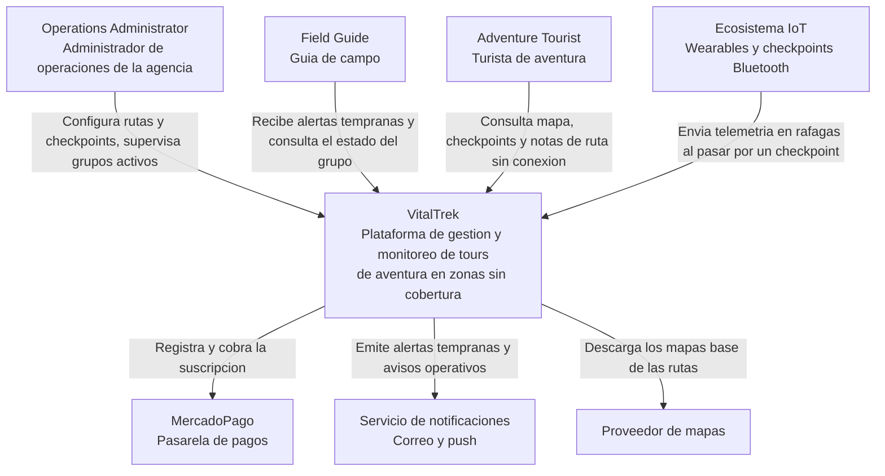
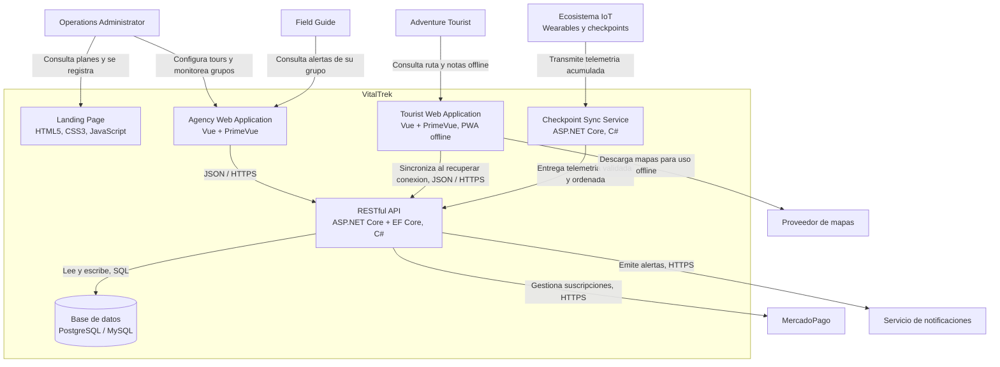

# Capítulo IV: Product Design

Este capítulo establece las decisiones de diseño que guían la experiencia digital de **VitalTrek**. La propuesta busca comunicar seguridad, claridad operativa y confianza en el contexto del turismo de aventura en rutas remotas del Perú. Las decisiones se aplican primero al Landing Page desarrollado para AV1 y sirven como base para las futuras Web Applications de operadores y guías.

## 4.1. Style Guidelines

VitalTrek utiliza un sistema visual sobrio, accesible y consistente. La identidad combina referencias de montaña y naturaleza con señales de seguridad y monitoreo tecnológico, evitando una estética turística genérica o recreativa. La interfaz debe transmitir calma, precisión y preparación ante escenarios de conectividad limitada.

### 4.1.1. General Style Guidelines

#### Branding y tono de comunicación

La marca VitalTrek comunica **safe adventure beyond signal**: el usuario debe percibir que la plataforma acompaña la operación de una expedición aun cuando no exista cobertura móvil continua. El tono es profesional, sereno, directo y empático. Se evitan mensajes alarmistas, promesas de monitoreo celular permanente y lenguaje técnico innecesario para visitantes no especializados.

La interfaz usa inglés como idioma predeterminado (`en_US`) y ofrece español latinoamericano (`es_419`) mediante i18n. Los términos de negocio definidos en el Ubiquitous Language, como *Route*, *Checkpoint*, *Expedition Group* y *Early Warning Alert*, se conservan cuando facilitan la precisión del dominio.

  

#### Principios de diseño

| Principio                     | Aplicación en VitalTrek                                                                                                           |
|-------------------------------|-----------------------------------------------------------------------------------------------------------------------------------|
| Seguridad comprensible        | La información crítica se presenta con jerarquía clara, etiquetas explícitas y acciones reconocibles.                             |
| Claridad antes que decoración | Cada sección y componente comunica un objetivo concreto; se evita saturar las pantallas con elementos visuales no funcionales.    |
| Offline-aware                 | El contenido explica que la telemetría se almacena offline y se sincroniza en checkpoints; no promete conectividad continua.      |
| Confianza y trazabilidad      | Se muestran procesos, estados y beneficios con mensajes verificables y consistentes.                                              |
| Inclusión                     | Tipografía legible, contraste suficiente, navegación por teclado, textos alternativos y contenido disponible en inglés y español. |

#### Paleta de color

| Token        | Color     | Uso principal                                                                             |
|--------------|-----------|-------------------------------------------------------------------------------------------|
| Forest Green | `#0F3D2E` | Color institucional, encabezados oscuros, footer y superficies de alta jerarquía.         |
| Alpine Teal  | `#1C7C7D` | Elementos interactivos secundarios, indicadores de estado y enlaces destacados.           |
| Safety Amber | `#F2A93B` | Call-to-action prioritarios, indicadores de atención y acentos visuales.                  |
| Off-white    | `#F7F4EA` | Fondo principal y superficies claras.                                                     |
| Charcoal     | `#1E2423` | Texto principal y contraste sobre fondos claros.                                          |
| Mist         | `#D9E2DC` | Bordes, divisores y fondos de baja jerarquía.                                             |
| Alert Red    | `#C94B42` | Alertas críticas en las futuras aplicaciones operativas; no se usa como color decorativo. |

El color nunca es el único medio para comunicar un estado. Una alerta, error o confirmación debe combinar color, ícono, etiqueta textual y, cuando corresponda, una descripción de la acción requerida.

#### Tipografía

| Uso                 | Familia             |  Peso   | Tamaño desktop   | Tamaño móvil   |
|---------------------|---------------------|--------:|-----------------:|---------------:|
| Display / Hero      | Sora, sans-serif    |     700 |            56 px |          40 px |
| H1                  | Sora, sans-serif    |     700 |            48 px |          36 px |
| H2                  | Sora, sans-serif    |     600 |            36 px |          28 px |
| H3                  | Sora, sans-serif    |     600 |            24 px |          22 px |
| Texto de cuerpo     | DM Sans, sans-serif |     400 |            16 px |          16 px |
| Texto de apoyo      | DM Sans, sans-serif | 400–500 |            14 px |          14 px |
| Botones y etiquetas | DM Sans, sans-serif |     600 |         14–16 px |       14–16 px |

Los encabezados utilizan Sora por su estructura contemporánea y legible. DM Sans se utiliza en cuerpos de texto, formularios y controles por su claridad en tamaños pequeños. La altura de línea mínima es `1.5` para párrafos y `1.2` para títulos.

#### Espaciado, forma y composición

La interfaz se construye sobre una escala base de 4 píxeles: `4, 8, 12, 16, 24, 32, 48, 64 y 96 px`. Esta escala se aplica a márgenes, paddings, separación entre secciones y componentes.

- Contenedor máximo de contenido: `1200 px`.
- Margen horizontal mínimo: `24 px` en desktop y `16 px` en móvil.
- Radio de borde: `8 px` para controles y `16 px` para tarjetas.
- Bordes: `1 px` en Mist para componentes claros.
- Sombras: discretas y funcionales, usadas solo para separar superficies interactivas.
- Las secciones alternan fondos Off-white, blanco y Forest Green para sostener la jerarquía de lectura.

#### Imágenes e iconografía

Las imágenes deben representar trekking, rutas de montaña, grupos organizados y operación responsable. Se priorizan fotografías o ilustraciones de apariencia documental, con overlays que aseguren legibilidad del texto. Se evitan íconos genéricos de turismo como aviones, palmeras o brújulas decorativas.

La iconografía debe ser lineal, simple y consistente. Todo ícono que comunique una acción debe tener etiqueta visible o un nombre accesible mediante `aria-label`.

#### Accesibilidad general

- Contraste mínimo de texto y controles según WCAG AA.
- Texto alternativo descriptivo para imágenes informativas.
- Foco visible para enlaces, botones, selector de idioma y campos de formulario.
- Navegación completa mediante teclado.
- Etiquetas explícitas para formularios; no usar únicamente placeholders.
- Estados de error descritos con texto claro y asociando el mensaje al campo correspondiente.

### 4.1.2. Web Style Guidelines

#### Diseño responsive

El Landing Page es mobile-first y se adapta a los principales anchos de pantalla.

| Breakpoint   | Rango         | Comportamiento esperado                                                                  |
|--------------|---------------|------------------------------------------------------------------------------------------|
| Mobile       | 320–767 px    | Una columna, menú colapsado, CTAs a ancho completo cuando sea necesario.                 |
| Tablet       | 768–1023 px   | Dos columnas en secciones de beneficios y tarjetas adaptadas.                            |
| Desktop      | 1024–1439 px  | Grid de 12 columnas, navegación completa y composición horizontal del hero.              |
| Wide desktop | 1440 px o más | Contenido limitado por el contenedor de 1200 px para evitar líneas excesivamente largas. |

#### Componentes web

| Componente         | Regla visual e interacción                                                                                                              |
|--------------------|-----------------------------------------------------------------------------------------------------------------------------------------|
| Header             | Navegación persistente, logo enlazado al inicio, selector de idioma y CTA visible en desktop. En móvil se transforma en menú colapsado. |
| Botón primario     | Fondo Safety Amber, texto Charcoal, etiqueta con verbo de acción; por ejemplo, `Request a demo`.                                        |
| Botón secundario   | Fondo transparente o Forest Green, borde visible y etiqueta descriptiva; por ejemplo, `See how it works`.                               |
| Enlace             | Texto Alpine Teal o Forest Green, subrayado o indicador visible al foco y hover.                                                        |
| Tarjeta            | Fondo claro, borde Mist, radio de 16 px, título, texto breve e ícono o imagen funcional.                                                |
| Formulario         | Etiqueta sobre cada campo, validación visible, mensaje de éxito y errores comprensibles.                                                |
| Selector de idioma | Control accesible que muestra el idioma activo y permite alternar entre `EN` y `ES`.                                                    |
| Footer             | Enlaces a contacto, redes, términos y condiciones, privacidad, idioma y derechos de la startup.                                         |

#### Estados de interacción

- **Hover:** variación sutil de tono o elevación en controles interactivos.
- **Focus:** contorno visible de al menos 3 px en Alpine Teal o Safety Amber, con contraste suficiente.
- **Active:** reducción sutil de elevación o variación del color de fondo.
- **Disabled:** menor opacidad, cursor no interactivo y explicación cuando una acción no está disponible.
- **Loading:** indicador textual o visual que no bloquee la comprensión del contenido.
- **Error:** Alert Red acompañado de una explicación y una forma de corregir el problema.

#### Contenido y microcopy

Los textos de interfaz deben ser breves, específicos y orientados a la acción. Se priorizan verbos claros: `Request a demo`, `Explore plans`, `View safety process` y `Contact us`. Los mensajes no deben atribuir al producto capacidades no implementadas ni afirmar que existe seguimiento continuo por red celular.

#### Accessibility (a11y)

VitalTrek implementa los siguientes estándares de accesibilidad en la web:

- **ARIA landmarks**: `role="navigation"` en navbar, `role="contentinfo"` en footer, `role="dialog"` en modal, `role="tablist"` y `role="tabpanel"` en el toggle de planes.
- **aria-labelledby**: cada `<section>` referencia su `<h2>` correspondiente por ID.
- **aria-live**: región `role="status"` anuncia cambios de idioma a screen readers.
- **aria-selected**: los botones de tab de planes actualizan `aria-selected="true/false"` dinámicamente.
- **aria-expanded**: el botón hamburger reporta el estado del menú mobile.
- **aria-hidden**: todos los SVGs decorativos están marcados como `aria-hidden="true"`.
- **focus-visible**: outline naranja de 2px en todos los elementos interactivos para navegación por teclado.
- **Semántica HTML**: se usan `<nav>`, `<section>`, `<footer>`, `<address>`, `<figure>`, `<blockquote>`, `<figcaption>` según su propósito semántico.
- **Textos alternativos**: todas las imágenes tienen `alt` descriptivo; las decorativas tienen `alt=""`.

#### Internationalization (i18n)

La interfaz web soporta dos locales:

| Locale                 | Código   | Idioma por defecto   |
|------------------------|----------|----------------------|
| English                | `en-US`  | Sí                   |
| Latin American Spanish | `es-419` | No                   |

El sistema i18n se implementa mediante atributos `data-i18n` en el HTML y un objeto `translations` en `main.js`. La función `toggleLanguage()` actualiza `document.documentElement.lang`, todos los elementos `[data-i18n]`, el pill del botón de idioma y anuncia el cambio mediante `aria-live`. El modal de Join también responde al toggle de idioma. El idioma predeterminado al cargar la página es inglés, conforme al statement del proyecto.

## 4.2. Information Architecture

La arquitectura de información de **VitalTrek** organiza el contenido del Landing Page y de las futuras Web Applications para que los dos segmentos objetivo definidos en la sección 1.3, **Agencias y Operadores de Turismo de Aventura** y **Turistas de Aventura**, así como los actores operativos que se desprenden de ellos (Operations Administrator y Field Guide, dentro del primer segmento), encuentren lo que necesitan con el mínimo esfuerzo. Esta decisión resulta especialmente sensible en un producto cuyo valor central es la seguridad operativa en zonas remotas: un administrador que tarda en ubicar una alerta, o un guía que no encuentra una nota de ruta sin conexión, representa un riesgo real para la integridad de un turista y no solo una fricción de usabilidad.

En esta primera entrega, la arquitectura se materializa principalmente en el Landing Page, dirigido a visitantes de ambos segmentos que aún evalúan el producto: agencias que buscan profesionalizar su operación, representadas por Vanessa Quispe, y turistas que buscan seguridad durante su recorrido, representados por Sebastian Rojas. Las decisiones para el Operations Dashboard y el Field Guide Workspace, las dos Web Applications descritas en el 4.1, quedan planteadas como base de diseño para los siguientes sprints, ya que sustentan los Epics EP02 a EP05 del Product Backlog: configuración del tour, operación offline, checkpoint y supervisión, e incidentes y cierre.

### 4.2.1. Organization Systems

La organización visual de VitalTrek combina jerarquía, secuencia y matriz según el tipo de contenido. El Hero, la propuesta de valor y los CTAs del Landing Page siguen una organización jerárquica apoyada en la escala tipográfica definida en el 4.1 (Sora para títulos, Safety Amber para las acciones prioritarias), de modo que lo más urgente se perciba antes que el contenido de soporte; el mismo criterio se aplicará en el encabezado del Operations Dashboard, donde el estado de las expediciones activas y las alertas deben mostrarse antes que el detalle histórico. La sección *How it works* del Landing Page, en cambio, sigue una organización secuencial porque describe un proceso real del dominio que solo tiene sentido en un orden fijo: configurar el tour, operar sin conexión, sincronizar en el checkpoint, evaluar el riesgo y responder. Ese mismo criterio secuencial regirá la configuración de una Route dentro del Operations Dashboard (US07 a US10) y la preparación del wearable antes de iniciar el tour (US15 a US17), ya que registrar estos pasos fuera de orden generaría configuraciones incompletas o inseguras. La organización matricial se reserva para comparar elementos homogéneos bajo los mismos criterios, como ocurre en la comparación de planes del Landing Page y como ocurrirá en la futura vista de expediciones activas del Operations Dashboard, donde cada fila será un Expedition Group y cada columna un atributo compartido (Route, Field Guide asignado, último checkpoint, estado).

Respecto a los esquemas de categorización, el contenido se agrupa principalmente por tópicos y por audiencia. Las secciones *How it works*, *For operators*, *Safety* y *Plans* del Landing Page, y los futuros módulos *Routes and checkpoints*, *Expedition groups*, *Alerts* y *Reports* del Operations Dashboard, agrupan cada uno un concepto cerrado del Ubiquitous Language, evitando que un mismo dato quede disperso entre secciones. La categorización por audiencia diferencia el contenido dirigido a Agencias y Operadores de Turismo de Aventura del contenido dirigido a Turistas de Aventura en el Landing Page, y dentro de las aplicaciones separa el Operations Dashboard, de uso del Operations Administrator, del Field Guide Workspace, de uso del Field Guide, porque ambos roles trabajan en contextos distintos: uno supervisa desde una base con conexión y el otro opera en campo, muchas veces sin cobertura. La categorización cronológica se reserva para contenido cuya utilidad depende del momento en que ocurrió: el historial de check-in por checkpoint de un Expedition Group, la lista de Early Warning Alerts e Incidents, siempre del más reciente al más antiguo y con lo no atendido destacado, y el Tour Summary que se genera al cierre de cada tour. Por último, la categorización alfabética se limita a listados pequeños y sin urgencia temporal, como el directorio de Rescue Entity disponibles para escalamiento o la lista de integrantes del equipo en la sección *Team* del Landing Page, donde ordenar por nombre resulta más natural que cualquier otro criterio.

### 4.2.2. Labeling Systems

Las etiquetas de VitalTrek buscan el mínimo número de palabras posible sin perder claridad, reutilizan los términos ya fijados en el Ubiquitous Language (Route, Checkpoint, Expedition Group, Early Warning Alert, Tour Summary) y se presentan en inglés por defecto, con equivalente en español latinoamericano mediante i18n, tal como establece el 4.1. Se evitan etiquetas de implementación interna o ambiguas: por ejemplo, se usa *Sync at checkpoint* y no *Sync job*, y *Early Warning Alert* y no *Alert record*.

| Área                     | Etiqueta (inglés)        | Equivalente `es_419`        | Propósito                                                                    |
|--------------------------|--------------------------|-----------------------------|------------------------------------------------------------------------------|
| Landing — navegación     | `Home`                   | `Inicio`                    | Volver al inicio del Landing Page.                                           |
| Landing — navegación     | `How it works`           | `Cómo funciona`             | Explicar el proceso completo del producto.                                   |
| Landing — navegación     | `For operators`          | `Para operadores`           | Mostrar beneficios dirigidos a Agencias y Operadores de Turismo de Aventura. |
| Landing — navegación     | `Safety`                 | `Seguridad`                 | Explicar el enfoque de alertas tempranas y continuidad offline.              |
| Landing — navegación     | `Plans`                  | `Planes`                    | Comparar la propuesta comercial.                                             |
| Landing — CTA            | `Request a demo`         | `Solicitar demostración`    | Captar prospectos y abrir el formulario de contacto (US05).                  |
| Landing — CTA secundaria | `See how it works`       | `Ver cómo funciona`         | Llevar al visitante al proceso operativo.                                    |
| Operations Dashboard     | `Active expeditions`     | `Expediciones activas`      | Consultar Expedition Groups en ruta (US20, US23).                            |
| Operations Dashboard     | `Routes and checkpoints` | `Rutas y puntos de control` | Configurar Route, Checkpoint y Expected Time Window (US07 a US09).           |
| Operations Dashboard     | `Alerts`                 | `Alertas`                   | Revisar Early Warning Alerts priorizadas (US25, US26).                       |
| Operations Dashboard     | `Reports`                | `Reportes`                  | Consultar el Tour Summary de tours finalizados (US32).                       |
| Field Guide Workspace    | `Current tour`           | `Tour actual`               | Ver el Expedition Group y la Route asignados (US11, US13).                   |
| Field Guide Workspace    | `Group check-in`         | `Registro del grupo`        | Registrar el Tourist Manifest y activar los wearables (US12, US15, US16).    |
| Field Guide Workspace    | `Offline route notes`    | `Notas de ruta offline`     | Consultar Route Notes sin conexión (US19).                                   |
| Field Guide Workspace    | `Alerts and incidents`   | `Alertas e incidentes`      | Confirmar Incidents y coordinar la respuesta (US27, US30).                   |
| Field Guide Workspace    | `Tour closure`           | `Cierre del tour`           | Finalizar el Adventure Tour (US31).                                          |

Los estados de las entidades operativas se etiquetan siguiendo el mismo vocabulario que ya usan las User Stories, de modo que un Operations Administrator y un Field Guide reconozcan la misma palabra en la interfaz que en el proceso real: un Adventure Tour puede estar en preparación, Active (US17) o Finished (US31); un Incident pasa de reportado a Confirmed (US27) y, si escala, a Emergency Declared (US28). Ningún estado se comunica únicamente por color, en línea con el principio de accesibilidad ya definido en el 4.1.

### 4.2.3. SEO Tags and Meta Tags

**Landing Page (`index.html`)**

| Elemento                              | Valor propuesto                                                                                                                               |
|---------------------------------------|-----------------------------------------------------------------------------------------------------------------------------------------------|
| `title`                               | `VitalTrek \| Safer adventure tours beyond signal`                                                                                            |
| `meta name="description"`             | `VitalTrek helps adventure tour operators monitor expeditions, synchronize offline telemetry at checkpoints, and act on early safety alerts.` |
| `meta name="keywords"`                | `adventure tourism safety, trekking monitoring, offline telemetry, checkpoint synchronization, tour operator, Peru`                           |
| `meta name="author"`                  | `Nexum Devs`                                                                                                                                  |
| `meta name="robots"`                  | `index, follow`                                                                                                                               |
| `link rel="canonical"`                | `https://landing-page-phi-one-54.vercel.app/`                                                                                                 |
| `meta property="og:title"`            | `VitalTrek \| Safer adventure tours beyond signal`                                                                                            |
| `meta property="og:description"`      | `Offline-aware safety operations for adventure tours in remote mountain routes.`                                                              |
| `meta property="og:type"`             | `website`                                                                                                                                     |
| `meta property="og:locale"`           | `en_US`                                                                                                                                       |
| `meta property="og:locale:alternate"` | `es_419`                                                                                                                                      |
| `meta name="twitter:card"`            | `summary_large_image`                                                                                                                         |
| Idiomas                               | `hreflang="en-US"` para inglés y `hreflang="es-419"` para español latinoamericano.                                                            |

La imagen usada en `og:image` debe incluir el logo de VitalTrek y un fondo de montaña sobrio, coherente con la paleta Forest Green y Off-white definida en el 4.1, sin texto pequeño ni información sensible.

**Web Applications (Operations Dashboard y Field Guide Workspace)**

Estas vistas son privadas y no deben indexarse, por lo que comparten `meta name="robots" content="noindex, nofollow"` y `meta name="author" content="Nexum Devs"`, variando solo el `title` y la `description` según la vista:

| Vista                                     | `title`                          | `meta name="description"`                                                                              |
|-------------------------------------------|----------------------------------|--------------------------------------------------------------------------------------------------------|
| Login                                     | `Sign in — VitalTrek`            | `Sign in to your VitalTrek account to manage tours, monitor expeditions and respond to safety alerts.` |
| Operations Dashboard — Active expeditions | `Active expeditions — VitalTrek` | `Monitor active Expedition Groups, their last checkpoint and current risk status in real time.`        |
| Operations Dashboard — Alerts             | `Alerts — VitalTrek`             | `Review prioritized Early Warning Alerts and respond before a risk becomes an emergency.`              |
| Field Guide Workspace — Current tour      | `Current tour — VitalTrek`       | `Access your assigned Expedition Group, manifest and offline route notes for the active tour.`         |

### 4.2.4. Navigation Systems

VitalTrek combina navegación global, local, contextual y de utilidad, manteniendo en desktop y en móvil el mismo orden y las mismas opciones, tal como especifica el 4.1.

| Tipo       | Aplicación                                                                                                                                                                                                                                                                                                                   |
|------------|------------------------------------------------------------------------------------------------------------------------------------------------------------------------------------------------------------------------------------------------------------------------------------------------------------------------------|
| Global     | Header persistente del Landing Page con `Home`, `How it works`, `For operators`, `Safety`, `Plans`, selector de idioma y CTA `Request a demo`; menú lateral persistente en el Operations Dashboard y en el Field Guide Workspace, con acceso directo a cada módulo.                                                          |
| Local      | Anclas con scroll suave dentro del Landing Page; dentro de cada módulo de la Web Application, un patrón hub and spoke en el que el módulo (por ejemplo, *Routes and checkpoints*) funciona como hub y cada elemento abre una vista de detalle con un botón de retorno explícito, sin depender del botón atrás del navegador. |
| Contextual | CTAs del hero y de la sección *Plans* que dirigen al formulario de contacto; dentro de una expedición activa, acciones directas como *Register checkpoint* o *Report incident* disponibles sin salir del contexto del grupo.                                                                                                 |
| Utilidad   | Selector de idioma y enlaces a *Terms and Conditions*, *Privacy Policy* y contacto en el footer del Landing Page; acceso a *Settings* y cierre de sesión dentro de la Web Application.                                                                                                                                       |

El recorrido del visitante en el Landing Page sigue la progresión Home, How it works, For operators o Safety según el segmento que lo motive, Plans, Team, Contact / Request a demo y footer, coherente con la organización jerárquica descrita en el punto anterior.

Para las siguientes iteraciones, el Operations Administrator recorrerá el Operations Dashboard iniciando sesión y revisando primero las expediciones activas, para luego configurar rutas y checkpoints (US07 a US10), crear y asignar Expedition Groups (US11, US13), evaluar el riesgo y revisar las Early Warning Alerts (US24 a US26), declarar una emergencia y notificar a los contactos correspondientes cuando sea necesario (US28, US29), y finalmente consultar el Tour Summary de los tours cerrados (US32). El Field Guide, por su parte, recorrerá el Field Guide Workspace desde el tour que tiene asignado, registrando el manifiesto y activando los wearables del grupo (US12, US15, US16), iniciando el Adventure Tour (US17), consultando las Route Notes sin conexión durante un Coverage Gap (US19), registrando el check-in y sincronizando la telemetría en cada checkpoint (US21, US22), confirmando incidentes y coordinando una evacuación si el caso lo requiere (US27, US30), y cerrando el tour al finalizar el recorrido (US31). Este recorrido por rol queda definido como especificación de diseño para el desarrollo de ambas aplicaciones, ya que en AV1 solo se implementa el Landing Page. En todos los casos la navegación conserva un enlace de salto al contenido principal, estados de foco visibles y compatibilidad completa con teclado y lector de pantalla, según la accesibilidad general ya definida en el 4.1.

### 4.2.5. Searching Systems

El Landing Page no incorpora un buscador global, dado que su contenido es breve, secuencial y ya es accesible mediante la navegación por anclas descrita en el punto anterior; incorporar búsqueda en esta etapa añadiría complejidad sin un beneficio proporcional para el visitante.

Las futuras Web Applications sí requieren búsqueda y filtros, ya que el volumen de expediciones, alertas y rutas que un Operations Administrator o un Field Guide deben supervisar crece de forma considerable en temporada alta.

| Módulo                 | Búsqueda / filtros                                                                                                                    | Resultado esperado                                                                                                                                   |
|------------------------|---------------------------------------------------------------------------------------------------------------------------------------|------------------------------------------------------------------------------------------------------------------------------------------------------|
| Active expeditions     | Texto libre por nombre de Expedition Group; filtros por Route, Field Guide asignado y estado (en ruta, retrasado, con alerta activa). | Lista de grupos coincidentes con su último checkpoint, tramo actual y nivel de riesgo, ordenada por prioridad de atención.                           |
| Alerts                 | Filtros por prioridad, tipo (Delay, Anomaly, Route Deviation), estado (activa o revisada) y Expedition Group.                         | Cola de Early Warning Alerts ordenada por criticidad y recencia, con la causa y el protocolo recomendado visibles sin abrir el detalle.              |
| Routes and checkpoints | Texto libre por nombre de Route; filtros por dificultad y estado (en uso o archivada).                                                | Rutas coincidentes con su número de Checkpoints y duración estimada.                                                                                 |
| Reports                | Filtros por rango de fechas, Route y Expedition Group.                                                                                | Listado de Tour Summary disponibles para revisión operativa, con acceso directo al detalle del recorrido, los checkpoints y los eventos registrados. |

Estos sistemas de búsqueda mantienen el mismo comportamiento en todos los módulos: los filtros aplicados nunca modifican los datos subyacentes y pueden restablecerse en cualquier momento mediante un control de tipo *Clear filters*; cuando una búsqueda no devuelve resultados, el sistema distingue entre la ausencia real de registros, por ejemplo ninguna expedición activa en ese momento, y la falta de coincidencias con los filtros aplicados, para que el Operations Administrator o el Field Guide no interpreten ese vacío como una falla del sistema. No existe una búsqueda global entre módulos, ya que entidades relacionadas como Route y Expedition Group deben mantenerse en contextos separados para evitar resultados ambiguos, y cada elemento devuelto por una búsqueda expone directamente su acción más frecuente, como abrir una alerta desde el propio resultado, para reducir pasos en escenarios donde el tiempo de respuesta incide en la seguridad del turista.

## 4.6. Domain-Driven Software Architecture

En esta sección se presenta la arquitectura de software de VitalTrek aplicando el **C4 Model**, a partir del dominio identificado en el Big Picture EventStorming y del Ubiquitous Language definido en la sección 2.5. Los diagramas se elaboran bajo el enfoque de diagram-as-code con Mermaid, alternativa contemplada para los C4 Model Diagrams.

Las decisiones de tecnología responden al stack establecido para la solución: HTML5, CSS3 y JavaScript para el Landing Page, Vue Framework con PrimeVue para las Frontend Web Applications, ASP.NET Core con Entity Framework Core y C# para los Web Services bajo estilo arquitectónico RESTful, y PostgreSQL o MySQL como motor de base de datos relacional.

La arquitectura responde a la restricción central del dominio: los grupos de expedición operan durante horas o días en zonas sin cobertura móvil, por lo que la solución no puede depender de conectividad continua. Esto determina que la sincronización de telemetría ocurra en ráfagas al pasar por los puntos de control y que la aplicación del turista funcione en modo offline.

### 4.6.2. Software Architecture Context Diagram

El Context Diagram corresponde al nivel 1 del C4 Model. Presenta a VitalTrek como una única caja central y muestra quiénes lo usan y con qué sistemas externos se relaciona, sin entrar en detalles de tecnología ni de estructura interna.

| Elemento | Tipo | Descripción |
| --- | --- | --- |
| Operations Administrator | Persona | Responsable de la agencia. Configura rutas y puntos de control, asigna guías y supervisa los grupos activos desde la base de operaciones. |
| Field Guide | Persona | Acompaña físicamente al grupo durante el recorrido. Recibe las alertas tempranas y ejecuta la respuesta en campo. |
| Adventure Tourist | Persona | Participa en el tour, porta el dispositivo de monitoreo y consulta la información de la ruta sin conexión. |
| Ecosistema IoT | Sistema externo | Wearables y checkpoints Bluetooth que capturan posición y signos vitales. Su comportamiento es simulado para el alcance del MVP. |
| MercadoPago | Sistema externo | Pasarela de pagos para la gestión de suscripciones de las agencias. |
| Servicio de notificaciones | Sistema externo | Entrega de alertas por correo y notificaciones push. |
| Proveedor de mapas | Sistema externo | Provee los mapas base que se descargan para su uso sin conexión. |

VitalTrek se sitúa entre dos ámbitos que hoy permanecen desconectados: la operación de la agencia, que ocurre en oficina y con conectividad, y el recorrido en campo, donde la cobertura es intermitente o nula. Los tres actores interactúan con el mismo sistema pero en momentos distintos: el Operations Administrator antes y durante el tour desde la base de operaciones, el Field Guide durante el recorrido, y el Adventure Tourist en ruta y de forma offline.

Respecto de los sistemas externos, el ecosistema IoT es el único que no es consumido por VitalTrek sino que lo alimenta: constituye la fuente de la telemetría que hace posible la detección de retrasos y anomalías. Los otros tres son servicios que la plataforma consume. Esta distinción resulta relevante porque el ecosistema IoT es el punto de entrada de datos crítico y, a la vez, el elemento con mayor incertidumbre respecto de la conectividad.

### 4.6.3. Software Architecture Container Diagrams

El Container Diagram corresponde al nivel 2 del C4 Model. Descompone VitalTrek en sus unidades de despliegue independientes, indicando la responsabilidad de cada una, la tecnología seleccionada y la forma en que se comunican entre sí.

| Container | Tecnología | Responsabilidad |
| --- | --- | --- |
| Landing Page | HTML5, CSS3, JavaScript | Presenta la propuesta de valor, los planes de suscripción y deriva al registro de nuevas agencias. |
| Agency Web Application | Vue Framework con PrimeVue | Configuración de rutas y checkpoints, dashboard de grupos activos, gestión de alertas e incidencias y administración de la suscripción. |
| Tourist Web Application | Vue Framework con PrimeVue, PWA con almacenamiento local | Mapa de la ruta, checkpoints, notas de ruta y resumen del recorrido. Opera sin conexión y sincroniza al recuperar conectividad. |
| RESTful API | ASP.NET Core con Entity Framework Core, C# | Lógica de negocio: gestión de tours y rutas, evaluación del motor de reglas, generación de alertas tempranas y gestión de suscripciones. |
| Checkpoint Sync Service | ASP.NET Core, C# | Recibe las ráfagas de telemetría provenientes de los checkpoints, las valida, ordena por marca de tiempo y las entrega a la API. |
| Base de datos | PostgreSQL o MySQL | Almacena agencias, usuarios, rutas, checkpoints, grupos de expedición, registros de paso, telemetría, alertas, incidencias y suscripciones. |

La separación entre las dos aplicaciones web responde a que los segmentos objetivo tienen necesidades opuestas. La Agency Web Application es un panel de supervisión que asume conectividad y prioriza la densidad de información. La Tourist Web Application, en cambio, debe funcionar con el dispositivo sin señal, por lo que se plantea como Progressive Web App con almacenamiento local: descarga la información de la ruta antes de iniciar el recorrido y la consulta sin depender de la red.

El Checkpoint Sync Service se separa de la API por una razón propia del dominio. La telemetría no llega de forma continua ni ordenada, sino en ráfagas cuando un checkpoint recupera conectividad, y puede contener registros de varias horas atrás. Aislar esa recepción evita que los picos de ingesta afecten la disponibilidad del dashboard de la agencia y permite validar y ordenar los datos antes de que el motor de reglas los evalúe.

El motor de reglas reside dentro de la RESTful API porque requiere consultar la ruta, las ventanas de tiempo esperadas y los rangos basales de cada turista para determinar si un registro de paso constituye un retraso o una anomalía. Esa decisión no puede tomarse en el punto de ingesta, que solo conoce el dato aislado.

Finalmente, los contenedores comparten una única base de datos relacional. Esta decisión resulta adecuada para el alcance del MVP, dado el volumen esperado y la fuerte relación entre las entidades del dominio: una agencia tiene rutas, una ruta tiene checkpoints, y un grupo de expedición recorre una ruta y genera registros de paso.
