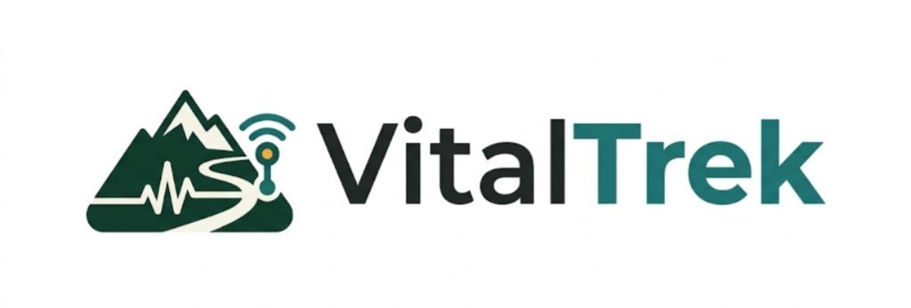

# Capítulo IV: Product Design

Este capítulo establece las decisiones de diseño que guían la experiencia digital de **VitalTrek**. La propuesta busca comunicar seguridad, claridad operativa y confianza en el contexto del turismo de aventura en rutas remotas del Perú. Las decisiones se aplican primero al Landing Page desarrollado para AV1 y sirven como base para las futuras Web Applications de operadores y guías.

## 4.1. Style Guidelines

VitalTrek utiliza un sistema visual sobrio, accesible y consistente. La identidad combina referencias de montaña y naturaleza con señales de seguridad y monitoreo tecnológico, evitando una estética turística genérica o recreativa. La interfaz debe transmitir calma, precisión y preparación ante escenarios de conectividad limitada.

### 4.1.1. General Style Guidelines

#### Branding y tono de comunicación

La marca VitalTrek comunica **safe adventure beyond signal**: el usuario debe percibir que la plataforma acompaña la operación de una expedición aun cuando no exista cobertura móvil continua. El tono es profesional, sereno, directo y empático. Se evitan mensajes alarmistas, promesas de monitoreo celular permanente y lenguaje técnico innecesario para visitantes no especializados.

La interfaz usa inglés como idioma predeterminado (`en_US`) y ofrece español latinoamericano (`es_419`) mediante i18n. Los términos de negocio definidos en el Ubiquitous Language, como *Route*, *Checkpoint*, *Expedition Group* y *Early Warning Alert*, se conservan cuando facilitan la precisión del dominio.

  

#### Principios de diseño

| Principio | Aplicación en VitalTrek |
|---|---|
| Seguridad comprensible | La información crítica se presenta con jerarquía clara, etiquetas explícitas y acciones reconocibles. |
| Claridad antes que decoración | Cada sección y componente comunica un objetivo concreto; se evita saturar las pantallas con elementos visuales no funcionales. |
| Offline-aware | El contenido explica que la telemetría se almacena offline y se sincroniza en checkpoints; no promete conectividad continua. |
| Confianza y trazabilidad | Se muestran procesos, estados y beneficios con mensajes verificables y consistentes. |
| Inclusión | Tipografía legible, contraste suficiente, navegación por teclado, textos alternativos y contenido disponible en inglés y español. |

#### Paleta de color

| Token | Color | Uso principal |
|---|---|---|
| Forest Green | `#0F3D2E` | Color institucional, encabezados oscuros, footer y superficies de alta jerarquía. |
| Alpine Teal | `#1C7C7D` | Elementos interactivos secundarios, indicadores de estado y enlaces destacados. |
| Safety Amber | `#F2A93B` | Call-to-action prioritarios, indicadores de atención y acentos visuales. |
| Off-white | `#F7F4EA` | Fondo principal y superficies claras. |
| Charcoal | `#1E2423` | Texto principal y contraste sobre fondos claros. |
| Mist | `#D9E2DC` | Bordes, divisores y fondos de baja jerarquía. |
| Alert Red | `#C94B42` | Alertas críticas en las futuras aplicaciones operativas; no se usa como color decorativo. |

El color nunca es el único medio para comunicar un estado. Una alerta, error o confirmación debe combinar color, ícono, etiqueta textual y, cuando corresponda, una descripción de la acción requerida.

#### Tipografía

| Uso | Familia | Peso | Tamaño desktop | Tamaño móvil |
|---|---|---:|---:|---:|
| Display / Hero | Sora, sans-serif | 700 | 56 px | 40 px |
| H1 | Sora, sans-serif | 700 | 48 px | 36 px |
| H2 | Sora, sans-serif | 600 | 36 px | 28 px |
| H3 | Sora, sans-serif | 600 | 24 px | 22 px |
| Texto de cuerpo | DM Sans, sans-serif | 400 | 16 px | 16 px |
| Texto de apoyo | DM Sans, sans-serif | 400–500 | 14 px | 14 px |
| Botones y etiquetas | DM Sans, sans-serif | 600 | 14–16 px | 14–16 px |

Los encabezados utilizan Sora por su estructura contemporánea y legible. DM Sans se utiliza en cuerpos de texto, formularios y controles por su claridad en tamaños pequeños. La altura de línea mínima es `1.5` para párrafos y `1.2` para títulos.

#### Espaciado, forma y composición

La interfaz se construye sobre una escala base de 4 píxeles: `4, 8, 12, 16, 24, 32, 48, 64 y 96 px`. Esta escala se aplica a márgenes, paddings, separación entre secciones y componentes.

- Contenedor máximo de contenido: `1200 px`.
- Margen horizontal mínimo: `24 px` en desktop y `16 px` en móvil.
- Radio de borde: `8 px` para controles y `16 px` para tarjetas.
- Bordes: `1 px` en Mist para componentes claros.
- Sombras: discretas y funcionales, usadas solo para separar superficies interactivas.
- Las secciones alternan fondos Off-white, blanco y Forest Green para sostener la jerarquía de lectura.

#### Imágenes e iconografía

Las imágenes deben representar trekking, rutas de montaña, grupos organizados y operación responsable. Se priorizan fotografías o ilustraciones de apariencia documental, con overlays que aseguren legibilidad del texto. Se evitan íconos genéricos de turismo como aviones, palmeras o brújulas decorativas.

La iconografía debe ser lineal, simple y consistente. Todo ícono que comunique una acción debe tener etiqueta visible o un nombre accesible mediante `aria-label`.

#### Accesibilidad general

- Contraste mínimo de texto y controles según WCAG AA.
- Texto alternativo descriptivo para imágenes informativas.
- Foco visible para enlaces, botones, selector de idioma y campos de formulario.
- Navegación completa mediante teclado.
- Etiquetas explícitas para formularios; no usar únicamente placeholders.
- Estados de error descritos con texto claro y asociando el mensaje al campo correspondiente.

### 4.1.2. Web Style Guidelines

#### Diseño responsive

El Landing Page es mobile-first y se adapta a los principales anchos de pantalla.

| Breakpoint | Rango | Comportamiento esperado |
|---|---|---|
| Mobile | 320–767 px | Una columna, menú colapsado, CTAs a ancho completo cuando sea necesario. |
| Tablet | 768–1023 px | Dos columnas en secciones de beneficios y tarjetas adaptadas. |
| Desktop | 1024–1439 px | Grid de 12 columnas, navegación completa y composición horizontal del hero. |
| Wide desktop | 1440 px o más | Contenido limitado por el contenedor de 1200 px para evitar líneas excesivamente largas. |

#### Componentes web

| Componente | Regla visual e interacción |
|---|---|
| Header | Navegación persistente, logo enlazado al inicio, selector de idioma y CTA visible en desktop. En móvil se transforma en menú colapsado. |
| Botón primario | Fondo Safety Amber, texto Charcoal, etiqueta con verbo de acción; por ejemplo, `Request a demo`. |
| Botón secundario | Fondo transparente o Forest Green, borde visible y etiqueta descriptiva; por ejemplo, `See how it works`. |
| Enlace | Texto Alpine Teal o Forest Green, subrayado o indicador visible al foco y hover. |
| Tarjeta | Fondo claro, borde Mist, radio de 16 px, título, texto breve e ícono o imagen funcional. |
| Formulario | Etiqueta sobre cada campo, validación visible, mensaje de éxito y errores comprensibles. |
| Selector de idioma | Control accesible que muestra el idioma activo y permite alternar entre `EN` y `ES`. |
| Footer | Enlaces a contacto, redes, términos y condiciones, privacidad, idioma y derechos de la startup. |

#### Estados de interacción

- **Hover:** variación sutil de tono o elevación en controles interactivos.
- **Focus:** contorno visible de al menos 3 px en Alpine Teal o Safety Amber, con contraste suficiente.
- **Active:** reducción sutil de elevación o variación del color de fondo.
- **Disabled:** menor opacidad, cursor no interactivo y explicación cuando una acción no está disponible.
- **Loading:** indicador textual o visual que no bloquee la comprensión del contenido.
- **Error:** Alert Red acompañado de una explicación y una forma de corregir el problema.

#### Contenido y microcopy

Los textos de interfaz deben ser breves, específicos y orientados a la acción. Se priorizan verbos claros: `Request a demo`, `Explore plans`, `View safety process` y `Contact us`. Los mensajes no deben atribuir al producto capacidades no implementadas ni afirmar que existe seguimiento continuo por red celular.

#### Accessibility (a11y)

VitalTrek implementa los siguientes estándares de accesibilidad en la web:

- **ARIA landmarks**: `role="navigation"` en navbar, `role="contentinfo"` en footer, `role="dialog"` en modal, `role="tablist"` y `role="tabpanel"` en el toggle de planes.
- **aria-labelledby**: cada `<section>` referencia su `<h2>` correspondiente por ID.
- **aria-live**: región `role="status"` anuncia cambios de idioma a screen readers.
- **aria-selected**: los botones de tab de planes actualizan `aria-selected="true/false"` dinámicamente.
- **aria-expanded**: el botón hamburger reporta el estado del menú mobile.
- **aria-hidden**: todos los SVGs decorativos están marcados como `aria-hidden="true"`.
- **focus-visible**: outline naranja de 2px en todos los elementos interactivos para navegación por teclado.
- **Semántica HTML**: se usan `<nav>`, `<section>`, `<footer>`, `<address>`, `<figure>`, `<blockquote>`, `<figcaption>` según su propósito semántico.
- **Textos alternativos**: todas las imágenes tienen `alt` descriptivo; las decorativas tienen `alt=""`.

#### Internationalization (i18n)

La interfaz web soporta dos locales:

| Locale | Código | Idioma por defecto |
|---|---|---|
| English | `en-US` | Sí |
| Latin American Spanish | `es-419` | No |

El sistema i18n se implementa mediante atributos `data-i18n` en el HTML y un objeto `translations` en `main.js`. La función `toggleLanguage()` actualiza `document.documentElement.lang`, todos los elementos `[data-i18n]`, el pill del botón de idioma y anuncia el cambio mediante `aria-live`. El modal de Join también responde al toggle de idioma. El idioma predeterminado al cargar la página es inglés, conforme al statement del proyecto.