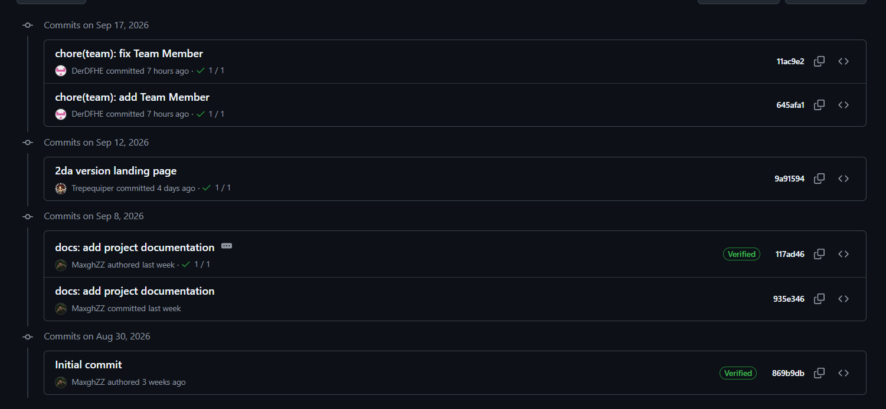
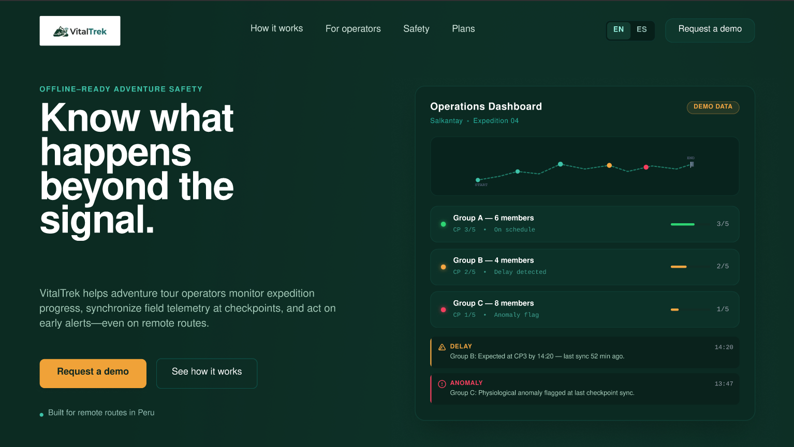
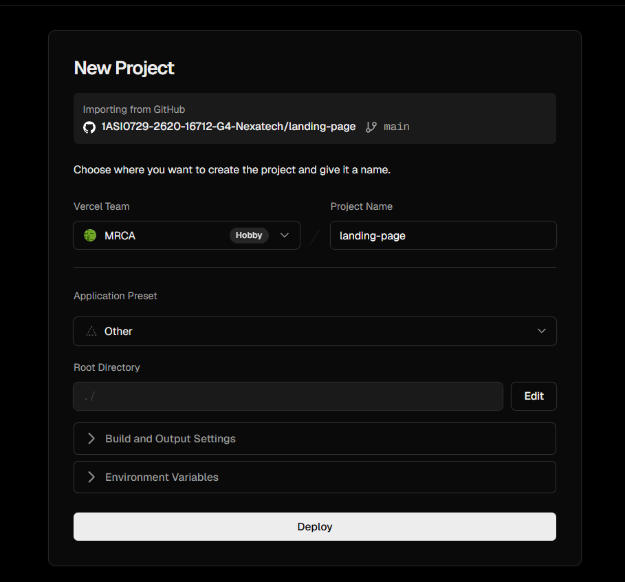
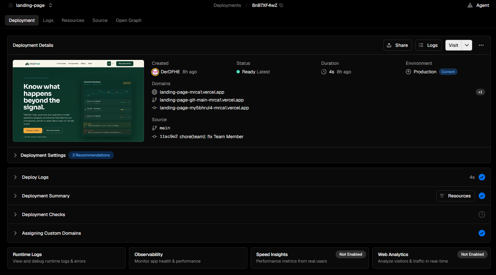
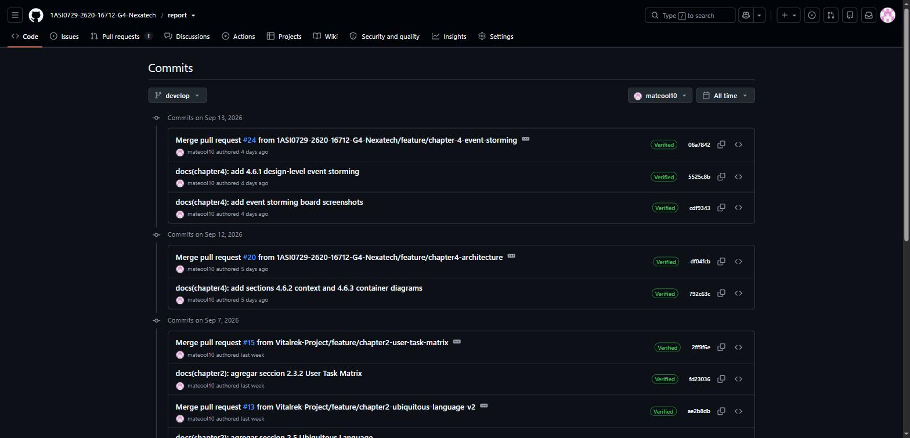
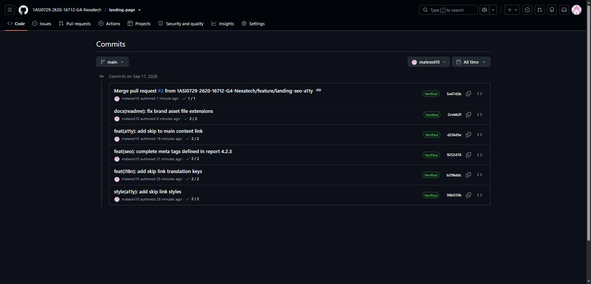
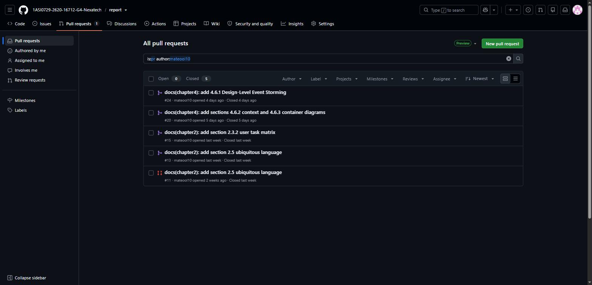

# Capítulo V: Product Implementation, Validation & Deployment

## 5.1. Software Configuration Management

Esta sección establece las herramientas, configuraciones y convenciones utilizadas para mantener la consistencia del proyecto VitalTrek durante el Sprint 1. Se documentan el entorno de desarrollo, el control de versiones, las reglas de estilo y la configuración de despliegue del Landing Page. Estas decisiones permiten coordinar el trabajo del equipo, mantener trazabilidad sobre los cambios y asegurar que la solución pueda ejecutarse y publicarse de forma consistente.

### 5.1.1. Software Development Environment Configuration

La siguiente tabla presenta las herramientas utilizadas por el equipo durante el desarrollo del Sprint 1 y la elaboración de los artefactos correspondientes a AV1.

| Producto           | Actividad                | Propósito                                                            | Referencia                                           |
| ------------------ | ------------------------ | -------------------------------------------------------------------- | ---------------------------------------------------- |
| Jira Software      | Project Management       | Gestionar el Product Backlog, Sprint Backlog, tareas y Story Points. | [Jira](https://www.atlassian.com/software/jira)      |
| GitHub             | Source Code Management   | Almacenar el código, aplicar GitFlow y registrar commits.            | [GitHub](https://github.com/)                        |
| Figma              | UX/UI Design             | Elaborar wireframes, mock-ups y prototipos.                          | [Figma](https://www.figma.com/)                      |
| UXPressia          | Requirements / UX Design | Elaborar User Personas, Journey Maps, Empathy Maps e Impact Maps.    | [UXPressia](https://uxpressia.com/)                  |
| Miro               | Domain Modeling          | Elaborar el Big Picture y Design-Level EventStorming.                | [Miro](https://miro.com/)                            |
| Visual Studio Code | Software Development     | Desarrollar el Landing Page con HTML5, CSS3 y JavaScript.            | [Visual Studio Code](https://code.visualstudio.com/) |
| Vercel             | Software Deployment      | Desplegar y publicar la primera versión del Landing Page.            | [Vercel](https://vercel.com/)                        |
| Markdown           | Software Documentation   | Redactar el informe del proyecto y organizar sus capítulos.          | [Markdown Guide](https://www.markdownguide.org/)     |

### 5.1.2. Source Code Management

El código fuente de VitalTrek se administra mediante Git y GitHub. Cada producto mantiene su propio repositorio para separar responsabilidades y facilitar el trabajo colaborativo. Para controlar la evolución del proyecto se utiliza GitFlow, Conventional Commits y Semantic Versioning.

| Producto                  | Repositorio                                                     | Estado en AV1             |
| ------------------------- | --------------------------------------------------------------- | ------------------------- |
| Landing Page              | https://github.com/1ASI0729-2620-16712-G4-Nexatech/landing-page | Implementado y desplegado |
| Frontend Web Applications | URL pendiente                                                   | Planificado               |
| RESTful Web Services      | URL pendiente                                                   | Planificado               |

#### GitFlow Workflow

El flujo de trabajo utiliza las siguientes ramas:

- `main`: versión estable y publicada.
- `develop`: integración de cambios aprobados.
- `feature/*`: desarrollo de funcionalidades.
- `release/*`: preparación de una versión.
- `hotfix/*`: corrección urgente sobre `main`.

Durante el Sprint 1 se utilizaron ramas `feature/*`. La evidencia de cada rama, commit y Pull Request se registra en la sección 5.2.1.4.

### 5.1.3. Source Code Style Guide & Conventions

El equipo utiliza convenciones comunes para mantener un código legible, consistente y fácil de mantener. Todos los nombres de archivos, variables, funciones, clases, identificadores HTML y componentes se redactan en inglés.

| Tecnología | Convenciones principales                                                                                                                           |
| ---------- | -------------------------------------------------------------------------------------------------------------------------------------------------- |
| HTML5      | Elementos semánticos, etiquetas en minúscula, atributos entre comillas dobles y textos alternativos en imágenes.                                   |
| CSS3       | Clases e identificadores en `kebab-case`, variables CSS centralizadas y diseño mobile-first.                                                       |
| JavaScript | Variables y funciones en `camelCase`, constantes en `UPPER_SNAKE_CASE`, uso de `const` y `let`, y funciones con responsabilidades específicas.     |
| Markdown   | Encabezados jerárquicos, enlaces relativos, imágenes con texto alternativo y tablas con formato consistente.                                       |
| Vue.js     | Componentes en `PascalCase`, propiedades y eventos con nombres descriptivos. Aplicación planificada para entregas posteriores.                     |
| C#         | Clases, métodos y propiedades en `PascalCase`; parámetros y variables locales en `camelCase`. Aplicación planificada para el RESTful Web Services. |

Ejemplos:

```html
<section class="safety-features">
  <h2 id="safety-title">Checkpoint synchronization</h2>
</section>
```

```css
:root {
  --forest-green: #0f3d2e;
  --safety-amber: #f2a93b;
}

.request-demo-button {
  background-color: var(--safety-amber);
}
```

```javascript
const DEFAULT_LOCALE = 'en-US';

function toggleLanguage(selectedLocale) {
  document.documentElement.lang = selectedLocale;
}
```

### 5.1.4. Software Deployment Configuration

La primera versión desplegada de VitalTrek corresponde al Landing Page desarrollado con HTML5, CSS3 y JavaScript. La publicación se realiza desde GitHub hacia Vercel, permitiendo disponer de una versión accesible para la revisión de AV1.

| Producto                  | Plataforma | Rama      | Estado      |
| ------------------------- | ---------- | --------- | ----------- |
| Landing Page              | Vercel     | `main`    | Desplegado  |
| Frontend Web Applications | Pendiente  | Pendiente | Planificado |
| RESTful Web Services      | Pendiente  | Pendiente | Planificado |

#### Configuración del Landing Page

- Repositorio: https://github.com/1ASI0729-2620-16712-G4-Nexatech/landing-page
- Plataforma: https://landing-page-mrca1.vercel.app/
- Rama desplegada: `main`
- Framework: Static HTML/CSS/JavaScript
- Build command: No aplica
- Output directory: Directorio raíz del repositorio
- Variables de entorno: No requeridas

#### Proceso de despliegue

1. Se actualiza el código en la rama `develop`.
2. Se validan los cambios del Landing Page.
3. Se integra la versión aprobada en `main`.
4. Vercel detecta el cambio en el repositorio.
5. Se ejecuta el despliegue automático.
6. Se verifica la navegación, el diseño responsive, los enlaces y los call-to-action.

## 5.2. Landing Page, Services & Applications Implementation

Esta sección documenta la implementación, validación y despliegue de los productos incluidos en la solución VitalTrek. Para AV1, el alcance se concentra en la primera versión funcional y desplegada del Landing Page, desarrollado con HTML5, CSS3 y JavaScript. Las Web Applications y el RESTful Web Services quedan planificados para los siguientes Sprints.

### 5.2.1. Sprint 1

El Sprint 1 tiene como objetivo implementar y publicar la primera versión del Landing Page de VitalTrek. El alcance comprende las User Stories US01 a US06, relacionadas con la navegación principal, la propuesta de valor, los planes, la información del equipo, el formulario de contacto y el cambio de idioma. La estimación total del Sprint es de 14 Story Points.

#### 5.2.1.1. Sprint Planning 1

La reunión de planificación permitió definir el objetivo, alcance, responsabilidades y tareas del primer Sprint. El trabajo se enfocó en entregar un Landing Page responsive, accesible y coherente con los wireframes, mock-ups, Style Guidelines e Information Architecture definidos en el capítulo IV.

| Campo                 | Información                                                                                                                                                 |
| --------------------- | ----------------------------------------------------------------------------------------------------------------------------------------------------------- |
| Sprint                | Sprint 1                                                                                                                                                    |
| Fecha                 | 2026-09-05                                                                                                                                                  |
| Hora                  | 20:00                                                                                                                                                       |
| Ubicación             | Discord — reunión virtual                                                                                                                                   |
| Preparado por         | Rodriguez Rojas, Miler Alexander                                                                                                                            |
| Participantes         | Cayanchi Avila, Milenko Rubén; León Naupari, Jorge Mateo; Mendoza Blanco, Ariel Roberto; Rodriguez Rojas, Miler Alexander; Herrera Enriquez, Diego Fernando |
| Sprint Goal           | Implementar y desplegar la primera versión funcional del Landing Page de VitalTrek.                                                                         |
| Sprint Velocity       | 14 Story Points                                                                                                                                             |
| Total de Story Points | 14                                                                                                                                                          |

**Sprint Goal**

Nuestro enfoque está en comunicar la propuesta de valor de VitalTrek mediante un Landing Page responsive con navegación, información del producto, planes, equipo, contacto y soporte bilingüe. Consideramos que esto permitirá a los visitantes comprender la solución y solicitar una demostración. El cumplimiento se confirmará cuando el Landing Page esté publicado y sus User Stories principales puedan ser recorridas correctamente.

#### 5.2.1.2. Aspect Leaders and Collaborators

La siguiente matriz organiza el liderazgo y la colaboración del equipo durante el Sprint 1. La asignación debe coincidir con las tareas registradas en el Sprint Backlog y con la evidencia de commits.

| Integrante                       | Usuario de GitHub | Landing Page structure | Responsive UI | i18n y a11y | QA y deployment | Documentación |
| -------------------------------- | ----------------- | ---------------------- | ------------- | ----------- | --------------- | ------------- |
| Cayanchi Avila, Milenko Rubén    | `MaxghZZ`         | L                      | C             | C           | C               | L             |
| León Naupari, Jorge Mateo        | `mateool10`       | C                      | L             | C           | C               | C             |
| Mendoza Blanco, Ariel Roberto    | `Trepequiper`     | C                      | C             | L           | C               | C             |
| Rodriguez Rojas, Miler Alexander | `Miler2003`       | C                      | C             | C           | L               | L             |
| Herrera Enriquez, Diego Fernando | `DerDFHE`         | C                      | C             | C           | C               | C             |

#### 5.2.1.3. Sprint Backlog 1

El Sprint Backlog contiene las seis User Stories del Landing Page seleccionadas desde el Product Backlog. Las tareas se descomponen en actividades de estructura HTML, estilos responsive, contenido, internacionalización, accesibilidad, validación y despliegue.

**Evidencia del board**


*Figura 5.1. Sprint Backlog del Sprint 1.*

**Enlace público del board Jira:** [Ver Product Backlog](https://milenkorvu.atlassian.net/jira/software/projects/SCRUM/boards/1/backlog)

| User Story | Tarea | Descripción                                                           | Estimación (horas) | Responsable                      | Estado |
| ---------- | ----- | --------------------------------------------------------------------- | -----------------: | -------------------------------- | ------ |
| US01       | LP-01 | Implementar header, navegación y enlaces a las secciones principales. |                  4 | Cayanchi Avila, Milenko Rubén    | Done   |
| US02       | LP-02 | Implementar Hero, propuesta de valor y beneficios principales.        |                  6 | León Naupari, Jorge Mateo        | Done   |
| US03       | LP-03 | Implementar sección de planes y características.                      |                  5 | Rodriguez Rojas, Miler Alexander | Done   |
| US04       | LP-04 | Implementar sección de equipo y perfiles de NexaTech.                 |                  4 | Herrera Enriquez, Diego Fernando | Done   |
| US05       | LP-05 | Implementar formulario de contacto y validaciones básicas.            |                  5 | Mendoza Blanco, Ariel Roberto    | Done   |
| US06       | LP-06 | Implementar cambio de idioma entre en-US y es-419.                    |                  6 | Mendoza Blanco, Ariel Roberto    | Done   |
| US01–US06  | LP-07 | Aplicar responsive design para desktop, tablet y mobile.              |                  8 | León Naupari, Jorge Mateo        | Done   |
| US01–US06  | LP-08 | Validar navegación, accesibilidad y enlaces del Landing Page.         |                  4 | Herrera Enriquez, Diego Fernando | Done   |
| US01–US06  | LP-09 | Configurar y verificar el despliegue público.                         |                  2 | Rodriguez Rojas, Miler Alexander | Done   |

#### 5.2.1.4. Development Evidence for Sprint Review

##### Report Development Evidence
Durante el Sprint 1 se implementaron los componentes correspondientes al Report. La evidencia debe relacionar cada cambio con su repositorio, rama, commit y fecha de realización.

| Repositorio                                                          | Rama                                           | Commit ID | Mensaje del commit                                                                                                            | Fecha      | Sección / Capítulo relacionada |
| -------------------------------------------------------------------- | ---------------------------------------------- | --------- | ----------------------------------------------------------------------------------------------------------------------------- | ---------- | ------------------------------ |
| [Reporte](https://github.com/1ASI0729-2620-16712-G4-Nexatech/report) | `develop`                                      | `dd2827f` | `Merge pull request #29 from 1ASI0729-2620-16712-G4-Nexatech/feature/chapter-5-development-evidence`                          | 2026-09-17 | Capítulo 5                     |
| [Reporte](https://github.com/1ASI0729-2620-16712-G4-Nexatech/report) | `feature/chapter-5-development-evidence`       | `f410575` | `docs(chapter5): add Jorge Mateo Leon commits to 5.2.1.4 development evidence`                                                | 2026-09-17 | Capítulo 5                     |
| [Reporte](https://github.com/1ASI0729-2620-16712-G4-Nexatech/report) | `develop`                                      | `842b4a3` | `Merge pull request #28 from 1ASI0729-2620-16712-G4-Nexatech/feature/chapter-5-collaboration-insights`                        | 2026-09-17 | Capítulo 5                     |
| [Reporte](https://github.com/1ASI0729-2620-16712-G4-Nexatech/report) | `feature/chapter-5-collaboration-insights`     | `e9ae4cc` | `docs(chapter5): complete 5.2.1.8 collaboration insights for Jorge Mateo Leon`                                                | 2026-09-17 | Capítulo 5                     |
| [Reporte](https://github.com/1ASI0729-2620-16712-G4-Nexatech/report) | `feature/chapter-5-collaboration-insights`     | `410f207` | `docs(chapter5): add collaboration evidence screenshots`                                                                      | 2026-09-17 | Capítulo 5                     |
| [Reporte](https://github.com/1ASI0729-2620-16712-G4-Nexatech/report) | `develop`                                      | `398d3e2` | `docs(chapter3): add epics table.`                                                                                            | 2026-09-17 | Capítulo 3                     |
| [Reporte](https://github.com/1ASI0729-2620-16712-G4-Nexatech/report) | `develop`                                      | `ed4bec2` | `docs(chapter3): update user stories:`                                                                                        | 2026-09-17 | Capítulo 3                     |
| [Reporte](https://github.com/1ASI0729-2620-16712-G4-Nexatech/report) | `main`                                         | `374dd07` | `chore: update readme.`                                                                                                       | 2026-09-17 | Documentación                  |
| [Reporte](https://github.com/1ASI0729-2620-16712-G4-Nexatech/report) | `main`                                         | `bfee799` | `chore: update readme.`                                                                                                       | 2026-09-17 | Documentación                  |
| [Reporte](https://github.com/1ASI0729-2620-16712-G4-Nexatech/report) | `feature/chapter-5`                            | `8b648e3` | `docs(chapter5): add chapter 5.`                                                                                              | 2026-09-17 | Capítulo 5                     |
| [Reporte](https://github.com/1ASI0729-2620-16712-G4-Nexatech/report) | `feature/chapter-5`                            | `abfcbf3` | `docs(chapter5): add chapter 5.`                                                                                              | 2026-09-17 | Capítulo 5                     |
| [Reporte](https://github.com/1ASI0729-2620-16712-G4-Nexatech/report) | `develop`                                      | `a5a3931` | `Merge branch 'feature/documentation-profile' into develop`                                                                   | 2026-09-16 | Documentación                  |
| [Reporte](https://github.com/1ASI0729-2620-16712-G4-Nexatech/report) | `feature/documentation-profile`                | `8519f14` | `docs: add Student Outcome section with communication criteria and actions`                                                   | 2026-09-16 | Documentación                  |
| [Reporte](https://github.com/1ASI0729-2620-16712-G4-Nexatech/report) | `feature/documentation-profile`                | `2856a3e` | `docs: add collaboration insights for project report`                                                                         | 2026-09-16 | Documentación                  |
| [Reporte](https://github.com/1ASI0729-2620-16712-G4-Nexatech/report) | `feature/documentation-profile`                | `7a1cc16` | `docs: add version history for project report`                                                                                | 2026-09-16 | Documentación                  |
| [Reporte](https://github.com/1ASI0729-2620-16712-G4-Nexatech/report) | `develop`                                      | `2196ad8` | `docs(chapter4): update section headings for consistency and clarity`                                                         | 2026-09-16 | Capítulo 4                     |
| [Reporte](https://github.com/1ASI0729-2620-16712-G4-Nexatech/report) | `feature/documentation-profile`                | `a460900` | `docs: add cover page for final project report`                                                                               | 2026-09-16 | Documentación                  |
| [Reporte](https://github.com/1ASI0729-2620-16712-G4-Nexatech/report) | `feature/chapter-4-wireframes`                 | `027a2a1` | `docs(chapter4): add login wireframes and mockups.`                                                                           | 2026-09-15 | Capítulo 4                     |
| [Reporte](https://github.com/1ASI0729-2620-16712-G4-Nexatech/report) | `feature/chapter-4-wireframes`                 | `737470f` | `docs(chapter4): add wireframes and mockups descriptions.`                                                                    | 2026-09-15 | Capítulo 4                     |
| [Reporte](https://github.com/1ASI0729-2620-16712-G4-Nexatech/report) | `feature/chapter-4-wireframes`                 | `0f63dd3` | `docs(chapter4): add wireframes and mockups web.`                                                                             | 2026-09-15 | Capítulo 4                     |
| [Reporte](https://github.com/1ASI0729-2620-16712-G4-Nexatech/report) | `feature/chapter-4-wireframes`                 | `0bd53a1` | `docs(chapter4): add assets`                                                                                                  | 2026-09-15 | Capítulo 4                     |
| [Reporte](https://github.com/1ASI0729-2620-16712-G4-Nexatech/report) | `feature/chapter-4-wireframes`                 | `f7a00a6` | `docs(chapter4): add wireframes and mockups web.`                                                                             | 2026-09-14 | Capítulo 4                     |
| [Reporte](https://github.com/1ASI0729-2620-16712-G4-Nexatech/report) | `feature/chapter-4-wireframes`                 | `4f39ddb` | `docs(chapter4): add wireframes and mockups web.`                                                                             | 2026-09-14 | Capítulo 4                     |
| [Reporte](https://github.com/1ASI0729-2620-16712-G4-Nexatech/report) | `feature/chapter4-architecture`                | `b5ec32a` | `docs(chapter4): add class diagrams.`                                                                                         | 2026-09-13 | Capítulo 4                     |
| [Reporte](https://github.com/1ASI0729-2620-16712-G4-Nexatech/report) | `develop`                                      | `06a7842` | `Merge pull request #24 from 1ASI0729-2620-16712-G4-Nexatech/feature/chapter-4-event-storming`                                | 2026-09-13 | Capítulo 4                     |
| [Reporte](https://github.com/1ASI0729-2620-16712-G4-Nexatech/report) | `feature/chapter-4-event-storming`             | `5525c8b` | `docs(chapter4): add 4.6.1 design-level event storming`                                                                       | 2026-09-13 | Capítulo 4                     |
| [Reporte](https://github.com/1ASI0729-2620-16712-G4-Nexatech/report) | `feature/chapter-4-event-storming`             | `cdf9343` | `docs(chapter4): add event storming board screenshots`                                                                        | 2026-09-13 | Capítulo 4                     |
| [Reporte](https://github.com/1ASI0729-2620-16712-G4-Nexatech/report) | `develop`                                      | `a114277` | `Merge remote-tracking branch 'origin/develop' into develop`                                                                  | 2026-09-13 | Documentación                  |
| [Reporte](https://github.com/1ASI0729-2620-16712-G4-Nexatech/report) | `feature/chapter-4-database`                   | `ba5ba04` | `docs(chapter4): add database diagram`                                                                                        | 2026-09-13 | Capítulo 4                     |
| [Reporte](https://github.com/1ASI0729-2620-16712-G4-Nexatech/report) | `feature/chapter-4-database`                   | `50d57b4` | `docs(chapter4): add database diagram`                                                                                        | 2026-09-13 | Capítulo 4                     |
| [Reporte](https://github.com/1ASI0729-2620-16712-G4-Nexatech/report) | `feature/chapter4-architecture`                | `dabdd80` | `docs(chapter4): add software achitecture diagrams.`                                                                          | 2026-09-13 | Capítulo 4                     |
| [Reporte](https://github.com/1ASI0729-2620-16712-G4-Nexatech/report) | `feature/chapter4-architecture`                | `2384479` | `docs(chapter4): add software achitecture diagrams.`                                                                          | 2026-09-13 | Capítulo 4                     |
| [Reporte](https://github.com/1ASI0729-2620-16712-G4-Nexatech/report) | `develop`                                      | `df04fcb` | `Merge pull request #20 from 1ASI0729-2620-16712-G4-Nexatech/feature/chapter4-architecture`                                   | 2026-09-12 | Capítulo 4                     |
| [Reporte](https://github.com/1ASI0729-2620-16712-G4-Nexatech/report) | `feature/chapter4-architecture`                | `792c63c` | `docs(chapter4): add sections 4.6.2 context and 4.6.3 container diagrams`                                                     | 2026-09-12 | Capítulo 4                     |
| [Reporte](https://github.com/1ASI0729-2620-16712-G4-Nexatech/report) | `develop`                                      | `727277d` | `Merge branch 'feature/chapter-4-information-architecture' into develop`                                                      | 2026-09-10 | Capítulo 4                     |
| [Reporte](https://github.com/1ASI0729-2620-16712-G4-Nexatech/report) | `feature/chapter-4-information-architecture`   | `d798a57` | `docs(chapter4): add section on information architecture and organization systems`                                            | 2026-09-10 | Capítulo 4                     |
| [Reporte](https://github.com/1ASI0729-2620-16712-G4-Nexatech/report) | `feature/chapter-4-style-guidelines`           | `ba24361` | `Feature/chapter 4 style guidelines`                                                                                          | 2026-09-10 | Capítulo 4                     |
| [Reporte](https://github.com/1ASI0729-2620-16712-G4-Nexatech/report) | `feature/chapter-4-style-guidelines`           | `708d7cc` | `docs(chapter4): add chapter 4.1 Style Guidelines`                                                                            | 2026-09-10 | Capítulo 4                     |
| [Reporte](https://github.com/1ASI0729-2620-16712-G4-Nexatech/report) | `feature/chapter-4-style-guidelines`           | `4f0a81d` | `docs(chapter4): add chapter 4`                                                                                               | 2026-09-10 | Capítulo 4                     |
| [Reporte](https://github.com/1ASI0729-2620-16712-G4-Nexatech/report) | `feature/chapter-3-product-backlog`            | `14fc8b5` | `docs: add point 3.3 product backlog`                                                                                         | 2026-09-09 | Capítulo 3                     |
| [Reporte](https://github.com/1ASI0729-2620-16712-G4-Nexatech/report) | `feature/chapter-3-product-backlog`            | `de00def` | `docs: add point 3.3 product backlog`                                                                                         | 2026-09-09 | Capítulo 3                     |
| [Reporte](https://github.com/1ASI0729-2620-16712-G4-Nexatech/report) | `develop`                                      | `3f61ff8` | `Merge branch 'feature/chapter3-impact-mapping' into develop`                                                                 | 2026-09-09 | Capítulo 3                     |
| [Reporte](https://github.com/1ASI0729-2620-16712-G4-Nexatech/report) | `feature/chapter3-impact-mapping`              | `4744c54` | `docs(chapter3): add impact mapping diagram`                                                                                  | 2026-09-09 | Capítulo 3                     |
| [Reporte](https://github.com/1ASI0729-2620-16712-G4-Nexatech/report) | `feature/chapter3-impact-mapping`              | `9610c3d` | `docs(chapter3): add impact mapping section with user personas and business goals`                                            | 2026-09-09 | Capítulo 3                     |
| [Reporte](https://github.com/1ASI0729-2620-16712-G4-Nexatech/report) | `develop`                                      | `256b027` | `docs(chapter2): update section headings and improve structure for clarity`                                                   | 2026-09-09 | Capítulo 2                     |
| [Reporte](https://github.com/1ASI0729-2620-16712-G4-Nexatech/report) | `feature/chapter-3-user-stories`               | `82de5d3` | `docs: add chapter 3.1 user stories`                                                                                          | 2026-09-08 | Capítulo 3                     |
| [Reporte](https://github.com/1ASI0729-2620-16712-G4-Nexatech/report) | `feature/chapter-3-user-stories`               | `85f00c5` | `docs: add chapter 3.1 user stories`                                                                                          | 2026-09-08 | Capítulo 3                     |
| [Reporte](https://github.com/1ASI0729-2620-16712-G4-Nexatech/report) | `feature/chapter-3-event-storming`             | `d5e5cc2` | `docs: update event storming`                                                                                                 | 2026-09-08 | Capítulo 3                     |
| [Reporte](https://github.com/1ASI0729-2620-16712-G4-Nexatech/report) | `feature/chapter-3-user-journey`               | `fa74dfa` | `docs: add user journey maping`                                                                                               | 2026-09-08 | Capítulo 3                     |
| [Reporte](https://github.com/1ASI0729-2620-16712-G4-Nexatech/report) | `feature/chapter-3-event-storming`             | `796d8a7` | `docs: add event storming point`                                                                                              | 2026-09-08 | Capítulo 3                     |
| [Reporte](https://github.com/1ASI0729-2620-16712-G4-Nexatech/report) | `feature/chapter-3-event-storming`             | `4c1ac88` | `docs: add event storming point`                                                                                              | 2026-09-08 | Capítulo 3                     |
| [Reporte](https://github.com/1ASI0729-2620-16712-G4-Nexatech/report) | `feature/chapter-3-event-storming`             | `c4e1e45` | `docs: add event storming image`                                                                                              | 2026-09-08 | Capítulo 3                     |
| [Reporte](https://github.com/1ASI0729-2620-16712-G4-Nexatech/report) | `develop`                                      | `d335beb` | `Merge branch 'feature/chapter-2-graficos-entrevistas' into develop`                                                          | 2026-09-08 | Capítulo 2                     |
| [Reporte](https://github.com/1ASI0729-2620-16712-G4-Nexatech/report) | `feature/chapter-2-graficos-entrevistas`       | `7cf074a` | `docs(chapter2): add graphical representations for agency and tourist data`                                                   | 2026-09-08 | Capítulo 2                     |
| [Reporte](https://github.com/1ASI0729-2620-16712-G4-Nexatech/report) | `feature/chapter-2-graficos-entrevistas`       | `2b36dfb` | `docs(chapter2): update interview analysis and add visual data representation`                                                | 2026-09-08 | Capítulo 2                     |
| [Reporte](https://github.com/1ASI0729-2620-16712-G4-Nexatech/report) | `develop`                                      | `2ff9f6e` | `Merge pull request #15 from Vitalrek-Project/feature/chapter2-user-task-matrix`                                              | 2026-09-07 | Capítulo 2                     |
| [Reporte](https://github.com/1ASI0729-2620-16712-G4-Nexatech/report) | `feature/chapter2-user-task-matrix`            | `fd23036` | `docs(chapter2): agregar seccion 2.3.2 User Task Matrix`                                                                      | 2026-09-07 | Capítulo 2                     |
| [Reporte](https://github.com/1ASI0729-2620-16712-G4-Nexatech/report) | `feature/chapter-2-user-segments`              | `bde7426` | `docs: add users by object segment`                                                                                           | 2026-09-07 | Capítulo 2                     |
| [Reporte](https://github.com/1ASI0729-2620-16712-G4-Nexatech/report) | `feature/chapter-2-user-segments`              | `0681347` | `docs: add users by object segment`                                                                                           | 2026-09-07 | Capítulo 2                     |
| [Reporte](https://github.com/1ASI0729-2620-16712-G4-Nexatech/report) | `develop`                                      | `495d242` | `docs: update document points`                                                                                                | 2026-09-07 | Documentación                  |
| [Reporte](https://github.com/1ASI0729-2620-16712-G4-Nexatech/report) | `develop`                                      | `ae2b8db` | `Merge pull request #13 from Vitalrek-Project/feature/chapter2-ubiquitous-language-v2`                                        | 2026-09-07 | Capítulo 2                     |
| [Reporte](https://github.com/1ASI0729-2620-16712-G4-Nexatech/report) | `feature/chapter2-ubiquitous-language-v2`      | `50ff348` | `docs(chapter2): agregar seccion 2.5 Ubiquitous Language`                                                                     | 2026-09-07 | Capítulo 2                     |
| [Reporte](https://github.com/1ASI0729-2620-16712-G4-Nexatech/report) | `feature/chapter-1`                            | `66a2a15` | `docs(chapter1): add member photo and description`                                                                            | 2026-09-07 | Capítulo 1                     |
| [Reporte](https://github.com/1ASI0729-2620-16712-G4-Nexatech/report) | `main`                                         | `beb1ee5` | `docs(readme): fix team`                                                                                                      | 2026-09-07 | Documentación                  |
| [Reporte](https://github.com/1ASI0729-2620-16712-G4-Nexatech/report) | `develop`                                      | `9896b41` | `Merge branch 'feature/chapter-2-analissi-entrevistas' into develop`                                                          | 2026-09-07 | Capítulo 2                     |
| [Reporte](https://github.com/1ASI0729-2620-16712-G4-Nexatech/report) | `feature/chapter-2-analissi-entrevistas`       | `d192aa5` | `docs(chapter2): refine interview analysis for adventure tourism stakeholders`                                                | 2026-09-07 | Capítulo 2                     |
| [Reporte](https://github.com/1ASI0729-2620-16712-G4-Nexatech/report) | `feature/chapter-2-analissi-entrevistas`       | `37ad77b` | `docs(chapter2): add interview analysis for adventure tourism stakeholders`                                                   | 2026-09-07 | Capítulo 2                     |
| [Reporte](https://github.com/1ASI0729-2620-16712-G4-Nexatech/report) | `develop`                                      | `56c6462` | `Merge branch 'feature/chapter2-entrevistas' into develop`                                                                    | 2026-09-07 | Capítulo 2                     |
| [Reporte](https://github.com/1ASI0729-2620-16712-G4-Nexatech/report) | `feature/chapter2-entrevistas`                 | `22767b7` | `Merge branch 'develop' of https://github.com/Vitalrek-Project/VitalRek-Documents into feature/chapter2-entrevistas`          | 2026-09-07 | Capítulo 2                     |
| [Reporte](https://github.com/1ASI0729-2620-16712-G4-Nexatech/report) | `feature/chapter2-entrevistas`                 | `0f7cf2c` | `docs(chapter2): add interview segment images to assets`                                                                      | 2026-09-07 | Capítulo 2                     |
| [Reporte](https://github.com/1ASI0729-2620-16712-G4-Nexatech/report) | `feature/chapter2-entrevista-segmento1`        | `f237d53` | `docs(chapter2): update interview details with extended summaries and additional records`                                     | 2026-09-07 | Capítulo 2                     |
| [Reporte](https://github.com/1ASI0729-2620-16712-G4-Nexatech/report) | `develop`                                      | `296689b` | `Merge branch 'feature/chapter2-entrevista-segmento1' into develop`                                                           | 2026-09-07 | Capítulo 2                     |
| [Reporte](https://github.com/1ASI0729-2620-16712-G4-Nexatech/report) | `feature/chapter2-entrevista-segmento1`        | `30aa8c0` | `Merge branch 'develop' of https://github.com/Vitalrek-Project/VitalRek-Documents into feature/chapter2-entrevista-segmento1` | 2026-09-07 | Capítulo 2                     |
| [Reporte](https://github.com/1ASI0729-2620-16712-G4-Nexatech/report) | `feature/chapter2-entrevista-segmento1`        | `7d17d15` | `docs(chapter2): update interview records and add project configuration files`                                                | 2026-09-07 | Capítulo 2                     |
| [Reporte](https://github.com/1ASI0729-2620-16712-G4-Nexatech/report) | `develop`                                      | `56474a5` | `Merge branch 'feature/chapter-2-analisis-entrevistas' into develop`                                                          | 2026-09-07 | Capítulo 2                     |
| [Reporte](https://github.com/1ASI0729-2620-16712-G4-Nexatech/report) | `feature/chapter-2-analisis-entrevistas`       | `98bda71` | `docs(chapter2): add analysis of interviews with adventure tourism stakeholders`                                              | 2026-09-07 | Capítulo 2                     |
| [Reporte](https://github.com/1ASI0729-2620-16712-G4-Nexatech/report) | `feature/chapter-2-entrevista-miler-rodriguez` | `cf441d0` | `docs: add second interview`                                                                                                  | 2026-09-06 | Capítulo 2                     |
| [Reporte](https://github.com/1ASI0729-2620-16712-G4-Nexatech/report) | `feature/chapter-2-entrevista-miler-rodriguez` | `64c6608` | `docs: add second interview`                                                                                                  | 2026-09-06 | Capítulo 2                     |
| [Reporte](https://github.com/1ASI0729-2620-16712-G4-Nexatech/report) | `develop`                                      | `a3efb26` | `Merge branch 'feature/chapter-2-entrevista-miler-rodriguez' into develop`                                                    | 2026-09-06 | Capítulo 2                     |
| [Reporte](https://github.com/1ASI0729-2620-16712-G4-Nexatech/report) | `feature/chapter-2-entrevista-miler-rodriguez` | `fbc3b37` | `docs(chapter2): add details for second interview with Celeste Rodriguez`                                                     | 2026-09-06 | Capítulo 2                     |
| [Reporte](https://github.com/1ASI0729-2620-16712-G4-Nexatech/report) | `feature/chapter-2-entrevista-miler-rodriguez` | `cbbcf3e` | `docs: add image for third interview segment 1 into assets file`                                                              | 2026-09-06 | Capítulo 2                     |
| [Reporte](https://github.com/1ASI0729-2620-16712-G4-Nexatech/report) | `feature/chapter-2-entrevista-miler-rodriguez` | `7ca0097` | `docs(chapter2): add evidence for third interview with Miler Rodriguez`                                                       | 2026-09-06 | Capítulo 2                     |
| [Reporte](https://github.com/1ASI0729-2620-16712-G4-Nexatech/report) | `feature/chapter-2-entrevista-miler-rodriguez` | `c8f57f4` | `docs(chapter2): add second interview details for Celeste Rodriguez`                                                          | 2026-09-06 | Capítulo 2                     |
| [Reporte](https://github.com/1ASI0729-2620-16712-G4-Nexatech/report) | `feature/chapter2-entrevista-segmento1`        | `defbc42` | `docs(chapter2): agregar registro entrevista 2 segmento 1`                                                                    | 2026-09-06 | Capítulo 2                     |
| [Reporte](https://github.com/1ASI0729-2620-16712-G4-Nexatech/report) | `feature/chapter2-entrevista-segmento1`        | `f959752` | `docs(chapter2): agregar registro entrevista 2 segmento 1`                                                                    | 2026-09-06 | Capítulo 2                     |
| [Reporte](https://github.com/1ASI0729-2620-16712-G4-Nexatech/report) | `feature/chapter2-entrevista-segmento1`        | `193f12a` | `evidencia entrevista 2 segmento 1`                                                                                           | 2026-09-06 | Capítulo 2                     |
| [Reporte](https://github.com/1ASI0729-2620-16712-G4-Nexatech/report) | `develop`                                      | `d3ee05a` | `Merge branch 'feature/chapter2-entrevistas' into develop`                                                                    | 2026-09-06 | Capítulo 2                     |
| [Reporte](https://github.com/1ASI0729-2620-16712-G4-Nexatech/report) | `feature/chapter2-entrevistas`                 | `b413637` | `docs(chapter2): add interviews`                                                                                              | 2026-09-06 | Capítulo 2                     |
| [Reporte](https://github.com/1ASI0729-2620-16712-G4-Nexatech/report) | `feature/chapter2-entrevistas`                 | `0132a61` | `docs: add interviews`                                                                                                        | 2026-09-06 | Capítulo 2                     |
| [Reporte](https://github.com/1ASI0729-2620-16712-G4-Nexatech/report) | `feature/chapter2-entrevistas`                 | `30cbdac` | `docs: add interviews`                                                                                                        | 2026-09-06 | Capítulo 2                     |
| [Reporte](https://github.com/1ASI0729-2620-16712-G4-Nexatech/report) | `main`                                         | `cc46ed5` | `docs: update readme`                                                                                                         | 2026-09-04 | Documentación                  |
| [Reporte](https://github.com/1ASI0729-2620-16712-G4-Nexatech/report) | `feature/chapter-2-interview-design`           | `fe22b36` | `docs: add interview design section (2.2.1) to Chapter2.md`                                                                   | 2026-09-04 | Capítulo 2                     |
| [Reporte](https://github.com/1ASI0729-2620-16712-G4-Nexatech/report) | `feature/chapter-2-interview-design`           | `af48411` | `docs: add interview design section (2.2.1) to Chapter2.md`                                                                   | 2026-09-04 | Capítulo 2                     |
| [Reporte](https://github.com/1ASI0729-2620-16712-G4-Nexatech/report) | `feature/chapter-2-competitor-analysis`        | `686c807` | `docs: add competitor analysis section (2.1) to Chapter2.md`                                                                  | 2026-09-04 | Capítulo 2                     |
| [Reporte](https://github.com/1ASI0729-2620-16712-G4-Nexatech/report) | `feature/chapter-2-competitor-analysis`        | `d7620ad` | `docs: add competitor analysis section (2.1) to Chapter2.md`                                                                  | 2026-09-04 | Capítulo 2                     |
| [Reporte](https://github.com/1ASI0729-2620-16712-G4-Nexatech/report) | `feature/chapter1-solution-profile`            | `18f0e58` | `docs: update lean ux assumption.`                                                                                            | 2026-09-01 | Capítulo 1                     |
| [Reporte](https://github.com/1ASI0729-2620-16712-G4-Nexatech/report) | `feature/chapter1-solution-profile`            | `d4bca68` | `docs: update lean ux assumption.`                                                                                            | 2026-09-01 | Capítulo 1                     |
| [Reporte](https://github.com/1ASI0729-2620-16712-G4-Nexatech/report) | `feature/chapter1-solution-profile`            | `b3e69c0` | `docs: update problem statement.`                                                                                             | 2026-09-01 | Capítulo 1                     |
| [Reporte](https://github.com/1ASI0729-2620-16712-G4-Nexatech/report) | `feature/chapter1-solution-profile`            | `eb6ccb8` | `docs: update problem statement.`                                                                                             | 2026-09-01 | Capítulo 1                     |
| [Reporte](https://github.com/1ASI0729-2620-16712-G4-Nexatech/report) | `develop`                                      | `3620c5f` | `Merge branch 'feature/chapter1-solution-profile' into develop`                                                               | 2026-09-01 | Capítulo 1                     |
| [Reporte](https://github.com/1ASI0729-2620-16712-G4-Nexatech/report) | `feature/chapter1-solution-profile`            | `897a35a` | `docs(chapter1): fix 1.2.2.3 Lean UX Hypothesis Statement`                                                                    | 2026-09-01 | Capítulo 1                     |
| [Reporte](https://github.com/1ASI0729-2620-16712-G4-Nexatech/report) | `feature/chapter1-solution-profile`            | `7f28d62` | `docs: update Jorge's photo filename in Chapter1 and adjust image path`                                                       | 2026-09-01 | Capítulo 1                     |
| [Reporte](https://github.com/1ASI0729-2620-16712-G4-Nexatech/report) | `feature/chapter1-solution-profile`            | `3e34365` | `docs: update team profiles and add Lean UX Canvas details`                                                                   | 2026-09-01 | Capítulo 1                     |
| [Reporte](https://github.com/1ASI0729-2620-16712-G4-Nexatech/report) | `feature/chapter1-solution-profile`            | `4a20f6f` | `fix: resolve merge conflict in Chapter1`                                                                                     | 2026-09-01 | Capítulo 1                     |
| [Reporte](https://github.com/1ASI0729-2620-16712-G4-Nexatech/report) | `feature/chapter1-solution-profile`            | `1dedf24` | `docs: update team member profiles; add Ariel's photo and description`                                                        | 2026-09-01 | Capítulo 1                     |
| [Reporte](https://github.com/1ASI0729-2620-16712-G4-Nexatech/report) | `feature/chapter1-solution-profile`            | `37a9c73` | `docs: add Ariel's photo to assets`                                                                                           | 2026-09-01 | Capítulo 1                     |
| [Reporte](https://github.com/1ASI0729-2620-16712-G4-Nexatech/report) | `feature/chapter1-solution-profile`            | `7cd5d4a` | `docs: refine team member profiles; update Miler's photo and descriptions`                                                    | 2026-09-01 | Capítulo 1                     |
| [Reporte](https://github.com/1ASI0729-2620-16712-G4-Nexatech/report) | `feature/chapter1-solution-profile`            | `bed538d` | `docs: update team member profiles; include Lean UX Canvas image`                                                             | 2026-09-01 | Capítulo 1                     |
| [Reporte](https://github.com/1ASI0729-2620-16712-G4-Nexatech/report) | `feature/chapter1-solution-profile`            | `23a15be` | `docs: add Miler's photo to assets`                                                                                           | 2026-09-01 | Capítulo 1                     |
| [Reporte](https://github.com/1ASI0729-2620-16712-G4-Nexatech/report) | `feature/chapter1-solution-profile`            | `2476747` | `docs: add image of lean ux canvas into assets file`                                                                          | 2026-09-01 | Capítulo 1                     |
| [Reporte](https://github.com/1ASI0729-2620-16712-G4-Nexatech/report) | `feature/chapter1-solution-profile`            | `49fcc4d` | `docs: add Lean UX Canvas section with detailed descriptions and structured content`                                          | 2026-09-01 | Capítulo 1                     |
| [Reporte](https://github.com/1ASI0729-2620-16712-G4-Nexatech/report) | `feature/chapter1-solution-profile`            | `0be047c` | `docs: add team profile (Ariel) and Lean UX hypothesis statements (1.2.2.3. Lean UX Hypothesis Statement)`                    | 2026-08-30 | Capítulo 1                     |
| [Reporte](https://github.com/1ASI0729-2620-16712-G4-Nexatech/report) | `feature/chapter1-solution-profile`            | `23c2fdd` | `docs: add team profile (Ariel) and Lean UX hypothesis statements (1.2.2.3)`                                                  | 2026-08-30 | Capítulo 1                     |
| [Reporte](https://github.com/1ASI0729-2620-16712-G4-Nexatech/report) | `feature/chapter1-solution-profile`            | `a5d158f` | `Update Chapter1.md`                                                                                                          | 2026-08-30 | Capítulo 1                     |
| [Reporte](https://github.com/1ASI0729-2620-16712-G4-Nexatech/report) | `feature/chapter1-solution-profile`            | `790af9c` | `Add files via upload`                                                                                                        | 2026-08-30 | Capítulo 1                     |
| [Reporte](https://github.com/1ASI0729-2620-16712-G4-Nexatech/report) | `main`                                         | `9cfa9d6` | `Update README.md`                                                                                                            | 2026-08-30 | Documentación                  |
| [Reporte](https://github.com/1ASI0729-2620-16712-G4-Nexatech/report) | `main`                                         | `95b583a` | `Update README.md`                                                                                                            | 2026-08-30 | Documentación                  |
| [Reporte](https://github.com/1ASI0729-2620-16712-G4-Nexatech/report) | `main`                                         | `9ae61f6` | `docs: update the data in the README file.`                                                                                   | 2026-08-30 | Documentación                  |
| [Reporte](https://github.com/1ASI0729-2620-16712-G4-Nexatech/report) | `feature/chapter1-solution-profile`            | `86f8263` | `docs: update section 1.3 - align target segments with checkpoint-based monitoring language`                                  | 2026-08-30 | Capítulo 1                     |
| [Reporte](https://github.com/1ASI0729-2620-16712-G4-Nexatech/report) | `feature/chapter1-solution-profile`            | `58fbaee` | `docs: add section 1.3 - align target segments with checkpoint-based monitoring language.`                                    | 2026-08-30 | Capítulo 1                     |
| [Reporte](https://github.com/1ASI0729-2620-16712-G4-Nexatech/report) | `feature/chapter1-solution-profile`            | `d05545e` | `docs: add section 1.2.1 fix real time monitoring language to checkpoint-based alerts.`                                       | 2026-08-30 | Capítulo 1                     |
| [Reporte](https://github.com/1ASI0729-2620-16712-G4-Nexatech/report) | `feature/chapter1-solution-profile`            | `9ef7345` | `docs: add section 1.2.1 fix real time monitoring language to checkpoint-based alerts.`                                       | 2026-08-30 | Capítulo 1                     |
| [Reporte](https://github.com/1ASI0729-2620-16712-G4-Nexatech/report) | `main`                                         | `afe4cdb` | `add structure base od readme.`                                                                                               | 2026-08-30 | Documentación                  |
| [Reporte](https://github.com/1ASI0729-2620-16712-G4-Nexatech/report) | `main`                                         | `1d4261c` | `add structure base od readme.`                                                                                               | 2026-08-30 | Documentación                  |
| [Reporte](https://github.com/1ASI0729-2620-16712-G4-Nexatech/report) | `feature/chapter1-solution-profile`            | `87f7b69` | `feat: create first chapter file`                                                                                             | 2026-08-30 | Capítulo 1                     |
| [Reporte](https://github.com/1ASI0729-2620-16712-G4-Nexatech/report) | `feature/chapter1-solution-profile`            | `a10b6e0` | `feat: create first chapter file`                                                                                             | 2026-08-30 | Capítulo 1                     |
| [Reporte](https://github.com/1ASI0729-2620-16712-G4-Nexatech/report) | `main`                                         | `6b44ca3` | `Initial commit`                                                                                                              | 2026-08-29 | Configuración inicial          |


##### Landing Page Development Evidence
Durante el Sprint 1 se implementaron los componentes correspondientes al Landing Page. La evidencia debe relacionar cada cambio con su repositorio, rama, commit y fecha de realización.

| Repositorio                                                                     | Rama                       | Commit ID | Mensaje del commit                                      | Fecha      | User Story relacionada |
| ------------------------------------------------------------------------------- | -------------------------- | --------- | ------------------------------------------------------- | ---------- | ---------------------- |
| [Landing Page](https://github.com/1ASI0729-2620-16712-G4-Nexatech/landing-page) | `feature/landing-seo-a11y` | `2cebb2f` | `docs(readme): fix brand asset file extensions`         | 2026-09-17 | US01–US06              |
| [Landing Page](https://github.com/1ASI0729-2620-16712-G4-Nexatech/landing-page) | `feature/landing-seo-a11y` | `d216d5e` | `feat(a11y): add skip to main content link`             | 2026-09-17 | US01–US06              |
| [Landing Page](https://github.com/1ASI0729-2620-16712-G4-Nexatech/landing-page) | `feature/landing-seo-a11y` | `9252476` | `feat(seo): complete meta tags defined in report 4.2.3` | 2026-09-17 | US01–US06              |
| [Landing Page](https://github.com/1ASI0729-2620-16712-G4-Nexatech/landing-page) | `feature/landing-seo-a11y` | `b296ddc` | `feat(i18n): add skip link translation keys`            | 2026-09-17 | US01–US06              |
| [Landing Page](https://github.com/1ASI0729-2620-16712-G4-Nexatech/landing-page) | `feature/landing-seo-a11y` | `36b333b` | `style(a11y): add skip link styles`                     | 2026-09-17 | US01–US06              |
| [Landing Page](https://github.com/1ASI0729-2620-16712-G4-Nexatech/landing-page) | `main`                     | `11ac9e2` | `chore(team): fix Team Member`                          | 2026-09-17 | US04                   |
| [Landing Page](https://github.com/1ASI0729-2620-16712-G4-Nexatech/landing-page) | `main`                     | `645afa1` | `chore(team): add Team Member`                          | 2026-09-17 | US04                   |
| [Landing Page](https://github.com/1ASI0729-2620-16712-G4-Nexatech/landing-page) | `main`                     | `9a91594` | `2da version landing page`                              | 2026-09-12 | US01–US06              |
| [Landing Page](https://github.com/1ASI0729-2620-16712-G4-Nexatech/landing-page) | `main`                     | `117ad46` | `docs: add project documentation`                       | 2026-09-08 | Documentación          |
| [Landing Page](https://github.com/1ASI0729-2620-16712-G4-Nexatech/landing-page) | `main`                     | `935e346` | `docs: add project documentation`                       | 2026-09-08 | Documentación          |
| [Landing Page](https://github.com/1ASI0729-2620-16712-G4-Nexatech/landing-page) | `main`                     | `869b9db` | `Initial commit`                                        | 2026-08-30 | Configuración inicial  |



*Figura 5.2. Commits relacionados con la implementación del Landing Page durante el Sprint 1.*

#### 5.2.1.5. Execution Evidence for Sprint Review

La ejecución del Sprint produjo una primera versión funcional del Landing Page. La página presenta la propuesta de valor de VitalTrek, explica el problema de monitoreo en rutas remotas, muestra el funcionamiento por checkpoints, diferencia los beneficios para operadores y turistas, presenta las funcionalidades, planes, equipo, preguntas frecuentes y formulario de contacto.



*Figura 5.3. Vista desktop del Landing Page implementado.*


*Figura 5.4. Secciones principales implementadas en el Sprint 1.*

La validación visual debe comprobar la navegación entre secciones, el comportamiento responsive, el cambio de idioma, los call-to-action, el formulario de contacto y la legibilidad del contenido.

**Adjuntar enlace del video de navegación del Landing Page:** [Pegar enlace de Microsoft Stream]

#### 5.2.1.6. Services Documentation Evidence for Sprint Review

El alcance del Sprint 1 se limita al Landing Page estático desarrollado con HTML5, CSS3 y JavaScript. No se implementaron endpoints RESTful ni una API en este Sprint; por ello, la documentación OpenAPI y Swagger no aplican a esta entrega. La implementación de Web Services se planifica para una entrega posterior.

| Producto             | Endpoint              | Método HTTP | Estado      |
| -------------------- | --------------------- | ----------- | ----------- |
| RESTful Web Services | No aplica en Sprint 1 | No aplica   | Planificado |

#### 5.2.1.7. Software Deployment Evidence for Sprint Review

La primera versión del Landing Page se publica desde el repositorio de GitHub hacia la plataforma de despliegue configurada. La rama estable utilizada y la URL pública deben corresponder con la versión revisada durante el Sprint Review.

| Elemento             | Información                                                     |
| -------------------- | --------------------------------------------------------------- |
| Producto             | Landing Page                                                    |
| Plataforma           | Vercel                                                          |
| Repositorio          | https://github.com/1ASI0729-2620-16712-G4-Nexatech/landing-page |
| Rama desplegada      | main                                                            |
| Build command        | No aplica para HTML5, CSS3 y JavaScript estático                |
| Output directory     | Directorio raíz del repositorio                                 |
| Variables de entorno | No requeridas                                                   |
| URL pública          | https://landing-page-lbs0yqroj-mrca1.vercel.app/                |



*Figura 5.5. Configuración del proyecto en la plataforma de despliegue.*



*Figura 5.6. Despliegue exitoso de la primera versión del Landing Page.*

**Landing Page desplegado:** [https://landing-page-lbs0yqroj-mrca1.vercel.app/](https://landing-page-lbs0yqroj-mrca1.vercel.app/)

#### 5.2.1.8. Team Collaboration Insights during Sprint

El trabajo colaborativo del Sprint 1 se realizó mediante GitHub, Jira/Trello y herramientas de diseño. Cada integrante participó en actividades de planificación, diseño, implementación, validación o documentación. La evidencia debe mostrar que los aportes registrados corresponden a los integrantes y tareas indicados en el Sprint Backlog.


*Figura 5.7. Analítica de colaboración del repositorio durante el Sprint 1.*


*Figura 5.8. Participación de los integrantes mediante commits.*

| Integrante                       | Actividad realizada                                                                                                                                                                                                   | Evidencia                                                                                                                    |
| -------------------------------- | --------------------------------------------------------------------------------------------------------------------------------------------------------------------------------------------------------------------- | ---------------------------------------------------------------------------------------------------------------------------- |
| Cayanchi Avila, Milenko Rubén    | Especificación de User Stories y Product Backlog; diagramas de arquitectura y base de datos.                                                                                                                          | Commits `ed4bec2`, `398d3e2`, `dabdd80` y `ba5ba04`.                                                                         |
| León Naupari, Jorge Mateo        | Modelado del Ubiquitous Language, User Task Matrix, diagramas C4 de contexto y contenedores, Design-Level Event Storming (4.6.1) y, en el Landing Page, meta tags de SEO, skip link de accesibilidad e i18n asociado. | 16 commits en report y 6 en landing-page; PRs #13, #15, #20 y #24 (report) y PR #2 (landing-page). Figuras 5.9, 5.10 y 5.11. |
| Mendoza Blanco, Ariel Roberto    | Registro de entrevistas y User Journey Maps del Chapter II.                                                                                                                                                           | Commits `cf441d0` y `fa74dfa`.                                                                                               |
| Rodriguez Rojas, Miler Alexander | Impact Mapping, perfil de colaboración, Student Outcome e integración de Chapters IV y V.                                                                                                                             | Commits `9610c3d`, `8519f14`, `7a1cc16` y `98b172a`.                                                                         |
| Herrera Enriquez, Diego Fernando | Style Guidelines y wireframes/mock-ups de Landing Page y Web Applications.                                                                                                                                            | Commits `708d7cc`, `737470f` y `027a2a1`.                                                                                    |

La colaboración debe reflejarse de forma coherente en el Sprint Backlog, los commits, la matriz de líderes y colaboradores, y el reporte de participación individual.

**Evidencia individual - León Naupari, Jorge Mateo (mateool10)**

Los siguientes registros corresponden a la participación verificable del integrante en los repositorios del equipo durante el Sprint 1.



*Figura 5.9. Historial de commits de mateool10 en el repositorio report.*



*Figura 5.10. Historial de commits de mateool10 en el repositorio landing-page (rama main).*



*Figura 5.11. Pull requests creados y fusionados por mateool10 en el repositorio report.*
