# Capítulo V: Product Implementation, Validation & Deployment

## 5.1. Software Configuration Management
 
Esta sección establece las herramientas, convenciones y configuraciones que el equipo utiliza para mantener la consistencia del proyecto VitalTrek a lo largo de su ciclo de vida. Se documentan el entorno de desarrollo, el esquema de control de versiones con GitFlow, las convenciones de codificación y la configuración de despliegue de cada producto. Estas decisiones permiten coordinar el trabajo de los cinco integrantes, mantener trazabilidad sobre cada cambio y reproducir el entorno en cualquier equipo.
 
### 5.1.1. Software Development Environment Configuration
 
La siguiente tabla especifica los productos de software que el equipo utiliza, agrupados por tipo de actividad del ciclo de vida. Para los productos basados en modelos SaaS se indica la ruta de referencia; para los que se ejecutan en el computador de cada integrante se indica la ruta de descarga.
 
| Actividad | Producto | Propósito de uso en el proyecto | Tipo | Ruta de referencia o descarga |
| --- | --- | --- | --- | --- |
| Project Management | Jira Software | Gestionar el Product Backlog, los Sprint Backlogs, las Engineering Tasks y las estimaciones en Story Points y horas. | SaaS | https://www.atlassian.com/software/jira |
| Project Management | Discord | Coordinar las ceremonias del Sprint y la comunicación diaria del equipo. | SaaS / aplicación de escritorio | https://discord.com/download |
| Requirements Management | UXPressia | Elaborar las fichas de User Persona, los Journey Maps, los Empathy Maps y el Impact Map. | SaaS | https://uxpressia.com/ |
| Requirements Management | Miro | Elaborar el Big Picture EventStorming y el Design-Level EventStorming. | SaaS | https://miro.com/ |
| Product UX/UI Design | Figma | Elaborar los wireframes, mock-ups y prototipos del Landing Page y de las Web Applications. | SaaS | https://www.figma.com/ |
| Software Development | Git | Controlar las versiones del código fuente en el computador de cada integrante y aplicar el flujo de ramas de GitFlow. | Instalación local | https://git-scm.com/downloads |
| Software Development | GitHub | Alojar los repositorios de la organización del equipo, gestionar los Pull Requests y registrar la colaboración. | SaaS | https://github.com/ |
| Software Development | Visual Studio Code | Editar el código del Landing Page y la documentación en Markdown. | Instalación local | https://code.visualstudio.com/download |
| Software Development | Google Chrome | Verificar la navegación, el comportamiento responsive y la accesibilidad del Landing Page mediante sus herramientas de desarrollo. | Instalación local | https://www.google.com/chrome/ |
| Software Development | Vue.js | Construir las Frontend Web Applications. Planificado para Sprints posteriores. | Instalación local (vía npm) | https://vuejs.org/ |
| Software Development | .NET SDK y C# | Construir el RESTful Web Services. Planificado para Sprints posteriores. | Instalación local | https://dotnet.microsoft.com/download |
| Software Development | PostgreSQL | Persistir la información operativa y de seguridad de las expediciones. Planificado para Sprints posteriores. | Instalación local | https://www.postgresql.org/download/ |
| Software Deployment | Vercel | Desplegar y publicar el Landing Page a partir del repositorio de GitHub. | SaaS | https://vercel.com/ |
| Software Documentation | Markdown | Redactar el informe del proyecto y los archivos README de cada repositorio. | Formato abierto | https://www.markdownguide.org/ |
| Software Documentation | dbdiagram.io | Elaborar el Database Diagram de la sección 4.8. | SaaS | https://dbdiagram.io/ |
| Software Documentation | PlantUML | Elaborar los Class Diagrams de la sección 4.7. | Instalación local / SaaS | https://plantuml.com/download |
| Software Documentation | Microsoft PowerPoint | Elaborar la presentación de exposición de cada entrega. | Instalación local | https://www.microsoft.com/microsoft-365/powerpoint |
| Software Documentation | Microsoft Stream | Publicar los videos de exposición y de navegación del producto. | SaaS | https://www.microsoft.com/microsoft-365/microsoft-stream |
 
### 5.1.2. Source Code Management
 
El código fuente de VitalTrek se administra con **Git** como sistema de control de versiones y **GitHub** como plataforma de alojamiento y colaboración. Cada producto de la solución mantiene su propio repositorio dentro de la organización del equipo, de modo que sus ciclos de vida y despliegues sean independientes.
 
| Producto | Repositorio | Rama por defecto | Estado en AV1 |
| --- | --- | --- | --- |
| Project Report | https://github.com/1ASI0729-2620-16712-G4-Nexatech/report | `develop` | En elaboración |
| Landing Page | https://github.com/1ASI0729-2620-16712-G4-Nexatech/landing-page | `main` | Implementado y desplegado |
| Frontend Web Applications | https://github.com/1ASI0729-2620-16712-G4-Nexatech/web-applications | `develop` | Repositorio creado, implementación planificada |
| RESTful Web Services | https://github.com/1ASI0729-2620-16712-G4-Nexatech/web-services | `develop` | Repositorio creado, implementación planificada |
 
En el caso del RESTful Web Services, el repositorio incluye tanto el proyecto como los archivos de pruebas unitarias y de integración, conforme a lo indicado en el enunciado del trabajo final.
 
> **Acción necesaria:** crea ahora los repositorios `web-applications` y `web-services` en la organización, aunque solo contengan un `README.md` con el alcance planificado. Toma cinco minutos y convierte un "URL pendiente" en una URL verificable, que es lo que el criterio evalúa.
 
#### GitFlow como Workflow de branching y colaboración
 
El equipo aplica **GitFlow**, según el modelo descrito por Vincent Driessen en *A successful Git branching model*. El repositorio mantiene dos ramas de larga duración y tres tipos de ramas de apoyo.
 
**Ramas de larga duración**
 
| Rama | Propósito | Quién integra en ella |
| --- | --- | --- |
| `main` | Contiene únicamente versiones estables y publicadas. Cada integración en esta rama corresponde a una Release etiquetada. | Solo mediante Pull Request desde `release/*` o `hotfix/*`. |
| `develop` | Integra el trabajo aprobado de todas las funcionalidades en curso. Es la base desde la que nacen las ramas de funcionalidad. | Solo mediante Pull Request desde `feature/*`. |
 
**Ramas de apoyo y sus convenciones de nombre**
 
| Tipo | Convención de nombre | Nace de | Se integra en | Ejemplo real del proyecto |
| --- | --- | --- | --- | --- |
| Feature | `feature/<ámbito>-<descripción-breve>` en inglés y `kebab-case` | `develop` | `develop` | `feature/landing-seo-a11y` |
| Release | `release/vMAJOR.MINOR.PATCH` | `develop` | `main` y `develop` | `release/v1.0.0` |
| Hotfix | `hotfix/vMAJOR.MINOR.PATCH-<descripción-breve>` | `main` | `main` y `develop` | `hotfix/v1.0.1-contact-form-validation` |
 
Reglas aplicables a los nombres de rama:
 
1. Se escriben íntegramente en inglés y en minúsculas, con palabras separadas por guion.
2. El ámbito identifica el producto o el capítulo afectado: `landing`, `webapp`, `api`, `chapter-3`.
3. No se usan espacios, caracteres acentuados ni mayúsculas.
4. Una rama de funcionalidad corresponde a una sola User Story o Technical Story, y se elimina una vez integrada.

**Flujo de trabajo**
 
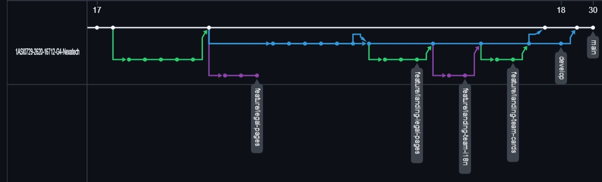
 
*Figura 5.0. Flujo de ramas aplicado en los repositorios de VitalTrek.*
 
**Política de Pull Requests**
 
1. Toda integración a `develop` y a `main` se realiza mediante Pull Request; no se permite empujar directamente a ninguna de las dos.
2. Cada Pull Request indica en su descripción la User Story o Technical Story que resuelve y los criterios de aceptación cubiertos.
3. Un Pull Request requiere la revisión y aprobación de al menos un integrante distinto de su autor.
4. La rama de funcionalidad se elimina después de la integración.
#### Semantic Versioning
 
Las Releases se nombran según **Semantic Versioning 2.0.0**, con el formato `vMAJOR.MINOR.PATCH`:
 
| Componente | Se incrementa cuando | Ejemplo |
| --- | --- | --- |
| `MAJOR` | Se introduce un cambio incompatible con la versión anterior. | `v2.0.0` |
| `MINOR` | Se agrega funcionalidad manteniendo la compatibilidad. | `v1.1.0` |
| `PATCH` | Se corrige un defecto sin agregar funcionalidad. | `v1.0.1` |
 
La versión publicada al cierre del Sprint 1 es **`v1.0.0`**, correspondiente a la primera versión funcional y desplegada del Landing Page. Cada Release se etiqueta en `main` con su número de versión.
 
#### Conventional Commits
 
Los mensajes de commit siguen la especificación **Conventional Commits 1.0.0**, con la estructura:
 
```
<tipo>(<alcance>): <descripción en imperativo y en inglés>
 
[cuerpo opcional]
```
 
| Tipo | Se usa para |
| --- | --- |
| `feat` | Agregar una funcionalidad nueva. |
| `fix` | Corregir un defecto. |
| `docs` | Cambios que solo afectan documentación. |
| `style` | Cambios de formato que no alteran el comportamiento. |
| `refactor` | Reestructurar código sin cambiar su comportamiento externo. |
| `test` | Agregar o corregir pruebas. |
| `chore` | Tareas de mantenimiento, configuración o dependencias. |
 
Ejemplos tomados del repositorio del proyecto:
 
```
feat(a11y): add skip to main content link
feat(seo): complete meta tags defined in report 4.2.3
docs(chapter5): add Jorge Mateo Leon commits to development evidence
style(a11y): add skip link styles
```
 
> **Nota sobre la adopción de las convenciones.** El equipo adoptó formalmente Conventional Commits y la convención de nombres de rama a partir del 7 de septiembre de 2026. Los commits y ramas anteriores a esa fecha, registrados en la sección 5.2.1.4, no siguen la convención, dado que corresponden al período de configuración inicial del repositorio. No se reescribió el historial para preservar la trazabilidad de los aportes individuales. A partir de esa fecha, la convención se verifica durante la revisión de cada Pull Request.
 
### 5.1.3. Source Code Style Guide & Conventions
 
El equipo adopta guías de estilo estándar para cada lenguaje de la solución. Todos los identificadores, nombres de archivo, clases, funciones y comentarios se redactan en inglés, conforme a lo indicado en el enunciado del trabajo final.
 
| Tecnología | Convenciones adoptadas | Referencia |
| --- | --- | --- |
| HTML5 | Elementos semánticos, etiquetas y atributos en minúscula, atributos entre comillas dobles, texto alternativo en toda imagen informativa, indentación de dos espacios. | [Google HTML/CSS Style Guide](https://google.github.io/styleguide/htmlcssguide.html) · [W3Schools HTML Style Guide](https://www.w3schools.com/html/html5_syntax.asp) |
| CSS3 | Clases e identificadores en `kebab-case`, variables centralizadas en `tokens.css`, enfoque mobile-first, una declaración por línea. | [Google HTML/CSS Style Guide](https://google.github.io/styleguide/htmlcssguide.html) |
| JavaScript | Variables y funciones en `camelCase`, constantes en `UPPER_SNAKE_CASE`, uso de `const` y `let` en lugar de `var`, funciones con una sola responsabilidad, punto y coma obligatorio. | [Google JavaScript Style Guide](https://google.github.io/styleguide/jsguide.html) · [MDN JavaScript Guidelines](https://developer.mozilla.org/en-US/docs/MDN/Writing_guidelines/Code_style_guide/JavaScript) |
| Vue.js | Componentes en `PascalCase` con nombre de varias palabras, props en `camelCase` dentro del script y en `kebab-case` en la plantilla, un componente por archivo. Planificado para Sprints posteriores. | [Vue Style Guide](https://vuejs.org/style-guide/) |
| C# | Clases, métodos y propiedades en `PascalCase`; parámetros y variables locales en `camelCase`; interfaces con prefijo `I`. Planificado para el RESTful Web Services. | [C# Coding Conventions](https://learn.microsoft.com/en-us/dotnet/csharp/fundamentals/coding-style/coding-conventions) · [ASP.NET Core Engineering Guidelines](https://github.com/dotnet/aspnetcore/wiki/Engineering-guidelines) |
| Gherkin | Un escenario por comportamiento, redacción en tiempo presente y tercera persona, sin referencias a elementos de interfaz. | [Gherkin Reference](https://cucumber.io/docs/gherkin/reference/) |
| Markdown | Encabezados jerárquicos sin saltar niveles, enlaces relativos entre capítulos, imágenes con texto alternativo, tablas con formato consistente. | [Markdown Guide](https://www.markdownguide.org/basic-syntax/) |
 
Ejemplos aplicados en el Landing Page:
 
```html
<section class="safety-features" aria-labelledby="safety-title">
  <h2 id="safety-title" data-i18n="safetyTitle">Checkpoint synchronization</h2>
</section>
```
 
```css
:root {
  --forest-green: #0f3d2e;
  --safety-amber: #f2a93b;
}
 
.request-demo-button {
  background-color: var(--safety-amber);
}
```
 
```javascript
const DEFAULT_LOCALE = 'en-US';
 
function setLanguage(selectedLocale) {
  document.documentElement.lang = selectedLocale;
  localStorage.setItem('vitaltrek-language', selectedLocale);
}
```
 
### 5.1.4. Software Deployment Configuration
 
El despliegue de cada producto parte de su repositorio de código fuente. Para AV1 el único producto desplegado es el Landing Page, publicado en Vercel a partir del repositorio de GitHub.
 
| Producto | Plataforma | Rama de despliegue | Estado |
| --- | --- | --- | --- |
| Landing Page | Vercel | `main` | Desplegado |
| Frontend Web Applications | Vercel | `main` | Planificado |
| RESTful Web Services | Azure App Service | `main` | Planificado |
 
#### Configuración del Landing Page
 
| Parámetro | Valor |
| --- | --- |
| Repositorio | https://github.com/1ASI0729-2620-16712-G4-Nexatech/landing-page |
| Plataforma | Vercel |
| Production Branch | `main` |
| Framework preset | Other (HTML, CSS y JavaScript estáticos) |
| Build command | No aplica |
| Output directory | Directorio raíz del repositorio |
| Variables de entorno | No requeridas |
| URL pública de producción | https://landing-page-mrca1.vercel.app/ |
| Versión desplegada | `v1.0.0` |
 
#### Pasos para lograr el despliegue desde el repositorio
 
1. El integrante desarrolla la funcionalidad en su rama `feature/*` y abre un Pull Request hacia `develop`.
2. Otro integrante revisa el Pull Request y verifica que se cumplan los criterios de aceptación de la historia correspondiente.
3. Aprobado el Pull Request, la rama se integra en `develop` y se elimina.
4. Al cerrar el Sprint se crea la rama `release/vX.Y.Z` desde `develop`, donde se ejecutan las validaciones finales: marcado W3C, enlaces internos, comportamiento responsive, cambio de idioma y accesibilidad por teclado.
5. La rama de Release se integra en `main` mediante Pull Request y se etiqueta con su número de versión.
6. Vercel detecta el cambio en la Production Branch y ejecuta el despliegue automático.
7. Se verifica la URL pública de producción y se registra la evidencia en la sección 5.2.X.7 del Sprint correspondiente.

## 5.2. Landing Page, Services & Applications Implementation

Esta sección documenta la implementación, validación y despliegue de los productos incluidos en la solución VitalTrek. Para AV1, el alcance se concentra en la primera versión funcional y desplegada del Landing Page, desarrollado con HTML5, CSS3 y JavaScript. En TB1, el Sprint 2 amplía el producto con las Web Applications frontend para configurar expediciones y consultar su progreso mediante una Fake API y datos simulados. El RESTful Web Services productivo, la persistencia real y la integración con dispositivos permanecen fuera del alcance de esta entrega.

### 5.2.1. Sprint 1

El Sprint 1 tiene como objetivo implementar y publicar la primera versión del Landing Page de VitalTrek. El alcance comprende las User Stories US01 a US06 y US33, relacionadas con la navegación, la propuesta de valor, los planes, la información del equipo, la solicitud de información, el cambio de idioma y la publicación de los términos de servicio y la política de privacidad; y las Technical Stories TS01 a TS04, que habilitan la estructura técnica, la adaptación a distintos dispositivos, la internacionalización con accesibilidad y el despliegue. La estimación total del Sprint es de 30 Story Points.

| Campo | Valor corregido |
| --- | --- |
| Sprint Velocity | 30 Story Points |
| Total de Story Points | 30 |

#### 5.2.1.1. Sprint Planning 1

La reunión de planificación permitió definir el objetivo, alcance, responsabilidades y tareas del primer Sprint. El trabajo se enfocó en entregar un Landing Page responsive, accesible y coherente con los wireframes, mock-ups, Style Guidelines e Information Architecture definidos en el capítulo IV.

| Campo                 | Información                                                                                                                                                 |
| --------------------- | ----------------------------------------------------------------------------------------------------------------------------------------------------------- |
| Sprint                | Sprint 1                                                                                                                                                    |
| Fecha                 | 2026-09-05                                                                                                                                                  |
| Hora                  | 20:00                                                                                                                                                       |
| Ubicación             | Discord — reunión virtual                                                                                                                                   |
| Preparado por         | Rodriguez Rojas, Miler Alexander                                                                                                                            |
| Participantes         | Cayanchi Avila, Milenko Rubén; León Naupari, Jorge Mateo; Mendoza Blanco, Ariel Roberto; Rodriguez Rojas, Miler Alexander; Herrera Enriquez, Diego Fernando |
| Sprint Goal           | Publicar una Landing Page bilingüe y responsive de VitalTrek para visitantes de agencias y turistas.                                                          |
| Sprint Velocity       | 14 Story Points                                                                                                                                             |
| Total de Story Points | 14                                                                                                                                                          |

**Sprint Goal**

Nuestro enfoque está en publicar una Landing Page bilingüe y responsive que comunique la propuesta de valor de VitalTrek. Creemos que esto permitirá a los visitantes de agencias y turistas comprender la solución y solicitar información o una demostración. Esto se confirmará cuando el sitio esté desplegado y sus flujos principales puedan recorrerse correctamente en ambos idiomas.

#### 5.2.1.2. Aspect Leaders and Collaborators

La siguiente matriz organiza el liderazgo y la colaboración del equipo durante el Sprint 1. La asignación debe coincidir con las tareas registradas en el Sprint Backlog y con la evidencia de commits.

| Integrante                       | Usuario de GitHub | Landing Page structure | Responsive UI | i18n y a11y | QA y deployment | Documentación |
| -------------------------------- | ----------------- | ---------------------- | ------------- | ----------- | --------------- | ------------- |
| Cayanchi Avila, Milenko Rubén    | `MaxghZZ`         | L                      | C             | C           | C               | L             |
| León Naupari, Jorge Mateo        | `mateool10`       | C                      | L             | C           | C               | C             |
| Mendoza Blanco, Ariel Roberto    | `Trepequiper`     | C                      | C             | L           | C               | C             |
| Rodriguez Rojas, Miler Alexander | `Miler2003`       | C                      | C             | C           | L               | L             |
| Herrera Enriquez, Diego Fernando | `DerDFHE`         | C                      | C             | C           | C               | C             |

#### 5.2.1.3. Sprint Backlog 1

El Sprint Backlog 1 agrupa las siete User Stories de la Landing Page y las cuatro Technical Stories que la habilitan, seleccionadas desde el Product Backlog de la sección 3.3. La descomposición produjo veintiún Work-items, estimados individualmente entre 4 y 8 horas, con un total de 105 horas. Las tareas se repartieron según la matriz de líderes y colaboradores de la sección 5.2.1.2: cada integrante asume las tareas del aspecto que lidera y colabora en los aspectos restantes.
 
**Evidencia del Board del Sprint**
 
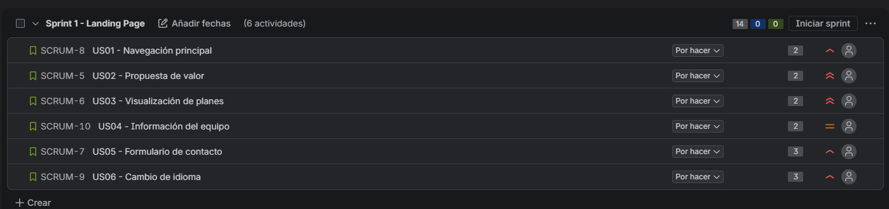
 
*Figura 5.1. Board del Sprint 1 en Jira.*
 
**Enlace público del board Jira:** [Ver Product Backlog](https://milenkorvu.atlassian.net/jira/software/projects/SCRUM/boards/1/backlog)
 
| Sprint # | Story Id | Story Title | Task Id | Task Title | Task Description | Estimation (Hours) | Assigned To | Status |
| --- | --- | --- | --- | --- | --- | ---: | --- | --- |
| Sprint 1 | US01 | Navegación principal | T-01 | Estructura del header y de las secciones principales | Construir el encabezado y el esqueleto de las secciones del sitio con elementos semánticos, de modo que cada sección sea alcanzable desde la navegación. | 5 | Cayanchi Avila, Milenko Rubén | Done |
| Sprint 1 | US01 | Navegación principal | T-02 | Navegación para pantallas reducidas | Implementar el comportamiento de la navegación por debajo de 768 px conservando las mismas opciones que la vista de escritorio. | 4 | Herrera Enriquez, Diego Fernando | Done |
| Sprint 1 | US02 | Propuesta de valor | T-03 | Sección inicial con problema, solución y beneficios | Maquetar la sección inicial que presenta el problema de las zonas sin cobertura, la solución por checkpoints y los beneficios principales. | 6 | Cayanchi Avila, Milenko Rubén | Done |
| Sprint 1 | US02 | Propuesta de valor | T-04 | Contenido de beneficios por segmento | Redactar e integrar el contenido que diferencia los beneficios para agencias y para turistas, a partir de los insights del capítulo II. | 4 | Mendoza Blanco, Ariel Roberto | Done |
| Sprint 1 | US03 | Consulta de planes y precios | T-05 | Sección comparativa de planes | Construir la presentación de los planes con su precio, alcance y características, de forma que puedan compararse entre sí. | 5 | Rodriguez Rojas, Miler Alexander | Done |
| Sprint 1 | US03 | Consulta de planes y precios | T-06 | Continuidad desde el plan hacia el contacto | Enlazar cada plan con el formulario de contacto de modo que el plan de interés quede identificado en la solicitud. | 4 | Rodriguez Rojas, Miler Alexander | Done |
| Sprint 1 | US04 | Información del equipo | T-07 | Sección de equipo con los perfiles de NexaTech | Construir la sección de equipo con el nombre, el rol y la descripción de cada integrante, y sus fotografías. | 5 | Mendoza Blanco, Ariel Roberto | Done |
| Sprint 1 | US05 | Solicitud de información o demostración | T-08 | Formulario de contacto y estructura de campos | Construir el formulario con los campos requeridos para registrar una solicitud de información o demostración. | 5 | Mendoza Blanco, Ariel Roberto | Done |
| Sprint 1 | US05 | Solicitud de información o demostración | T-09 | Validación de campos obligatorios y formato de correo | Implementar la validación que impide el envío con campos obligatorios vacíos o con correo de formato inválido, e informa qué corregir. | 4 | Herrera Enriquez, Diego Fernando | Done |
| Sprint 1 | US06 | Consulta del contenido en el idioma del visitante | T-10 | Mecanismo de cambio de idioma y diccionario de claves | Implementar la función que recorre las cadenas marcadas y las sustituye por el bloque de idioma seleccionado. | 6 | León Naupari, Jorge Mateo | Done |
| Sprint 1 | US06 | Consulta del contenido en el idioma del visitante | T-11 | Persistencia de la preferencia de idioma | Conservar el idioma seleccionado entre visitas y actualizar el idioma declarado del documento al cambiarlo. | 4 | Mendoza Blanco, Ariel Roberto | Done |
| Sprint 1 | US33 | Consulta del tratamiento de datos personales | T-12 | Páginas de términos de servicio y política de privacidad | Construir ambas páginas con las categorías de datos registrados, su finalidad, el plazo de conservación y los derechos del titular. | 6 | León Naupari, Jorge Mateo | Done |
| Sprint 1 | US33 | Consulta del tratamiento de datos personales | T-13 | Contenido legal bilingüe y acceso desde el pie de página | Traducir el contenido legal a ambos idiomas y habilitar su acceso desde el pie de página de todas las vistas. | 5 | León Naupari, Jorge Mateo | Done |
| Sprint 1 | TS01 | Estructura técnica del Landing Page | T-14 | Estructura de directorios, tokens de estilo y README | Separar marcado, estilos y scripts en directorios propios, centralizar color y tipografía como variables, y documentar la estructura y la ejecución local. | 6 | Cayanchi Avila, Milenko Rubén | Done |
| Sprint 1 | TS02 | Adaptación del Landing Page a distintos dispositivos | T-15 | Adaptación a los anchos de referencia | Ajustar la presentación en 360, 768, 1024 y 1440 px verificando que no se produzca desplazamiento horizontal ni recorte de texto. | 8 | Herrera Enriquez, Diego Fernando | Done |
| Sprint 1 | TS02 | Adaptación del Landing Page a distintos dispositivos | T-16 | Áreas táctiles y escala tipográfica móvil | Verificar el área mínima de los controles interactivos y aplicar la escala tipográfica móvil por debajo de 768 px. | 4 | Herrera Enriquez, Diego Fernando | Done |
| Sprint 1 | TS03 | Internacionalización y accesibilidad del Landing Page | T-17 | Acceso al contenido principal, elementos semánticos y orden de tabulación | Incorporar el acceso directo al contenido principal como primer elemento enfocable, aplicar los elementos semánticos de referencia y verificar el orden de tabulación. | 6 | León Naupari, Jorge Mateo | Done |
| Sprint 1 | TS03 | Internacionalización y accesibilidad del Landing Page | T-18 | Verificación de contraste y textos alternativos | Comprobar que el contraste cumple WCAG 2.1 AA y que las imágenes informativas declaran texto alternativo descriptivo. | 5 | Rodriguez Rojas, Miler Alexander | Done |
| Sprint 1 | TS03 | Internacionalización y accesibilidad del Landing Page | T-19 | Paridad de claves entre los bloques de idioma | Verificar que ambos bloques de idioma contienen el mismo conjunto de claves y corregir las ausencias detectadas. | 4 | Mendoza Blanco, Ariel Roberto | Done |
| Sprint 1 | TS04 | Validación y despliegue del Landing Page | T-20 | Metadatos de identificación e indexación | Declarar en cada página el título, la descripción, la URL canónica, las alternativas de idioma y los metadatos de previsualización social. | 5 | León Naupari, Jorge Mateo | Done |
| Sprint 1 | TS04 | Validación y despliegue del Landing Page | T-21 | Validación del marcado, de los enlaces y despliegue | Ejecutar la validación del W3C, comprobar que ningún enlace interno responde 404 y publicar la versión aprobada desde la rama estable. | 4 | Rodriguez Rojas, Miler Alexander | Done |
 
**Resumen del Sprint Backlog 1**
 
| Concepto | Valor |
| --- | ---: |
| User Stories y Technical Stories asignadas | 11 |
| Work-items resultantes de la descomposición | 21 |
| Estimación mínima de una task | 4 horas |
| Estimación máxima de una task | 8 horas |
| Total de horas estimadas | 105 |
| Sum of Story Points | 30 |
 
**Distribución de la carga por integrante**
 
| Integrante | Tasks | Horas |
| --- | ---: | ---: |
| León Naupari, Jorge Mateo | 5 | 28 |
| Mendoza Blanco, Ariel Roberto | 5 | 22 |
| Herrera Enriquez, Diego Fernando | 4 | 20 |
| Rodriguez Rojas, Miler Alexander | 4 | 18 |
| Cayanchi Avila, Milenko Rubén | 3 | 17 |
| **Total** | **21** | **105** |
 
---

#### 5.2.1.4. Development Evidence for Sprint Review

##### Report Development Evidence
Durante el Sprint 1 se implementaron los componentes correspondientes al Report. La evidencia debe relacionar cada cambio con su repositorio, rama, commit y fecha de realización.

| Repositorio                                                          | Rama                                           | Commit ID | Mensaje del commit                                                                                                            | Fecha      | Sección / Capítulo relacionada |
| -------------------------------------------------------------------- | ---------------------------------------------- | --------- | ----------------------------------------------------------------------------------------------------------------------------- | ---------- | ------------------------------ |
| [Reporte](https://github.com/1ASI0729-2620-16712-G4-Nexatech/report) | `develop`                                      | `dd2827f` | `Merge pull request #29 from 1ASI0729-2620-16712-G4-Nexatech/feature/chapter-5-development-evidence`                          | 2026-09-17 | Capítulo 5                     |
| [Reporte](https://github.com/1ASI0729-2620-16712-G4-Nexatech/report) | `feature/chapter-5-development-evidence`       | `f410575` | `docs(chapter5): add Jorge Mateo Leon commits to 5.2.1.4 development evidence`                                                | 2026-09-17 | Capítulo 5                     |
| [Reporte](https://github.com/1ASI0729-2620-16712-G4-Nexatech/report) | `develop`                                      | `842b4a3` | `Merge pull request #28 from 1ASI0729-2620-16712-G4-Nexatech/feature/chapter-5-collaboration-insights`                        | 2026-09-17 | Capítulo 5                     |
| [Reporte](https://github.com/1ASI0729-2620-16712-G4-Nexatech/report) | `feature/chapter-5-collaboration-insights`     | `e9ae4cc` | `docs(chapter5): complete 5.2.1.8 collaboration insights for Jorge Mateo Leon`                                                | 2026-09-17 | Capítulo 5                     |
| [Reporte](https://github.com/1ASI0729-2620-16712-G4-Nexatech/report) | `feature/chapter-5-collaboration-insights`     | `410f207` | `docs(chapter5): add collaboration evidence screenshots`                                                                      | 2026-09-17 | Capítulo 5                     |
| [Reporte](https://github.com/1ASI0729-2620-16712-G4-Nexatech/report) | `develop`                                      | `398d3e2` | `docs(chapter3): add epics table.`                                                                                            | 2026-09-17 | Capítulo 3                     |
| [Reporte](https://github.com/1ASI0729-2620-16712-G4-Nexatech/report) | `develop`                                      | `ed4bec2` | `docs(chapter3): update user stories:`                                                                                        | 2026-09-17 | Capítulo 3                     |
| [Reporte](https://github.com/1ASI0729-2620-16712-G4-Nexatech/report) | `main`                                         | `374dd07` | `chore: update readme.`                                                                                                       | 2026-09-17 | Documentación                  |
| [Reporte](https://github.com/1ASI0729-2620-16712-G4-Nexatech/report) | `main`                                         | `bfee799` | `chore: update readme.`                                                                                                       | 2026-09-17 | Documentación                  |
| [Reporte](https://github.com/1ASI0729-2620-16712-G4-Nexatech/report) | `feature/chapter-5`                            | `8b648e3` | `docs(chapter5): add chapter 5.`                                                                                              | 2026-09-17 | Capítulo 5                     |
| [Reporte](https://github.com/1ASI0729-2620-16712-G4-Nexatech/report) | `feature/chapter-5`                            | `abfcbf3` | `docs(chapter5): add chapter 5.`                                                                                              | 2026-09-17 | Capítulo 5                     |
| [Reporte](https://github.com/1ASI0729-2620-16712-G4-Nexatech/report) | `develop`                                      | `a5a3931` | `Merge branch 'feature/documentation-profile' into develop`                                                                   | 2026-09-16 | Documentación                  |
| [Reporte](https://github.com/1ASI0729-2620-16712-G4-Nexatech/report) | `feature/documentation-profile`                | `8519f14` | `docs: add Student Outcome section with communication criteria and actions`                                                   | 2026-09-16 | Documentación                  |
| [Reporte](https://github.com/1ASI0729-2620-16712-G4-Nexatech/report) | `feature/documentation-profile`                | `2856a3e` | `docs: add collaboration insights for project report`                                                                         | 2026-09-16 | Documentación                  |
| [Reporte](https://github.com/1ASI0729-2620-16712-G4-Nexatech/report) | `feature/documentation-profile`                | `7a1cc16` | `docs: add version history for project report`                                                                                | 2026-09-16 | Documentación                  |
| [Reporte](https://github.com/1ASI0729-2620-16712-G4-Nexatech/report) | `develop`                                      | `2196ad8` | `docs(chapter4): update section headings for consistency and clarity`                                                         | 2026-09-16 | Capítulo 4                     |
| [Reporte](https://github.com/1ASI0729-2620-16712-G4-Nexatech/report) | `feature/documentation-profile`                | `a460900` | `docs: add cover page for final project report`                                                                               | 2026-09-16 | Documentación                  |
| [Reporte](https://github.com/1ASI0729-2620-16712-G4-Nexatech/report) | `feature/chapter-4-wireframes`                 | `027a2a1` | `docs(chapter4): add login wireframes and mockups.`                                                                           | 2026-09-15 | Capítulo 4                     |
| [Reporte](https://github.com/1ASI0729-2620-16712-G4-Nexatech/report) | `feature/chapter-4-wireframes`                 | `737470f` | `docs(chapter4): add wireframes and mockups descriptions.`                                                                    | 2026-09-15 | Capítulo 4                     |
| [Reporte](https://github.com/1ASI0729-2620-16712-G4-Nexatech/report) | `feature/chapter-4-wireframes`                 | `0f63dd3` | `docs(chapter4): add wireframes and mockups web.`                                                                             | 2026-09-15 | Capítulo 4                     |
| [Reporte](https://github.com/1ASI0729-2620-16712-G4-Nexatech/report) | `feature/chapter-4-wireframes`                 | `0bd53a1` | `docs(chapter4): add assets`                                                                                                  | 2026-09-15 | Capítulo 4                     |
| [Reporte](https://github.com/1ASI0729-2620-16712-G4-Nexatech/report) | `feature/chapter-4-wireframes`                 | `f7a00a6` | `docs(chapter4): add wireframes and mockups web.`                                                                             | 2026-09-14 | Capítulo 4                     |
| [Reporte](https://github.com/1ASI0729-2620-16712-G4-Nexatech/report) | `feature/chapter-4-wireframes`                 | `4f39ddb` | `docs(chapter4): add wireframes and mockups web.`                                                                             | 2026-09-14 | Capítulo 4                     |
| [Reporte](https://github.com/1ASI0729-2620-16712-G4-Nexatech/report) | `feature/chapter4-architecture`                | `b5ec32a` | `docs(chapter4): add class diagrams.`                                                                                         | 2026-09-13 | Capítulo 4                     |
| [Reporte](https://github.com/1ASI0729-2620-16712-G4-Nexatech/report) | `develop`                                      | `06a7842` | `Merge pull request #24 from 1ASI0729-2620-16712-G4-Nexatech/feature/chapter-4-event-storming`                                | 2026-09-13 | Capítulo 4                     |
| [Reporte](https://github.com/1ASI0729-2620-16712-G4-Nexatech/report) | `feature/chapter-4-event-storming`             | `5525c8b` | `docs(chapter4): add 4.6.1 design-level event storming`                                                                       | 2026-09-13 | Capítulo 4                     |
| [Reporte](https://github.com/1ASI0729-2620-16712-G4-Nexatech/report) | `feature/chapter-4-event-storming`             | `cdf9343` | `docs(chapter4): add event storming board screenshots`                                                                        | 2026-09-13 | Capítulo 4                     |
| [Reporte](https://github.com/1ASI0729-2620-16712-G4-Nexatech/report) | `develop`                                      | `a114277` | `Merge remote-tracking branch 'origin/develop' into develop`                                                                  | 2026-09-13 | Documentación                  |
| [Reporte](https://github.com/1ASI0729-2620-16712-G4-Nexatech/report) | `feature/chapter-4-database`                   | `ba5ba04` | `docs(chapter4): add database diagram`                                                                                        | 2026-09-13 | Capítulo 4                     |
| [Reporte](https://github.com/1ASI0729-2620-16712-G4-Nexatech/report) | `feature/chapter-4-database`                   | `50d57b4` | `docs(chapter4): add database diagram`                                                                                        | 2026-09-13 | Capítulo 4                     |
| [Reporte](https://github.com/1ASI0729-2620-16712-G4-Nexatech/report) | `feature/chapter4-architecture`                | `dabdd80` | `docs(chapter4): add software achitecture diagrams.`                                                                          | 2026-09-13 | Capítulo 4                     |
| [Reporte](https://github.com/1ASI0729-2620-16712-G4-Nexatech/report) | `feature/chapter4-architecture`                | `2384479` | `docs(chapter4): add software achitecture diagrams.`                                                                          | 2026-09-13 | Capítulo 4                     |
| [Reporte](https://github.com/1ASI0729-2620-16712-G4-Nexatech/report) | `develop`                                      | `df04fcb` | `Merge pull request #20 from 1ASI0729-2620-16712-G4-Nexatech/feature/chapter4-architecture`                                   | 2026-09-12 | Capítulo 4                     |
| [Reporte](https://github.com/1ASI0729-2620-16712-G4-Nexatech/report) | `feature/chapter4-architecture`                | `792c63c` | `docs(chapter4): add sections 4.6.2 context and 4.6.3 container diagrams`                                                     | 2026-09-12 | Capítulo 4                     |
| [Reporte](https://github.com/1ASI0729-2620-16712-G4-Nexatech/report) | `develop`                                      | `727277d` | `Merge branch 'feature/chapter-4-information-architecture' into develop`                                                      | 2026-09-10 | Capítulo 4                     |
| [Reporte](https://github.com/1ASI0729-2620-16712-G4-Nexatech/report) | `feature/chapter-4-information-architecture`   | `d798a57` | `docs(chapter4): add section on information architecture and organization systems`                                            | 2026-09-10 | Capítulo 4                     |
| [Reporte](https://github.com/1ASI0729-2620-16712-G4-Nexatech/report) | `feature/chapter-4-style-guidelines`           | `ba24361` | `Feature/chapter 4 style guidelines`                                                                                          | 2026-09-10 | Capítulo 4                     |
| [Reporte](https://github.com/1ASI0729-2620-16712-G4-Nexatech/report) | `feature/chapter-4-style-guidelines`           | `708d7cc` | `docs(chapter4): add chapter 4.1 Style Guidelines`                                                                            | 2026-09-10 | Capítulo 4                     |
| [Reporte](https://github.com/1ASI0729-2620-16712-G4-Nexatech/report) | `feature/chapter-4-style-guidelines`           | `4f0a81d` | `docs(chapter4): add chapter 4`                                                                                               | 2026-09-10 | Capítulo 4                     |
| [Reporte](https://github.com/1ASI0729-2620-16712-G4-Nexatech/report) | `feature/chapter-3-product-backlog`            | `14fc8b5` | `docs: add point 3.3 product backlog`                                                                                         | 2026-09-09 | Capítulo 3                     |
| [Reporte](https://github.com/1ASI0729-2620-16712-G4-Nexatech/report) | `feature/chapter-3-product-backlog`            | `de00def` | `docs: add point 3.3 product backlog`                                                                                         | 2026-09-09 | Capítulo 3                     |
| [Reporte](https://github.com/1ASI0729-2620-16712-G4-Nexatech/report) | `develop`                                      | `3f61ff8` | `Merge branch 'feature/chapter3-impact-mapping' into develop`                                                                 | 2026-09-09 | Capítulo 3                     |
| [Reporte](https://github.com/1ASI0729-2620-16712-G4-Nexatech/report) | `feature/chapter3-impact-mapping`              | `4744c54` | `docs(chapter3): add impact mapping diagram`                                                                                  | 2026-09-09 | Capítulo 3                     |
| [Reporte](https://github.com/1ASI0729-2620-16712-G4-Nexatech/report) | `feature/chapter3-impact-mapping`              | `9610c3d` | `docs(chapter3): add impact mapping section with user personas and business goals`                                            | 2026-09-09 | Capítulo 3                     |
| [Reporte](https://github.com/1ASI0729-2620-16712-G4-Nexatech/report) | `develop`                                      | `256b027` | `docs(chapter2): update section headings and improve structure for clarity`                                                   | 2026-09-09 | Capítulo 2                     |
| [Reporte](https://github.com/1ASI0729-2620-16712-G4-Nexatech/report) | `feature/chapter-3-user-stories`               | `82de5d3` | `docs: add chapter 3.1 user stories`                                                                                          | 2026-09-08 | Capítulo 3                     |
| [Reporte](https://github.com/1ASI0729-2620-16712-G4-Nexatech/report) | `feature/chapter-3-user-stories`               | `85f00c5` | `docs: add chapter 3.1 user stories`                                                                                          | 2026-09-08 | Capítulo 3                     |
| [Reporte](https://github.com/1ASI0729-2620-16712-G4-Nexatech/report) | `feature/chapter-3-event-storming`             | `d5e5cc2` | `docs: update event storming`                                                                                                 | 2026-09-08 | Capítulo 3                     |
| [Reporte](https://github.com/1ASI0729-2620-16712-G4-Nexatech/report) | `feature/chapter-3-user-journey`               | `fa74dfa` | `docs: add user journey maping`                                                                                               | 2026-09-08 | Capítulo 3                     |
| [Reporte](https://github.com/1ASI0729-2620-16712-G4-Nexatech/report) | `feature/chapter-3-event-storming`             | `796d8a7` | `docs: add event storming point`                                                                                              | 2026-09-08 | Capítulo 3                     |
| [Reporte](https://github.com/1ASI0729-2620-16712-G4-Nexatech/report) | `feature/chapter-3-event-storming`             | `4c1ac88` | `docs: add event storming point`                                                                                              | 2026-09-08 | Capítulo 3                     |
| [Reporte](https://github.com/1ASI0729-2620-16712-G4-Nexatech/report) | `feature/chapter-3-event-storming`             | `c4e1e45` | `docs: add event storming image`                                                                                              | 2026-09-08 | Capítulo 3                     |
| [Reporte](https://github.com/1ASI0729-2620-16712-G4-Nexatech/report) | `develop`                                      | `d335beb` | `Merge branch 'feature/chapter-2-graficos-entrevistas' into develop`                                                          | 2026-09-08 | Capítulo 2                     |
| [Reporte](https://github.com/1ASI0729-2620-16712-G4-Nexatech/report) | `feature/chapter-2-graficos-entrevistas`       | `7cf074a` | `docs(chapter2): add graphical representations for agency and tourist data`                                                   | 2026-09-08 | Capítulo 2                     |
| [Reporte](https://github.com/1ASI0729-2620-16712-G4-Nexatech/report) | `feature/chapter-2-graficos-entrevistas`       | `2b36dfb` | `docs(chapter2): update interview analysis and add visual data representation`                                                | 2026-09-08 | Capítulo 2                     |
| [Reporte](https://github.com/1ASI0729-2620-16712-G4-Nexatech/report) | `develop`                                      | `2ff9f6e` | `Merge pull request #15 from Vitalrek-Project/feature/chapter2-user-task-matrix`                                              | 2026-09-07 | Capítulo 2                     |
| [Reporte](https://github.com/1ASI0729-2620-16712-G4-Nexatech/report) | `feature/chapter2-user-task-matrix`            | `fd23036` | `docs(chapter2): agregar seccion 2.3.2 User Task Matrix`                                                                      | 2026-09-07 | Capítulo 2                     |
| [Reporte](https://github.com/1ASI0729-2620-16712-G4-Nexatech/report) | `feature/chapter-2-user-segments`              | `bde7426` | `docs: add users by object segment`                                                                                           | 2026-09-07 | Capítulo 2                     |
| [Reporte](https://github.com/1ASI0729-2620-16712-G4-Nexatech/report) | `feature/chapter-2-user-segments`              | `0681347` | `docs: add users by object segment`                                                                                           | 2026-09-07 | Capítulo 2                     |
| [Reporte](https://github.com/1ASI0729-2620-16712-G4-Nexatech/report) | `develop`                                      | `495d242` | `docs: update document points`                                                                                                | 2026-09-07 | Documentación                  |
| [Reporte](https://github.com/1ASI0729-2620-16712-G4-Nexatech/report) | `develop`                                      | `ae2b8db` | `Merge pull request #13 from Vitalrek-Project/feature/chapter2-ubiquitous-language-v2`                                        | 2026-09-07 | Capítulo 2                     |
| [Reporte](https://github.com/1ASI0729-2620-16712-G4-Nexatech/report) | `feature/chapter2-ubiquitous-language-v2`      | `50ff348` | `docs(chapter2): agregar seccion 2.5 Ubiquitous Language`                                                                     | 2026-09-07 | Capítulo 2                     |
| [Reporte](https://github.com/1ASI0729-2620-16712-G4-Nexatech/report) | `feature/chapter-1`                            | `66a2a15` | `docs(chapter1): add member photo and description`                                                                            | 2026-09-07 | Capítulo 1                     |
| [Reporte](https://github.com/1ASI0729-2620-16712-G4-Nexatech/report) | `main`                                         | `beb1ee5` | `docs(readme): fix team`                                                                                                      | 2026-09-07 | Documentación                  |
| [Reporte](https://github.com/1ASI0729-2620-16712-G4-Nexatech/report) | `develop`                                      | `9896b41` | `Merge branch 'feature/chapter-2-analissi-entrevistas' into develop`                                                          | 2026-09-07 | Capítulo 2                     |
| [Reporte](https://github.com/1ASI0729-2620-16712-G4-Nexatech/report) | `feature/chapter-2-analissi-entrevistas`       | `d192aa5` | `docs(chapter2): refine interview analysis for adventure tourism stakeholders`                                                | 2026-09-07 | Capítulo 2                     |
| [Reporte](https://github.com/1ASI0729-2620-16712-G4-Nexatech/report) | `feature/chapter-2-analissi-entrevistas`       | `37ad77b` | `docs(chapter2): add interview analysis for adventure tourism stakeholders`                                                   | 2026-09-07 | Capítulo 2                     |
| [Reporte](https://github.com/1ASI0729-2620-16712-G4-Nexatech/report) | `develop`                                      | `56c6462` | `Merge branch 'feature/chapter2-entrevistas' into develop`                                                                    | 2026-09-07 | Capítulo 2                     |
| [Reporte](https://github.com/1ASI0729-2620-16712-G4-Nexatech/report) | `feature/chapter2-entrevistas`                 | `22767b7` | `Merge branch 'develop' of https://github.com/Vitalrek-Project/VitalRek-Documents into feature/chapter2-entrevistas`          | 2026-09-07 | Capítulo 2                     |
| [Reporte](https://github.com/1ASI0729-2620-16712-G4-Nexatech/report) | `feature/chapter2-entrevistas`                 | `0f7cf2c` | `docs(chapter2): add interview segment images to assets`                                                                      | 2026-09-07 | Capítulo 2                     |
| [Reporte](https://github.com/1ASI0729-2620-16712-G4-Nexatech/report) | `feature/chapter2-entrevista-segmento1`        | `f237d53` | `docs(chapter2): update interview details with extended summaries and additional records`                                     | 2026-09-07 | Capítulo 2                     |
| [Reporte](https://github.com/1ASI0729-2620-16712-G4-Nexatech/report) | `develop`                                      | `296689b` | `Merge branch 'feature/chapter2-entrevista-segmento1' into develop`                                                           | 2026-09-07 | Capítulo 2                     |
| [Reporte](https://github.com/1ASI0729-2620-16712-G4-Nexatech/report) | `feature/chapter2-entrevista-segmento1`        | `30aa8c0` | `Merge branch 'develop' of https://github.com/Vitalrek-Project/VitalRek-Documents into feature/chapter2-entrevista-segmento1` | 2026-09-07 | Capítulo 2                     |
| [Reporte](https://github.com/1ASI0729-2620-16712-G4-Nexatech/report) | `feature/chapter2-entrevista-segmento1`        | `7d17d15` | `docs(chapter2): update interview records and add project configuration files`                                                | 2026-09-07 | Capítulo 2                     |
| [Reporte](https://github.com/1ASI0729-2620-16712-G4-Nexatech/report) | `develop`                                      | `56474a5` | `Merge branch 'feature/chapter-2-analisis-entrevistas' into develop`                                                          | 2026-09-07 | Capítulo 2                     |
| [Reporte](https://github.com/1ASI0729-2620-16712-G4-Nexatech/report) | `feature/chapter-2-analisis-entrevistas`       | `98bda71` | `docs(chapter2): add analysis of interviews with adventure tourism stakeholders`                                              | 2026-09-07 | Capítulo 2                     |
| [Reporte](https://github.com/1ASI0729-2620-16712-G4-Nexatech/report) | `feature/chapter-2-entrevista-miler-rodriguez` | `cf441d0` | `docs: add second interview`                                                                                                  | 2026-09-06 | Capítulo 2                     |
| [Reporte](https://github.com/1ASI0729-2620-16712-G4-Nexatech/report) | `feature/chapter-2-entrevista-miler-rodriguez` | `64c6608` | `docs: add second interview`                                                                                                  | 2026-09-06 | Capítulo 2                     |
| [Reporte](https://github.com/1ASI0729-2620-16712-G4-Nexatech/report) | `develop`                                      | `a3efb26` | `Merge branch 'feature/chapter-2-entrevista-miler-rodriguez' into develop`                                                    | 2026-09-06 | Capítulo 2                     |
| [Reporte](https://github.com/1ASI0729-2620-16712-G4-Nexatech/report) | `feature/chapter-2-entrevista-miler-rodriguez` | `fbc3b37` | `docs(chapter2): add details for second interview with Celeste Rodriguez`                                                     | 2026-09-06 | Capítulo 2                     |
| [Reporte](https://github.com/1ASI0729-2620-16712-G4-Nexatech/report) | `feature/chapter-2-entrevista-miler-rodriguez` | `cbbcf3e` | `docs: add image for third interview segment 1 into assets file`                                                              | 2026-09-06 | Capítulo 2                     |
| [Reporte](https://github.com/1ASI0729-2620-16712-G4-Nexatech/report) | `feature/chapter-2-entrevista-miler-rodriguez` | `7ca0097` | `docs(chapter2): add evidence for third interview with Miler Rodriguez`                                                       | 2026-09-06 | Capítulo 2                     |
| [Reporte](https://github.com/1ASI0729-2620-16712-G4-Nexatech/report) | `feature/chapter-2-entrevista-miler-rodriguez` | `c8f57f4` | `docs(chapter2): add second interview details for Celeste Rodriguez`                                                          | 2026-09-06 | Capítulo 2                     |
| [Reporte](https://github.com/1ASI0729-2620-16712-G4-Nexatech/report) | `feature/chapter2-entrevista-segmento1`        | `defbc42` | `docs(chapter2): agregar registro entrevista 2 segmento 1`                                                                    | 2026-09-06 | Capítulo 2                     |
| [Reporte](https://github.com/1ASI0729-2620-16712-G4-Nexatech/report) | `feature/chapter2-entrevista-segmento1`        | `f959752` | `docs(chapter2): agregar registro entrevista 2 segmento 1`                                                                    | 2026-09-06 | Capítulo 2                     |
| [Reporte](https://github.com/1ASI0729-2620-16712-G4-Nexatech/report) | `feature/chapter2-entrevista-segmento1`        | `193f12a` | `evidencia entrevista 2 segmento 1`                                                                                           | 2026-09-06 | Capítulo 2                     |
| [Reporte](https://github.com/1ASI0729-2620-16712-G4-Nexatech/report) | `develop`                                      | `d3ee05a` | `Merge branch 'feature/chapter2-entrevistas' into develop`                                                                    | 2026-09-06 | Capítulo 2                     |
| [Reporte](https://github.com/1ASI0729-2620-16712-G4-Nexatech/report) | `feature/chapter2-entrevistas`                 | `b413637` | `docs(chapter2): add interviews`                                                                                              | 2026-09-06 | Capítulo 2                     |
| [Reporte](https://github.com/1ASI0729-2620-16712-G4-Nexatech/report) | `feature/chapter2-entrevistas`                 | `0132a61` | `docs: add interviews`                                                                                                        | 2026-09-06 | Capítulo 2                     |
| [Reporte](https://github.com/1ASI0729-2620-16712-G4-Nexatech/report) | `feature/chapter2-entrevistas`                 | `30cbdac` | `docs: add interviews`                                                                                                        | 2026-09-06 | Capítulo 2                     |
| [Reporte](https://github.com/1ASI0729-2620-16712-G4-Nexatech/report) | `main`                                         | `cc46ed5` | `docs: update readme`                                                                                                         | 2026-09-04 | Documentación                  |
| [Reporte](https://github.com/1ASI0729-2620-16712-G4-Nexatech/report) | `feature/chapter-2-interview-design`           | `fe22b36` | `docs: add interview design section (2.2.1) to Chapter2.md`                                                                   | 2026-09-04 | Capítulo 2                     |
| [Reporte](https://github.com/1ASI0729-2620-16712-G4-Nexatech/report) | `feature/chapter-2-interview-design`           | `af48411` | `docs: add interview design section (2.2.1) to Chapter2.md`                                                                   | 2026-09-04 | Capítulo 2                     |
| [Reporte](https://github.com/1ASI0729-2620-16712-G4-Nexatech/report) | `feature/chapter-2-competitor-analysis`        | `686c807` | `docs: add competitor analysis section (2.1) to Chapter2.md`                                                                  | 2026-09-04 | Capítulo 2                     |
| [Reporte](https://github.com/1ASI0729-2620-16712-G4-Nexatech/report) | `feature/chapter-2-competitor-analysis`        | `d7620ad` | `docs: add competitor analysis section (2.1) to Chapter2.md`                                                                  | 2026-09-04 | Capítulo 2                     |
| [Reporte](https://github.com/1ASI0729-2620-16712-G4-Nexatech/report) | `feature/chapter1-solution-profile`            | `18f0e58` | `docs: update lean ux assumption.`                                                                                            | 2026-09-01 | Capítulo 1                     |
| [Reporte](https://github.com/1ASI0729-2620-16712-G4-Nexatech/report) | `feature/chapter1-solution-profile`            | `d4bca68` | `docs: update lean ux assumption.`                                                                                            | 2026-09-01 | Capítulo 1                     |
| [Reporte](https://github.com/1ASI0729-2620-16712-G4-Nexatech/report) | `feature/chapter1-solution-profile`            | `b3e69c0` | `docs: update problem statement.`                                                                                             | 2026-09-01 | Capítulo 1                     |
| [Reporte](https://github.com/1ASI0729-2620-16712-G4-Nexatech/report) | `feature/chapter1-solution-profile`            | `eb6ccb8` | `docs: update problem statement.`                                                                                             | 2026-09-01 | Capítulo 1                     |
| [Reporte](https://github.com/1ASI0729-2620-16712-G4-Nexatech/report) | `develop`                                      | `3620c5f` | `Merge branch 'feature/chapter1-solution-profile' into develop`                                                               | 2026-09-01 | Capítulo 1                     |
| [Reporte](https://github.com/1ASI0729-2620-16712-G4-Nexatech/report) | `feature/chapter1-solution-profile`            | `897a35a` | `docs(chapter1): fix 1.2.2.3 Lean UX Hypothesis Statement`                                                                    | 2026-09-01 | Capítulo 1                     |
| [Reporte](https://github.com/1ASI0729-2620-16712-G4-Nexatech/report) | `feature/chapter1-solution-profile`            | `7f28d62` | `docs: update Jorge's photo filename in Chapter1 and adjust image path`                                                       | 2026-09-01 | Capítulo 1                     |
| [Reporte](https://github.com/1ASI0729-2620-16712-G4-Nexatech/report) | `feature/chapter1-solution-profile`            | `3e34365` | `docs: update team profiles and add Lean UX Canvas details`                                                                   | 2026-09-01 | Capítulo 1                     |
| [Reporte](https://github.com/1ASI0729-2620-16712-G4-Nexatech/report) | `feature/chapter1-solution-profile`            | `4a20f6f` | `fix: resolve merge conflict in Chapter1`                                                                                     | 2026-09-01 | Capítulo 1                     |
| [Reporte](https://github.com/1ASI0729-2620-16712-G4-Nexatech/report) | `feature/chapter1-solution-profile`            | `1dedf24` | `docs: update team member profiles; add Ariel's photo and description`                                                        | 2026-09-01 | Capítulo 1                     |
| [Reporte](https://github.com/1ASI0729-2620-16712-G4-Nexatech/report) | `feature/chapter1-solution-profile`            | `37a9c73` | `docs: add Ariel's photo to assets`                                                                                           | 2026-09-01 | Capítulo 1                     |
| [Reporte](https://github.com/1ASI0729-2620-16712-G4-Nexatech/report) | `feature/chapter1-solution-profile`            | `7cd5d4a` | `docs: refine team member profiles; update Miler's photo and descriptions`                                                    | 2026-09-01 | Capítulo 1                     |
| [Reporte](https://github.com/1ASI0729-2620-16712-G4-Nexatech/report) | `feature/chapter1-solution-profile`            | `bed538d` | `docs: update team member profiles; include Lean UX Canvas image`                                                             | 2026-09-01 | Capítulo 1                     |
| [Reporte](https://github.com/1ASI0729-2620-16712-G4-Nexatech/report) | `feature/chapter1-solution-profile`            | `23a15be` | `docs: add Miler's photo to assets`                                                                                           | 2026-09-01 | Capítulo 1                     |
| [Reporte](https://github.com/1ASI0729-2620-16712-G4-Nexatech/report) | `feature/chapter1-solution-profile`            | `2476747` | `docs: add image of lean ux canvas into assets file`                                                                          | 2026-09-01 | Capítulo 1                     |
| [Reporte](https://github.com/1ASI0729-2620-16712-G4-Nexatech/report) | `feature/chapter1-solution-profile`            | `49fcc4d` | `docs: add Lean UX Canvas section with detailed descriptions and structured content`                                          | 2026-09-01 | Capítulo 1                     |
| [Reporte](https://github.com/1ASI0729-2620-16712-G4-Nexatech/report) | `feature/chapter1-solution-profile`            | `0be047c` | `docs: add team profile (Ariel) and Lean UX hypothesis statements (1.2.2.3. Lean UX Hypothesis Statement)`                    | 2026-08-30 | Capítulo 1                     |
| [Reporte](https://github.com/1ASI0729-2620-16712-G4-Nexatech/report) | `feature/chapter1-solution-profile`            | `23c2fdd` | `docs: add team profile (Ariel) and Lean UX hypothesis statements (1.2.2.3)`                                                  | 2026-08-30 | Capítulo 1                     |
| [Reporte](https://github.com/1ASI0729-2620-16712-G4-Nexatech/report) | `feature/chapter1-solution-profile`            | `a5d158f` | `Update Chapter1.md`                                                                                                          | 2026-08-30 | Capítulo 1                     |
| [Reporte](https://github.com/1ASI0729-2620-16712-G4-Nexatech/report) | `feature/chapter1-solution-profile`            | `790af9c` | `Add files via upload`                                                                                                        | 2026-08-30 | Capítulo 1                     |
| [Reporte](https://github.com/1ASI0729-2620-16712-G4-Nexatech/report) | `main`                                         | `9cfa9d6` | `Update README.md`                                                                                                            | 2026-08-30 | Documentación                  |
| [Reporte](https://github.com/1ASI0729-2620-16712-G4-Nexatech/report) | `main`                                         | `95b583a` | `Update README.md`                                                                                                            | 2026-08-30 | Documentación                  |
| [Reporte](https://github.com/1ASI0729-2620-16712-G4-Nexatech/report) | `main`                                         | `9ae61f6` | `docs: update the data in the README file.`                                                                                   | 2026-08-30 | Documentación                  |
| [Reporte](https://github.com/1ASI0729-2620-16712-G4-Nexatech/report) | `feature/chapter1-solution-profile`            | `86f8263` | `docs: update section 1.3 - align target segments with checkpoint-based monitoring language`                                  | 2026-08-30 | Capítulo 1                     |
| [Reporte](https://github.com/1ASI0729-2620-16712-G4-Nexatech/report) | `feature/chapter1-solution-profile`            | `58fbaee` | `docs: add section 1.3 - align target segments with checkpoint-based monitoring language.`                                    | 2026-08-30 | Capítulo 1                     |
| [Reporte](https://github.com/1ASI0729-2620-16712-G4-Nexatech/report) | `feature/chapter1-solution-profile`            | `d05545e` | `docs: add section 1.2.1 fix real time monitoring language to checkpoint-based alerts.`                                       | 2026-08-30 | Capítulo 1                     |
| [Reporte](https://github.com/1ASI0729-2620-16712-G4-Nexatech/report) | `feature/chapter1-solution-profile`            | `9ef7345` | `docs: add section 1.2.1 fix real time monitoring language to checkpoint-based alerts.`                                       | 2026-08-30 | Capítulo 1                     |
| [Reporte](https://github.com/1ASI0729-2620-16712-G4-Nexatech/report) | `main`                                         | `afe4cdb` | `add structure base od readme.`                                                                                               | 2026-08-30 | Documentación                  |
| [Reporte](https://github.com/1ASI0729-2620-16712-G4-Nexatech/report) | `main`                                         | `1d4261c` | `add structure base od readme.`                                                                                               | 2026-08-30 | Documentación                  |
| [Reporte](https://github.com/1ASI0729-2620-16712-G4-Nexatech/report) | `feature/chapter1-solution-profile`            | `87f7b69` | `feat: create first chapter file`                                                                                             | 2026-08-30 | Capítulo 1                     |
| [Reporte](https://github.com/1ASI0729-2620-16712-G4-Nexatech/report) | `feature/chapter1-solution-profile`            | `a10b6e0` | `feat: create first chapter file`                                                                                             | 2026-08-30 | Capítulo 1                     |
| [Reporte](https://github.com/1ASI0729-2620-16712-G4-Nexatech/report) | `main`                                         | `6b44ca3` | `Initial commit`                                                                                                              | 2026-08-29 | Configuración inicial          |


##### Landing Page Development Evidence
Durante el Sprint 1 se implementaron los componentes correspondientes al Landing Page. La evidencia debe relacionar cada cambio con su repositorio, rama, commit y fecha de realización.

| Repositorio                                                                     | Rama                       | Commit ID | Mensaje del commit                                      | Fecha      | User Story relacionada |
| ------------------------------------------------------------------------------- | -------------------------- | --------- | ------------------------------------------------------- | ---------- | ---------------------- |
| [Landing Page](https://github.com/1ASI0729-2620-16712-G4-Nexatech/landing-page) | `feature/landing-seo-a11y` | `2cebb2f` | `docs(readme): fix brand asset file extensions`         | 2026-09-17 | US01–US06              |
| [Landing Page](https://github.com/1ASI0729-2620-16712-G4-Nexatech/landing-page) | `feature/landing-seo-a11y` | `d216d5e` | `feat(a11y): add skip to main content link`             | 2026-09-17 | US01–US06              |
| [Landing Page](https://github.com/1ASI0729-2620-16712-G4-Nexatech/landing-page) | `feature/landing-seo-a11y` | `9252476` | `feat(seo): complete meta tags defined in report 4.2.3` | 2026-09-17 | US01–US06              |
| [Landing Page](https://github.com/1ASI0729-2620-16712-G4-Nexatech/landing-page) | `feature/landing-seo-a11y` | `b296ddc` | `feat(i18n): add skip link translation keys`            | 2026-09-17 | US01–US06              |
| [Landing Page](https://github.com/1ASI0729-2620-16712-G4-Nexatech/landing-page) | `feature/landing-seo-a11y` | `36b333b` | `style(a11y): add skip link styles`                     | 2026-09-17 | US01–US06              |
| [Landing Page](https://github.com/1ASI0729-2620-16712-G4-Nexatech/landing-page) | `main`                     | `11ac9e2` | `chore(team): fix Team Member`                          | 2026-09-17 | US04                   |
| [Landing Page](https://github.com/1ASI0729-2620-16712-G4-Nexatech/landing-page) | `main`                     | `645afa1` | `chore(team): add Team Member`                          | 2026-09-17 | US04                   |
| [Landing Page](https://github.com/1ASI0729-2620-16712-G4-Nexatech/landing-page) | `main`                     | `9a91594` | `2da version landing page`                              | 2026-09-12 | US01–US06              |
| [Landing Page](https://github.com/1ASI0729-2620-16712-G4-Nexatech/landing-page) | `main`                     | `117ad46` | `docs: add project documentation`                       | 2026-09-08 | Documentación          |
| [Landing Page](https://github.com/1ASI0729-2620-16712-G4-Nexatech/landing-page) | `main`                     | `935e346` | `docs: add project documentation`                       | 2026-09-08 | Documentación          |
| [Landing Page](https://github.com/1ASI0729-2620-16712-G4-Nexatech/landing-page) | `main`                     | `869b9db` | `Initial commit`                                        | 2026-08-30 | Configuración inicial  |

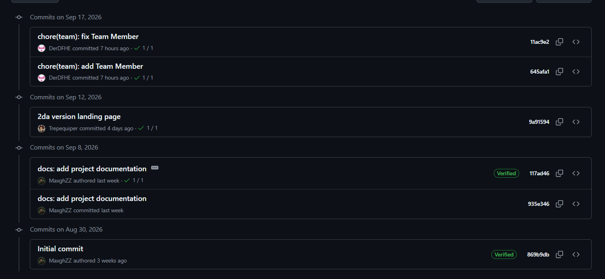

*Figura 5.2. Commits relacionados con la implementación del Landing Page durante el Sprint 1.*

#### 5.2.1.5. Execution Evidence for Sprint Review

La ejecución del Sprint produjo una primera versión funcional del Landing Page. La página presenta la propuesta de valor de VitalTrek, explica el problema de monitoreo en rutas remotas, muestra el funcionamiento por checkpoints, diferencia los beneficios para operadores y turistas, presenta las funcionalidades, planes, equipo, preguntas frecuentes y formulario de contacto.

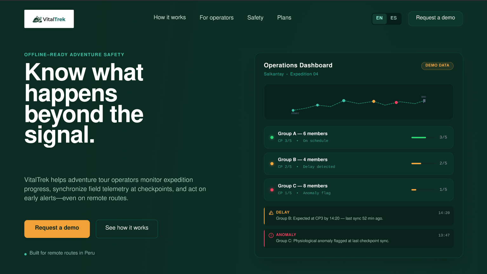

*Figura 5.3. Vista desktop del Landing Page implementado.*


*Figura 5.4. Secciones principales implementadas en el Sprint 1.*

La validación visual debe comprobar la navegación entre secciones, el comportamiento responsive, el cambio de idioma, los call-to-action, el formulario de contacto y la legibilidad del contenido.

**Adjuntar enlace del video de navegación del Landing Page:** [Pegar enlace de Microsoft Stream]

#### 5.2.1.6. Services Documentation Evidence for Sprint Review

El alcance del Sprint 1 se limita al Landing Page estático desarrollado con HTML5, CSS3 y JavaScript. No se implementaron endpoints RESTful ni una API en este Sprint; por ello, la documentación OpenAPI y Swagger no aplican a esta entrega. La implementación de Web Services se planifica para una entrega posterior.

| Producto             | Endpoint              | Método HTTP | Estado      |
| -------------------- | --------------------- | ----------- | ----------- |
| RESTful Web Services | No aplica en Sprint 1 | No aplica   | Planificado |

#### 5.2.1.7. Software Deployment Evidence for Sprint Review

La primera versión del Landing Page se publica desde el repositorio de GitHub hacia la plataforma de despliegue configurada. La rama estable utilizada y la URL pública deben corresponder con la versión revisada durante el Sprint Review.

| Elemento             | Información                                                     |
| -------------------- | --------------------------------------------------------------- |
| Producto             | Landing Page                                                    |
| Plataforma           | Vercel                                                          |
| Repositorio          | https://github.com/1ASI0729-2620-16712-G4-Nexatech/landing-page |
| Rama desplegada      | main                                                            |
| Build command        | No aplica para HTML5, CSS3 y JavaScript estático                |
| Output directory     | Directorio raíz del repositorio                                 |
| Variables de entorno | No requeridas                                                   |
| URL pública          | https://landing-page-lbs0yqroj-mrca1.vercel.app/                |

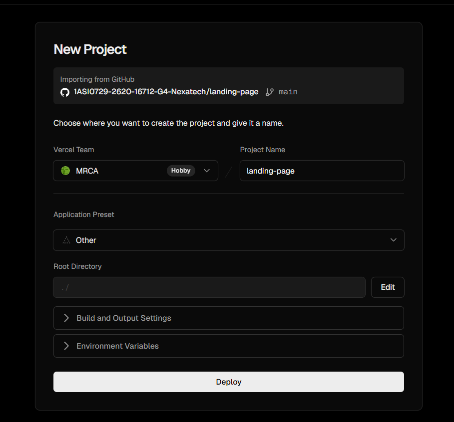

*Figura 5.5. Configuración del proyecto en la plataforma de despliegue.*

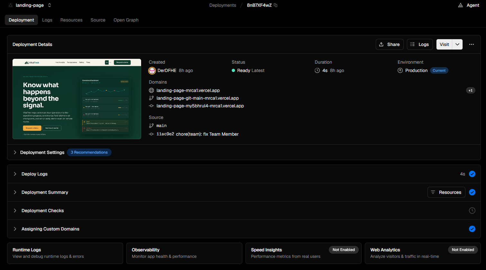

*Figura 5.6. Despliegue exitoso de la primera versión del Landing Page.*

**Landing Page desplegado:** [https://landing-page-lbs0yqroj-mrca1.vercel.app/](https://landing-page-lbs0yqroj-mrca1.vercel.app/)

#### 5.2.1.8. Team Collaboration Insights during Sprint

El trabajo colaborativo del Sprint 1 se realizó mediante GitHub, Jira/Trello y herramientas de diseño. Cada integrante participó en actividades de planificación, diseño, implementación, validación o documentación. La evidencia debe mostrar que los aportes registrados corresponden a los integrantes y tareas indicados en el Sprint Backlog.

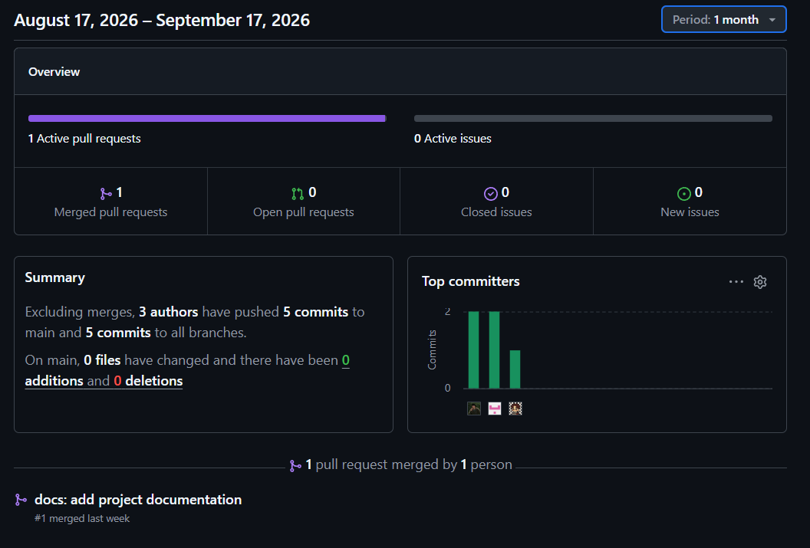

*Figura 5.7. Analítica de colaboración del repositorio durante el Sprint 1.*

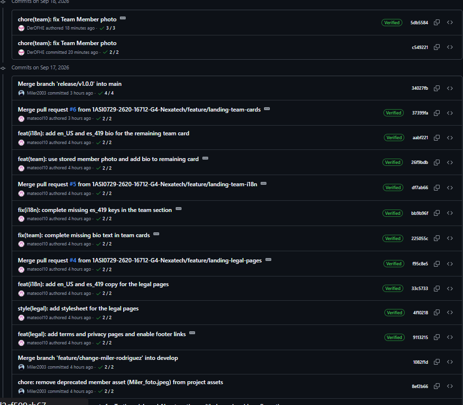

*Figura 5.8. Participación de los integrantes mediante commits.*

| Integrante                       | Actividad realizada                                                                                                                                                                                                   | Evidencia                                                                                                                    |
| -------------------------------- | --------------------------------------------------------------------------------------------------------------------------------------------------------------------------------------------------------------------- | ---------------------------------------------------------------------------------------------------------------------------- |
| Cayanchi Avila, Milenko Rubén    | Especificación de User Stories y Product Backlog; diagramas de arquitectura y base de datos.                                                                                                                          | Commits `ed4bec2`, `398d3e2`, `dabdd80` y `ba5ba04`.                                                                         |
| León Naupari, Jorge Mateo        | Modelado del Ubiquitous Language, User Task Matrix, diagramas C4 de contexto y contenedores, Design-Level Event Storming (4.6.1) y, en el Landing Page, meta tags de SEO, skip link de accesibilidad e i18n asociado. | 16 commits en report y 6 en landing-page; PRs #13, #15, #20 y #24 (report) y PR #2 (landing-page). Figuras 5.9, 5.10 y 5.11. |
| Mendoza Blanco, Ariel Roberto    | Registro de entrevistas y User Journey Maps del Chapter II.                                                                                                                                                           | Commits `cf441d0` y `fa74dfa`.                                                                                               |
| Rodriguez Rojas, Miler Alexander | Impact Mapping, perfil de colaboración, Student Outcome e integración de Chapters IV y V.                                                                                                                             | Commits `9610c3d`, `8519f14`, `7a1cc16` y `98b172a`.                                                                         |
| Herrera Enriquez, Diego Fernando | Style Guidelines y wireframes/mock-ups de Landing Page y Web Applications.                                                                                                                                            | Commits `708d7cc`, `737470f` y `027a2a1`.                                                                                    |

La colaboración debe reflejarse de forma coherente en el Sprint Backlog, los commits, la matriz de líderes y colaboradores, y el reporte de participación individual.

**Evidencia individual - León Naupari, Jorge Mateo (mateool10)**

Los siguientes registros corresponden a la participación verificable del integrante en los repositorios del equipo durante el Sprint 1.

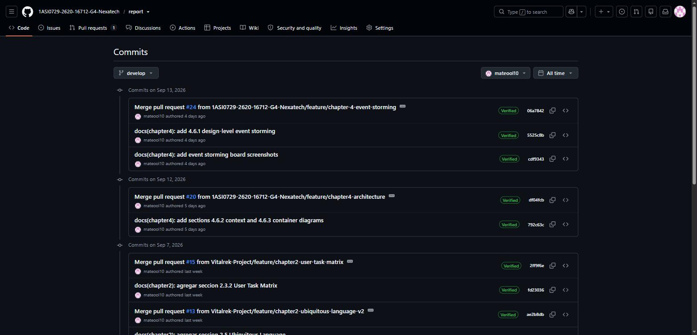

*Figura 5.9. Historial de commits de mateool10 en el repositorio report.*

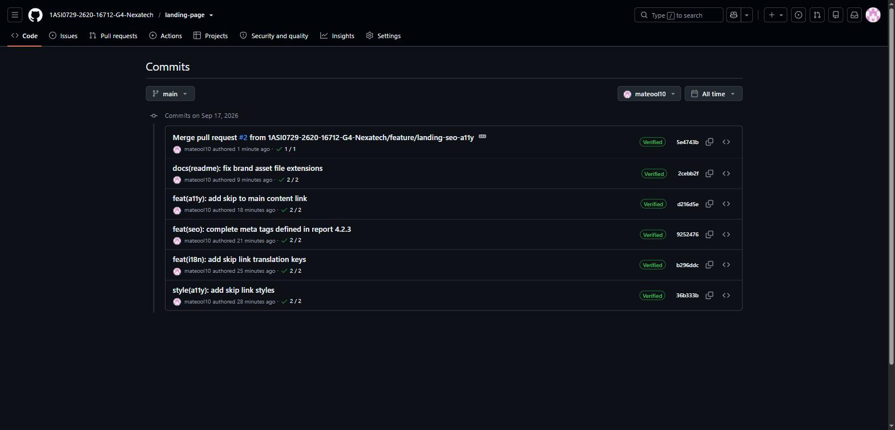

*Figura 5.10. Historial de commits de mateool10 en el repositorio landing-page (rama main).*

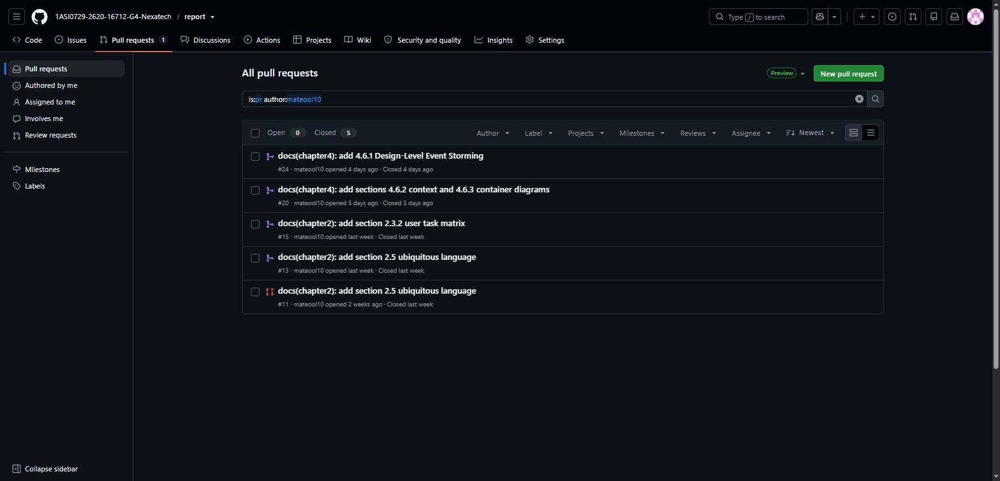

*Figura 5.11. Pull requests creados y fusionados por mateool10 en el repositorio report.*

### 5.2.2. Sprint 2

El Sprint 2 entrega la primera versión de las **Web Applications frontend** de VitalTrek para TB1. El alcance combina la configuración de rutas y expediciones dentro del bounded context `expedition-setup` con la consulta del progreso simulado en `field-tracking`. Se completaron US07, US08, US09, US11, US13, US12 y US20, con un total de **28 Story Points**, conforme al Product Backlog de la sección 3.3.

La aplicación está construida con Vue 3 y Vite; utiliza Pinia, Vue Router, Axios, PrimeVue y vue-i18n para el estado, navegación, componentes, consumo HTTP e internacionalización. json-server@0.17.4 proporciona los datos de prueba. Las capas `domain`, `application`, `infrastructure` y `presentation` separan las entidades, casos de uso/estado, acceso y mapeo de datos, e interfaz. El alcance no incluye autenticación real, backend productivo, persistencia real, Bluetooth, GPS, wearables, telemetría ni alertas reales.

| Campo | Valor |
| --- | --- |
| Sprint Goal | Completar el flujo frontend de preparación de expediciones y consulta de progreso estimado para Operations Administrators y Field Guides. |
| Historias incluidas | US07, US08, US09, US11, US13, US12 y US20 |
| Total de historias | 7 User Stories |
| Sprint Velocity / Total de Story Points | 28 Story Points |
| Contextos de dominio | `expedition-setup` y `field-tracking` |
| Resultado | Web Application frontend implementada; Fake API y telemetría de prueba. |

#### 5.2.2.1. Sprint Planning 2

La planificación del Sprint 2 definió como objetivo completar el flujo de preparación de una expedición —desde la configuración de la Route hasta el registro del Tourist Manifest— y agregar la consulta del progreso estimado del grupo. Las historias se seleccionaron del Product Backlog y se ordenaron según sus dependencias: primero la configuración de rutas, checkpoints y ventanas; luego la creación del grupo, la asignación del guía y el manifiesto; finalmente, el dashboard de seguimiento.

| Campo | Información |
| --- | --- |
| Sprint | Sprint 2 — TB1 |
| Fecha | 2026-10-04 |
| Hora | 20:00 |
| Ubicación | Discord — reunión virtual |
| Preparado por | Cayanchi Avila, Milenko Rubén |
| Participantes | Cayanchi Avila, Milenko Rubén; León Naupari, Jorge Mateo; Mendoza Blanco, Ariel Roberto; Rodriguez Rojas, Miler Alexander; Herrera Enriquez, Diego Fernando |
| Sprint Goal | Completar el flujo frontend de preparación de expediciones y consulta de progreso estimado para Operations Administrators y Field Guides. |
| Sprint Velocity | 28 Story Points |
| Total de Story Points | 28 |

**Sprint Goal**

Nuestro enfoque está en completar el flujo frontend para configurar rutas y grupos de expedición, registrar el Tourist Manifest y consultar el progreso estimado con datos simulados. Creemos que esto permitirá a los Operations Administrators preparar tours y a los Field Guides registrar a sus participantes mediante una aplicación coherente con el proceso operativo. Esto se confirmará cuando los usuarios puedan recorrer y validar los escenarios de US07, US08, US09, US11, US13, US12 y US20 en el frontend desplegado con Fake API; la validación no implica backend productivo ni telemetría real.

#### 5.2.2.2. Aspect Leaders and Collaborators

Milenko Rubén Cayanchi Avila fue el líder general del Sprint. La siguiente matriz registra las áreas de trabajo y la participación colaborativa comunicada por el equipo. Los commits identifican a los autores de cambios versionados; las actividades de revisión, pruebas y documentación deben respaldarse con la evidencia del Sprint Review.

| Integrante | Usuario de GitHub | Coordinación general | Configuración de rutas y checkpoints | Grupos, guías y manifiestos | Seguimiento, pruebas e integración |
| --- | --- | --- | --- | --- | --- |
| Cayanchi Avila, Milenko Rubén | `MaxghZZ` | L | L | C | C |
| León Naupari, Jorge Mateo | `mateool10` | C | C | C | C |
| Mendoza Blanco, Ariel Roberto | `Trepequiper` | C | C | C | C |
| Rodriguez Rojas, Miler Alexander | `Miler2003` | C | C | L | L |
| Herrera Enriquez, Diego Fernando | `DerDFHE` | C | C | C | C |

**Leyenda:** L = líder del aspecto; C = colaborador.

La autoría de los cambios de código que se pueden verificar en el repositorio se consigna en la sección 5.2.2.4. La matriz describe las responsabilidades de trabajo del Sprint y no sustituye la evidencia de commits, Pull Requests o validaciones individuales.

#### 5.2.2.3. Sprint Backlog 2

El Sprint Backlog 2 comprende las siete User Stories seleccionadas para TB1. La tabla conserva las estimaciones del Product Backlog de la sección 3.3 y resume el resultado funcional de cada historia. La descomposición granular en tareas, horas y responsables corresponde al registro de Jira y debe adjuntarse como evidencia del board.

**Evidencia del Board del Sprint**

**Enlace al board Jira:** [Ver Product Backlog](https://milenkorvu.atlassian.net/jira/software/projects/SCRUM/boards/1/backlog)

**Captura del Sprint Backlog 2:** [Pendiente de insertar la captura del board Jira con tareas, estimaciones y estados.]

| Sprint # | Story ID | Story Title | Bounded Context | Trabajo incluido en el Sprint | Estimation (Story Points) | Status |
| --- | --- | --- | --- | --- | ---: | --- |
| Sprint 2 | US07 | Configuración de rutas | `expedition-setup` | Registrar rutas con datos geográficos y operativos, validar campos y nombres duplicados, y guardar la Route inicialmente como `draft`. | 5 | Done |
| Sprint 2 | US08 | Definición de checkpoints | `expedition-setup` | Asociar checkpoints a una Route, mantener el orden de la secuencia, impedir órdenes duplicados y habilitar la ruta solo después de registrar al menos un checkpoint. | 5 | Done |
| Sprint 2 | US09 | Ventanas de tiempo esperadas | `expedition-setup` | Configurar ventanas por tramo, validar límites mínimo/máximo, evitar duplicados e identificar tramos pendientes. | 3 | Done |
| Sprint 2 | US11 | Creación del grupo de expedición | `expedition-setup` | Crear un Expedition Group asociado a una Route habilitada, registrar fecha y capacidad, y rechazar fechas pasadas. | 3 | Done |
| Sprint 2 | US13 | Asignación del guía | `expedition-setup` | Asignar un Field Guide mock al grupo, informar cruces de asignación y requerir confirmación explícita cuando corresponda. | 2 | Done |
| Sprint 2 | US12 | Registro del manifiesto | `expedition-setup` | Registrar participantes, rechazar documentos duplicados y evitar exceder la capacidad máxima del grupo. | 5 | Done |
| Sprint 2 | US20 | Seguimiento del progreso | `field-tracking` | Mostrar tramo actual, último checkpoint, progreso estimado y antigüedad de los datos; informar cuando el tour aún no está activo. | 5 | Done |
|  |  |  |  | **Total** | **28** |  |

El Sprint se planificó con el orden de dependencias **US07 → US08 → US09 → US11 → US13 → US12 → US20**. Las tareas asociadas a estas historias se implementaron siguiendo la arquitectura acordada para TB1. No se incluyen horas por tarea en esta tabla porque el detalle de estimaciones horarias debe coincidir con el Sprint Backlog publicado en Jira.

#### 5.2.2.4. Development Evidence for Sprint Review

La evidencia de desarrollo del Sprint 2 se encuentra en el repositorio [web-applications](https://github.com/1ASI0729-2620-16712-G4-Nexatech/web-applications). Los commits y Pull Requests de US07–US09 están integrados en `develop`. Las referencias de US11, US13, US12 y US20 identifican sus ramas y commits de trabajo; deben actualizarse con el enlace del Pull Request y el commit de merge cuando se integren en `develop`.

| User Story | Rama | Commit de referencia | Evidencia de integración |
| --- | --- | --- | --- |
| US07 — Configuración de rutas | `feature/webapp-route-configuration` | [`77e6fda`](https://github.com/1ASI0729-2620-16712-G4-Nexatech/web-applications/commit/77e6fda005b45ac9347db60c9d6781675cb9313a) | [PR #4](https://github.com/1ASI0729-2620-16712-G4-Nexatech/web-applications/pull/4), integrado en `develop`. |
| US08 — Definición de checkpoints | `feature/webapp-checkpoints` | [`29b84cc`](https://github.com/1ASI0729-2620-16712-G4-Nexatech/web-applications/commit/29b84cca5935d0fcf8f9f20fc999c770368a6541) | [PR #5](https://github.com/1ASI0729-2620-16712-G4-Nexatech/web-applications/pull/5), integrado en `develop`. |
| US09 — Ventanas de tiempo esperadas | `feature/webapp-expected-time-windows` | [`f0af953`](https://github.com/1ASI0729-2620-16712-G4-Nexatech/web-applications/commit/f0af953046fc8ceefbca4bd305598fedea35648c) | [PR #6](https://github.com/1ASI0729-2620-16712-G4-Nexatech/web-applications/pull/6), integrado en `develop`. |
| US11 — Creación del grupo de expedición | `feature/webapp-expedition-group-creation` | [`601e2c5`](https://github.com/1ASI0729-2620-16712-G4-Nexatech/web-applications/commit/601e2c50134562edb3b724e3bfa84cb0b382ba59) | Pull Request / merge: pendiente de registrar. |
| US13 — Asignación del guía | `feature/webapp-field-guide-assignment` | [`c35c01b`](https://github.com/1ASI0729-2620-16712-G4-Nexatech/web-applications/commit/c35c01b15e02ac9c54a204b031d6b3b8e0fedc5c) | Pull Request / merge: pendiente de registrar. |
| US12 — Registro del manifiesto | `feature/webapp-tourist-manifest` | [`71bbcaca`](https://github.com/1ASI0729-2620-16712-G4-Nexatech/web-applications/commit/71bbcaca4648445471ce6b81c3f0431925fac282) | Pull Request / merge: pendiente de registrar. |
| US20 — Seguimiento del progreso | `feature/webapp-group-progress-dashboard` | [`cef703d`](https://github.com/1ASI0729-2620-16712-G4-Nexatech/web-applications/commit/cef703d1c403cd0ff50717a9f5bebd45b2bfdad1) | Pull Request / merge: pendiente de registrar. |

**Evidencia visual del desarrollo**

Adjuntar capturas de la aplicación desplegada o ejecutada en local que muestren, como mínimo, la lista y el formulario de rutas, la configuración de checkpoints y ventanas de tiempo, la creación/asignación de grupos, el manifiesto y el dashboard de progreso. Las capturas deben corresponder a la versión presentada en el Sprint Review.

- Captura de configuración de rutas y checkpoints: [Pendiente de insertar.]
- Captura de ventanas de tiempo esperadas: [Pendiente de insertar.]
- Captura de creación del grupo y asignación del guía: [Pendiente de insertar.]
- Captura del Tourist Manifest: [Pendiente de insertar.]
- Captura del Group Progress Dashboard: [Pendiente de insertar.]

#### 5.2.2.5. Execution Evidence for Sprint Review

La validación funcional del Sprint 2 cubre los escenarios principales de las User Stories implementadas. La telemetría y los datos de seguimiento utilizados en US20 son simulados; la aplicación no sustituye sistemas de comunicación o respuesta de emergencia.

| User Story | Escenario de validación | Resultado esperado |
| --- | --- | --- |
| US07 | Registrar una Route válida y probar un nombre duplicado o campos obligatorios incompletos. | La ruta se crea en estado `draft`; los datos inválidos o duplicados se rechazan y se informa el problema. |
| US08 | Registrar checkpoints con órdenes únicos; intentar duplicar un orden y habilitar una ruta sin checkpoints. | Se asocian los checkpoints a la ruta; se rechaza el orden duplicado y no se habilita la ruta vacía. Con al menos un checkpoint, la ruta puede habilitarse. |
| US09 | Guardar una ventana válida, invertir los límites mínimo/máximo y consultar tramos sin configuración. | Se guarda la ventana válida, se rechazan límites inconsistentes y se identifican los tramos pendientes. |
| US11 | Crear un Expedition Group para una ruta habilitada y probar una fecha anterior a la actual. | El grupo se asocia a la ruta; una fecha pasada se rechaza. |
| US13 | Asignar un guía disponible, seleccionar uno con cruce de fecha y comprobar el requisito de responsable. | La asignación se registra; el cruce requiere confirmación y el sistema identifica un grupo sin guía. |
| US12 | Registrar participantes, repetir un documento de identidad y superar la capacidad del grupo. | El manifiesto se actualiza; el documento duplicado y el participante que excede la capacidad se rechazan. |
| US20 | Consultar un tour activo con datos de seguimiento, uno sin sincronización reciente y uno no iniciado. | Se muestran último checkpoint, tramo y progreso estimado; se indica la antigüedad de la información y que es una estimación; un tour no iniciado informa que el seguimiento se habilita al comenzar. |

**Evidencia de ejecución**

- Video de recorrido de la Web Application: [Pendiente de insertar el enlace de Microsoft Stream.]
- Capturas de los escenarios ejecutados: [Pendiente de insertar en 5.2.2.4.]
- Registro o evidencia del build de producción: [Pendiente de adjuntar.]

#### 5.2.2.6. Services Documentation Evidence for Sprint Review

El Sprint 2 no implementa el RESTful Web Services productivo. Para habilitar el frontend se utiliza una **Fake API** ejecutada con json-server@0.17.4 y recursos JSON de prueba. Los datos de US20 se simulan para presentar el estado de seguimiento. Por ello, no se genera una especificación OpenAPI/Swagger de servicios productivos en esta entrega.

| Recurso de prueba | Endpoint local | Métodos utilizados | Propósito |
| --- | --- | --- | --- |
| Routes | `/api/v1/routes` | GET, POST y actualización de estado | Consultar y registrar rutas; habilitar una ruta después de agregar checkpoints. |
| Checkpoints | `/api/v1/checkpoints` | GET, POST | Consultar y registrar puntos de control asociados a una ruta. |
| Expected Time Windows | `/api/v1/expected-time-windows` | GET, POST | Consultar y registrar ventanas esperadas entre checkpoints. |
| Expedition Groups | `/api/v1/expedition-groups` | GET, POST y actualización | Consultar y crear grupos vinculados a una ruta; actualizar su guía asignado. |
| Field Guides | `/api/v1/field-guides` | GET | Consultar guías mock disponibles para la asignación. |
| Manifest Entries | `/api/v1/manifest-entries` | GET, POST | Consultar y registrar participantes asociados a un Expedition Group. |
| Group Progress | `/api/v1/group-progress` | GET | Leer registros simulados de último checkpoint, tramo, progreso, estado y antigüedad de sincronización. |

La ruta `/api/v1/*` se resuelve mediante `server/routes.json`. La URL configurada en `.env.development` utiliza `http://localhost:3000/api/v1` y es solo para desarrollo local; no debe presentarse como endpoint público. Los manifiestos y el progreso se persisten únicamente en el archivo JSON atendido por json-server. La Fake API no garantiza integridad ni unicidad en servidor y no representa un backend productivo.

#### 5.2.2.7. Software Deployment Evidence for Sprint Review

La Web Application del Sprint 2 se encuentra desplegada para su revisión. El despliegue corresponde al frontend de TB1 y consume datos simulados; debe mantenerse explícito que la Fake API no es un servicio productivo. Sustituir los valores de URL pendientes por los enlaces reales antes de cerrar la versión del informe.

| Elemento | Información |
| --- | --- |
| Producto | VitalTrek Web Applications — frontend TB1 |
| Plataforma de despliegue | Vercel |
| Repositorio | https://github.com/1ASI0729-2620-16712-G4-Nexatech/web-applications |
| Rama desplegada | `[Confirmar rama de despliegue]` |
| Build command | `npm run build` |
| Output directory | `dist` |
| Variable de entorno de producción | `VITE_VITALTREK_API_URL` debe apuntar a una Fake API accesible desde el despliegue; la URL local `localhost` solo aplica al desarrollo. |
| URL pública del frontend | `https://[URL-PUBLICA-DEL-FRONTEND-PENDIENTE]` |
| URL pública de la Fake API | `[Pendiente; confirmar si se desplegó junto con el frontend o en un servicio separado.]` |

**Evidencia del despliegue**

- Captura de la configuración del proyecto en Vercel: [Pendiente de insertar.]
- Captura del despliegue exitoso y versión publicada: [Pendiente de insertar.]
- URL pública real: reemplazar el marcador de la tabla antes de la entrega.

#### 5.2.2.8. Team Collaboration Insights during Sprint

El equipo trabajó sobre el repositorio `web-applications` mediante ramas de funcionalidad, integración en `develop` y revisión por Pull Request. La colaboración incluyó planificación, implementación, revisión de criterios de aceptación, pruebas de los flujos y preparación de evidencias. Los PR #4, #5 y #6 documentan la integración en `develop` de US07, US08 y US09. Para US11, US13, US12 y US20 se deben incorporar las referencias de Pull Request y merge una vez registradas.

| Integrante | Actividad del Sprint 2 | Evidencia disponible |
| --- | --- | --- |
| Cayanchi Avila, Milenko Rubén | Liderazgo general; implementación e integración de la configuración de rutas, checkpoints y ventanas de tiempo; coordinación del Sprint. | PR #4, #5 y #6; commits de las ramas `feature/webapp-route-configuration`, `feature/webapp-checkpoints` y `feature/webapp-expected-time-windows`. |
| León Naupari, Jorge Mateo | Colaboración en revisión funcional, consistencia con requisitos y validación de flujos de usuario. | [Adjuntar commits, revisión de PR o evidencia de pruebas del integrante.] |
| Mendoza Blanco, Ariel Roberto | Colaboración en revisión de reglas del dominio, datos de prueba y escenarios de preparación de expediciones. | [Adjuntar commits, revisión de PR o evidencia de pruebas del integrante.] |
| Rodriguez Rojas, Miler Alexander | Colaboración en la implementación de grupos, guías, manifiesto y seguimiento de progreso; apoyo en integración. | Commits en las ramas `feature/webapp-expedition-group-creation`, `feature/webapp-field-guide-assignment`, `feature/webapp-tourist-manifest` y `feature/webapp-group-progress-dashboard`. |
| Herrera Enriquez, Diego Fernando | Colaboración en revisión de interfaz, comportamiento responsive y comprobación de los flujos del Sprint. | [Adjuntar commits, revisión de PR o evidencia de pruebas del integrante.] |

**Evidencia colaborativa por completar**

- Captura de GitHub Insights correspondiente al Sprint 2: [Pendiente de insertar.]
- Captura del historial de commits y Pull Requests del equipo: [Pendiente de insertar.]
- Completar las evidencias individuales de revisión, pruebas y documentación y enlazar los PR de US11, US13, US12 y US20.

La evidencia final del Sprint debe mantener consistencia entre las historias y estados de Jira, los commits, las revisiones de Pull Request, las pruebas de aceptación, las capturas de la aplicación y el despliegue publicado.
