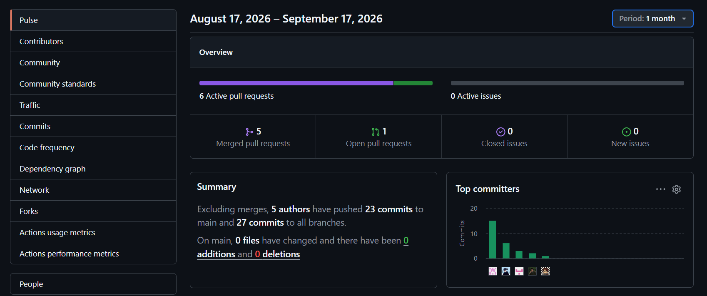
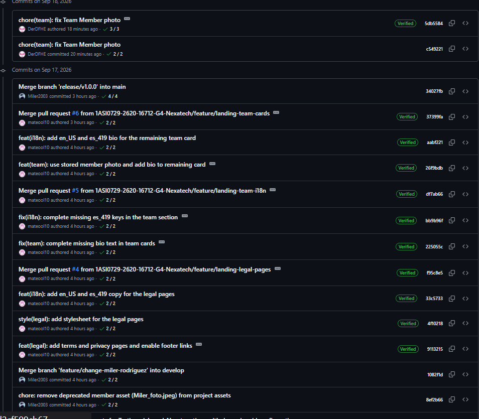

# Project Report Collaboration Insights

- URL del repositorio para el reporte del proyecto: https://github.com/1ASI0729-2620-16712-G4-Nexatech/report.git
- URL del repositorio para la Landing Page: https://github.com/1ASI0729-2620-16712-G4-Nexatech/landing-page.git

**AV1**

Para el desarrollo del informe perteneciente a la entrega AV1, se dividió la implementación de secciones de la siguiente forma para cada integrante del equipo:

| Integrante                       | Tareas Asignadas                                                                                                                                                                           |
|----------------------------------|--------------------------------------------------------------------------------------------------------------------------------------------------------------------------------------------|
| León Naupari, Jorge Mateo        | Desarrollo del Capítulo I, una parte del Capítulo II, así como la parte final del Capítulo V del documento en formato markdown.                                                            |
| Mendoza Blanco, Ariel Roberto    | Desarrollo del Capítulo III, desarrollo parcial de capítulo II, así como colaboración en el capítulo V del documento en formato markdown.                                                  |
| Cayanchi Avila, Milenko Rubén    | Desarrollo parcial del Capítulo IV, así como colaboración en el capítulo V del documento en formato markdown                                                                               |
| Rodriguez Rojas, Miler Alexander | Desarrollo parcial del Capítulo IV, así como colaboración en el capítulo V del documento en formato markdown                                                                               |
| Herrera Enriquez, Diego Fernando | Desarrollo parcial del Capítulo IV: Diseño del landing page y web application, y actualización del keynote. Además, colaboró en el desarrollo capítulo V del documento en formato markdown |

El trabajo se desarrolló mediante commits continuos en el repositorio de la organización, asegurando trazabilidad y colaboración activa del equipo.

---

## Github Collaboration Insights

Las siguientes capturas evidencian la actividad de colaboración y los commits registrados durante el Sprint 1. La distribución individual se detalla también en la sección 5.2.1.8 del informe.

*Figura 1. Actividad de colaboración registrada en GitHub durante el Sprint 1.*

*Figura 2. Participación del equipo mediante commits durante el Sprint 1.*

Github también presenta un timeline de las ramas principales y los procesos de merge a los que se han sometido. Todas las ramas se crearon tomando en cuenta el diseño de GitFlow para una buena organización cuando se usa un software de control de versiones.

Los integrantes son:

- Rodriguez Rojas, Miler Alexander (Miler2003)
- León Naupari, Jorge Mateo (mateool10)
- Mendoza Blanco, Ariel Roberto (Trepequiper)
- Herrera Enriquez, Diego Fernando (DerDFHE)
- Cayanchi Avila, Milenko Rubén (MaxghZZ)

Se explican las ramas más prominentes:

- **main**: Es representada por el color blanco. Se trata de la rama principal del proyecto y se actualiza para cada entregable.
- **develop**: Es representada por el color morado. Se trata de la rama principal para el proceso del desarrollo del proyecto.
- **feature/**: cambios específicos del documento o de endpoints implementados.
- **hotfix/**: correcciones puntuales realizadas sobre errores críticos encontrados durante la integración o despliegue.
